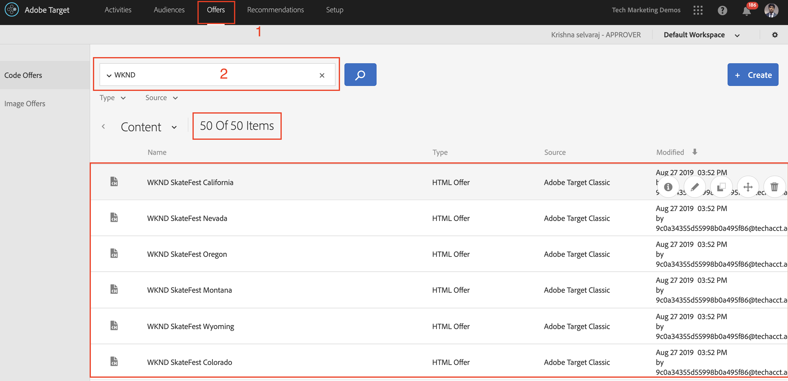

# 使用AEM Experience Fragments和Adobe Target进行个性化

凭借将AEM Experience Fragments作为HTML选件导出到Adobe Target中的功能，您可以将AEM的易用性和强大功能与Target中强大的自动智能(AI)和机器学习(ML)功能结合使用，从而测试和个性化大规模体验。

AEM将您的所有内容和资产集中到一个中心位置，为您的个性化策略提供助力。 通过AEM，您可以轻松地在一个位置创建台式机、平板电脑和移动设备的内容，而无需编写代码。 无需为每个设备创建页面，AEM会自动使用您的内容调整每个体验。

通过Target，您可以基于规则和AI驱动的机器学习方法的组合，大规模地提供个性化体验，这些方法结合了行为、上下文和离线变量。  通过Target，您可以轻松地设置并运行A/B活动和多变量(MVT)活动，从而确定最佳的选件、内容和体验。

体验片段意味着，在将内容创建者与使用Target推动业务成果的营销人员关联方面，向前迈出了一大步。

## 方案概述

WKND站点计划宣布 **SkateFest挑战** 通过他们的网站，在全美各地注册参加每个州的试镜。 作为营销人员，您已被分派在WKND网站主页运行营销活动，其中包含与用户位置相关的横幅消息以及指向事件详细信息页面的链接。 让我们探索WKND站点主页，了解如何根据用户的当前位置为其创建和提供个性化体验。

### 涉及的用户

在本练习中，需要涉及以下用户，要执行某些任务，您可能需要管理访问权限。

* **内容制作者/内容编辑器** (Adobe Experience Manager)
* **营销人员** (Adobe Target/优化团队)

### 前提条件

* **AEM**
   * [AEM创作和发布实例](./implementation.md#getting-aem) 分别在localhost 4502和4503上运行。
* **Experience Cloud**
   * 访问您的组织Adobe Experience Cloud - `https://<yourcompany>.experiencecloud.adobe.com`
   * 使用以下解决方案配置的Experience Cloud
      * [Adobe Target](https://experiencecloud.adobe.com)

### WKND站点主页

1. 营销人员通过AEM内容编辑器启动WKND SkateFest营销活动讨论并详细说明要求。
   * ***要求***：在WKND网站主页上推广包含个性化内容的WKND SkateFest营销活动，访客可来自美国各个州。 在主页轮播下方添加一个新内容块，其中包含背景图像、文本和按钮。
      * **背景图像**：图像应与用户访问WKND站点页面时所在的状态相关。
      * **文本**：“注册Audition”
      * **按钮**：“事件详细信息”，指向WKND SkateFest页面
      * **WKND SkateFest页面**：包含活动详细信息（包括面试地点、日期和时间）的新页面。
1. 根据要求，AEM内容编辑器会为内容块创建一个体验片段，并将其作为选件导出到Adobe Target。 要为美国的所有州提供个性化内容，内容作者可以创建一个体验片段主控变体，然后创建50个其他变体，每个州一个变体。 随后，可以手动编辑具有相关图像和文本的每个状态变量的内容。 在创作体验片段时，内容编辑者可以使用Asset Finder选项快速访问AEM Assets中所有可用的资源。 当体验片段导出到Adobe Target时，其所有变体也会作为选件推送到Adobe Target。

1. 在将体验片段从AEM导出到Adobe Target作为选件后，营销人员可以使用这些选件在Target中创建活动。 基于WKND网站SkateFest营销活动，营销人员需要为每个州的WKND网站访客创建并提供个性化体验。 要创建体验定位活动，营销人员需要标识受众。 对于我们的WKND SkateFest营销活动，我们需要根据访问WKND网站的位置创建50个单独的受众。
   * [受众](https://experienceleague.adobe.com/docs/target/using/introduction/target-key-concepts.html#section_3F32DA46BDF947878DD79DBB97040D01) 为活动定义目标，并可在任何有定位可用的位置使用。 Target受众是一组定义的访客标准。 可以将选件定位到特定受众（或区段）。 只有属于该受众的访客才能看到针对他们的体验。  例如，您可以将选件交付给由使用特定浏览器或来自特定地理位置的访客组成的受众。
   * An [选件](https://experienceleague.adobe.com/docs/target/using/introduction/target-key-concepts.html#section_973D4CC4CEB44711BBB9A21BF74B89E9) 是在营销活动或活动期间显示在网页上的内容。 在测试网页时，您将使用您所在位置中的不同选件来衡量每个体验是否成功。 选件可包含不同类型的内容，包括：
      * 图像
      * 文本
      * **HTML**
         * *HTML选件用于此方案的活动*
      * 链接
      * 按钮

## 内容编辑器活动

>[!VIDEO](https://video.tv.adobe.com/v/28596?quality=12&learn=on)

>[!NOTE]
>
>先发布体验片段，然后再将其导出到Adobe Target。

## 营销人员活动

### 通过地域定位创建受众 {#marketer-audience}

1. 导航到您的组织 [Adobe Experience Cloud](https://experiencecloud.adobe.com/) (`<https://<yourcompany>.experiencecloud.adobe.com`)
1. 使用您的Adobe ID登录，并确保您处于正确的组织中。
1. 在解决方案切换器中，单击 **Target** 然后 **启动** Adobe Target。

   

1. 导航到 **选件** 选项卡并搜索“WKND”选件。 您应该能够查看从AEM导出为HTML选件的体验片段变量列表。 每个选件都对应于一个状态。 例如， *加利福利亚州WKND SkateFest* 是提供给来自加利福尼亚的WKND站点访客的选件。

   

1. 在主导航中，单击 **受众**.

   营销人员需要为来自美利坚合众国各个州的WKND站点访客创建50个单独的受众。

1. 要创建受众，请单击 **创建受众** 按钮，并为受众提供一个名称。

   **受众名称格式：WKND-\&lt;*state*\>**

   

1. 单击 **添加规则>地域**.
1. 单击 **选择**，然后选择以下选项之一：
   * 国家/地区
   * **状态** *（为WKND Site SkateFest营销活动选择州）*
   * 城市
   * 邮政编码
   * 纬度
   * 经度
   * DMA
   * 移动设备运营商

   **地域**  — 使用受众根据用户的地理位置（包括其国家/地区、省/自治区/直辖市、城市、邮编/邮政编码、DMA或移动设备运营商）定位用户。 地理位置参数允许您根据访客的地理位置定位活动和体验。 此数据基于访客的IP地址，随每个Target请求一起发送。 选择这些参数的方式与选择任何定位值类似。

   >[!NOTE]
   >访客的IP地址将通过mbox请求传递，每次访问（会话）一次，以便为该访客解析地理定位参数。

1. 选择运算符为 **匹配**，提供相应的值（例如：加利福尼亚）和 **保存** 您所做的更改。 在本例中，请提供省/市/自治区名称。

   

   >[!NOTE]
   >您可以为一个受众分配多个规则。

1. 重复步骤6-9以创建其他州的受众。

   

此时，我们已成功为美利坚合众国各个州的所有WKND站点访客创建受众，并且还为每个州提供了相应的HTML选件。 现在，让我们创建一个体验定位活动，通过WKND网站主页的相应选件来定位受众。

### 使用地域定位创建活动

1. 在Adobe Target窗口中，导航到 **活动** 选项卡。
1. 单击 **创建活动** 并选择 **体验定位** 活动类型。
1. 选择 **Web** 渠道并选择 **可视化体验编辑器**.
1. 输入 **活动URL** 并单击 **下一个** 以打开可视化体验编辑器。

   WKND站点主页发布URL：http://localhost:4503/content/wknd/en.html

   

1. 对象 **可视化体验编辑器** 要加载，请启用 **允许加载Unsafe脚本** ，然后重新加载页面。

   

1. 请注意，WKND站点主页在可视化体验编辑器中打开。

   

1. 要将受众添加到VEC，请单击 **添加体验定位** 在受众下，选择WKND-California受众，然后单击 **下一个**.

   

1. 单击VEC中的WKND站点页面，选择HTML元素以为WKND-California受众添加选件，然后选择 **替换为** 选项，然后选择 **HTML选件**.

   

1. 选择 **加利福利亚州WKND SkateFest** HTML选件 **WKND — 加利福尼亚** 选件选择UI中的受众并单击 **完成**.
1. 您现在应该能够看到 **加利福利亚州WKND SkateFest** 已将HTML选件添加到您的WKND Site页面，以供WKND-California受众使用。
1. 重复步骤7 - 10以添加其他状态的体验定位并选择相应的HTML选件。
1. 单击 **下一个** 若要继续，您可以看到受众到体验的映射。
1. 单击 **下一个** 以移至“目标和设置”。
1. 选择您的报表源并确定活动的主要目标。 对于场景，让我们选择报表源作为 **Adobe Target**，衡量活动为 **转化**、操作查看了页面以及指向WKND SkateFest详细信息页面的URL。

   

   >[!NOTE]
   >您还可以选择Adobe Analytics作为报表源。

1. 将鼠标悬停在当前活动名称上，您可以将其重命名为 **WKND SkateFest — 美国**，然后 **保存并关闭** 您所做的更改。
1. 在活动详细信息屏幕中，确保 **激活** 您的活动。

   

1. 您的WKND SkateFest营销活动现已对所有WKND网站访客开放。
1. 导航到 [WKND站点主页](http://localhost:4503/content/wknd/en.html)，您应该能够根据地理位置查看WKND SkateFest选件(*州：加利福尼亚*)。

   

### Target活动QA

1. 下 **活动详细信息>概述** 选项卡，单击 **活动QA** 按钮，您可以获得指向所有体验的直接QA链接。

   

1. 导航到 [WKND站点主页](http://localhost:4503/content/wknd/en.html)，您应该能够根据地理位置（州）查看WKND SkateFest选件。
1. 观看以下视频，了解如何将选件交付到您的页面、如何自定义响应令牌以及执行质量检查。

>[!VIDEO](https://video.tv.adobe.com/v/28658?quality=12&learn=on)

## 摘要

在本章中，内容编辑者能够创建所有内容以在Adobe Experience Manager中支持WKND SkateFest促销活动，并将其作为HTML选件导出到Adobe Target，以便根据用户的地理位置创建体验定位。
