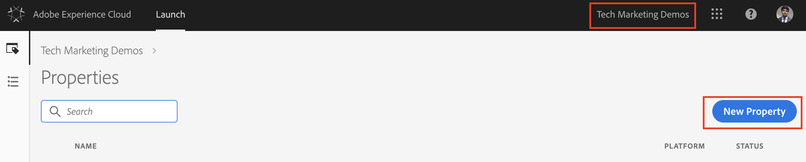
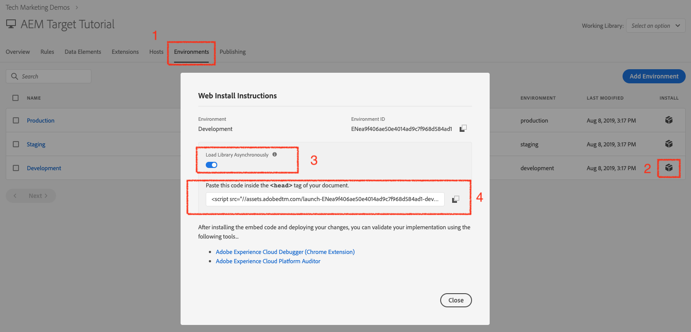

# 通过Adobe Developer控制台使用标记

## 先决条件

* [AEM创作和发布实例](./implementation.md#set-up-aem) 分别运行在本地主机端口4502和4503上
* **Experience Cloud**
   * 访问您的组织Adobe Experience Cloud - `https://<yourcompany>.experiencecloud.adobe.com`
   * 通过以下解决方案进行Experience Cloud配置
      * [数据收集](https://experiencecloud.adobe.com)
      * [Adobe Target](https://experiencecloud.adobe.com)
      * [Adobe Developer控制台](https://developer.adobe.com/console/)

     >[!NOTE]
     >您应具有在数据收集中开发、批准、发布、管理扩展和管理环境的权限。 如果由于用户界面选项不可用而无法完成其中的任何步骤，请联系Experience Cloud管理员以请求获取访问权限。 有关标记权限的详细信息， [请参阅文档](https://experienceleague.adobe.com/docs/experience-platform/tags/admin/user-permissions.html).

* **Chrome浏览器扩展**
   * Adobe Experience Cloud Debugger(https://chrome.google.com/webstore/detail/adobe-experience-platform/bfnnokhpnncpkdmbokanobigaccjkpob)

## 涉及的用户

对于此集成，必须涉及以下受众，并且要执行某些任务，您可能需要管理访问权限。

* 开发人员
* AEM管理员
* Experience Cloud管理员

## 简介

AEM提供了与标记的现成集成。 此集成允许AEM管理员通过易于使用的界面轻松配置标记，从而在配置这两种工具时减少工作量和错误数。 而且只需将Adobe Target扩展添加到标记，即可帮助我们在AEM网页上使用Adobe Target的所有功能。

在此部分中，我们将介绍以下集成步骤：

* 标记
   * 创建标记属性
   * 添加Target扩展
   * 创建数据元素
   * 创建页面规则
   * 设置环境
   * 构建和发布
* AEM
   * 创建Cloud Service
   * 创建

### 标记

#### 创建标记属性

资产是一个容器，在将标记部署到网站时可在其中填充扩展、规则、数据元素和库。

1. 导航到您的组织 [Adobe Experience Cloud](https://experiencecloud.adobe.com/) (`https://<yourcompany>.experiencecloud.adobe.com`)
1. 使用您的Adobe ID登录，并确保您处于正确的组织中。
1. 在解决方案切换器中，单击 **Experience Platform**，然后 **数据收集** 部分，然后选择 **标记**.

1. 确保您处于正确的组织中，然后继续创建标记属性。
   

   *有关创建属性的更多信息，请参阅 [创建资产](https://experienceleague.adobe.com/docs/experience-platform/tags/admin/companies-and-properties.html?lang=en#create-or-configure-a-property) 在产品文档中。*
1. 单击 **新建属性** 按钮
1. 提供资产的名称(例如， *AEM Target指南*)
1. 对于域，输入 *localhost.com* 因为这是运行WKND演示网站的域。 虽然&#39;*域*”字段为必填字段，则tags属性将适用于已实施该属性的任何域。 此字段的主要用途是在规则生成器中预填充菜单选项。
1. 单击 **保存** 按钮。

   

1. 打开之前创建的资产，然后单击Extensions选项卡。

#### 添加Target扩展

Adobe Target扩展支持使用适用于新版Web的Target JavaScript SDK进行客户端实施。 `at.js`. 仍在使用Target旧版库的客户， `mbox.js`， [应升级到at.js](https://experienceleague.adobe.com/docs/target-dev/developer/client-side/at-js-implementation/upgrading-from-atjs-1x-to-atjs-20.html) 以使用标记。

Target扩展包含两个主要部分：

* 扩展配置，用于管理核心库设置
* 规则操作，用于执行以下操作：
   * 加载Target (at.js)
   * Add Params to All Mbox
   * Add Params to Global Mbox
   * Fire Global Mbox

1. 下 **扩展**&#x200B;中，您可以看到已为标记资产安装的扩展列表。 ([AdobeLaunch核心扩展](https://exchange.adobe.com/apps/ec/100223/adobe-launch-core-extension) 默认安装)
2. 单击 **扩展目录** 选项，然后在筛选器中搜索Target。
3. 选择Adobe Target at.js的最新版本，然后单击 **安装** 选项。
   

4. 单击 **配置** 按钮上，您会注意到已导入Target帐户凭据的配置窗口，以及此扩展的at.js版本。
   

   通过异步标记嵌入代码部署Target时，您应在标记嵌入代码之前对页面上的预隐藏代码片段进行硬编码，以便管理内容闪烁。 我们稍后将详细了解预隐藏的狙击手。 您可以下载预隐藏代码片段 [此处](assets/using-launch-adobe-io/prehiding.js)

5. 单击 **保存** 要完成将Target扩展添加到Tags资产，您现在应该能够在 **已安装** 扩展名列表。

6. 重复上述步骤以搜索“Experience CloudID服务”扩展并安装它。
   

#### 设置环境

1. 单击 **环境** 选项卡中，您可以看到为站点资产创建的环境的列表。 默认情况下，我们为开发、暂存和生产分别创建一个实例。

#### 构建和发布

1. 单击 **发布** 选项卡，让我们创建库以生成更改（数据元素、规则）并将其部署到开发环境。
   >[!VIDEO](https://video.tv.adobe.com/v/28412?quality=12&learn=on)
2. 将更改从开发发布到暂存环境。
   >[!VIDEO](https://video.tv.adobe.com/v/28419?quality=12&learn=on)
3. 运行 **“为暂存构建”选项**.
4. 构建完成后，运行 **批准以发布**，可将更改从暂存环境移动到生产环境。
   
5. 最后，运行 **构建并发布到生产环境** 选项以将更改推送到生产环境。
   

### Adobe Experience Manager

>[!VIDEO](https://video.tv.adobe.com/v/28416?quality=12&learn=on)

>[!NOTE]
>
> 授予Adobe Developer集成使用适当的工作区来选择工作区的权限 [角色，允许中央团队仅在少数几个工作区中进行基于API的更改](https://experienceleague.adobe.com/docs/target/using/administer/manage-users/enterprise/configure-adobe-io-integration.html).

1. 使用来自Adobe Developer的凭据在AEM中创建IMS集成。 （01时12分至03时55分）
2. 在数据收集中，创建一个资产。 (涵盖 [以上](#create-launch-property))
3. 使用步骤1中的IMS集成，创建标记集成以导入标记属性。
4. 在AEM中，使用浏览器配置将标记集成映射到站点。 （05时28分至06时14分）
5. 手动验证集成。 （06时15分至06时33分）
6. 正在使用Adobe Experience Cloud Debugger浏览器插件。 （06时51分至07时22分）

此时，您已成功地集成 [带有使用标记的Adobe Target的AEM](./using-aem-cloud-services.md#integrating-aem-target-options) 如选项1中所详述。

为了使用AEM体验片段选件来支持您开展个性化活动，让我们继续下一章，并使用旧版云服务将AEM与Adobe Target集成。
