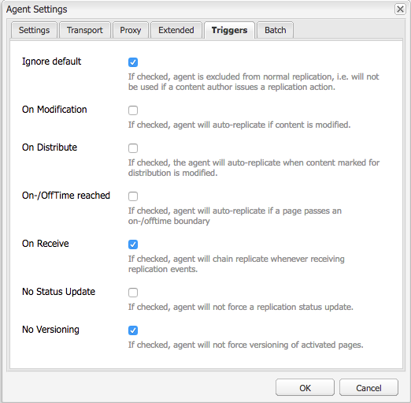

# 调度程序虚URL

[目录](./overview.md)

[&lt; — 上一个：使用和了解变量](./variables.md)

本文档将指导刷新的发生方式，并解释执行缓存刷新和失效的机制。


## 工作原理

### 操作顺序

最好介绍典型的工作流程，内容作者何时激活页面，当发布者收到新内容时，它会向调度程序触发刷新请求，如下图所示：

此事件链会突出显示，我们仅在项目是新项目或已更改项目时才刷新它们。  这可确保发布者在清除缓存之前已收到内容，以避免出现争用情况，即在发布者能够提取更改之前可能发生刷新。

## 复制代理

在创作时，有一个复制代理配置为指向发布者，当某些内容被激活时，它会触发将文件及其所有依赖项发送到发布者。

当发布者收到文件时，其复制代理配置为指向在接收事件时触发的调度程序。  然后，它将序列化刷新请求并将其发布到Dispatcher。

### 创作复制代理

以下是已配置标准复制代理的一些示例屏幕截图


在作者上，通常会为每个将内容复制到的发布者配置1个或2个复制代理。

首先是将内容激活推送到的标准复制代理。

第二个是反向代理。  这是可选的，设置为检查每个发布者发件箱，以查看是否有新内容可作为反向复制活动提取到作者中

### 发布者复制代理

以下是已配置标准刷新复制代理的屏幕截图示例


### 调度程序刷新复制接收虚拟主机

Dispatcher模块会查找特定的标头，以了解何时POST请求是要传递到AEM呈现器的内容，或者它是否序列化为刷新请求，并且需要由Dispatcher处理程序本身处理。

以下是配置页面的屏幕截图，其中显示了这些值：


默认设置页面显示 `Serialization Type` as `Dispatcher Flush` 并设置错误级别


在 `Transport` 选项卡 `URI` 设置为指向将接收刷新请求的Dispatcher的IP地址。  路径 `/dispatcher/invalidate.cache` 不是模块确定是否是刷新的方式，它只是您在访问日志中可以看到的一个明显端点，以知道它是刷新请求。  在 `Extended` 选项卡，我们将检查其中的内容，以确定这是对Dispatcher模块的刷新请求。


的 `HTTP Method` 对于刷新请求， `GET` 具有一些特殊请求标头的请求：
- CQ-Action
   - 它会根据请求使用AEM变量，该值通常为 *激活或删除*
- CQ-Handle
   - 它会根据请求使用AEM变量，例如，值通常是刷新项目的完整路径 `/content/dam/logo.jpg`
- CQ路径
   - 它会根据请求使用AEM变量，例如，值通常是正在刷新项目的完整路径 `/content/dam`
- 主机
   - 这是 `Host` 标头会被欺骗以定位特定 `VirtualHost` 在调度程序Apache Web服务器(`/etc/httpd/conf.d/enabled_vhosts/aem_flush.vhost`)。  硬编码值与 `aem_flush.vhost` 文件 `ServerName` 或 `ServerAlias`



在 `Triggers` 选项卡，我们将注意我们使用的切换触发器及其含义

- `Ignore default`
   - 已启用此功能，因此在页面激活时不会触发复制代理。  当创作实例对页面进行更改时，会触发刷新。  因为这是发布者，我们不希望触发此类事件。
- `On Receive`
   - 收到新文件时，我们要触发刷新。  因此，当作者向我们发送更新的文件时，我们将触发该文件，并向Dispatcher发送刷新请求。
- `No Versioning`
   - 我们选中此复选框可避免发布者由于收到新文件而生成新版本。  我们将只替换我们拥有的文件，并依赖作者来跟踪版本，而不是发布者。

现在，如果我们查看典型的刷新请求， `curl` 命令

```
$ curl \ 
-H "CQ-Action: Activate" \ 
-H "CQ-Handle: /content/dam/logo.jpg" \ 
-H "CQ-Path: /content/dam/" \ 
-H "Content-Length: 0" \  
-H "Content-Type: application/octect-stream" \ 
-H "Host: flush" \ 
http://10.43.0.32:80/dispatcher/invalidate.cache
```

此刷新示例将刷新 `/content/dam` 路径 `.stat` 文件。

## 的 `.stat` 文件

冲洗机制从本质上讲是简单的，我们想要解释 `.stat` 在创建缓存文件的文档根目录中生成的文件。

内部 `.vhost` 和 `_farm.any` 文件我们配置文档根指令，以指定当最终用户发出请求时缓存的位置以及从中存储/提供文件的位置。

如果要在Dispatcher服务器上运行以下命令，将开始查找 `.stat` 文件

```
$ find /mnt/var/www/html/ -type f -name ".stat"
```

下图显示了当您在缓存中包含项目，并且Dispatcher模块发送并处理了刷新请求时，此文件结构的外观


### 统计文件级别

请注意，在每个目录中， `.stat` 文件存在。  这表示已发生刷新。  在上面的示例中， `statfilelevel` 将设置为 `3` 在相应的场配置文件内。

的 `statfilelevel` 设置指示模块将遍历和更新的文件夹深度 `.stat` 文件。  .stat文件为空，它只是带有日期戳的文件名，甚至可以手动创建，但在Dispatcher服务器的命令行中运行触屏命令。

如果stat文件级别设置设置过高，则每个刷新请求都会遍历接触stat文件的目录树。  这可能会成为大型缓存树上的主要性能点击，并会影响Dispatcher的整体性能。

如果将此文件级别设置得太低，则可能会导致刷新请求清除超出预期的内容。  这反过来又会导致缓存流失更频繁，而缓存中提供的请求较少，并且可能导致性能问题。

<div style="color: #000;border-left: 6px solid #2196F3;background-color:#ddffff;"><b>注意:</b>

设置 `statfilelevel` 在合理的水平。  查看文件夹结构，并确保已设置该结构，以便允许简洁的刷新，而无需遍历太多目录。   在系统性能测试期间，测试并确保它符合您的需求。

一个支持语言的网站就是一个很好的示例。  典型的内容树将具有以下目录

`/content/brand1/en/us/`

在本示例中，使用stat文件级别设置4。  这将确保在您刷新位于 <b>`us`</b> 文件夹，不会导致语言文件夹也被刷新。
</div>

### STAT文件时间戳握手

当内容请求进入同一例程时

1. 的时间戳 `.stat` 文件与请求文件的时间戳进行比较
2. 如果 `.stat` 文件比请求的文件新，它会删除缓存内容，并从AEM中获取新内容并缓存该内容。  然后提供内容
3. 如果 `.stat` 文件比请求的文件旧，则文件会知道该文件是新的，可以提供内容。

### 缓存握手 — 示例1

在上面的示例中，对内容的请求 `/content/index.html`

时间 `index.html` 文件为2019-11-01 @ 6:21PM

最近的时间 `.stat` 文件为2019-11-01 @ 12:22PM

了解我们上面所读的内容，您可以看到索引文件比 `.stat` 文件和文件将从缓存提供给请求该文件的最终用户

### 缓存握手 — 示例2

在上面的示例中，对内容的请求 `/content/dam/logo.jpg`

时间 `logo.jpg` 文件为2019-10-31 @ 1:13PM

最近的时间 `.stat` 文件为2019-11-01 @ 12:22PM

如本例所示，文件比 `.stat` 文件和将被删除，并从AEM中提取一个新文件，以在缓存中替换它，然后提供给请求该文件的最终用户。

## 场文件设置

有关完整配置选项集，请参阅以下文档： [https://docs.adobe.com/content/help/en/experience-manager-dispatcher/using/configuring/dispatcher-configuration.html#configuring-dispatcher_configuring-the-dispatcher-cache-cache](https://docs.adobe.com/content/help/en/experience-manager-dispatcher/using/configuring/dispatcher-configuration.html#configuring-dispatcher_configuring-the-dispatcher-cache-cache)

我们将重点介绍其中与缓存刷新有关的几项

### 冲水农场

有两个键 `document root` 将从创作和发布者流量中缓存文件的目录。  为了使这些目录保持最新，我们需要刷新缓存。  这些刷新请求不希望与您正常的客户流量场配置发生冲突，这些配置可能会拒绝请求或执行一些不想要的操作。  相反，我们为此任务提供了两个刷新场：

- `/etc/httpd.conf.d/available_farms/001_ams_author_flush_farm.any`
- `/etc/httpd.conf.d/available_farms/001_ams_publish_flush_farm.any`

这些场文件只能刷新文档根目录。

```
/publishflushfarm {  
	/virtualhosts {
		"flush"
	}
	/cache {
		/docroot "${PUBLISH_DOCROOT}"
		/statfileslevel "${DEFAULT_STAT_LEVEL}"
		/rules {
			$include "/etc/httpd/conf.dispatcher.d/cache/ams_publish_cache.any"
		}
		/invalidate {
			/0000 {
				/glob "*"
				/type "allow"
			}
		}
		/allowedClients {
			/0000 {
				/glob "*.*.*.*"
				/type "deny"
			}
			$include "/etc/httpd/conf.dispatcher.d/cache/ams_publish_invalidate_allowed.any"
		}
	}
}
```

### 文档根

此配置条目位于场文件的以下部分：

```
/myfarm { 
    /cache { 
        /docroot
```

您可以指定希望Dispatcher作为缓存目录填充和管理的目录。

<div style="color: #000;border-left: 6px solid #2196F3;background-color:#ddffff;"><b>注意：</b>
此目录应与Web服务器配置为使用的域的Apache文档根设置匹配。

出于许多原因，在每个场中为Apache文档根目录的子文件夹生存嵌套的docroot文件夹是一个糟糕的主意。
</div>

### 统计文件级别

此配置条目位于场文件的以下部分：

```
/myfarm { 
    /cache { 
        /statfileslevel
```

此设置可测量深度 `.stat` 在收到刷新请求时，需要生成文件。

`/statfileslevel` 设置为以下数字，文档根为 `/var/www/html/` 刷新时会产生以下结果 `/content/dam/brand1/en/us/logo.jpg`

- 0 — 将创建以下stat文件
   - `/var/www/html/.stat`
- 1 — 将创建以下stat文件
   - `/var/www/html/.stat`
   - `/var/www/html/content/.stat`
- 2 — 将创建以下stat文件
   - `/var/www/html/.stat`
   - `/var/www/html/content/.stat`
   - `/var/www/html/content/dam/.stat`
- 3 — 将创建以下stat文件
   - `/var/www/html/.stat`
   - `/var/www/html/content/.stat`
   - `/var/www/html/content/dam/.stat`
   - `/var/www/html/content/dam/brand1/.stat`
- 4 — 将创建以下stat文件
   - `/var/www/html/.stat`
   - `/var/www/html/content/.stat`
   - `/var/www/html/content/dam/.stat`
   - `/var/www/html/content/dam/brand1/.stat`
   - `/var/www/html/content/dam/brand1/en/.stat`
- 5 — 将创建以下stat文件
   - `/var/www/html/.stat`
   - `/var/www/html/content/.stat`
   - `/var/www/html/content/dam/.stat`
   - `/var/www/html/content/dam/brand1/.stat`
   - `/var/www/html/content/damn/brand1/en/.stat`
   - `/var/www/html/content/damn/brand1/en/us/.stat`


<div style="color: #000;border-left: 6px solid #2196F3;background-color:#ddffff;"><b>注意:</b>

请记住，当发生时间戳握手时，它会查找最接近的 `.stat` 文件。

拥有 `.stat` 文件级别0和stat文件仅位于 `/var/www/html/.stat` 意味着那些 `/var/www/html/content/dam/brand1/en/us/` 会寻找最接近的 `.stat` 文件并遍历5个文件夹，以查找 `.stat` 文件，并将日期与其进行比较。  这意味着，在某个级别的高处进行一次刷新，实际上会使所有缓存的项目失效。
</div>

### 允许失效

此配置条目位于场文件的以下部分：

```
/myfarm { 
    /cache { 
        /allowedClients {
```

在此配置中，您可以放置允许发送刷新请求的IP地址列表。  如果刷新请求进入调度程序，则它必须来自可信IP。  如果配置错误或发送来自不受信任IP地址的刷新请求，您将在日志文件中看到以下错误：

```
[Mon Nov 11 22:43:05 2019] [W] [pid 3079 (tid 139859875088128)] Flushing rejected from 10.43.0.57
```

### 失效规则

此配置条目位于场文件的以下部分：

```
/myfarm { 
    /cache { 
        /invalidate {
```

这些规则通常指示允许哪些文件通过刷新请求失效。

为避免重要文件因页面激活而失效，您可以设置规则来指定哪些文件可以失效以及哪些文件必须手动失效。  以下是一组仅允许HTML文件失效的配置示例：

```
/invalidate { 
   /0000 { /glob "*" /type "deny" } 
   /0001 { /glob "*.html" /type "allow" } 
}
```

## 测试/疑难解答

当您激活页面并获得页面激活成功的绿灯时，您应该希望激活的内容也会从缓存中清除。

刷新页面并查看旧内容！ 什么!? 有绿灯?!

让我们按照手动步骤完成刷新过程，来洞察可能出现的错误。  从发布者shell中使用curl运行以下刷新请求：

```
$ curl -H "CQ-Action: Activate" \ 
-H "CQ-Handle: /content/<PATH TO ITEM TO FLUSH>" \ 
-H "CQ-Path: /content/<PATH TO ITEM TO FLUSH>" \ 
-H "Content-Length: 0" -H "Content-Type: application/octet-stream" \ 
-H "Host: flush" \ 
http://<DISPATCHER IP ADDRESS>/dispatcher/invalidate.cache
```

测试刷新请求示例

```
$ curl -H "CQ-Action: Activate" \ 
-H "CQ-Handle: /content/customer/en-us" \ 
-H "CQ-Path: /content/customer/en-us" \ 
-H "Content-Length: 0" -H "Content-Type: application/octet-stream" \ 
-H "Host: flush" \ 
http://169.254.196.222/dispatcher/invalidate.cache
```

向Dispatcher触发request命令后，您将需要查看它在日志中执行的操作以及在 `.stat files`.  跟踪日志文件，您应会看到以下条目，以确认刷新请求已点击Dispatcher模块

```
[Wed Nov 13 16:54:12 2019] [I] [pid 19173:tid 140542721578752] Activation detected: action=Activate [/content/dam/logo.jpg] 
[Wed Nov 13 16:54:12 2019] [I] [pid 19173:tid 140542721578752] Touched /mnt/var/www/html/.stat 
[Wed Nov 13 16:54:12 2019] [I] [pid 19173:tid 140542721578752] Touched /mnt/var/www/html/content/.stat 
[Wed Nov 13 16:54:12 2019] [I] [pid 19173:tid 140542721578752] Touched /mnt/var/www/html/content/dam/.stat 
[Wed Nov 13 16:54:12 2019] [I] [pid 19173:tid 140542721578752] "GET /dispatcher/invalidate.cache" 200 purge [publishfarm/-] 0ms
```

现在，我们看到模块已接收并确认刷新请求，因此我们需要了解它对 `.stat` 文件。  运行以下命令，并在发出另一次刷新时观看时间戳更新：

```
$ watch -n 3 "find /mnt/var/www/html/ -type f -name ".stat" | xargs ls -la $1"
```

如您从命令输出中看到的，当前的时间戳 `.stat` 文件

```
-rw-r--r--. 1 apache apache 0 Nov 13 16:54 /mnt/var/www/html/content/dam/.stat 
-rw-r--r--. 1 apache apache 0 Nov 13 16:54 /mnt/var/www/html/content/.stat 
-rw-r--r--. 1 apache apache 0 Nov 13 16:54 /mnt/var/www/html/.stat
```

现在，如果我们再次运行刷新，您将观看时间戳更新

```
-rw-r--r--. 1 apache apache 0 Nov 13 17:17 /mnt/var/www/html/content/dam/.stat 
-rw-r--r--. 1 apache apache 0 Nov 13 17:17 /mnt/var/www/html/content/.stat 
-rw-r--r--. 1 apache apache 0 Nov 13 17:17 /mnt/var/www/html/.stat
```

让我们将我们的内容时间戳与 `.stat` 文件时间戳

```
$ stat /mnt/var/www/html/content/customer/en-us/.stat 
  File: `.stat' 
  Size: 0           Blocks: 0          IO Block: 4096   regular empty file 
Device: ca90h/51856d    Inode: 17154125    Links: 1 
Access: (0644/-rw-r--r--)  Uid: (   48/  apache)   Gid: (   48/  apache) 
Access: 2019-11-13 16:22:31.000000000 -0400 
Modify: 2019-11-13 16:22:31.000000000 -0400 
Change: 2019-11-13 16:22:31.000000000 -0400 
 
$ stat /mnt/var/www/html/content/customer/en-us/logo.jpg 
File: `logo.jpg' 
  Size: 15856           Blocks: 32          IO Block: 4096   regular file 
Device: ca90h/51856d    Inode: 9175290    Links: 1 
Access: (0644/-rw-r--r--)  Uid: (   48/  apache)   Gid: (   48/  apache) 
Access: 2019-11-11 22:41:59.642450601 +0000 
Modify: 2019-11-11 22:41:59.642450601 +0000 
Change: 2019-11-11 22:41:59.642450601 +0000
```

如果您查看任何时间戳，您会注意到内容的时间比 `.stat` 用于告知模块从缓存中提供文件(因为该文件比 `.stat` 文件。

简而言之，更新了此文件的时间戳，但该时间戳不会使其被“刷新”或替换。

[下一个 — >虚URL](./disp-vanity-url.md)