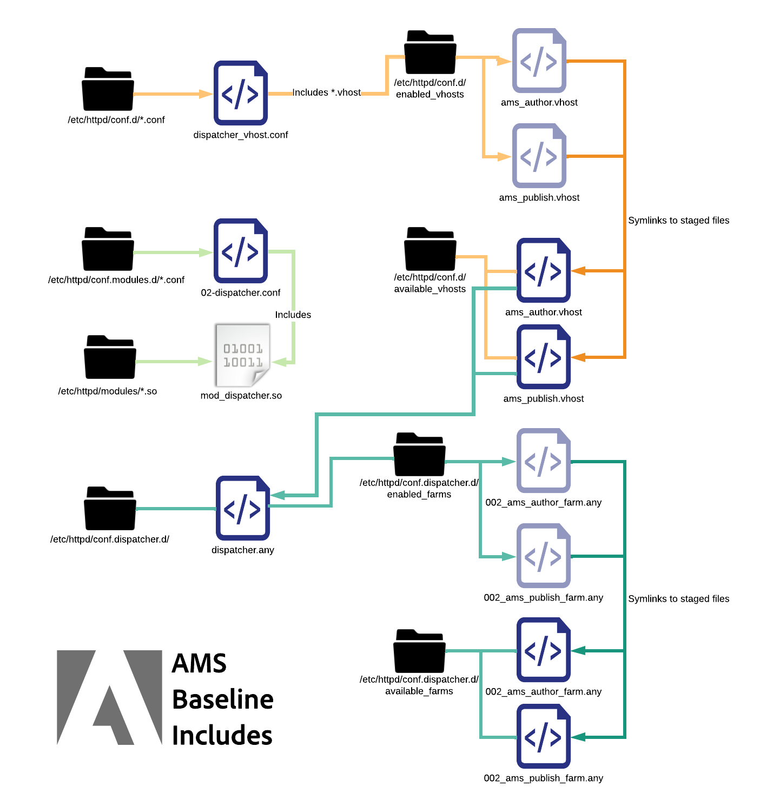
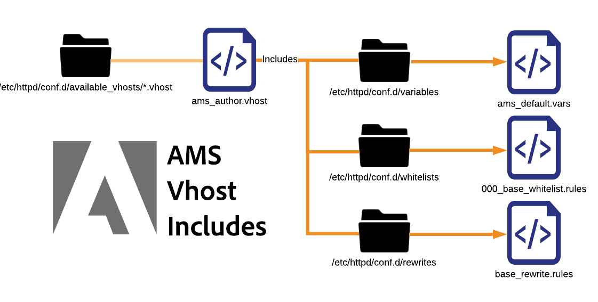

# 配置文件说明

[目录](./overview.md)

[&lt; — 上一页：基本文件布局](./basic-file-layout.md)

本文档将细分并解释在AdobeManaged Services中配置的标准内置Dispatcher服务器中部署的每个配置文件。 它们的使用、命名惯例等……

## 命名约定

在使用URL定位文件时，Apache Web Server实际上并不关心文件的文件扩展名 `Include` 或 `IncludeOptional` 语句。  使用能消除冲突和混淆的名称正确命名它们有助于 <b>吨</b>. 使用的名称将描述应用文件的范围，使工作更轻松。 如果所有内容都已命名 `.conf` 这真让人困惑。 我们希望避免文件及扩展名的命名不当。  以下是典型AMS配置的Dispatcher中使用的不同自定义文件扩展名和命名约定的列表。

## conf.d/中包含的文件

| 文件 | 文件目标 | 描述 |
| ---- | ---------------- | ----------- |
| 文件名`.conf` | `/etc/httpd/conf.d/` | 默认的Enterprise Linux安装使用此文件扩展名和包含文件夹作为覆盖在httpd.conf中声明的设置的位置，并允许您在Apache中的全局级别添加其他功能。 |
| 文件名`.vhost` | 已暂存： `/etc/httpd/conf.d/available_vhosts/`<br>活动： `/etc/httpd/conf.d/enabled_vhosts/`<br/><br/><div style="color: #000;border-left: 6px solid #2196F3;background-color:#ddffff;"><b>注意：</b> .vhost文件不会复制到enabled_vhosts文件夹中，而是使用符号链接指向available_vhosts/\*.vhost文件的相对路径</div></u><br><br> | \*.vhost （虚拟主机）文件是 `<VirtualHosts>`  条目以匹配主机名，并允许Apache使用不同的规则处理每个域流量。 从 `.vhost` 文件，其他文件，如 `rewrites`， `whitelisting`， `etc` 将被包括。 |
| 文件名`_rewrite.rules` | `/etc/httpd/conf.d/rewrites/` | `*_rewrite.rules` 文件存储 `mod_rewrite` 要由包含和使用的显式规则 `vhost` 文件 |
| 文件名`_whitelist.rules` | `/etc/httpd/conf.d/whitelists/` | `*_ipwhitelist.rules` 文件包含在 `*.vhost` 文件。 它包含IP正则表达式或允许拒绝规则，以允许将IP列入白名单。 如果您尝试根据IP地址限制查看虚拟主机，您将生成这些文件之一，并将其从您的网站中包含 `*.vhost` 文件 |

## conf.dispatcher.d/中包含的文件

| 文件 | 文件目标 | 描述 |
| --- | --- | --- |
| 文件名`.any` | `/etc/httpd/conf.dispatcher.d/` | AEM Dispatcher Apache模块从获取其设置 `*.any` 文件。 默认父包含文件为 `conf.dispatcher.d/dispatcher.any` |
| 文件名`_farm.any` | 已暂存： `/etc/httpd/conf.dispatcher.d/available_farms/`<br>活动： `/etc/httpd/conf.dispatcher.d/enabled_farms/`<br><br><div style="color: #000;border-left: 6px solid #2196F3;background-color:#ddffff;"><b>注意：</b> 这些场文件将不会复制到 `enabled_farms` 文件夹但使用 `symlinks` 到相对路径 `available_farms/*_farm.any` 文件 </div> <br/>`*_farm.any` 文件包含在 `conf.dispatcher.d/dispatcher.any` 文件。 这些父场文件可用于控制每个渲染或网站类型的模块行为。 文件创建于 `available_farms` 目录并已启用 `symlink` 到 `enabled_farms` 目录。  <br/>它会根据中的名称自动包含这些字段。 `dispatcher.any` 文件。<br/><b>基线</b> 场文件开头为 `000_` 以确保它们最先被加载。<br><b>自定义</b> 场文件应随后加载，方法是在开始其编号方案时 `100_` 以确保正确的包含行为。 |
| 文件名`_filters.any` | `/etc/httpd/conf.dispatcher.d/filters/` | `*_filters.any` 文件包含在 `conf.dispatcher.d/enabled_farms/*_farm.any` 文件。 每个场都有一组规则，这些规则会更改应该过滤掉的流量，而不是发送给渲染程序。 |
| 文件名`_vhosts.any` | `/etc/httpd/conf.dispatcher.d/vhosts/` | `*_vhosts.any` 文件包含在 `conf.dispatcher.d/enabled_farms/*_farm.any` 文件。 这些文件是主机名或URI路径的列表，将通过blob匹配来匹配，以确定使用哪个渲染器为该请求提供服务 |
| 文件名`_cache.any` | `/etc/httpd/conf.dispatcher.d/cache/` | `*_cache.any` 文件包含在 `conf.dispatcher.d/enabled_farms/*_farm.any` 文件。 这些文件指定缓存哪些项目以及不缓存哪些项目 |
| 文件名`_invalidate_allowed.any` | `/etc/httpd/conf.dispatcher.d/cache/` | `*_invalidate_allowed.any` 文件包含在 `conf.dispatcher.d/enabled_farms/*_farm.any` 文件。 它们指定允许哪些IP地址发送刷新和失效请求。 |
| 文件名`_clientheaders.any` | `/etc/httpd/conf.dispatcher.d/clientheaders/` | `*_clientheaders.any` 文件包含在 `conf.dispatcher.d/enabled_farms/*_farm.any` 文件。 它们指定应将哪些客户端标头传递到每个渲染程序。 |
| 文件名`_renders.any` | `/etc/httpd/conf.dispatcher.d/renders/` | `*_renders.any` 文件包含在 `conf.dispatcher.d/enabled_farms/*_farm.any` 文件。 它们为每个渲染器指定IP、端口和超时设置。 合适的渲染器可以是Livecycle服务器或Dispatcher从中获取/代理请求的任何AEM系统 |

## 已避免的问题

在遵循命名惯例时，您可以避免某些容易出错且可能造成灾难性结果的错误。  我们将介绍一些示例。

### 问题示例

例如，作为站点示例，Dispatcher配置的开发人员创建了两个配置文件。

<b>/etc/httpd/conf.d/exampleco.conf</b>

```
<VirtualHost *:80> 
    ServerName  "exampleco" 
    ServerAlias "www.exampleco.com" 
    .......... SNIP ............... 
    <IfModule mod_rewrite.c> 
        ReWriteEngine   on 
        LogLevel warn rewrite:trace1 
        Include /etc/httpd/conf.d/rewrites/exampleco.conf 
    </IfModule> 
</VirtualHost>
```

<b>/etc/httpd/conf.d/rewrites/exampleco.conf</b>

```
RewriteRule ^/$ /content/exampleco/en.html [PT,L] 
RewriteRule ^/robots.txt$ /content/dam/exampleco/robots.txt [PT,L]
```

#### `POTENTIAL DANGER - The file names are the same`

如果 `vhost` 文件被意外放入 `rewrites` 文件夹和 `rewrites file` 被放入 `vhosts` 文件夹。  它似乎已按文件名正确部署，但Apache将掷回 *错误* 这个问题不会立即显现。

<b>这通常如何成为一个问题</b>

如果 `two files` 下载到 `same` 位置可以 `overwrite themselves` 或者让部署过程变得一目了然，变成一场噩梦。

<b>文件扩展名相同且容易自动包含</b>

文件扩展名相同，并使用Apache将自动包含的扩展名 `auto include` 任意 `.conf` 文件位于许多默认文件夹中。

<b>这通常如何成为一个问题</b>

如果扩展名为 `.conf` 放入 `/etc/httpd/conf.d/` 文件夹，它会尝试将它加载到Apache上的内存中，这通常没有问题，但如果重写了扩展名为 `.conf` 放置在 `/etc/httpd/conf.d/` 文件夹内，它将被自动包含并全局应用，从而导致混乱和不希望的结果。

## 解决方法

根据文件的操作命名文件，并安全地退出自动包含规则命名空间。

如果是虚拟主机文件名，则使用 `.vhost` 作为扩展。

如果是重写规则文件，请将其命名为“site（站点）”`_rewrite.rules` 作为后缀和扩展。 此命名惯例将明确指出该站点用于哪个站点，以及它是一组重写规则。

如果它是IP白名单规则文件，请将其命名为描述`_whitelist.rules` 作为后缀和扩展。 此命名约定将给出其用途的一些描述，以及它是一组IP匹配规则。

如果文件被移动到其不所属的自动包含目录中，使用这些命名约定可避免出现问题。

例如，将名为的文件放入 `.rules`， `.any`，或 `.vhost` 在的自动包含文件夹中 `/etc/httpd/conf.d/` 不会有任何影响。

如果部署更改请求中显示“请将exampleco_rewrite.rules部署到生产Dispatcher”，则部署这些更改的人员可能已经知道他们不会添加新站点，而只是更新重写规则，如文件名所示。

### 包括订单

在Enterprise Linux上安装的Apache Webserver中扩展功能和配置时，您有一些重要的包括订单，您需要了解这些订单

### Apache基线包括


如上图所示，httpd二进制文件仅查找httpd.conf文件作为配置文件。  该文件包含以下语句：

```
Include conf.modules.d/*.conf 
IncludeOptional conf.d/*.conf
```

### AMS顶级包含

在应用标准时，我们添加了其他文件类型，并包括我们自己的文件类型。

以下是AMS基准目录，最上层包括


在Apache基线的基础上，我们展示了AMS如何为创建一些其他文件夹和顶级包含 `conf.d` 文件夹以及嵌套在下的模块特定目录 `/etc/httpd/conf.dispatcher.d/`

加载Apache时，它会拉入 `/etc/httpd/conf.modules.d/02-dispatcher.conf` 并且该文件将包含二进制文件 `/etc/httpd/modules/mod_dispatcher.so` 进入运行状态。

```
LoadModule dispatcher_module modules /mod_dispatcher .so
```

要在我们的中使用 `<VirtualHost />` 我们会将配置文件放入 `/etc/httpd/conf.d/` 已命名 `dispatcher_vhost.conf` 在此文件中，您将看到“使用设置”模块运行所需的基本参数：

```
<IfModule disp_apache2.c> 
    DispatcherConfig conf.dispatcher.d/dispatcher.any 
    ...SNIP... 
</IfModule>
```

如上所示，这包括顶层 `dispatcher.any` 文件供Dispatcher模块从中获取配置文件 `/etc/httpd/conf.dispatcher.d/dispatcher.any`

请注意此文件的内容：

```
/farms { 
    $include "enabled_farms/*_farm.any" 
}
```

顶层 `dispatcher.any` 文件包含所有位于中的启用的场文件 `/etc/httpd/conf.dispatcher.d/enabled_farms/` 文件名为 `FILENAME_farm.any` 它遵循我们的标准命名惯例。

稍后 `dispatcher_vhost.conf` 前面提到的文件，我们还使用include语句启用每个启用的虚拟主机文件，这些文件位于 `/etc/httpd/conf.d/enabled_vhosts/` 文件名为 `FILENAME.vhost` 它遵循我们的标准命名惯例。

```
IncludeOptional /etc/httpd/conf.d/enabled_vhosts/*.vhost
```

在我们每个.vhost文件中，您会注意到Dispatcher模块作为目录的默认文件处理程序进行初始化。  下面是一个示例.vhost文件，其中显示了语法：

```
<VirtualHost *:80> 
 ServerName "weretail" 
 ServerAlias www.weretail.com weretail.com 
 <Directory /> 
  <IfModule disp_apache2.c> 
   ....SNIP.... 
   SetHandler dispatcher-handler 
  </IfModule> 
  ....SNIP.... 
 </Directory> 
 ....SNIP.... 
</VirtualHost>
```

在顶级包含解析后，它们会具有其他值得一提的子包含。  以下是一个高级图表，说明了场和vhosts文件如何包含其他子元素

### AMS虚拟主机包括



当出现任何 `.vhost` 文件来源 `/etc/httpd/conf.d/availabled_vhosts/` 目录符号链接到 `/etc/httpd/conf.d/enabled_vhosts/` 目录，它们将在运行配置中使用。

此 `.vhost` 根据我们找到的公共部分，文件包含sub includes。  变量、白名单和重写规则等内容。

此 `.vhost` 根据文件中需要包含语句的位置，文件将包含include语句 `.vhost` 文件。  以下是的语法示例 `.vhost` 文件作为良好参考：

```
Include /etc/httpd/conf.d/variables/weretail.vars 
<VirtualHost *:80> 
 ServerName "${MAIN_DOMAIN}" 
 <Directory /> 
  Include /etc/httpd/conf.d/whitelists/weretail*_whitelist.rules 
  <IfModule disp_apache2.c> 
   ....SNIP.... 
   SetHandler dispatcher-handler 
  </IfModule> 
  ....SNIP.... 
 </Directory> 
 ....SNIP.... 
 <IfModule mod_rewrite.c> 
  ReWriteEngine   on 
  LogLevel warn rewrite:trace1 
  Include /etc/httpd/conf.d/rewrites/weretail_rewrite.rules 
 </IfModule> 
</VirtualHost>
```

如上面的示例所示，此配置文件中有一个include用于以后要使用的变量。

文件内部 `/etc/httpd/conf.d/variables/weretail.vars` 我们可以看到定义了哪些变量：

```
Define MAIN_DOMAIN dev.weretail.com
```

您还可以看到一行，其中包含列表 `_whitelist.rules` 根据不同的白名单条件限制可查看此内容的人员的文件。  让我们看一下其中一个白名单文件的内容 `/etc/httpd/conf.d/whitelists/weretail_mainoffice_whitelist.rules`：

```
<RequireAny> 
  Require ip 192.150.16.0/23 
</RequireAny>
```

您还可以看到包含一组重写规则的行。  下面我们看一下 `weretail_rewrite.rules` 文件：

```
RewriteRule ^/robots.txt$ /content/dam/weretail/robots.txt [NC,PT] 
RewriteCond %{SERVER_NAME} brand1.weretail.net [NC] 
RewriteRule ^/favicon.ico$ /content/dam/weretail/favicon.ico [NC,PT] 
RewriteCond %{SERVER_NAME} brand2.weretail.com [NC] 
RewriteRule ^/sitemap.xml$ /content/weretail/general/sitemap.xml [NC,PT] 
RewriteRule ^/logo.jpg$ /content/dam/weretail/general/logo.jpg [NC,PT]
```

### AMS场包含


当任何FILENAME_farm.any文件来自 `/etc/httpd/conf.dispatcher.d/available_farms/` 目录符号链接到 `/etc/httpd/conf.dispatcher.d/enabled_farms/` 目录，它们将在运行配置中使用。

场文件具有基于的子包含 [场的顶级部分](https://experienceleague.adobe.com/docs/experience-manager-dispatcher/using/configuring/dispatcher-configuration.html?lang=en#defining-farms-farms) 如缓存、clientheaders、过滤器、渲染和主机。

此 `FILENAME_farm.any` 根据文件场文件中需要包含的位置，文件将为每个文件包含include语句。  以下是的语法示例 `FILENAME_farm.any` 文件作为良好参考：

```
/weretailfarm {   
 /clientheaders { 
  $include "/etc/httpd/conf.dispatcher.d/clientheaders/ams_publish_clientheaders.any" 
  $include "/etc/httpd/conf.dispatcher.d/clientheaders/ams_common_clientheaders.any" 
 } 
 /virtualhosts { 
  $include "/etc/httpd/conf.dispatcher.d/vhosts/weretail_vhosts.any" 
 } 
 /renders { 
  $include "/etc/httpd/conf.dispatcher.d/renders/ams_publish_renders.any" 
 } 
 /filter { 
  $include "/etc/httpd/conf.dispatcher.d/filters/ams_publish_filters.any" 
  $include "/etc/httpd/conf.dispatcher.d/filters/weretail_search_filters.any" 
 } 
 ....SNIP.... 
 /cache { 
  ....SNIP.... 
  /rules { 
   $include "/etc/httpd/conf.dispatcher.d/cache/ams_publish_cache.any" 
  } 
  ....SNIP.... 
  /allowedClients { 
   /0000 { 
    /glob "*.*.*.*" 
    /type "deny" 
   } 
   $include "/etc/httpd/conf.dispatcher.d/cache/ams_publish_invalidate_allowed.any" 
  } 
 ....SNIP.... 
 } 
}
```

由于您可以看到weretail场的每个部分，但没有获得所需的所有语法，因此请使用include语句。

让我们看一下其中几个包含的语法，以了解每个子包含是什么样的

`/etc/httpd/conf.dispatcher.d/vhosts/weretail_publish_vhosts.any`：

```
"brand1.weretail.com" 
"brand2.weretail.com" 
"www.weretail.comf"
```

如您所见，这是一个新的以行分隔的域名列表，应从该场呈现域名，而不是其他场。

接下来，我们来看一下 `/etc/httpd/conf.dispatcher.d/filters/weretail_search_filters.any`：

```
/400 { /type "allow" /method "GET" /path "/bin/weretail/lists/*" /extension "json" } 
/401 { /type "allow" /method "POST" /path "/bin/weretail/search/' /extension "html" }
```

[下一步 — >了解缓存](./understanding-cache.md)
