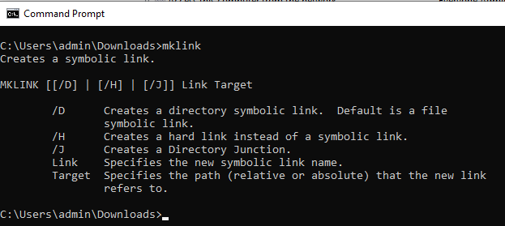

# 在GIT中添加符号链接

[目录](./overview.md)

[&lt; — 上一页：Dispatcher运行状况检查](./health-check.md)

在AMS中，您将获得一个预填充的GIT存储库，其中包含已成熟的调度程序源代码，可供您开始开发和自定义。

创建第一个`.vhost`文件或顶级`farm.any`文件后，您需要创建从`available_*`目录到`enabled_*`目录的符号链接。 使用正确的链接类型将是通过Cloud Manager管道成功部署的关键。 此页面将帮助您了解如何执行此操作。

## Dispatcher原型

AEM开发人员通常从[AEM原型](https://github.com/adobe/aem-project-archetype)开始他们的项目

以下是源代码区域示例，您可以从中看到使用的符号链接：

```
$ tree dispatcher
dispatcher
└── src
   ├── conf.d
.....SNIP.....
    │   └── available_vhosts
    │   │   ├── 000_unhealthy_author.vhost
    │   │   ├── 000_unhealthy_publish.vhost
    │   │   ├── aem_author.vhost
    │   │   ├── aem_flush.vhost
    │   │   ├── aem_health.vhost
    │   │   ├── aem_lc.vhost
    │   │   └── aem_publish.vhost
    └── dispatcher_vhost.conf
    │   └── enabled_vhosts
    │   │   ├── aem_author.vhost -> ../available_vhosts/aem_author.vhost
    │   │   ├── aem_flush.vhost -> ../available_vhosts/aem_flush.vhost
    │   │   ├── aem_health.vhost -> ../available_vhosts/aem_health.vhost
    │   │   └── aem_publish.vhost -> ../available_vhosts/aem_publish.vhost
.....SNIP.....
    └── conf.dispatcher.d
    │   ├── available_farms
    │   │   ├── 000_ams_author_farm.any
    │   │   ├── 001_ams_lc_farm.any
    │   │   └── 002_ams_publish_farm.any
.....SNIP.....
    │   └── enabled_farms
    │   │   ├── 000_ams_author_farm.any -> ../available_farms/000_ams_author_farm.any
    │   │   └── 002_ams_publish_farm.any -> ../available_farms/002_ams_publish_farm.any
.....SNIP.....
17 directories, 60 files
```

例如，`/etc/httpd/conf.d/available_vhosts/`目录包含我们可在运行配置中使用的暂存的潜在`.vhost`文件。

启用的`.vhost`文件将在`/etc/httpd/conf.d/enabled_vhosts/`目录中显示为相对路径`symlinks`。

## 创建符号链接

我们使用指向文件的符号链接，因此Apache Webserver会将目标文件视为相同的文件。  我们不希望同时在这两个目录中复制文件。  而只是从一个目录（符号链接）到另一个目录的快捷方式。

识别您部署的配置将针对Linux主机。  创建与目标系统不兼容的符号链接会导致故障和不需要的结果。

如果您的工作站不是Linux计算机，您可能会想知道要使用什么命令来正确创建这些链接，以便它们可以将其提交到GIT中。

> `TIP:`使用相对链接很重要，因为如果您安装了Apache Webserver的本地副本并具有不同的安装基础，则链接仍然有效。  如果您使用绝对路径，则您的工作站或其他系统必须匹配相同的精确目录结构。

### OSX / Linux

符号链接是这些操作系统的固有链接，下面是创建这些链接的一些示例。  打开您喜爱的终端应用程序，然后使用以下示例命令创建链接：

```
$ cd <LOCATION OF CLONED GIT REPO>\src\conf.d\enabled_vhosts
$ ln -s ../available_vhosts/<Destination File Name> <Target File Name>
```

以下是供参考的填充命令示例：

```
$ git clone https://github.com/adobe/aem-project-archetype.git
$ cd aem-project-archetype/src/main/archetype/dispatcher.ams/src/conf.d/enabled_vhosts/
$ ln -s ../available_vhosts/aem_flush.vhost aem_flush.vhost
```

如果您使用`ls`命令列出文件，下面是现在链接的示例：

```
ls -l
total 0
lrwxrwxrwx. 1 root root 35 Oct 13 21:38 aem_flush.vhost -> ../available_vhosts/aem_flush.vhost
```

### Windows

> `Note:`原来MS Windows（更好的是NTFS）支持符号链接，因为……Windows Vista！



> `Warning:`创建符号链接的mklink命令需要管理员权限才能正常运行。 即使作为管理员帐户，您仍需要以管理员身份运行命令提示符，除非您已启用开发人员模式
> <br/>不正确的权限：
> 
> <br/>适当权限：
> 

以下是创建链接的命令：

```
C:\<PATH TO SRC>\enabled_vhosts> mklink <Target File Name> ..\available_vhosts\<Destination File Name>
```


以下是供参考的填充命令示例：

```
C:\> git clone https://github.com/adobe/aem-project-archetype.git
C:\> cd aem-project-archetype\src\main\archetype\dispatcher.ams\src\conf.d\enabled_vhosts\
C:\aem-project-archetype\src\main\archetype\dispatcher.ams\src\conf.d\enabled_vhosts> mklink aem_flush.vhost ..\available_vhost\aem_flush.vhost
symbolic link created for aem_flush.vhost <<===>> ..\available_vhosts\aem_flush.vhost
```

#### 开发人员模式( Windows 10 )

当置于[开发人员模式](https://docs.microsoft.com/en-us/windows/apps/get-started/enable-your-device-for-development)中时，Windows 10允许您更轻松地测试您正在开发的应用、使用Ubuntu Bash shell环境、更改各种以开发人员为中心的设置以及执行其他此类操作。

Microsoft似乎不断向开发人员模式添加功能，或者在达到更广泛的采用并被视为稳定时默认启用其中的某些功能（例如，使用创建者更新，Ubuntu Bash Shell环境不再需要开发人员模式）。

符号链接呢？ 启用“开发人员模式”后，无需使用提升的权限运行命令提示符即可创建符号链接。 因此，启用“开发人员模式”后，任何用户都可以创建符号链接。

> 启用“开发人员模式”后，用户应注销/登录以使更改生效。

现在，您无需以管理员身份运行命令即可看到


#### 替代/程序化方法

有一个特定策略允许某些用户在[创建符号链接(Windows 10) - Windows安全→创建符号链接 | Microsoft文档](https://docs.microsoft.com/en-us/windows/security/threat-protection/security-policy-settings/create-symbolic-links)

专业版：
- 客户可以利用这一点以编程方式允许为其组织内的所有开发人员（即Active Directory）创建符号链接，而无需在每个设备上手动启用开发人员模式。
- 此外，此策略应在不提供开发人员模式的早期版本的MS Windows中可用。

CON：
- 此策略似乎对属于Administrators组的用户无效。 管理员仍需要以提升的权限运行命令提示符。 奇怪。

> 用户需要注销/登录才能使对本地/组策略的更改生效。

运行`gpedit.msc`，根据需要添加/更改用户。 默认情况下，管理员在那里


#### 在GIT中启用符号链接

Git根据core.symlinks选项处理符号链接

Source： [Git - git-config文档](https://git-scm.com/docs/git-config#Documentation/git-config.txt-coresymlinks)

*如果core.symlinks为false，符号链接将作为包含链接文本的小普通文件签出。 `git-update-index[1]`和`git-add[1]`不会将记录的类型更改为常规文件。 对于不支持符号链接的文件系统（如FAT）非常有用。
默认值为true，但`git-clone[1]`或`git-init[1] will probe and set core.symlinks false if appropriate when the repository is created.`除外。在大多数情况下，Git将假设Windows对符号链接没有好处，并将此值设置为false。*

Git在Windows上的行为可在此处详细解释：符号链接· git-for-windows/git Wiki · GitHub

> `Info`：以上链接文档中所列的假设在Windows上可能的AEM Developer设置（尤其是NTFS）以及我们只有文件符号链接与目录符号链接的情况下似乎没问题

好消息是，由于[Git for Windows version 2.10.2](https://github.com/git-for-windows/git/releases/tag/v2.10.2.windows.1)，安装程序有一个[显式选项来启用符号链接支持。](https://github.com/git-for-windows/git/issues/921)

> `Warning`：可在克隆存储库时运行时提供core.symlink选项，否则可存储为全局配置。


适用于Windows的Git将在`"C:\Program Files\Git\etc\gitconfig"`中存储全局首选项。 其他Git桌面客户端应用程序可能不考虑这些设置。
这里有个问题，并不是所有开发人员都会使用Git本机客户端（即Git Cmd、Git Bash），并且某些Git桌面应用程序（例如GitHub Desktop、Atlassian Sourcetree）可能具有不同的设置/默认值以使用系统或嵌入的Git

以下是`gitconfig`文件内的内容的示例

```
[diff "astextplain"]
    textconv = astextplain
[filter "lfs"]
    clean = git-lfs clean -- %f
    smudge = git-lfs smudge -- %f
    process = git-lfs filter-process
    required = true
[http]
    sslBackend = openssl
    sslCAInfo = C:/Program Files/Git/mingw64/ssl/certs/ca-bundle.crt
[core]
    autocrlf = true
    fscache = true
    symlinks = true
[pull]
    rebase = false
[credential]
    helper = manager-core
[credential "https://dev.azure.com"]
    useHttpPath = true
[init]
    defaultBranch = master
```

#### Git命令行提示

在有些情况下，您可能需要创建新符号链接（例如，添加新的主机或新场）。

我们在上面的文档中看到，Windows提供了“mklink”命令来创建符号链接。

如果您在Git Bash环境中工作，则可以改用标准Bash命令`ln -s`，但必须使用特殊指令（如以下示例）作为前缀：

```
MSYS=winsymlinks:nativestrict ln -s test_vhost_symlink ../dispatcher/src/conf.d/available_vhosts/default.vhost
```

#### 摘要

要在Microsoft Windows操作系统上让Git正确处理符号链接(至少对于当前AEM Dispatcher配置基线的范围)，您将需要：

| 项目 | 最低版本/配置 | 建议的版本/配置 |
|------|---------------------------------|-------------------------------------|
| 操作系统 | Windows Vista或更新版本 | Windows 10创建者更新或更高版本 |
| 文件系统 | NTFS | NTFS |
| 能够为Windows用户处理符号链接 | `"Create symbolic links"`组/本地策略`under "Group Computer Configuration\Windows Settings\Security Settings\Local Policies\User Rights Assignment"` | Windows 10开发人员模式已启用 |
| GIT | Native client版本1.5.3 | Native Client版本2.10.2或更高版本 |
| Git配置 | 从命令行执行git克隆时的`--core.symlinks=true`选项 | Git全局配置<br/>`[core]`<br/>    symlinks = true <br/>本机Git客户端配置路径： `C:\Program Files\Git\etc\gitconfig` <br/>Git桌面客户端的标准位置： `%HOMEPATH%\.gitconfig` |

> `Note:`如果您已经拥有本地存储库，则需要从源重新克隆。 您可以克隆到一个新位置，并将未提交/未暂存的本地更改手动合并到新克隆的存储库中。
