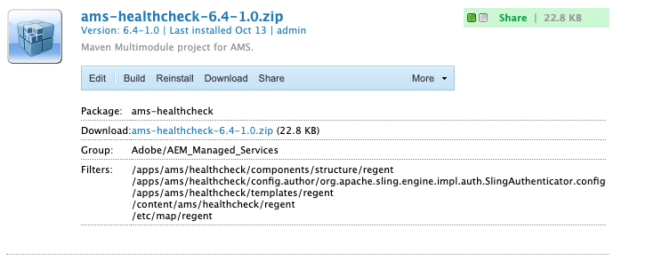

# AMS Dispatcher运行状况检查

[目录](./overview.md)

[&lt; — 上一个：只读文件](./immutable-files.md)

安装AMS基线调度程序后，会附带一些免费赠品。  其中一项功能是一组运行状况检查脚本。
这些脚本使前面的AEM堆栈负载平衡器能够知道哪些腿部正常，并使它们保持服务。


## 基本负载平衡器运行状况检查

当客户流量通过Internet到达您的AEM实例时，他们将通过负载平衡器


通过负载平衡器的每个请求都将循环到每个实例。  负载平衡器内置了运行状况检查机制，以确保它向正常主机发送流量。

默认检查通常是端口检查，以查看负载平衡器中目标服务器是否正在侦听端口流量（即TCP 80和443）

> `Note:` 虽然这样做起作用，但AEM是否健康还没有真正的衡量标准。  它仅测试Dispatcher（Apache Web服务器）是否已启动且正在运行。

## AMS运行状况检查

为避免将流量发送到正在处理不正常AEM实例的正常调度程序，AMS创建了一些额外功能来评估腿的健康状况，而不只是评估调度程序的运行状况。


健康检查包括以下部分
- 1 `Load balancer`
- 1 `Apache web server`
- 3 `Apache *VirtualHost* config files`
- 5 `CGI-Bin scripts`
- 1 `AEM instance`
- 1 `AEM package`

我们将介绍每件作品的布置及其重要性

### AEM包

要指示AEM是否正常运行，您需要它执行一些基本的页面编译并提供页面。  Adobe Managed Services创建了一个包含测试页的基本包。  页面会测试存储库是否已打开，以及资源和页面模板是否可以呈现。



这是页面。  将显示安装的存储库ID


> `Note:` 我们确保页面不能缓存。  如果每次只返回缓存的页面，则不会检查实际状态！

这是我们可以测试的轻量端点，用于查看AEM是否已启动且正在运行。

### 负载平衡器配置

我们将负载平衡器配置为指向CGI-BIN端点，而不是使用端口检查。


### Apache运行状况检查虚拟主机

#### CGI-BIN虚拟主机 `(/etc/httpd/conf.d/available_vhosts/ams_health.vhost)`

这是 `<VirtualHost>` Apache配置文件，用于启用CGI-Bin文件的运行。

```
Listen 81
<VirtualHost *:81>
    ServerName	"health"
    ...SNIP...
    ScriptAlias /health/ "/var/www/cgi-bin/health/"
</VirtualHost>
```

> `Note:` cgi-bin文件是可以运行的脚本。  这可能是一个易受攻击的攻击矢量，而AMS使用的这些脚本并不可公开访问，只有负载平衡器才能针对其进行测试。


#### 虚拟主机维护不正常

- `/etc/httpd/conf.d/available_vhosts/000_unhealthy_author.vhost`
- `/etc/httpd/conf.d/available_vhosts/000_unhealthy_publish.vhost`

这些文件名为 `000_` 作为前缀。  内部配置为使用与实时网站相同的域名。  其目的在于，当运行状况检查检测到某个AEM后端存在问题时，启用此文件。  然后提供错误页面，而不是仅提供没有页面的503 HTTP响应代码。  会偷走正常交通 `.vhost` 文件，因为它在 `.vhost` 文件 `ServerName` 或 `ServerAlias`.  导致发往特定域的页面转到不健康的主机，而不是正常流量通过的默认主机。

运行运行状况检查脚本时，它们会注销其当前运行状况状态。  服务器上每分钟运行一次cronjob，该作业在日志中查找不正常的条目。  如果它检测到创作AEM实例不正常，则将启用符号链接：

日志条目：

```
# grep "ERROR\|publish" /var/log/lb/health_check.log
E, [2022-11-23T20:13:54.984379 #26794] ERROR -- : AUTHOR -- Exception caught: Connection refused - connect(2)
I, [2022-11-23T20:13:54.984403 #26794]  INFO -- : [checkpublish]-author:0-publish:1-[checkpublish]
```

触发：

```
# grep symlink /var/log/lb/health_check_reload.log
I, [2022-11-23T20:34:19.213179 #2275]  INFO -- : ADDING VHOST symlink /etc/httpd/conf.d/available_vhosts/000_unhealthy_author.vhost => /etc/httpd/conf.d/enabled_vhosts/000_unhealthy_author.vhost
```

您可以通过在 `/var/www/cgi-bin/health_check.conf`

```
# grep RELOAD_MODE /var/www/cgi-bin/health_check.conf
RELOAD_MODE='author'
```

有效选项：
- 作者
   - 这是默认选项。
   - 这会为作者设置一个维护页面，当它不正常时
- 发布
   - 此选项将为发布者设置一个维护页面，当它不正常时
- 全部
   - 此选项将为作者或发布者设置一个维护页面，或者如果两者变得不正常，则会同时设置这两个页面
- 无
   - 此选项会跳过运行状况检查的此功能

在查看 `VirtualHost` 为这些请求设置时，您会看到它们加载的文档与启用请求后出现的每个请求的错误页面相同：

```
<VirtualHost *:80>
	ServerName	unhealthyauthor
	ServerAlias	${AUTHOR_DEFAULT_HOSTNAME}
	ErrorDocument	503 /error.html
	DocumentRoot	/mnt/var/www/default
	<Directory />
		Options FollowSymLinks
		AllowOverride None
	</Directory>
	<Directory "/mnt/var/www/default">
		AllowOverride None
		Require all granted
	</Directory>
	<IfModule mod_headers.c>
		Header always add X-Dispatcher ${DISP_ID}
		Header always add X-Vhost "unhealthy-author"
	</IfModule>
	<IfModule mod_rewrite.c>
		ReWriteEngine   on
		RewriteCond %{REQUEST_URI} !^/error.html$
		RewriteRule ^/* /error.html [R=503,L,NC]
	</IfModule>
</VirtualHost>
```

响应代码仍为 `HTTP 503`

```
# curl -I https://we-retail.com/
HTTP/1.1 503 Service Unavailable
X-Dispatcher: dispatcher1useast1
X-Vhost: unhealthy-author
```

他们将获取此页面，而不是空白页面。


### CGI-Bin脚本

当从负载平衡器中拉出Dispatcher时，CSE可以在负载平衡器设置中配置5个不同的脚本，以更改这些脚本的行为或标准。

#### /bin/checkauthor

使用时，此脚本将检查并记录其正面的所有实例，但仅在 `author` AEM实例不正常

> `Note:` 请记住，如果发布AEM实例不正常，调度程序将继续运行以允许流量流向创作AEM实例

#### /bin/checkpublish（默认）

使用时，此脚本将检查并记录其正面的所有实例，但仅在 `publish` AEM实例不正常

> `Note:` 请记住，如果作者AEM实例不正常，调度程序将继续运行以允许流量流向发布AEM实例

#### /bin/checkeither

使用时，此脚本将检查并记录其正面的所有实例，但仅在 `author` 或 `publisher` AEM实例不正常

> `Note:` 请记住，如果发布AEM实例或创作AEM实例不正常，调度程序将会退出服务。  这意味着，如果其中一个运行正常，它也不会收到流量

#### /bin/checkboth

使用时，此脚本将检查并记录其正面的所有实例，但仅在 `author` 和 `publisher` AEM实例不正常

> `Note:` 请记住，如果发布AEM实例或创作AEM实例不正常，则调度程序不会退出服务。  这意味着，如果其中一个设备不健康，它将继续接收流量，并给请求资源的人员造成错误。

#### /bin/heathy

使用时，此脚本将检查并记录其正面的所有实例，但无论AEM是否返回错误，都只会返回正常状态。

> `Note:` 当运行状况检查未按预期运行且允许覆盖将AEM实例保留在负载平衡器中时，将使用此脚本。

[下一个 — > GIT符号链接](./git-symlinks.md)