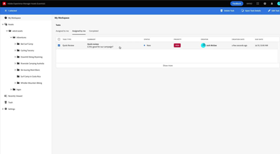

# 概述

Experience ManagerAssets Essentials为轻量级的资产管理和协作提供了简化的用户界面。

观看我们的视频，了解如何使用Assets Essentials管理您的资产，以及如何将其与Adobe历程Orchestrator集成！

## 进一步了解Assets Essentials

<table>
<td>
   
   

      <a href="./basics/managing.md">
      <strong>开始使用Assets Essentials</strong>
      </a>
   

   

      <em>了解Assets Essentials的基础知识！</em>
   

</td>
<td>
   
   

      <a href="./basics/collaborating.md">
      <strong>协作Assets Essentials</strong>
      </a>
   

   

      <em>了解Assets Essentials如何提供轻量级任务管理来管理资产的生命周期！</em>
   

</td>
<td>
   
   

      <a href="https://experienceleague.adobe.com/docs/journey-optimizer-learn/tutorials/create-messages/create-email-content-with-the-message-editor.html">
      <strong>Adobe Journey Optimizer</strong>
      </a>
   

   

      <em>了解Assets Essentials如何与Adobe Journey Optimizer集成！</em>
   

</td>
</table>
