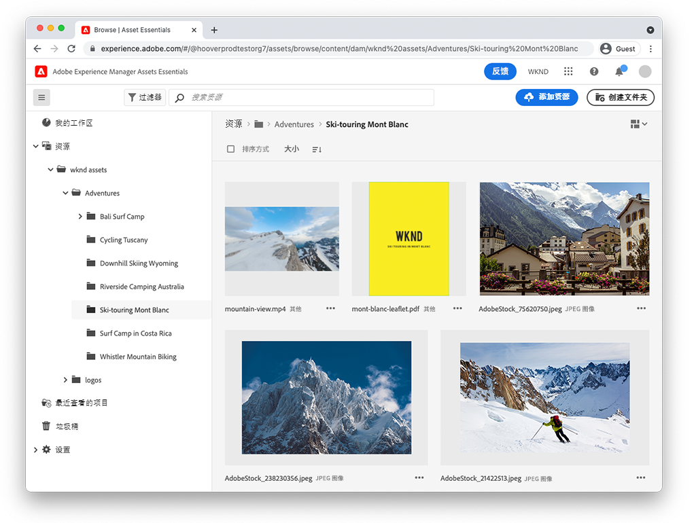
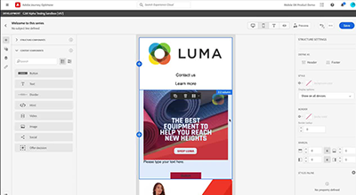

# AEM Assets Essentials

Experience ManagerAssets Essentials为轻量级的资产管理和协作提供了简化的用户界面。

观看我们的视频，了解如何使用Assets Essentials管理您的资产，以及如何将其与Adobe历程Orchestrator集成！

<table>
<td>
   
   

      <a href="./basics/managing.md">
      <strong>开始使用Assets Essentials</strong>
      </a>
   

   

      <em>了解Assets Essentials的基础知识！</em>
   

</td>
<!--
<td>
   
   

      <a href="./provisioning/getting-access.md">
      <strong>Creative Cloud and Assets Essentials</strong>
      </a>
   

   

      <em>Learn how Assets Essentials can integrate with your Creative Cloud Enterprise Libraries!</em>
   

</td>
-->
<td>
   
   

      <a href="https://experienceleague.adobe.com/docs/journey-optimizer/using/create-messages/assets-essentials.html">
      <strong>Adobe Journey Optimizer</strong>
      </a>
   

   

      <em>了解Assets Essentials如何与Adobe Journey Optimizer集成！</em>
   

</td>
</table>
