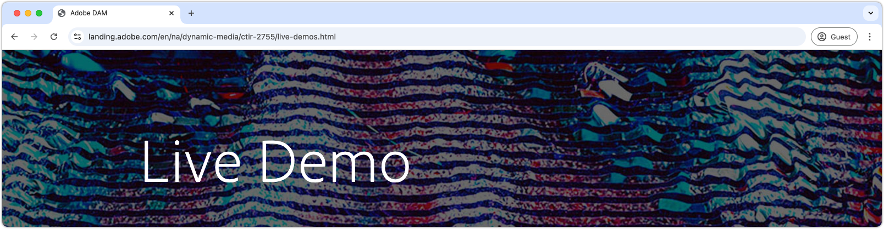

# 将Dynamic Media与AEM Assets结合使用 {#understanding-aem-dynamic-media}

此多部分视频系列概述了如何使用Adobe Experience Manager Dynamic Media作为内容服务服务来管理和访问媒体内容。 通过Dynamic Media，您可以管理和发布动态数字体验，这是Experience Manager Assets特有的功能。 我们的框架和组件套件允许营销人员在所有设备上自定义和提供交互式多媒体体验。

## Dynamic Media实时演示

通过我们的&#x200B;[**实时演示**](https://landing.adobe.com/zh-Hans/na/dynamic-media/ctir-2755/live-demos.html)来探索Adobe Dynamic Media的可能性，从而让前沿解决方案栩栩如生。 了解&#x200B;[**Dynamic Assets**](https://landing.adobe.com/en/na/dynamic-media/ctir-2755/dynamic-assets.html)如何简化工作流和提升内容管理，并发现能够在每个渠道中吸引受众的&#x200B;[**交互式体验**](https://landing.adobe.com/en/na/dynamic-media/ctir-2755/interactive-experiences.html)。 [了解Dynamic Media如何转变您的内容策略](https://landing.adobe.com/zh-Hans/na/dynamic-media/ctir-2755/live-demos.html)！

## Dynamic Media 概述

>[!VIDEO](https://video.tv.adobe.com/v/34932?captions=chi_hans&quality=12&learn=on)

>[!NOTE]
>
>此处演示的功能适用于Dynamic Media DMS7运行模式（我们当前支持的运行模式），不一定适用于DMS7已取代的DMHybrid运行模式。

此视频介绍如何使用Adobe Experience Manager Dynamic Media作为内容服务服务来管理和访问媒体内容。 Dynamic Media在单个“主资产”方法上运行，在此方法中，您可以上传图像资产或视频资产，可以请求这些资产完成一组无限制所需的可消耗变量或派生演绎版。 包括：

* 解释单个主资产到URL的产品交付内容
* 图像处理选项
* 内容查看器选项
* 将URL复制到图像和响应式查看器
* 将智能裁剪变体裁剪为URL

## 与AEM Sites一起使用

>[!VIDEO](https://video.tv.adobe.com/v/34936?captions=chi_hans&quality=12&learn=on)

>[!NOTE]
>
>此处演示的功能适用于Dynamic Media DMS7运行模式（我们当前支持的运行模式），不一定适用于DMS7已取代的DMHybrid运行模式。 本视频引用第1部分视频（Dynamic Media概述）中描述的概念。

此视频介绍如何在Adobe Experience Manager Dynamic Media中管理媒体内容，以及如何通过组件轻松地在AEM Sites中使用媒体内容，以实现简单且自动的裁剪，从而根据响应式页面宽度进行优化。 轻松创建交互式图像横幅并生成副本URL以用于任何内容管理系统。

* AEM Sites Dynamic Media组件灵活性
* 使用图像预设本地下载
* 创建和发布交互式横幅

## 构建混合媒体收藏集

>[!VIDEO](https://video.tv.adobe.com/v/34942?captions=chi_hans&quality=12&learn=on)

>[!NOTE]
>
>此处演示的功能适用于Dynamic Media DMS7运行模式（我们当前支持的运行模式），不一定适用于DMS7已取代的DMHybrid运行模式。 本视频引用第1部分视频（Dynamic Media概述）中描述的概念。

此视频介绍混合媒体查看器媒体资产集合（包括旋转集、视频和产品图像集合）的简单创建过程。 将内容添加到混合媒体集，并创建一个自定义的查看器，以在最终复制URL或AEM Sites组件中进行选择。

* 从相应的产品照片创建旋转集
* 为Dynamic Media视频上载母版视频并进行编码
* 从旋转集、视频和照片创建混合媒体集
* 编辑和使用自定义混合媒体查看器

## 图像预设

>[!VIDEO](https://video.tv.adobe.com/v/34499?captions=chi_hans&quality=12&learn=on)

此视频介绍如何创建图像预设，以及什么是图像预设，它是一系列图像服务器参数的简写形式，这些参数会在URL请求时对图像进行操作。 了解扩展和编辑图像预设的有用技术。

* 图像预设缩短器隐藏显式图像服务器命令集合
* 仅使用一个像素尺寸（宽度或高度）来使调整大小的新图像一致，而不使用内边距
* 始终使用锐化
* URL修饰符字段，用于添加调整图像预设大小的额外命令

## 高级URL修饰符

>[!VIDEO](https://video.tv.adobe.com/v/34493?captions=chi_hans&quality=12&learn=on)

此视频介绍如何超越调整图像大小功能，利用源文件本身的功能（背景透明度、内置剪切路径以及作为变量裁剪和文本）以及Dynamic Media的URL修饰符。

* 在Dynamic Media修饰符字段中使用URL修饰符
* 更改具有透明度的图像的背景颜色
* 剪切到图像路径
* 裁剪到图像路径
* 从Photoshop文件创建文本模板

## JPEG文件大小管理

>[!VIDEO](https://video.tv.adobe.com/v/35194?captions=chi_hans&quality=12&learn=on)

>[!NOTE]
>
>图像质量以反向压缩的百分比来测量，其中100%质量最少，从而产生高质量的图像，但文件大小相对较大。 Jpeg压缩是一种有损压缩方案，其中压缩设置决定图像质量和文件大小。

使用2个命令调整jpeg压缩设置，将jpeg图像质量与结果文件大小（以KB为单位）平衡以提高页面加载速度。 QLT通过调整jpeg压缩质量设置来定义图像质量。 JPEG Size命令允许您指定需要使用压缩实现的文件大小。

## 隐藏字幕

>[!VIDEO](https://video.tv.adobe.com/v/34311?captions=chi_hans&quality=12&learn=on)

通过附加复制URL以指向其他隐藏式字幕文件文档（一个web.VTT侧边栏文件，其中包含任何视频的CC信息），轻松地将隐藏式字幕添加到Dynamic Media视频中。

## 图像锐化

本视频说明为什么锐化图像对于保持图像保真度至关重要，以及如何使用高级设置制作完美图像。

<!--
This link is broken

>[!VIDEO](https://demos-pub.assetsadobe.com/etc/dam/viewers/s7viewers/html5/VideoViewer.html?asset=%2Fcontent%2Fdam%2Fdm-public-facing-upgrade-portal-video%2F04_DynamicImagery_AdvancedSettings_071917_BH.mp4&config=/etc/dam/presets/viewer/Video_social&serverUrl=https%3A%2F%2Fadobedemo62-h.assetsadobe.com%2Fis%2Fimage%2F&contenturl=%2F&config2=/etc/dam/presets/analytics&videoserverurl=https://gateway-na.assetsadobe.com/DMGateway/public/demoCo&posterimage=/content/dam/dm-public-facing-upgrade-portal-video/04_DynamicImagery_AdvancedSettings_071917_BH.mp4)
-->
