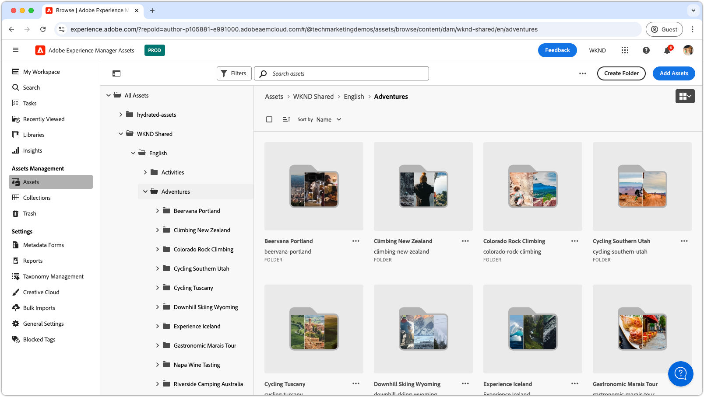

# Assets视图的视频播放列表

{align=center}

探索这些播放列表以掌握AEM Assetsas a Cloud ServiceAssets视图，包括配置、优化、使用以及与创意工作流的无缝集成。 获取成功使用AEM Assets as a Cloud Service所需的洞察信息。

## 配置Assets视图

开始使用基本设置和配置，以使AEM Assetsas a Cloud Service为您的团队和项目无缝工作。

<!-- CARDS

* https://experienceleague.adobe.com/en/playlists/experience-manager-all-configure-administrative-access
* https://experienceleague.adobe.com/en/playlists/experience-manager-assets-get-started-assets-essentials

-->
<!-- START CARDS HTML - DO NOT MODIFY BY HAND -->

    

        

            

                <figure class="image x-is-16by9">
                    
                </figure>
            

            

                

                    

                        <a href="https://experienceleague.adobe.com/en/playlists/experience-manager-all-configure-administrative-access" target="_blank" rel="referrer" title="配置对Experience Manager的管理访问权限">配置对Experience Manager的管理访问权限</a>
                    

                    
了解用户如何使用Adobe IMS对AEM as a Cloud Service进行身份验证，以及如何使用Adobe IMS用户、用户组和产品配置文件来控制对AEM及其特性和功能的访问。

                

                <a href="https://experienceleague.adobe.com/en/playlists/experience-manager-all-configure-administrative-access" target="_blank" rel="referrer" class="spectrum-Button spectrum-Button--outline spectrum-Button--primary spectrum-Button--sizeM" style="align-self: flex-start; margin-top: 1rem;">
                    观看
                </a>
            

        

    

    

        

            

                <figure class="image x-is-16by9">
                    
                </figure>
            

            

                

                    

                        <a href="https://experienceleague.adobe.com/en/playlists/experience-manager-assets-get-started-assets-essentials" target="_blank" rel="referrer" title="开始使用AEM Assets Essentials">开始使用AEM Assets Essentials</a>
                    

                    
了解AEM Assets Essentials如何简化您部门的资源管理。

                

                <a href="https://experienceleague.adobe.com/en/playlists/experience-manager-assets-get-started-assets-essentials" target="_blank" rel="referrer" class="spectrum-Button spectrum-Button--outline spectrum-Button--primary spectrum-Button--sizeM" style="align-self: flex-start; margin-top: 1rem;">
                    观看
                </a>
            

        

    

<!-- END CARDS HTML - DO NOT MODIFY BY HAND -->

## 开始使用资源视图

像专家一样导航Assets视图界面 — 了解有效管理资源的工具和技术。

<!-- CARDS

* https://experienceleague.adobe.com/en/playlists/experience-manager-assets-generate-image-assets-with-adobe-firefly
* https://experienceleague.adobe.com/en/playlists/experience-manager-assets-assets-view-search-use

-->
<!-- START CARDS HTML - DO NOT MODIFY BY HAND -->

    

        

            

                <figure class="image x-is-16by9">
                    
                </figure>
            

            

                

                    

                        <a href="https://experienceleague.adobe.com/en/playlists/experience-manager-assets-generate-image-assets-with-adobe-firefly" target="_blank" rel="referrer" title="使用Adobe Firefly生成图像Assets">使用Adobe Firefly生成图像Assets</a>
                    

                    
了解AEM Assets如何使用Adobe Firefly和Gen AI提高内容速度。

                

                <a href="https://experienceleague.adobe.com/en/playlists/experience-manager-assets-generate-image-assets-with-adobe-firefly" target="_blank" rel="referrer" class="spectrum-Button spectrum-Button--outline spectrum-Button--primary spectrum-Button--sizeM" style="align-self: flex-start; margin-top: 1rem;">
                    观看
                </a>
            

        

    

    

        

            

                <figure class="image x-is-16by9">
                    
                </figure>
            

            

                

                    

                        <a href="https://experienceleague.adobe.com/en/playlists/experience-manager-assets-assets-view-search-use" target="_blank" rel="referrer" title="在AEM Assets Assets视图中搜索以查找Assets">在AEM Assets Assets视图中搜索以查找Assets</a>
                    

                    
了解AEM Assets Assets视图搜索如何帮助您快速轻松地查找资源。

                

                <a href="https://experienceleague.adobe.com/en/playlists/experience-manager-assets-assets-view-search-use" target="_blank" rel="referrer" class="spectrum-Button spectrum-Button--outline spectrum-Button--primary spectrum-Button--sizeM" style="align-self: flex-start; margin-top: 1rem;">
                    观看
                </a>
            

        

    

<!-- END CARDS HTML - DO NOT MODIFY BY HAND -->

## 将创意工作流程与AEM Assets连接

通过将AEM Assetsas a Cloud Service与您的创意工具集成，解锁流畅的协作，确保工作流程一致且高效。

<!-- CARDS

* https://experienceleague.adobe.com/en/playlists/experience-manager-assets-manage-creative-workflows-with-workfront-and-assets-essentials

-->
<!-- START CARDS HTML - DO NOT MODIFY BY HAND -->

    

        

            

                <figure class="image x-is-16by9">
                    
                </figure>
            

            

                

                    

                        <a href="https://experienceleague.adobe.com/en/playlists/experience-manager-assets-manage-creative-workflows-with-workfront-and-assets-essentials" target="_blank" rel="referrer" title="使用Workfront和Assets Essentials管理创意工作流">使用Workfront和Assets Essentials管理创意工作流</a>
                    

                    
了解Adobe Workfront和Experience Manager Assets Essentials如何帮助您的组织管理创意工作流。

                

                <a href="https://experienceleague.adobe.com/en/playlists/experience-manager-assets-manage-creative-workflows-with-workfront-and-assets-essentials" target="_blank" rel="referrer" class="spectrum-Button spectrum-Button--outline spectrum-Button--primary spectrum-Button--sizeM" style="align-self: flex-start; margin-top: 1rem;">
                    观看
                </a>
            

        

    

<!-- END CARDS HTML - DO NOT MODIFY BY HAND -->

