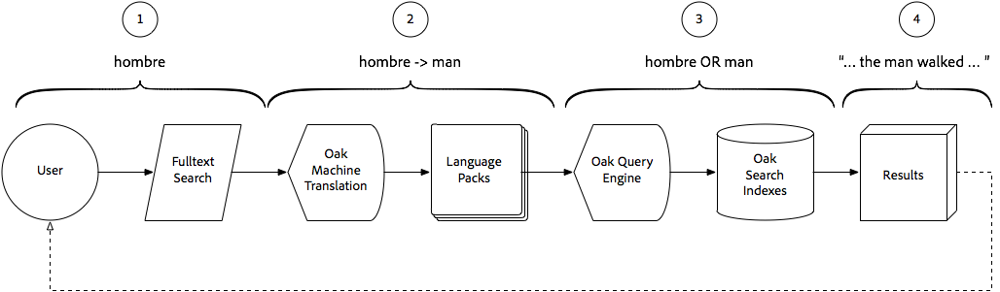

# 将智能翻译搜索与AEM Assets结合使用{#using-smart-translation-search-with-aem-assets}

Smart Translation Search支持跨AEM内容(Assets和Pages)自动进行跨语言搜索和发现，支持50多种语言，并降低了对手动内容翻译的需求。

>[!VIDEO](https://video.tv.adobe.com/v/21297?quality=12&learn=on)

AEM Smart Translation Search允许用户在AEM中使用非英语术语搜索内容，以匹配AEM中具有同等英语术语的资源。

智能翻译搜索是AEM智能标记（应用于英语资产）的完美补充。

本视频假定已设置[AEM Smart Translation Search](smart-translation-search-technical-video-setup.md)。

## 智能翻译搜索的工作原理 {#how-smart-translation-search-works}

1. AEM用户执行全文搜索，提供本地化的搜索词(例如， 西班牙语中“man”、“hombre”的意思)。
2. 由Apache Oak机器翻译OSGi捆绑包提供的智能翻译搜索将参与并评估提供的搜索词是否可以使用注册的语言包进行翻译。
3. 收集步骤#2中的所有翻译词，并在内部扩充查询以将其包含为搜索词。 如果针对查找相关匹配项的AEM搜索索引评估正常，则此搜索词集将会增加。
4. 将收集与原始搜索词(“hombre”)或翻译搜索词(“man”)匹配的搜索结果，并将用户作为搜索结果返回。

## 其他资源{#additional-resources}

* [使用AEM Assets设置智能翻译搜索](smart-translation-search-technical-video-setup.md)
* [Apache Joshua语言包](https://cwiki.apache.org/confluence/display/JOSHUA/Language+Packs)
