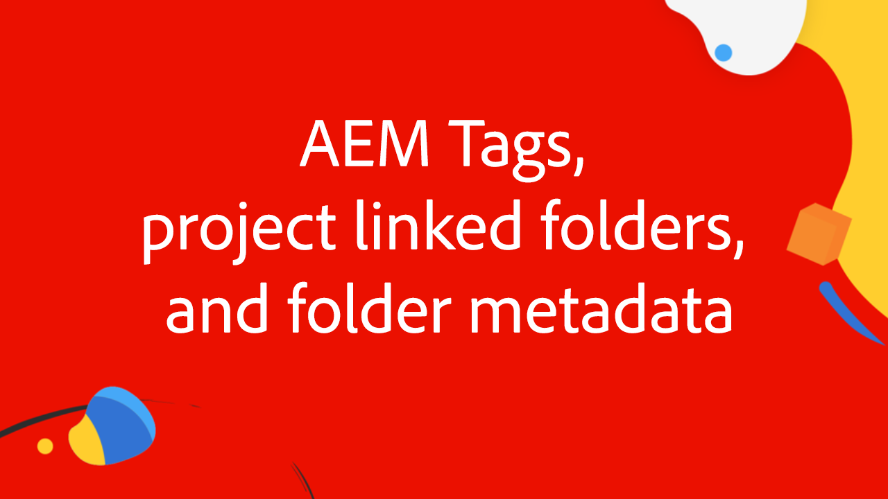

# Workfront for Experience Manager增强型连接器专家系列

与Adobe的Workfront和Experience Manager Assets专家一起观看这四个部分视频系列，共同演示和讨论Workfront中用于Experience Manager增强连接器的内部和外部。

这四个部分的专家系列是在一群Adobe专家(从产品经理到顾问和Adobe合作伙伴)讨论以下问题之后完成的：

1. [在Workfront和AEM中执行初始设置配置](./setup.md)
2. [配置Workfront自定义表单与AEM之间的元数据同步](./custom-forms.md)
3. [使用AEM标记、项目链接的文件夹、Adobe资产链接和文件夹元数据架构，以实现最大价值](./aem-tags-project-linked-folders-and-folder-metadata.md)
4. [使用高级AEM工作流简化AEM和Workfront之间的业务流程，以及其他高级设置](./advanced-settings-and-workflows.md)

<table>
  <td>
      
      

         <a href="./setup.md"><strong>设置和初始配置</strong></a>
          <em>第1/4部分</em>
      

      

         
         了解如何为Experience Manager增强的连接器设置和执行Workfront的初始配置。
      

   </td>
   <!-- Workfront custom forms and metadata mapping -->
   <td>
      
      

         <a href="./custom-forms.md"><strong>Workfront自定义表单和元数据映射</strong></a>
          <em>第2/4部分</em>
      

      

         
         了解Workfront自定义表单，以及它们如何映射到Experience Manager Assets元数据架构以同步数据。
      

    </td>
    <!-- AEM Tags, project linked folders, and folder metadata -->
    <td>
      
      

         <a href="./aem-tags-project-linked-folders-and-folder-metadata.md"><strong>AEM标记、项目链接的文件夹和文件夹元数据</strong></a>
          <em>第3/4部分</em> 
      

      

         
            了解如何从Workfront驱动AEM分类、使用项目链接的文件夹，以及将数据导入AEM资产文件夹元数据。
      

   </td>   
   <!-- Advanced workflows -->
    <td>
      
      

         <a href="./advanced-settings-and-workflows.md"><strong>高级设置和工作流</strong></a>
          <em>第4/4部分</em>
      

      

         
            了解Workfront for AEM增强连接器的高级设置，如何使用高级工作流管理数据同步。
      

   </td>
  </tr>  
</tbody></table>
