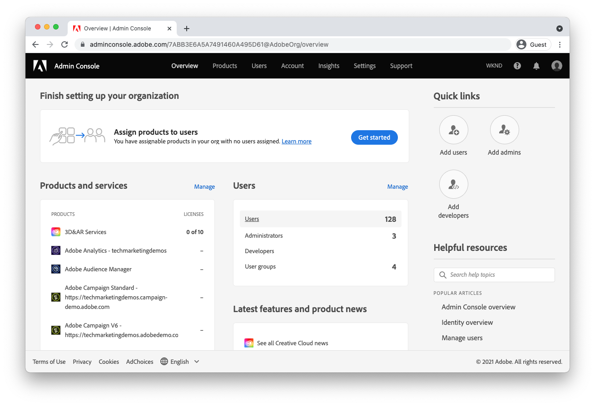

# 配置 AEM as a Cloud Service 的访问权限 {#configuring-access-to-aem-as-a-cloud-service}

>[!CONTEXTUALHELP]
>id="aemcloud_adobeims_overview"
>title="Adobe IMS 简介"
>abstract="AEM as a Cloud Service 利用 Adobe IMS (Identity Management System) 推动其用户（包括管理员和普通用户）登录 AEM Author 服务。了解 Adobe IMS 用户、组和产品配置文件如何与 AEM 组和权限结合使用，以提供对 AEM Author 服务的精细访问。"

AEMas a Cloud Service是利用AEM应用程序的云原生方式，因此，会利用Adobe IMS (Identity Management System)为其用户（管理员和常规用户）登录AEM Author服务提供便利。

了解 Adobe IMS 用户、组和产品配置文件如何与 AEM 组和权限结合使用，以提供对 AEM Author 服务的精细访问。

## Adobe IMS用户

需要访问AEM创作服务的用户被管理为 [Adobe IMS用户](https://helpx.adobe.com/cn/enterprise/using/set-up-identity.html) 在 [Adobe的管理控制台](https://adminconsole.adobe.com). 了解 Adobe IMS 用户的身份，以及如何在 Admin Console 中访问和管理他们。

>[!NOTE]
>
>从AdminConsole中删除IMS用户时，不会自动从AEM中删除该用户，但是一旦AEM会话（令牌）过期，该用户将无法登录到AEM。

[了解Adobe IMS用户](./adobe-ims-users.md)

## Adobe IMS用户组

访问AEM Author服务的用户应使用分组为逻辑组 [Adobe IMS用户组](https://helpx.adobe.com/cn/enterprise/using/user-groups.html) 在 [Adobe的管理控制台](https://adminconsole.adobe.com). Adobe IMS用户组不提供对AEM的直接权限或访问权限(此作业属于 [Adobe IMS产品配置文件](#adobe-ims-product-profiles))，但是，它们也是定义用户逻辑分组的绝佳方法，而这些逻辑分组又可以使用AEM组和权限转换为AEM Author服务中的特定访问级别。

[了解Adobe IMS用户组](./adobe-ims-user-groups.md)

## Adobe IMS产品配置文件

[Adobe IMS产品配置文件](https://helpx.adobe.com/enterprise/using/manage-permissions-and-roles.html)，在中管理 [Adobe的管理控制台](https://adminconsole.adobe.com)，是提供 [Adobe IMS用户](#adobe-ims-users) 具有基本访问级别登录AEM Author服务的权限。

+ 此 __AEM用户__ 产品配置文件为用户提供AEM的只读访问权限，用户可通过AEM Contributors组中的成员资格来访问。
+ 此 __AEM管理员__ 产品配置文件为用户提供对AEM的完全管理访问权限。

[了解Adobe IMS产品配置文件](./adobe-ims-product-profiles.md)

## AEM用户组和权限

Adobe Experience Manager 基于 Adobe IMS 用户、用户组和产品配置文件进行构建，以便向用户提供对 AEM 的可定制的访问权限。了解如何构建AEM组和权限，以及它们如何与Adobe IMS抽象概念协同工作，从而提供对AEM的无缝访问和可定制的访问。

[了解AEM用户、组和权限](./aem-users-groups-and-permissions.md)

## 访问和权限演练

概要介绍如何在AdobeAdminConsole中配置Adobe IMS用户、用户组和产品配置文件，以及如何利用AEM Author中的这些Adobe IMS抽象概念来定义和管理特定的基于组的权限。

[AEM访问和权限演练](./walk-through.md)

## 其他Adobe Admin Console资源

以下文档封面 [Adobe Admin Console](https://adminconsole.adobe.com) — 特定的详细信息和关注事项，这可能会帮助更好地了解Adobe Admin Console并使用它来管理用户和跨Experience Cloud产品的访问。

+ [Adobe Admin Console 标识概述](https://helpx.adobe.com/cn/enterprise/using/identity.html)
+ [Adobe Admin Console管理员角色](https://helpx.adobe.com/enterprise/using/admin-roles.html)
+ [Adobe Admin Console开发人员角色](https://helpx.adobe.com/enterprise/using/manage-developers.html)
