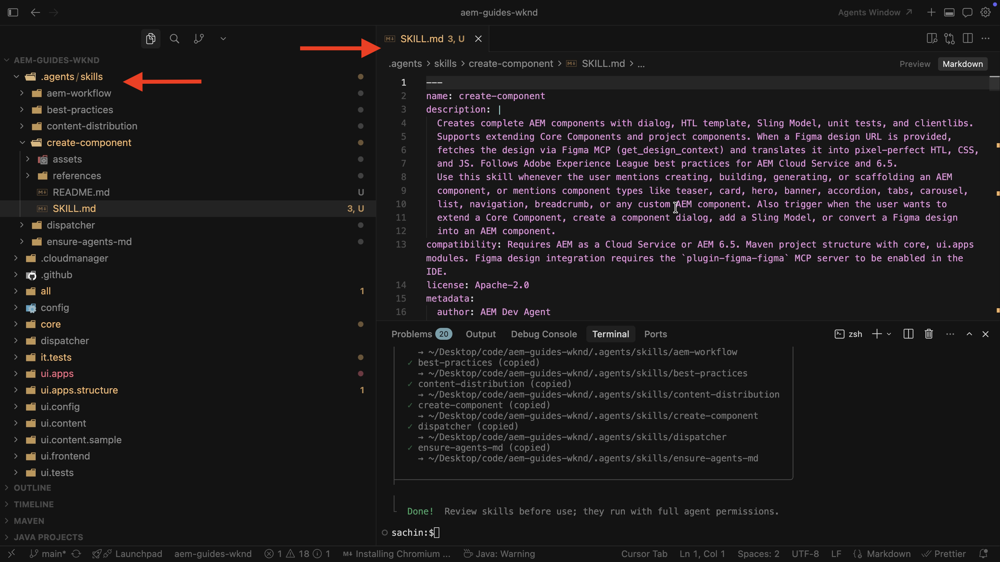
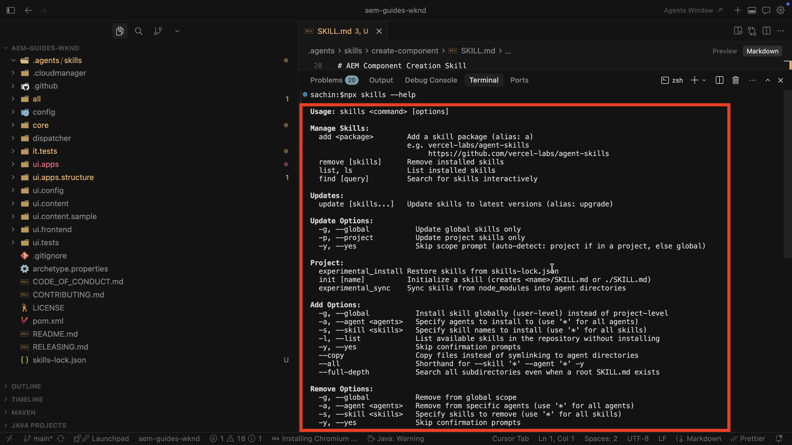

# 设置AEM Agent技能

了解如何设置AEM代理技能以进行人工智能辅助开发。

当您通过AI支持的IDE要求编码代理处理AEM开发任务时，它可以使用Adobe提供的&#x200B;**AEM代理技能**&#x200B;过程指南，而不是仅依赖通用模型训练或它从存储库中推断的任何内容。

Adobe通过[AEM技能](https://github.com/adobe/skills)存储库提供Adobe代理技能。 另请参阅[AI辅助开发](../overview.md)，了解Adobe如何帮助AI辅助开发。

在本教程中，您将在[WKND Sites项目](https://github.com/adobe/aem-guides-wknd)的本地克隆上安装技能。 您可以对自己的AEM as a Cloud Service项目使用相同的步骤。

>[!VIDEO](https://video.tv.adobe.com/v/3484940/?learn=on&enablevpops)

## 先决条件

要学习本教程，您需要满足以下条件：

- [WKND站点项目](https://github.com/adobe/aem-guides-wknd)的本地克隆或您自己的AEM as a Cloud Service项目。
- AI支持的IDE（如Cursor）或带有GitHub Copilot的Visual Studio代码。

## 安装AEM Agent技能

使用`npx`命令安装AEM代理技能（需要[Node.js](https://nodejs.org/)，因此`npx`可用）。 有关其他安装选项，例如Claude Code插件或GitHub CLI扩展，请参阅Adobe Skills存储库中的[Installation](https://github.com/adobe/skills/tree/main#installation)部分。

1. 在本地克隆[WKND站点项目](https://github.com/adobe/aem-guides-wknd)：

   ```shell
   $ git clone https://github.com/adobe/aem-guides-wknd.git
   ```

1. 在AI支持的IDE中打开克隆的项目（例如，Cursor），然后打开集成的终端。
   

1. 运行以下命令为光标添加AEM代理技能：

   ```shell
   $ npx skills add https://github.com/adobe/skills/tree/main/plugins/aem/cloud-service --agent cursor
   ```

   有关其他代理类型，请参阅Adobe技能存储库中的[安装](https://github.com/adobe/skills/tree/main#installation)部分。

1. 出现提示时，选择要安装的AEM Agent技能。
   

   选择&#x200B;**require-agents-md**&#x200B;技能，以便安装程序可以在存储库根目录下创建&#x200B;**AGENTS.md**&#x200B;和&#x200B;**CLAUDE.md**&#x200B;文件。 该引导程序技能检查您的项目，例如根`pom.xml`和模块，并生成定制的代理指导。

   如果&#x200B;**AGENTS.md**&#x200B;已存在，则&#x200B;**不会**&#x200B;被覆盖。

1. 选择安装范围。 对于此演练，**项目**范围是典型的，因此技能文件位于存储库中。
   

1. 确认`.agents/skills`下的安装。 您应该会看到&#x200B;**SKILLS.md**以及相关的引用和资产文件夹。
   

1. 当Adobe添加或更新技能时，使用CLI添加、更新、删除或列出这些技能。 要查看所有命令，请执行以下操作：

   ```shell
   $ npx skills --help
   ```

   

## 用例

<!-- 
CARDS
{target = _self}

* ../use-cases/component-development.md    
    {title = Create AEM Component with AI-assisted development}
    {description = Learn how to use AI-assisted development to develop AEM components.}
    {image = ../assets/component-development/review-generated-code.png}
    {cta = Create AEM Component}
-->
<!-- START CARDS HTML - DO NOT MODIFY BY HAND -->
<div class="columns">
    <div class="column is-half-tablet is-half-desktop is-one-third-widescreen" aria-label="Create AEM Component with AI-assisted development">
        <div class="card" style="height: 100%; display: flex; flex-direction: column; height: 100%;">
            <div class="card-image">
                <figure class="image x-is-16by9">
                    <a href="../use-cases/component-development.md" title="使用人工智能辅助开发创建AEM组件" target="_self" rel="referrer">
                        
                    </a>
                </figure>
            </div>
            <div class="card-content is-padded-small" style="display: flex; flex-direction: column; flex-grow: 1; justify-content: space-between;">
                <div class="top-card-content">
                    <p class="headline is-size-6 has-text-weight-bold">
                        <a href="../use-cases/component-development.md" target="_self" rel="referrer" title="使用人工智能辅助开发创建AEM组件">使用AI辅助开发创建AEM组件</a>
                    </p>
                    <p class="is-size-6">了解如何使用人工智能辅助开发来开发AEM组件。</p>
                </div>
                <a href="../use-cases/component-development.md" target="_self" rel="referrer" class="spectrum-Button spectrum-Button--outline spectrum-Button--primary spectrum-Button--sizeM" style="align-self: flex-start; margin-top: 1rem;">
                    <span class="spectrum-Button-label has-no-wrap has-text-weight-bold">创建AEM组件</span>
                </a>
            </div>
        </div>
    </div>
</div>
<!-- END CARDS HTML - DO NOT MODIFY BY HAND -->

## 其他资源

- [使用人工智能工具进行本地开发](https://experienceleague.adobe.com/en/docs/experience-manager-cloud-service/content/ai-in-aem/local-development-with-ai-tools)

- [面向AI编码代理的Adobe技能](https://github.com/adobe/skills)

- [AGENTS.md](https://agents.md/)

- [座席技能](https://agentskills.io/home)
