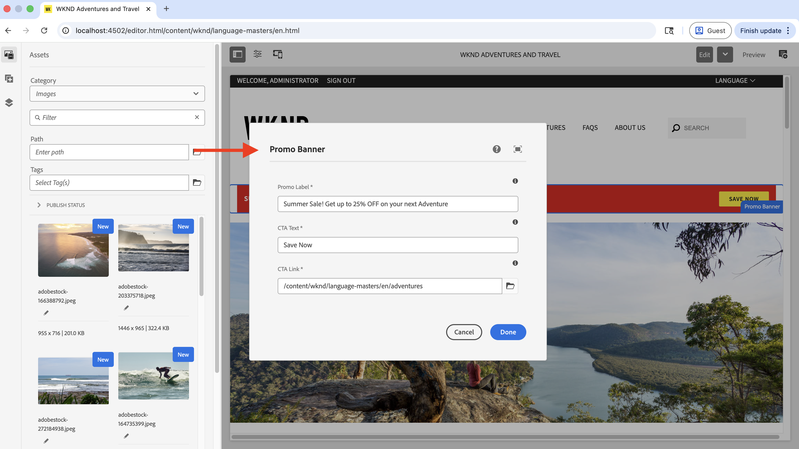

# 使用AEM Agent技能进行组件开发

了解如何使用AEM Agent Skills开发AEM组件，作为[AI辅助开发](../overview.md)的一部分。

在此演练中，您在AI支持的IDE中使用自然语言（例如，Cursor）在[WKND Sites项目](https://github.com/adobe/aem-guides-wknd)中开发&#x200B;**促销横幅**&#x200B;组件。 编码代理应用`create-component`AEM代理技能来生成实现。

>[!VIDEO](https://video.tv.adobe.com/v/3484952/?learn=on&enablevpops)

## 先决条件

要学习本教程，您需要满足以下条件：

- AI支持的IDE（如Cursor）或带有GitHub Copilot的Visual Studio代码。
- [WKND Sites项目](https://github.com/adobe/aem-guides-wknd)的本地克隆，已生成并部署到&#x200B;_本地AEM SDK_&#x200B;实例。
- 在该项目中安装了&#x200B;_AEM代理技能_。 如果尚未执行此操作，请完成[设置AEM代理技能](../setup/agent-skills.md)。

## 组件要求

假设WKND团队希望在主页上显示促销横幅，设计参考如下所示：


作者必须能够在组件对话框中设置&#x200B;_促销标签_、_CTA标签_&#x200B;和&#x200B;_CTA链接_&#x200B;字段。

设计参考是通过线框、模型或静态标记捕获获得的屏幕快照。

## 开发组件

1. 在IDE中打开WKND项目。 确认AEM代理技能存在（例如，`.agents/skills`下），然后开始新的代理聊天。
   

1. 输入如下所示的提示。 如果IDE支持聊天中的图像，请附加组件设计屏幕截图（通过线框、模型或静态标记捕获获取）：

   ```text
   Create a WKND Promo Banner Component. Please see attached screenshot for design reference.
   
   Dialog specification are:
   
   1. Promo Label - Textfield, required
   2. CTA Text - Textfield, required
   3. CTA Link - Pathfield, required
   ```

1. 编码代理使用`create-component` AEM代理技能生成组件。 查看建议的HTL、Sling模型、对话框XML和相关文件。
   

>[!TIP]
>
>您还可以通过[Figma MCP服务器](https://www.figma.com/mcp-catalog/)提供Figma设计来生成组件，而不是将设计参考作为屏幕快照提供。 `create-component`技能支持[Figma设计集成](https://github.com/adobe/skills/blob/main/plugins/aem/cloud-service/skills/create-component/references/figma-design-rules.md)


1. 将组件部署到本地AEM实例/SDK。

   ```shell
   $ mvn clean install -PautoInstallSinglePackage
   ```

1. 在创作时，请将促销横幅放在主页上，并验证其行为。 如果实施仍偏离设计参考，请优化实施。
   

1. 通过发布页面或查看已发布的内容来查看新创建的组件。
   

恭喜！ 您已使用AEM Agent Skills成功创建了新的AEM组件，作为AI辅助开发的一部分。

## 超越简单组件

此演练使用一个简单的组件。 同一`create-component`技能还支持更丰富的案例，包括：

- 多字段和嵌套对话框字段
- AEM核心组件扩展（包括Sling资源合并器模式）
- 在IDE中启用Figma MCP服务器（例如`plugin-figma-figma`）时，用于布局和样式的Figma文件或帧URL

对于字段类型、对话框模式、Figma规则和示例，请读取已安装skill文件夹中的`SKILL.md`，例如`.agents/skills/create-component/SKILL.md`。

有关概述、按IDE显示的安装路径以及疑难解答，请参阅Adobe技能存储库中的[AEM组件开发代理](https://github.com/adobe/skills/blob/main/plugins/aem/cloud-service/skills/create-component/README.md)。

## AGENTS.md

在结束发言之前，我们先了解在创建组件时如何生成AGENTS.md。

对于AEM as a Cloud Service项目，`ensure-agents-md`引导程序技能（在[设置AEM代理技能](../setup/agent-skills.md)期间选择）在存储库根目录中创建`AGENTS.md`，但此技能为&#x200B;**缺失**。 它使用从项目布局中学习的内容。

它&#x200B;**不**&#x200B;覆盖现有的`AGENTS.md`文件。


## 其他资源

- [使用人工智能工具进行本地开发](https://experienceleague.adobe.com/zh-hans/docs/experience-manager-cloud-service/content/ai-in-aem/local-development-with-ai-tools)

- [面向AI编码代理的Adobe技能](https://github.com/adobe/skills)

- [AGENTS.md](https://agents.md/)

- [座席技能](https://agentskills.io/home)
