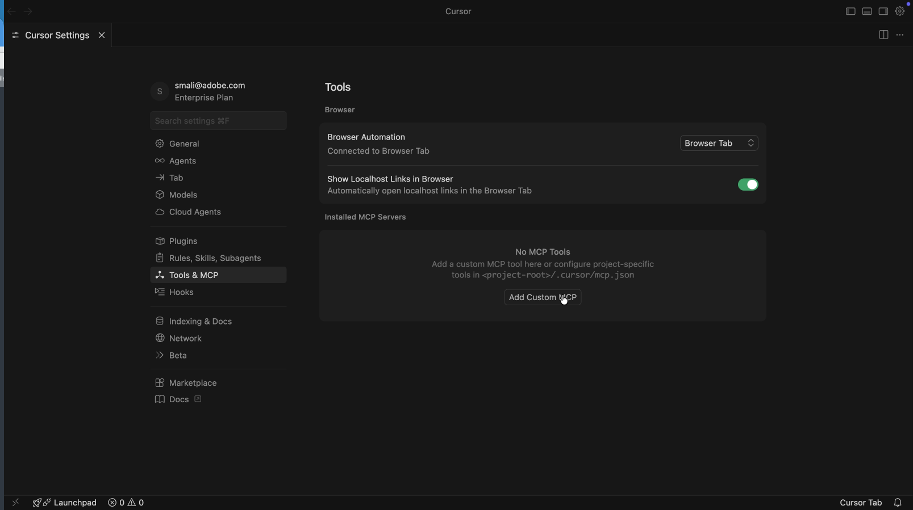
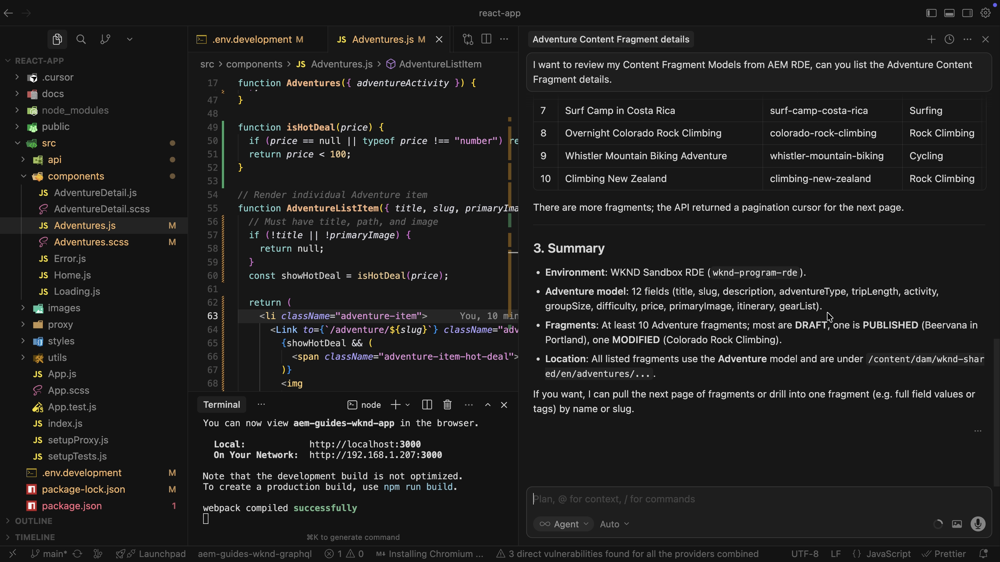

# 使用Content MCP Server加速AEM内容操作

使用AI支持的IDE（如&#x200B;**Cursor IDE**）中的[Content MCP Server](https://www.cursor.com/)以自然语言（无低级API代码或UI导航）处理AEM内容。

在本教程中，您&#x200B;_审阅_&#x200B;冒险内容片段详细信息，_更新_&#x200B;片段（例如，冒险的价格），以及&#x200B;_验证_ WKND Adventures React应用程序[中的更改](https://github.com/adobe/aem-guides-wknd-graphql/tree/main/react-app)，所有这些更改都是针对您的IDE中的&#x200B;_较低的AEM环境_ （RDE或开发），并且没有离开MCP流。

>[!VIDEO](https://video.tv.adobe.com/v/3480895/?learn=on&enablevpops)

## 概述

AEM as a Cloud Service提供&#x200B;_MCP服务器_，以便您的IDE或聊天应用可以安全地与AEM配合使用。 **Content MCP服务器**&#x200B;支持页面、片段和资产。 有关详细信息，请参阅AEM[中的](./overview.md)MCP服务器。

## 开发人员可怎样使用它

将[Cursor IDE](https://www.cursor.com/)连接到Content MCP服务器并运行以下方案。

### 设置 — 光标所在的Content MCP服务器

让我们按照以下步骤在光标中设置Content MCP Server。

1. 在计算机上打开光标。

1. 从“光标”菜单转到&#x200B;**设置** > **光标设置**以打开设置窗口。
   

1. 在左侧边栏中，单击&#x200B;**工具和MCP**以打开该面板。
   

1. 单击&#x200B;**添加自定义MCP**&#x200B;或&#x200B;**新建MCP服务器**&#x200B;以打开`mcp.json`，然后粘贴此配置：

   ```json
   {
       "mcpServers": {
           // Use this for create, read, update, and delete operations
           "AEM-RDE-Content": {
               "url": "https://mcp.adobeaemcloud.com/adobe/mcp/content"
           },
           //Use this for read-only operations
           "AEM-RDE-Content-Read-Only": {
               "url": "https://mcp.adobeaemcloud.com/adobe/mcp/content-readonly"
           }
       }
   }
   ```

   >[!CAUTION]
   >
   > 出于教程目的，上述配置为此教程添加了&#x200B;**Content**&#x200B;和&#x200B;**Content （只读）**。 实际上，**Content**&#x200B;已包含所有&#x200B;**Content （只读）**&#x200B;选件以及创建/更新/删除工具。
   >
   >
   > 如果要避免任何创建、修改或删除内容的可能性，请仅配置&#x200B;**内容（只读）** (`/content-readonly`)并忽略&#x200B;**内容** (`/content`)。 这样您就可以避免意外更改。

   

1. 在“光标设置”窗口中，单击&#x200B;**连接**&#x200B;以启动身份验证过程。 它使用OAuth 2.0 PKCE流获取&#x200B;**用户特定的访问令牌**以访问AEM MCP服务器。
   

1. 使用Adobe ID登录，然后返回到“光标设置”窗口。
   

1. 确认&#x200B;**AEM-RDE-Content-Read-Only**&#x200B;和&#x200B;**AEM-RDE-Content**&#x200B;显示为已连接。 您可以展开每个服务器以查看其工具。

   

### 设置 — WKND Adventures React应用程序

接下来，在光标中设置[WKND Adventures React应用程序](https://github.com/adobe/aem-guides-wknd-graphql/tree/main/react-app)。

1. 在您的计算机上克隆以下两个存储库：

   ```bash
   ## WKND GraphQL repo, the `react-app` folder is the WKND Adventures app
   $ git clone git@github.com:adobe/aem-guides-wknd-graphql.git
   
   ## WKND Site repo, you deploy this to RDE so the app can use its content fragments data via GraphQL
   $ git clone git@github.com:adobe/aem-guides-wknd.git
   ```

1. 将[WKND站点](https://github.com/adobe/aem-guides-wknd)项目部署到您的RDE。 有关详细步骤，请参阅[如何使用快速开发环境](https://experienceleague.adobe.com/en/docs/experience-manager-learn/cloud-service/developing/rde/how-to-use#deploy-aem-artifacts-using-the-aem-rde-plugin)。

1. 在IDE中打开`react-app`文件夹。

1. 编辑`.env.development`并设置：
   - `REACT_APP_HOST_URI`：您的RDE作者URL
   - `REACT_APP_AUTH_METHOD`：为`basic`
   - `REACT_APP_BASIC_AUTH_USER`和`REACT_APP_AEM_AUTH_PASSWORD`：设置为`aem-headless`（在RDE中创建此用户并将其添加到`administrators`组）

1. 从IDE终端中，运行：

   ```bash
   $ cd aem-guides-wknd-graphql/react-app
   $ npm install
   $ npm start
   ```

1. 在浏览器中，转到[http://localhost:3000](http://localhost:3000)以查看WKND Adventures应用程序。

   

### 生产力场景 — AEM内容审查和更新

假设当满足简单规则时，您需要在“冒险片”卡片上显示&#x200B;_热门交易_&#x200B;横幅。 通常的方法是：

- 查看Adventure卡组件代码
- 添加何时显示横幅的逻辑
- 查看AEM中的冒险内容片段模型
- 更改一个或多个冒险片段属性以测试规则

为了简单起见，让我们在冒险价格低于$100时显示&#x200B;_热门交易_&#x200B;横幅。

由于React应用程序从RDE环境中获取数据，因此您需要知道冒险内容片段模型，然后更新正确的片段属性。 这正是AEM Content MCP Server可以帮助解决的问题。 具体方法如下。

1. 在光标中，打开新聊天并键入：

   ```text
   I want to review my Content Fragment Models from AEM RDE, can you list the Adventure Content Fragment details.
   ```

   


   在调用Content MCP Server之前，它会要求确认以继续。 这样，您就可以控制内容操作。

   AI使用Content MCP Server获取数据，然后以清晰、结构化的方式呈现数据。 其中包括内容片段模型详细信息、片段数量和摘要信息。

1. 要触发&#x200B;_热门交易_&#x200B;横幅，请更新一次冒险的价格。 在同一次聊天中，尝试：

   ```text
   Can you update adventure Beervana in Portland's price to 99.99
   ```

   

   同样，AI在更新内容之前会要求确认是否继续。 它还总结了更新之前和之后的内容操作。

1. 在React应用程序中，确认Beervana卡现在显示&#x200B;_热门交易_&#x200B;横幅。

   

### 其他提示

在IDE中尝试这些以内容为中心的提示（连接Content MCP Server）以探索更多工作流和功能。

- 发现内容：

  ```text
  List all content fragments in the WKND Adventures folder
  
  List all WKND Site pages from US English site
  
  Can you give me page metadata for Tahoe Skiing English page? 
  
  List assets of Bali Surf camp
  
  What Content Fragment models are available in this environment?
  ```

- 搜索内容：

  ```text
  Search for content fragments that mention 'cycling'
  
  Do we have a magazine page in US English site with "Camping" in it
  ```

- 更新内容：

  ```text
  In WKND US English create a copy of Downhill Skiing Wyoming as "Test Downhill Skiing Wyoming"
  
  In newly created "Test Downhill Skiing Wyoming" please change title to "Duplicated Page"
  ```

- 发布或取消发布：

  ```text
  Can you publish the page at /us/en/adventures/test-downhill-skiing-wyoming and give me publish page URL
  
  Can you unpublish the test-downhill-skiing-wyoming page
  ```

## 摘要

您可以在光标中设置AEM Content MCP Server，并将其连接到RDE（或开发）环境。 然后，您使用WKND Adventures React应用程序并以自然语言聊天来查看Adventure内容片段详细信息。 您还更新了片段的AI价格，要求在每次内容操作之前进行确认。 您已在运行的应用程序中验证更改。 您可以使用来自IDE的相同以人为中心的流程来审查、更新和创建AEM内容，而无需切换到AEM UI或编写低级API代码。
