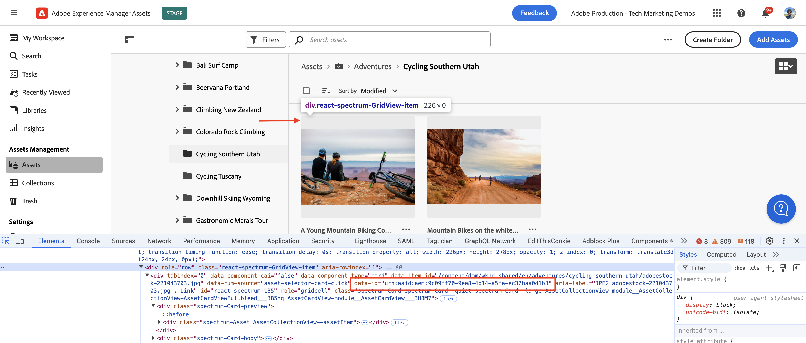
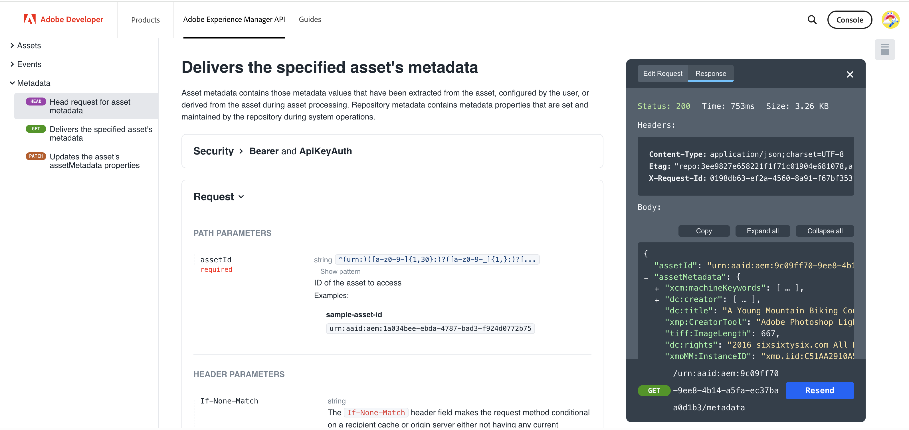

# 调用基于OpenAPI的AEM API以进行服务器到服务器身份验证{#invoke-openapi-based-aem-apis}

了解如何使用&#x200B;_OAuth服务器到服务器_&#x200B;身份验证，从自定义应用程序在AEM as a Cloud Service上配置和调用基于OpenAPI的AEM API。

OAuth服务器到服务器身份验证非常适用于需要API访问而不进行用户交互的后端服务。 它使用OAuth 2.0 _client_credentials_&#x200B;授权类型来验证客户端应用程序。

>[!AVAILABILITY]
>
>基于OpenAPI的AEM API作为早期访问计划的一部分提供。 如果您有兴趣访问它们，我们建议您通过电子邮件向[aem-apis@adobe.com](mailto:aem-apis@adobe.com)发送用例说明。

在本教程中，您将学习如何：

- 为您的AEM as a Cloud Service环境启用基于OpenAPI的AEM API访问。
- 创建并配置Adobe Developer Console (ADC)项目以使用&#x200B;_OAuth服务器到服务器身份验证_&#x200B;访问AEM API。
- 开发一个示例NodeJS应用程序，该应用程序调用Assets创作API以检索特定资源的元数据。

开始之前，请确保已查看[访问AdobeAPI和相关概念](overview.md#accessing-adobe-apis-and-related-concepts)部分。

## 先决条件

要完成本教程，您需要：

- 包含以下内容的现代化AEM as a Cloud Service环境：
   - AEM版本`2024.10.18459.20241031T210302Z`或更高版本。
   - 新样式产品配置文件（如果环境是在2024年11月之前创建的）

- 必须在其上部署示例[WKND Sites](https://github.com/adobe/aem-guides-wknd?#aem-wknd-sites-project)项目。

- 访问[Adobe Developer Console](https://developer.adobe.com/developer-console/docs/guides/getting-started/)。

- 在本地计算机上安装[Node.js](https://nodejs.org/en/)以运行示例NodeJS应用程序。

## 开发步骤

高级开发步骤包括：

1. AEM as a Cloud Service环境的现代化。
1. 启用AEM API访问。
1. 创建Adobe Developer Console (ADC)项目。
1. 配置ADC项目
   1. 添加所需的AEM API
   1. 配置其身份验证
   1. 将产品配置文件与身份验证配置关联
1. 配置AEM实例以启用ADC项目通信
1. 开发示例NodeJS应用程序
1. 验证端到端流量

## AEM as a Cloud Service环境的现代化

让我们从实现AEM as a Cloud Service环境现代化开始吧。 仅当环境未现代化时，才需要执行此步骤。

AEM as a Cloud Service环境的现代化是一个两步过程，

- 更新到最新的AEM发行版本
- 向其中添加新的产品配置文件。

### 更新AEM实例

要更新AEM实例，请在Adobe[Cloud Manager](https://my.cloudmanager.adobe.com/)的&#x200B;_环境_&#x200B;部分中，选择环境名称旁边的&#x200B;_省略号_&#x200B;图标，然后选择&#x200B;**更新**&#x200B;选项。


然后单击&#x200B;**提交**&#x200B;按钮并运行建议的全栈管道。


在我的示例中，Fullstack管道的名称为&#x200B;_Dev ：： Fullstack-Deploy_，而AEM环境名称为&#x200B;_wknd-program-dev_，具体情况可能会有所不同。

### 添加新产品配置文件

要向AEM实例添加新产品配置文件，请在Adobe[Cloud Manager](https://my.cloudmanager.adobe.com/)的&#x200B;_环境_&#x200B;部分中，选择环境名称旁边的&#x200B;_省略号_&#x200B;图标，然后选择&#x200B;**添加产品配置文件**&#x200B;选项。


您可以通过单击环境名称旁边的&#x200B;_省略号_&#x200B;图标并选择&#x200B;**管理访问权限** > **作者配置文件**&#x200B;来查看新添加的产品配置文件。

_Admin Console_&#x200B;窗口显示新添加的产品配置文件。


以上步骤完成了AEM as a Cloud Service环境的现代化。

## 启用AEM API访问

新产品配置文件支持在Adobe Developer Console (ADC)中访问基于OpenAPI的AEM API。

新添加的产品配置文件与&#x200B;_服务_&#x200B;相关联，这些服务代表具有预定义访问控制列表(ACL)的AEM用户组。 _服务_&#x200B;用于控制对AEM API的访问级别。

您还可以选择或取消选择与产品配置文件关联的&#x200B;_服务_，以减少或增加访问级别。

通过单击产品配置文件名称旁边的&#x200B;_查看详细信息_&#x200B;图标来查看关联。


默认情况下，**AEM Assets API Users**&#x200B;服务不与任何产品配置文件关联。 让我们将其与新添加的&#x200B;**AEM Administrators - author - Program XXX - Environment XXX**&#x200B;产品配置文件关联。 在此关联后，ADC项目的&#x200B;_资产创作API_&#x200B;可以设置OAuth服务器到服务器身份验证，并将身份验证帐户与产品配置文件关联。


需要注意的是，在现代化之前，在AEM Author实例中，有两个产品配置文件可用：**AEM Administrators-XXX**&#x200B;和&#x200B;**AEM Users-XXX**。 也可以将这些现有的产品配置文件与新的服务相关联。

## 创建Adobe Developer Console (ADC)项目

接下来，创建一个ADC项目以访问AEM API。

1. 使用您的Adobe ID登录[Adobe Developer Console](https://developer.adobe.com/console)。

   

1. 在&#x200B;_快速入门_&#x200B;部分中，单击&#x200B;**新建项目**&#x200B;按钮。

   

1. 这会创建一个具有默认名称的新项目。

   

1. 通过单击右上角的&#x200B;**编辑项目**&#x200B;按钮编辑项目名称。 提供一个有意义的名称，然后单击&#x200B;**保存**。

   

## 配置ADC项目

接下来，配置ADC项目以添加AEM API、配置其身份验证并关联产品配置文件。

1. 要添加AEM API，请单击&#x200B;**添加API**&#x200B;按钮。

   

1. 在&#x200B;_添加API_&#x200B;对话框中，按&#x200B;_Experience Cloud_&#x200B;筛选，选择&#x200B;**AEM Assets创作API**&#x200B;卡片，然后单击&#x200B;**下一步**。

   

1. 接下来，在&#x200B;_配置API_&#x200B;对话框中，选择&#x200B;**服务器到服务器**&#x200B;身份验证选项，然后单击&#x200B;**下一步**。 服务器到服务器身份验证非常适用于需要API访问而不需要用户交互的后端服务。

   

1. 重命名凭据以便于识别（如果需要），然后单击&#x200B;**下一步**。 出于演示目的，使用默认名称。

   

1. 选择&#x200B;**AEM Administrators - author - Program XXX - Environment XXX**&#x200B;产品配置文件，然后单击&#x200B;**保存**。 如您所见，仅与AEM Assets API Users服务关联的产品配置文件可供选择。

   

1. 审查AEM API和身份验证配置。

   

   


## 配置AEM实例以启用ADC项目通信

要启用ADC项目的OAuth服务器到服务器凭据ClientID以便与AEM实例通信，您需要配置AEM实例。

此操作可通过在AEM项目的`config.yaml`文件中定义配置来完成。 然后，使用Cloud Manager中的配置管道部署`config.yaml`文件。

1. 在AEM项目中，从`config`文件夹中找到或创建`config.yaml`文件。

   

1. 将以下配置添加到`config.yaml`文件。

   ```yaml
   kind: "API"
   version: "1.0"
   metadata: 
       envTypes: ["dev", "stage", "prod"]
   data:
       allowedClientIDs:
           author:
           - "<ADC Project's OAuth Server-to-Server credential ClientID>"
   ```

   将`<ADC Project's OAuth Server-to-Server credential ClientID>`替换为ADC项目的OAuth服务器到服务器凭据的实际ClientID。 本教程中使用的API端点仅在创作层上可用，但对于其他API，yaml配置还可以具有&#x200B;_发布_&#x200B;或&#x200B;_预览_&#x200B;节点。

1. 将配置更改提交到Git存储库并将更改推送到远程存储库。

1. 使用Cloud Manager中的配置管道来部署上述更改。 请注意，`config.yaml`文件也可以使用命令行工具安装在RDE中。

   

## 开发示例NodeJS应用程序

让我们开发一个调用Assets创作API的示例NodeJS应用程序。

您可以使用其他编程语言（如Java、Python等）来开发应用程序。

出于测试目的，您可以使用[Postman](https://www.postman.com/)、[curl](https://curl.se/)或任何其他REST客户端调用AEM API。

### 审查API

在开发应用程序之前，让我们从&#x200B;_Assets创作API_&#x200B;查看[交付指定资源的元数据](https://developer.adobe.com/experience-cloud/experience-manager-apis/api/experimental/assets/author/#operation/getAssetMetadata)端点。 API语法为：

```http
GET https://{bucket}.adobeaemcloud.com/adobe/assets/{assetId}/metadata
```

要检索特定资源的元数据，您需要`bucket`和`assetId`值。 `bucket`是没有Adobe域名(.adobeaemcloud.com)的AEM实例名称，例如`author-p63947-e1420428`。

`assetId`是前缀为`urn:aaid:aem:`的资源的JCR UUID，例如`urn:aaid:aem:a200faf1-6d12-4abc-bc16-1b9a21f870da`。 有多种方法可获取`assetId`：

- 附加AEM资源路径`.json`扩展以获取资源元数据。 例如，`https://author-p63947-e1420429.adobeaemcloud.com/content/dam/wknd-shared/en/adventures/cycling-southern-utah/adobestock-221043703.jpg.json`并查找`jcr:uuid`属性。

- 或者，您可以通过检查浏览器元素检查器中的资产来获取`assetId`。 查找`data-id="urn:aaid:aem:..."`属性。

  

### 使用浏览器调用API

在开发应用程序之前，让我们使用[API文档](https://developer.adobe.com/experience-cloud/experience-manager-apis/api/experimental/assets/author/#operation/getAssetMetadata)中的&#x200B;**尝试它**&#x200B;功能调用API。

1. 在浏览器中打开[Assets创作API文档](https://developer.adobe.com/experience-cloud/experience-manager-apis/api/experimental/assets/author)。

1. 展开&#x200B;_元数据_&#x200B;部分，然后单击&#x200B;**交付指定资源的元数据**&#x200B;选项。

1. 在右窗格中，单击&#x200B;**尝试它**按钮。
   

1. 输入以下值：
   1. `bucket`值是不带Adobe域名(.adobeaemcloud.com)的AEM实例名称，例如`author-p63947-e1420428`。

   1. 从ADC项目的OAuth服务器到服务器凭据中获取与&#x200B;**安全性**&#x200B;部分相关的`Bearer Token`和`X-Api-Key`值。 单击&#x200B;**生成访问令牌**&#x200B;以获取`Bearer Token`值并使用`ClientID`值作为`X-Api-Key`。
      

   1. **Parameters**&#x200B;部分相关的`assetId`值是AEM中资源的唯一标识符。 `X-Adobe-Accept-Experimental`设置为1。

      

1. 单击&#x200B;**发送**&#x200B;以调用API。

1. 查看&#x200B;**响应**&#x200B;选项卡以查看API响应。

   

以上步骤确认了AEM as a Cloud Service环境的现代化，从而启用AEM API访问。 它还确认已成功配置ADC项目，以及与AEM创作实例的OAuth服务器到服务器凭据ClientID通信。

### 示例NodeJS应用程序

让我们开发一个示例NodeJS应用程序。

若要开发应用程序，可以使用&#x200B;_Run-the-sample-application_&#x200B;或&#x200B;_逐步开发_&#x200B;说明。


>[!BEGINTABS]

>[!TAB Run-the-sample-application]

1. 下载示例[demo-nodejs-app-to-invoke-aem-openapi](assets/demo-nodejs-app-to-invoke-aem-openapi.zip)应用程序zip文件并将其解压缩。

1. 导航到提取的文件夹并安装依赖项。

   ```bash
   $ npm install
   ```

1. 将`.env`文件中的占位符替换为ADC项目的OAuth服务器到服务器凭据中的实际值。

1. 将`src/index.js`文件中的`<BUCKETNAME>`和`<ASSETID>`替换为实际值。

1. 运行NodeJS应用程序。

   ```bash
   $ node src/index.js
   ```

>[!TAB 逐步开发]

1. 创建新的NodeJS项目。

   ```bash
   $ mkdir demo-nodejs-app-to-invoke-aem-openapi
   $ cd demo-nodejs-app-to-invoke-aem-openapi
   $ npm init -y
   ```

1. 安装&#x200B;_fetch_&#x200B;和&#x200B;_dotenv_&#x200B;库以分别发出HTTP请求和读取环境变量。

   ```bash
   $ npm install node-fetch
   $ npm install dotenv
   ```

1. 在您喜爱的代码编辑器中打开项目并更新`package.json`文件以将`type`添加到`module`。

   ```json
   {
       ...
       "version": "1.0.0",
       "type": "module",
       "main": "index.js",
       ...
   }
   ```

1. 创建`.env`文件并添加以下配置。 将占位符替换为ADC项目的OAuth服务器到服务器凭据中的实际值。

   ```properties
   CLIENT_ID=<ADC Project OAuth Server-to-Server credential ClientID>
   CLIENT_SECRET=<ADC Project OAuth Server-to-Server credential Client Secret>
   SCOPES=<ADC Project OAuth Server-to-Server credential Scopes>
   ```

1. 创建`src/index.js`文件并添加以下代码，然后将`<BUCKETNAME>`和`<ASSETID>`替换为实际值。

   ```javascript
   // Import the dotenv configuration to load environment variables from the .env file
   import "dotenv/config";
   
   // Import the fetch function to make HTTP requests
   import fetch from "node-fetch";
   
   // REPLACE THE FOLLOWING VALUES WITH YOUR OWN
   const bucket = "<BUCKETNAME>"; // Bucket name is the AEM instance name (e.g. author-p63947-e1420428)
   const assetId = "<ASSETID>"; // Asset ID is the unique identifier for the asset in AEM (e.g. urn:aaid:aem:a200faf1-6d12-4abc-bc16-1b9a21f870da). You can get it by inspecting the asset in browser's element inspector, look for data-id="urn:aaid:aem:..."
   
   // Load environment variables for authentication
   const clientId = process.env.CLIENT_ID; // Adobe IMS client ID
   const clientSecret = process.env.CLIENT_SECRET; // Adobe IMS client secret
   const scopes = process.env.SCOPES; // Scope for the API access
   
   // Adobe IMS endpoint for obtaining an access token
   const adobeIMSV3TokenEndpointURL =
   "https://ims-na1.adobelogin.com/ims/token/v3";
   
   // Function to obtain an access token from Adobe IMS
   const getAccessToken = async () => {
       console.log("Getting access token from IMS"); // Log process initiation
       //console.log("Client ID: " + clientId); // Display client ID for debugging purposes
   
       // Configure the HTTP POST request to fetch the access token
       const options = {
           method: "POST",
           headers: {
           "Content-Type": "application/x-www-form-urlencoded", // Specify form data content type
           },
           // Send client ID, client secret, and scopes as the request body
           body: `grant_type=client_credentials&client_id=${clientId}&client_secret=${clientSecret}&scope=${scopes}`,
       };
   
       // Make the HTTP request to fetch the access token
       const response = await fetch(adobeIMSV3TokenEndpointURL, options);
   
       //console.log("Response status: " + response.status); // Log the HTTP status for debugging
   
       const responseJSON = await response.json(); // Parse the JSON response
   
       console.log("Access token received"); // Log success message
   
       // Return the access token
       return responseJSON.access_token;
   };
   
   // Function to retrieve metadata for a specific asset from AEM
   const getAssetMetadat = async () => {
       // Fetch the access token using the getAccessToken function
       const accessToken = await getAccessToken();
   
       console.log("Getting asset metadata from AEM");
   
       // Invoke the Assets Author API to retrieve metadata for a specific asset
       const resp = await fetch(
           `https://${bucket}.adobeaemcloud.com/adobe/assets/${assetId}/metadata`, // Construct the URL with bucket and asset ID
           {
           method: "GET",
           headers: {
               "If-None-Match": "string", // Header to handle caching (not critical for this tutorial)
               "X-Adobe-Accept-Experimental": "1", // Header to enable experimental Adobe API features
               Authorization: "Bearer " + accessToken, // Provide the access token for authorization
               "X-Api-Key": clientId, // Include the OAuth S2S ClientId for identification
           },
           }
       );
   
       const data = await resp.json(); // Parse the JSON response
   
       console.log("Asset metadata received"); // Log success message
       console.log(data); // Display the retrieved metadata
   };
   
   // Call the getAssets function to start the process
   getAssetMetadat();
   ```

1. 运行NodeJS应用程序。

   ```bash
   $ node src/index.js
   ```

>[!ENDTABS]

### API响应

成功执行后，控制台中会显示API响应。 响应包含指定资源的元数据。

```json
{
  "assetId": "urn:aaid:aem:9c09ff70-9ee8-4b14-a5fa-ec37baa0d1b3",
  "assetMetadata": {    
    ...
    "dc:title": "A Young Mountain Biking Couple Takes A Minute To Take In The Scenery",
    "xmp:CreatorTool": "Adobe Photoshop Lightroom Classic 7.5 (Macintosh)",
    ...
  },
  "repositoryMetadata": {
    ...
    "repo:name": "adobestock-221043703.jpg",
    "repo:path": "/content/dam/wknd-shared/en/adventures/cycling-southern-utah/adobestock-221043703.jpg",
    "repo:state": "ACTIVE",
    ...
  }
}
```

恭喜！您已成功使用OAuth服务器到服务器身份验证从自定义应用程序中调用基于OpenAPI的AEM API。

### 查看应用程序代码

示例NodeJS应用程序代码中的关键标注为：

1. **IMS身份验证**：使用ADC项目中的OAuth服务器到服务器凭据设置获取访问令牌。

   ```javascript
   // Function to obtain an access token from Adobe IMS
   const getAccessToken = async () => {
   
       // Configure the HTTP POST request to fetch the access token
       const options = {
           method: "POST",
           headers: {
           "Content-Type": "application/x-www-form-urlencoded", // Specify form data content type
           },
           // Send client ID, client secret, and scopes as the request body
           body: `grant_type=client_credentials&client_id=${clientId}&client_secret=${clientSecret}&scope=${scopes}`,
       };
   
       // Make the HTTP request to fetch the access token from Adobe IMS token endpoint https://ims-na1.adobelogin.com/ims/token/v3
       const response = await fetch(adobeIMSV3TokenEndpointURL, options);
   
       const responseJSON = await response.json(); // Parse the JSON response
   
       // Return the access token
       return responseJSON.access_token;
   };
   ...
   ```

1. **API调用**：调用Assets创作API，通过提供授权访问令牌来检索特定资源的元数据。

   ```javascript
   // Function to retrieve metadata for a specific asset from AEM
   const getAssetMetadat = async () => {
       // Fetch the access token using the getAccessToken function
       const accessToken = await getAccessToken();
   
       console.log("Getting asset metadata from AEM");
   
       // Invoke the Assets Author API to retrieve metadata for a specific asset
       const resp = await fetch(
           `https://${bucket}.adobeaemcloud.com/adobe/assets/${assetId}/metadata`, // Construct the URL with bucket and asset ID
           {
           method: "GET",
           headers: {
               "If-None-Match": "string", // Header to handle caching (not critical for this tutorial)
               "X-Adobe-Accept-Experimental": "1", // Header to enable experimental Adobe API features
               Authorization: "Bearer " + accessToken, // Provide the access token for authorization
               "X-Api-Key": clientId, // Include the OAuth S2S ClientId for identification
           },
           }
       );
   
       const data = await resp.json(); // Parse the JSON response
   
       console.log("Asset metadata received"); // Log success message
       console.log(data); // Display the retrieved metadata
   };
   ...
   ```

## 摘要

在本教程中，您已了解如何从自定义应用程序调用基于OpenAPI的AEM API。 您已启用AEM API访问，并创建和配置了Adobe Developer Console (ADC)项目。
在ADC项目中，您添加了AEM API，配置了其身份验证类型，并关联了产品配置文件。 您还配置了AEM实例以启用ADC项目通信，并开发了一个调用Assets创作API的示例NodeJS应用程序。
