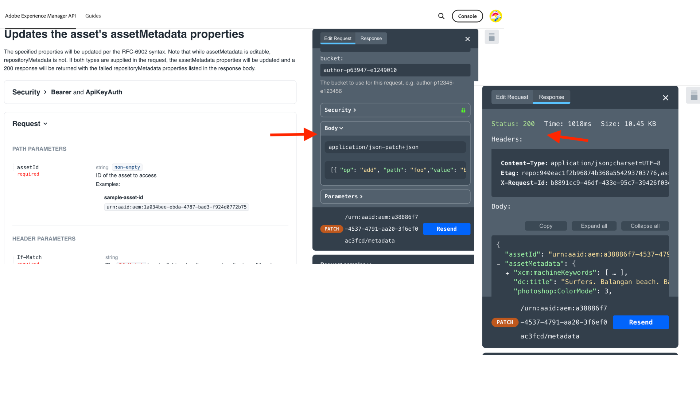

# API凭据和产品配置文件管理

了解如何为基于OpenAPI的AEM API管理&#x200B;_凭据和产品配置文件_。

在本教程中，您将学习如何添加或删除：

- _凭据_：为AEM API提供身份验证。
- _产品配置文件_：为访问AEM资源的凭据提供权限（或授权）。

## 背景

使用AEM API时，您需要在Adobe Developer Console （或ADC）项目中定义&#x200B;_凭据_&#x200B;和&#x200B;_产品配置文件_。 在以下屏幕截图中，您可以看到AEM Assets创作API的&#x200B;_凭据_&#x200B;和&#x200B;_产品配置文件_：

_凭据_&#x200B;提供API的身份验证机制。 _产品配置文件_&#x200B;向凭据授予&#x200B;_权限（或授权）_，以提供对AEM资源的访问权限。 API请求可以代表应用程序或用户。

产品配置文件与一个或多个&#x200B;_服务_&#x200B;关联。 在AEM as a Cloud Service中，_服务_&#x200B;表示具有预定义的存储库节点访问控制列表(ACL)的用户组，允许精细的权限管理。

成功调用API后，将在AEM创作服务中创建表示ADC项目凭据的用户，以及匹配产品配置文件和服务配置的用户组。

在上述方案中，用户`1323d2...`是在AEM Author服务中创建的，并且是用户组`AEM Assets Collaborator Users - Service`和`AEM Assets Collaborator Users - author - Program XXX - Environment XXX`的成员。

## 添加或删除凭据

AEM API支持以下类型的身份验证凭据：

1. **OAuth服务器到服务器**：专为计算机到计算机交互而设计。
1. **OAuth Web应用程序**：专为与客户端应用程序中的后端服务器进行用户驱动的交互而设计。
1. **OAuth单页应用程序**：专为客户端应用程序中无后端服务器的用户驱动交互而设计。

您可以使用不同类型的凭据支持各种用例。

所有凭据都在您的ADC项目中管理。

>[!BEGINTABS]

>[!TAB 添加凭据]

若要为AEM API添加凭据，请转到ADC项目的&#x200B;**API**&#x200B;部分，然后单击&#x200B;**连接其他凭据**。 然后，按照特定凭据类型的说明进行操作。

>[!TAB 删除凭据]

要删除AEM API凭据，请在ADC项目的&#x200B;**API**&#x200B;部分中选择它，然后单击&#x200B;**删除凭据**。

>[!ENDTABS]

## 添加或删除产品配置文件

_产品配置文件_&#x200B;为访问AEM资源的凭据提供&#x200B;_权限（或授权）_。 _产品配置文件_&#x200B;提供的权限基于与&#x200B;_产品配置文件_&#x200B;关联的&#x200B;_服务_。 大多数&#x200B;_服务_&#x200B;通过与&#x200B;_服务_&#x200B;同名的AEM实例中的用户组，为AEM资源提供&#x200B;_读取_&#x200B;权限。

有时，凭据（又称技术帐户用户）需要其他权限，如AEM资源的&#x200B;_创建、更新、删除_ (CUD)。 在这种情况下，您需要添加与&#x200B;_服务_&#x200B;关联的新&#x200B;_产品配置文件_，以提供所需的权限。

例如，当AEM Assets Author API调用收到非GET请求的[403错误](../use-cases/invoke-api-using-oauth-s2s.md#403-error-for-non-get-requests)时，您可以添加&#x200B;**AEM Administrators - author - Program XXX - Environment XXX** _产品配置文件_&#x200B;来解决此问题。

>[!CAUTION]
>
>**AEM Administrators**&#x200B;服务提供了对Experience Manager的&#x200B;_完全_&#x200B;管理访问权限。 或者，您可以更新[服务权限](./services-user-group-permission-management.md)以仅提供所需权限。

>[!BEGINTABS]

>[!TAB 添加产品配置文件]

要为AEM API添加产品配置文件，请在ADC项目的&#x200B;**API**&#x200B;部分中单击&#x200B;**编辑产品配置文件**，在&#x200B;**配置API**&#x200B;对话框中选择所需的产品配置文件，并保存更改。

选择与所需服务关联的所需产品配置文件(例如&#x200B;**AEM Administrators - author - Program XXX - Environment XXX**)，然后保存更改。

请注意，**AEM Administrators - author - Program XXX - Environment XXX**&#x200B;产品配置文件与&#x200B;**AEM Administrators**&#x200B;服务和&#x200B;**AEM Assets API Users**&#x200B;服务相关联。 如果没有后者，产品配置文件将不会显示在可用产品配置文件列表中。

用于更新资源元数据的&#x200B;**PATCH**&#x200B;请求现在应可正常使用，而不会出现问题。

>[!TAB 删除产品配置文件]

要删除AEM API的产品配置文件，请在ADC项目的&#x200B;**API**&#x200B;部分中单击&#x200B;**编辑产品配置文件**，在&#x200B;**配置API**&#x200B;对话框中取消选择所需的产品配置文件，并保存更改。

>[!ENDTABS]

## 摘要

您已了解如何使用Adobe Developer Console (ADC)项目中的&#x200B;_凭据和产品配置文件_&#x200B;更改AEM API的身份验证机制和权限。
