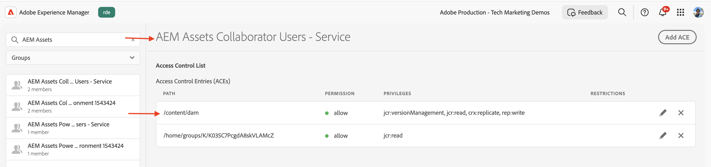

# 产品配置文件和服务用户组权限管理

了解如何在AEM as a Cloud Service中管理“产品配置文件”和“服务”用户组的权限。

在本教程中，您将学习：

- 产品配置文件及其与服务的关联。
- 正在更新Services用户组的权限。

## 背景

使用AEM API时，您需要将&#x200B;_产品配置文件_&#x200B;分配给Adobe Developer Console （或ADC）项目中的&#x200B;_凭据_。 _产品配置文件_（和关联的服务）为访问AEM资源的凭据提供&#x200B;_权限或授权_。 在以下屏幕截图中，您可以看到AEM Assets创作API的&#x200B;_凭据_&#x200B;和&#x200B;_产品配置文件_：


产品配置文件与一个或多个&#x200B;_服务_&#x200B;关联。 在AEM as a Cloud Service中，_服务_&#x200B;表示具有预定义的存储库节点访问控制列表(ACL)的用户组，允许精细的权限管理。


成功调用API后，将在AEM创作服务中创建表示ADC项目凭据的用户，以及匹配产品配置文件和服务配置的用户组。


在上述方案中，用户`1323d2...`是在AEM Author服务中创建的，并且是用户组`AEM Assets Collaborator Users - Service`和`AEM Assets Collaborator Users - author - Program XXX - Environment XXX`的成员。

## 更新Services用户组权限

大多数&#x200B;_服务_&#x200B;通过与&#x200B;_服务_&#x200B;同名的AEM实例中的用户组，为AEM资源提供&#x200B;_读取_&#x200B;权限。

有时，凭据（又称技术帐户用户）需要其他权限，如AEM资源的&#x200B;_创建、更新、删除_ (CUD)。 在这种情况下，您可以在AEM实例中更新&#x200B;_服务_&#x200B;用户组的权限。

例如，当AEM Assets Author API调用收到非GET请求[的](../use-cases/invoke-api-using-oauth-s2s.md#403-error-for-non-get-requests)403错误时，您可以在AEM实例中更新&#x200B;_AEM Assets Collaborator Users - Service_&#x200B;用户组的权限。

使用权限用户界面或[Sling存储库初始化](https://sling.apache.org/documentation/bundles/repository-initialization.html)脚本，您可以在AEM实例中更新现成用户组的权限。

### 使用权限用户界面更新权限

要使用权限用户界面更新服务用户组（例如`AEM Assets Collaborator Users - Service`）的权限，请执行以下步骤：

- 导航到AEM实例中的&#x200B;**工具** > **安全性** > **权限**。

- 搜索服务用户组（例如`AEM Assets Collaborator Users - Service`）。

  

- 单击&#x200B;**添加ACE**&#x200B;为用户组添加新的访问控制项(ACE)。

  

### 使用存储库初始化脚本更新权限

要使用存储库初始化脚本更新服务用户组（例如`AEM Assets Collaborator Users - Service`）的权限，请执行以下步骤：

- 在您喜爱的IDE中打开AEM项目。

- 导航到`ui.config`模块

- 在`ui.config/src/main/content/jcr_root/apps/<PROJECT-NAME>/osgiconfig/config.author`中创建一个名为`org.apache.sling.jcr.repoinit.RepositoryInitializer-services-group-acl-update.cfg.json`的文件，该文件包含以下内容：

  ```json
  {
      "scripts": [
          "set ACL for \"AEM Assets Collaborator Users - Service\" (ACLOptions=ignoreMissingPrincipal)",
          "    allow jcr:read,jcr:versionManagement,crx:replicate,rep:write on /content/dam",
          "end"
      ]
  }
  ```

- 提交更改并将其推送到存储库。

- 使用[Cloud Manager全栈管道](https://experienceleague.adobe.com/zh-hans/docs/experience-manager-cloud-service/content/implementing/using-cloud-manager/cicd-pipelines/introduction-ci-cd-pipelines#full-stack-pipeline)将更改部署到AEM实例。

- 您还可以使用&#x200B;**权限**&#x200B;视图验证用户组的权限。 导航到AEM实例中的&#x200B;**工具** > **安全性** > **权限**。

  

### 验证权限

使用以上任何方法更新权限后，PATCH更新资源元数据的请求现在应该可以正常使用，而不会出现任何问题。


## 摘要

您已了解如何在AEM as a Cloud Service中管理“产品配置文件”和“服务”用户组的权限。 您可以使用权限用户界面或存储库初始化脚本，在AEM实例中更新服务用户组的权限。
