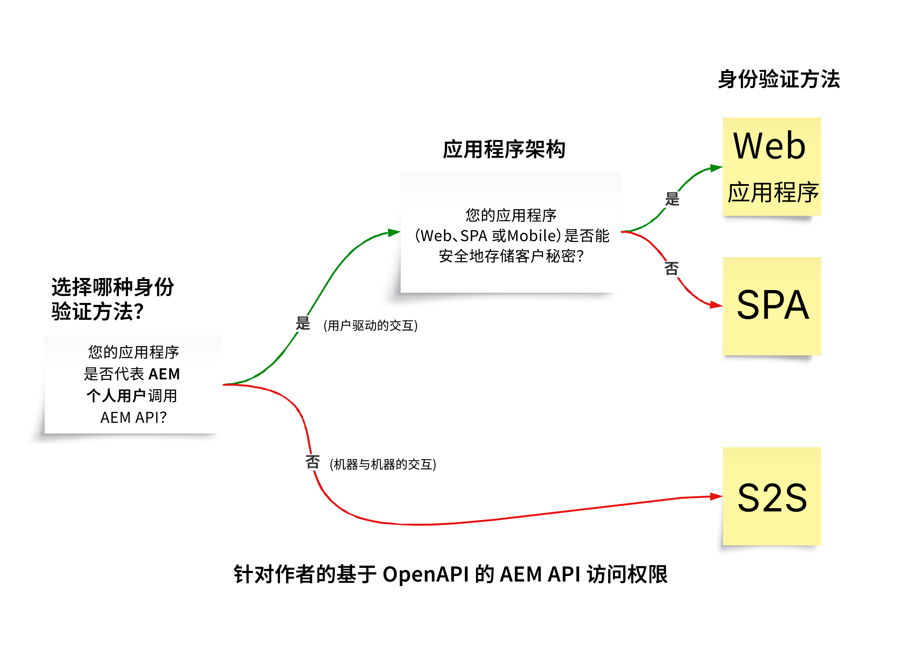

# 基于 OpenAPI 的 AEM API

>[!IMPORTANT]
>
>基于 OpenAPI 的 AEM API 仅在 AEM as a Cloud Service 中可用，并且与 AEM 6.X 不兼容。

了解基于 OpenAPI 的 AEM API，包括身份验证支持、关键概念以及如何访问 Adobe API。

[OpenAPI 规范](https://swagger.io/specification/)（原称 Swagger）是一种广泛使用的 RESTful API 定义标准。AEM as a Cloud Service 提供了多种基于 OpenAPI 规范的 API（简称基于 OpenAPI 的 AEM API），使得通过开发自定义应用程序来与 AEM 的 Author 或 Publish 服务类型进行交互变得更加便捷。下面给出了一些示例：

**Sites**

- [Sites API](https://developer.adobe.com/experience-cloud/experience-manager-apis/api/stable/sites/)：用于处理内容片段的 API。

**Assets**

- [文件夹 API](https://developer.adobe.com/experience-cloud/experience-manager-apis/api/experimental/folders/)：用于处理文件夹的 API，如创建、列出和删除文件夹。

- [资产创作 API](https://developer.adobe.com/experience-cloud/experience-manager-apis/api/experimental/assets/author/)：用于处理资产及其元数据的 API。

**Forms**

- [Forms 通信 API](https://developer.adobe.com/experience-cloud/experience-manager-apis/api/experimental/document/)：用于处理表单和文档的 API。

在未来的版本中，将会新增更多基于 OpenAPI 的 AEM API，以支持更多使用场景。

## 身份验证支持{#authentication-support}

基于 OpenAPI 的 AEM API 支持 OAuth 2.0 身份验证，其中涵盖以下授权类型：

- **OAuth 服务器到服务器凭据**：适用于无需用户交互即可访问 API 的后端服务。它使用 _client_credentials_ 授予类型，实现服务器级别的安全访问管理。有关详细信息，请参阅 [OAuth 服务器到服务器凭据](https://developer.adobe.com/developer-console/docs/guides/authentication/ServerToServerAuthentication/#oauth-server-to-server-credential)。

- **OAuth Web 应用凭据**：适用于具有前端和&#x200B;_后端_&#x200B;组件的网页应用程序，其代表用户访问 AEM API。它使用 _authorization_code_ 授予类型，由后端服务器安全地管理密钥和令牌。有关详细信息，请参阅 [OAuth Web 应用凭据](https://developer.adobe.com/developer-console/docs/guides/authentication/UserAuthentication/implementation#oauth-web-app-credential)。

- **OAuth 单页应用凭据**：专为在浏览器中运行的单页应用设计，无需后端服务器即可代表用户访问 API。它使用 _authorization_code_ 授权类型，依赖客户端安全机制中的 PKCE（代码交换证明密钥）来保障授权代码流程的安全。有关详细信息，请参阅 [OAuth 单页应用凭据](https://developer.adobe.com/developer-console/docs/guides/authentication/UserAuthentication/implementation#oauth-single-page-app-credential)。

## 使用哪种身份验证方法{#auth-method-decision}

在决定使用哪种身份验证方法时，请考虑以下事项：

每当涉及 AEM 用户上下文时，用户身份验证（Web 应用程序或单页应用程序）应该是默认选择。这确保了存储库中的所有操作均正确归属于经过身份验证的用户，并且用户仅被限制在其有权拥有的权限范围内。
使用服务器到服务器（或技术系统账户）代表个人用户执行操作会绕过安全模型，并带来权限提升和审计不准确等风险。

## OAuth 服务器到服务器、Web 应用和单页应用凭据之间的区别{#difference-between-oauth-server-to-server-vs-web-app-vs-single-page-app-credentials}

下表总结了基于 OpenAPI 的 AEM API 支持的三种 OAuth 身份验证方法之间的差异：

|  | OAuth 服务器到服务器 | OAuth Web 应用程序 | OAuth 单页应用 (SPA) |
| --- | --- | --- | --- |
| **身份验证目的** | 专为机器间交互而设计。 | 专为具有&#x200B;_后端_&#x200B;的 Web 应用程序中的用户驱动的交互而设计。 | 为&#x200B;_客户端 JavaScript 应用程序_&#x200B;中的由用户驱动的交互而设计。 |
| **令牌行为** | 签发代表客户端应用程序本身的访问令牌。 | _通过后端_&#x200B;代表已验证身份的用户发放访问令牌。 | _通过仅限前端的流程_，代表已验证身份的用户发放访问令牌。 |
| **用例** | 无需用户交互但需要 API 访问权限的后端服务。 | 具有前端和后端组件的 Web 应用程序，代表用户访问 API。 | 纯前端 (JavaScript) 应用程序在无后端支持的情况下，代表用户访问 API。 |
| **安全注意事项** | 在后端系统中安全存储敏感凭据 (`client_id`, `client_secret`)。 | 用户经过身份验证后，通过后端调用获得其专属的&#x200B;_临时访问令牌_。在后端系统中安全存储敏感凭据 (`client_id`, `client_secret`)，以便用授权代码交换访问令牌。 | 用户经过身份验证后，通过前端调用获得其专属的&#x200B;_临时访问令牌_。不使用 `client_secret`，因为在前端应用中存储此信息不安全。依赖 PKCE 机制通过授权代码交换访问令牌。 |
| **授权类型** | _client_credentials_ | _authorization_code_ | _authorization_code_ 搭配 **PKCE** |
| **Adobe Developer Console 凭据类型** | OAuth 服务器到服务器 | OAuth Web 应用程序 | OAuth 单页应用 |
| **教程** | [使用服务器到服务器身份验证调用 API](./use-cases/invoke-api-using-oauth-s2s.md) | [使用 Web 应用身份验证调用 API](./use-cases/invoke-api-using-oauth-web-app.md) | [使用单页应用程序身份验证调用 API](./use-cases/invoke-api-using-oauth-single-page-app.md) |

## 访问 Adobe API 和相关概念{#accessing-adobe-apis-and-related-concepts}

在访问 Adobe API 之前，必须了解以下关键结构：

- **[Adobe Developer Console](https://developer.adobe.com/)**：访问 Adobe API、SDK、实时事件、无服务器功能等资源的开发人员中心。请注意，它与用于调试 AEM 应用程序的 _AEM_ Developer Console 不同。

- **[Adobe Developer Console 项目](https://developer.adobe.com/developer-console/docs/guides/projects/)**：管理 API 集成、事件和运行时功能的中心位置。在这里，您可以配置 API、设置身份验证并生成所需的凭据。

- **[产品轮廓](https://helpx.adobe.com/cn/enterprise/using/manage-product-profiles.html)**：产品轮廓提供权限预设，使您能够控制用户或应用程序对 AEM、Adobe Target、Adobe Analytics 等 Adobe 产品的访问权限。每个 Adobe 产品都关联有预定义的产品轮廓。

- **服务**：服务定义具体权限，并与产品轮廓相关联。您可以通过取消选择或选择与产品轮廓相关联的服务，来减少或增加权限预设。从而使您能够控制对产品及其 API 的访问级别。在 AEM as a Cloud Service 中，服务代表用户组，并为存储库节点预设了访问控制列表 (ACL)，从而实现了精细的权限管理。

## 开始使用

了解如何将 AEM as a Cloud Service 环境，并创建 Adobe Developer Console 项目，以实现对基于 OpenAPI 的 AEM API 的访问。还可以使用浏览器访问 AEM API 来验证设置，并查看请求和响应。

<!-- CARDS
{target = _self}

* ./setup.md
  {title = Set up OpenAPI-based AEM APIs}
  {description = Learn how to set up your AEM as a Cloud Service environment to enable access to the OpenAPI-based AEM APIs.}
  {image = ./assets/setup/OpenAPI-Setup.png}
-->
<!-- START CARDS HTML - DO NOT MODIFY BY HAND -->

    

        

            

                <figure class="image x-is-16by9">
                    
                </figure>
            

            

                

                    

                        <a href="./setup.md" target="_self" rel="referrer" title="设置基于 OpenAPI 的 AEM API">设置基于 OpenAPI 的 AEM API</a>
                    

                    
了解如何设置您的 AEM as a Cloud Service 环境，以允许访问基于 OpenAPI 的 AEM API。

                

                <a href="./setup.md" target="_self" rel="referrer" class="spectrum-Button spectrum-Button--outline spectrum-Button--primary spectrum-Button--sizeM" style="align-self: flex-start; margin-top: 1rem;">
                    了解详情
                </a>
            

        

    

<!-- END CARDS HTML - DO NOT MODIFY BY HAND -->

## API 教程

了解如何使用不同的 OAuth 身份验证方法，来使用基于 OpenAPI 的 AEM API：

<!-- CARDS
{target = _self}

* ./use-cases/invoke-api-using-oauth-s2s.md
  {title = Invoke API using Server-to-Server authentication}
  {description = Learn how to invoke OpenAPI-based AEM APIs from a custom NodeJS application using OAuth Server-to-Server authentication.}
  {image = ./assets/s2s/OAuth-S2S.png}
* ./use-cases/invoke-api-using-oauth-web-app.md
  {title = Invoke API using Web App authentication}
  {description = Learn how to invoke OpenAPI-based AEM APIs from a custom web application using OAuth Web App authentication.}
  {image = ./assets/web-app/OAuth-WebApp.png}
* ./use-cases/invoke-api-using-oauth-single-page-app.md
  {title = Invoke API using Single Page App authentication}
  {description = Learn how to invoke OpenAPI-based AEM APIs from a custom Single Page App (SPA) using OAuth Single Page App authentication.}
  {image = ./assets/spa/OAuth-SPA.png}  
-->
<!-- START CARDS HTML - DO NOT MODIFY BY HAND -->

    

        

            

                <figure class="image x-is-16by9">
                    
                </figure>
            

            

                

                    

                        <a href="./use-cases/invoke-api-using-oauth-s2s.md" target="_self" rel="referrer" title="使用服务器到服务器身份验证调用 API">使用服务器到服务器身份验证调用 API</a>
                    

                    
了解如何使用 OAuth 服务器到服务器身份验证从自定义 NodeJS 应用程序调用基于 OpenAPI 的 AEM API。

                

                <a href="./use-cases/invoke-api-using-oauth-s2s.md" target="_self" rel="referrer" class="spectrum-Button spectrum-Button--outline spectrum-Button--primary spectrum-Button--sizeM" style="align-self: flex-start; margin-top: 1rem;">
                    了解详情
                </a>
            

        

    

    

        

            

                <figure class="image x-is-16by9">
                    
                </figure>
            

            

                

                    

                        <a href="./use-cases/invoke-api-using-oauth-web-app.md" target="_self" rel="referrer" title="使用 Web 应用身份验证调用 API">使用 Web 应用身份验证调用 API</a>
                    

                    
了解如何使用 OAuth Web App 身份验证从自定义 Web 应用程序调用基于 OpenAPI 的 AEM API。

                

                <a href="./use-cases/invoke-api-using-oauth-web-app.md" target="_self" rel="referrer" class="spectrum-Button spectrum-Button--outline spectrum-Button--primary spectrum-Button--sizeM" style="align-self: flex-start; margin-top: 1rem;">
                    了解详情
                </a>
            

        

    

    

        

            

                <figure class="image x-is-16by9">
                    
                </figure>
            

            

                

                    

                        <a href="./use-cases/invoke-api-using-oauth-single-page-app.md" target="_self" rel="referrer" title="使用单页应用程序身份验证调用 API">使用单页应用程序身份验证调用 API</a>
                    

                    
了解如何使用 OAuth 单页应用程序 (SPA) 身份验证，从自定义单页应用程序 (SPA) 调用基于 OpenAPI 的 AEM API。

                

                <a href="./use-cases/invoke-api-using-oauth-single-page-app.md" target="_self" rel="referrer" class="spectrum-Button spectrum-Button--outline spectrum-Button--primary spectrum-Button--sizeM" style="align-self: flex-start; margin-top: 1rem;">
                    了解详情
                </a>
            

        

    

<!-- END CARDS HTML - DO NOT MODIFY BY HAND -->
