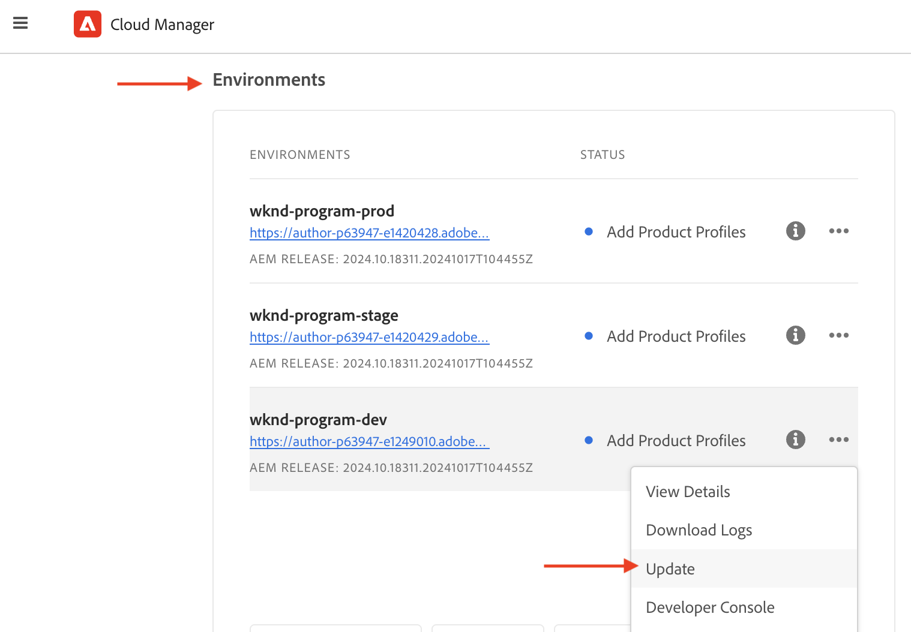

# 设置基于OpenAPI的AEM API

了解如何设置AEM as a Cloud Service环境，以便能够访问基于OpenAPI的AEM API。

>[!AVAILABILITY]
>
>基于OpenAPI的AEM API作为早期访问计划的一部分提供。 如果您有兴趣访问它们，我们建议您通过电子邮件向[aem-apis@adobe.com](mailto:aem-apis@adobe.com)发送用例说明。

>[!VIDEO](https://video.tv.adobe.com/v/3457510?quality=12&learn=on)


高级设置过程涉及以下步骤：

1. AEM as a Cloud Service环境的现代化。
1. 启用AEM API访问。
1. 创建Adobe Developer Console (ADC)项目。
1. 配置ADC项目
1. 配置AEM实例以启用ADC项目通信。

## AEM as a Cloud Service环境的现代化{#modernization-of-aem-as-a-cloud-service-environment}

AEM as a Cloud Service环境的现代化是一项针对每个环境的一次性活动，其中涉及以下步骤：

- 更新至AEM版本&#x200B;**2024.10.18459.20241031T210302Z**&#x200B;或更高版本。
- 如果环境是在版本2024.10.18459.20241031T210302Z之前创建的，请向其中添加新的产品配置文件。

### 更新AEM实例{#update-aem-instance}

要更新AEM实例，请在Adobe [Cloud Manager](https://my.cloudmanager.adobe.com/)的&#x200B;_环境_&#x200B;部分中，选择环境名称旁边的&#x200B;_省略号_&#x200B;图标，然后选择&#x200B;**更新**&#x200B;选项。



然后单击&#x200B;**提交**&#x200B;按钮并运行&#x200B;_建议_&#x200B;全栈管道。


在我的示例中，Fullstack管道名为&#x200B;**Dev ：： Fullstack-Deploy**，AEM环境名为&#x200B;**wknd-program-dev**。 你的名字可能不同。

### 添加新产品配置文件{#add-new-product-profiles}

要将新产品配置文件添加到AEM实例，请在Adobe [Cloud Manager](https://my.cloudmanager.adobe.com/)的&#x200B;_环境_&#x200B;部分中，选择环境名称旁边的&#x200B;_省略号_&#x200B;图标，然后选择&#x200B;**添加产品配置文件**&#x200B;选项。


您可以通过单击环境名称旁边的&#x200B;_省略号_&#x200B;图标并选择&#x200B;**管理访问权限** > **作者配置文件**&#x200B;来查看新添加的产品配置文件。

_Admin Console_&#x200B;窗口显示新添加的产品配置文件。


以上步骤完成了AEM as a Cloud Service环境的现代化。

## 启用AEM API访问{#enable-aem-apis-access}

存在&#x200B;_新产品配置文件_&#x200B;可在Adobe Developer Console (ADC)中启用基于OpenAPI的AEM API访问。 回顾[Adobe Developer Console (ADC)](./overview.md#accessing-adobe-apis-and-related-concepts)是访问Adobe API、SDK、实时事件、无服务器函数等的开发人员中心。

新添加的产品配置文件与&#x200B;_服务_&#x200B;关联，这些服务代表&#x200B;_具有预定义访问控制列表(ACL)_&#x200B;的AEM用户组。 _服务_&#x200B;用于控制对AEM API的访问级别。

您还可以选择或取消选择与产品配置文件关联的&#x200B;_服务_，以减少或增加访问级别。

通过单击产品配置文件名称旁边的&#x200B;_查看详细信息_&#x200B;图标来查看关联。


默认情况下，**AEM Assets API Users**&#x200B;服务不与任何产品配置文件关联。 让我们将其与新添加的&#x200B;**AEM Assets Collaborator Users - author - Program XXX - Environment XXX**&#x200B;产品配置文件关联。 在此关联后，ADC项目的&#x200B;_资产创作API_&#x200B;可以设置所需的服务器到服务器身份验证，并将ADC项目（在下一步中创建）中的身份验证帐户与产品配置文件关联。


>[!IMPORTANT]
>
>要为AEM Assets API启用服务器到服务器身份验证，上述步骤至关重要。 如果没有此关联，AEM Assets API将无法与服务器到服务器身份验证方法一起使用。

## 创建Adobe Developer Console (ADC)项目{#adc-project}

ADC项目用于添加所需的API、设置其身份验证并将身份验证帐户与产品配置文件关联。

创建ADC项目：

1. 使用您的Adobe ID登录[Adobe Developer Console](https://developer.adobe.com/console)。

   

1. 在&#x200B;_快速入门_&#x200B;部分中，单击&#x200B;**新建项目**&#x200B;按钮。

   

1. 这会创建一个具有默认名称的新项目。

   

1. 通过单击右上角的&#x200B;**编辑项目**&#x200B;按钮编辑项目名称。 提供一个有意义的名称，然后单击&#x200B;**保存**。

   

## 配置ADC项目{#configure-adc-project}

创建ADC项目后，您必须添加所需的AEM API，设置其身份验证，并将身份验证帐户与产品配置文件关联。

1. 要添加AEM API，请单击&#x200B;**添加API**&#x200B;按钮。

   

1. 在&#x200B;_添加API_&#x200B;对话框中，按&#x200B;_Experience Cloud_&#x200B;进行筛选，然后选择所需的AEM API。 例如，在本例中，选择了&#x200B;_资产创作API_。

   

1. 接下来，在&#x200B;_配置API_&#x200B;对话框中，选择所需的身份验证选项。 例如，在本例中，选择了&#x200B;**服务器到服务器**&#x200B;身份验证选项。

   

   服务器到服务器身份验证非常适用于需要API访问而不需要用户交互的后端服务。 Web应用程序和单页应用程序身份验证选项适用于需要代表用户进行API访问的应用程序。 有关详细信息，请参阅[OAuth服务器到服务器与Web应用程序与单页应用程序凭据之间的区别](./overview.md#difference-between-oauth-server-to-server-vs-web-app-vs-single-page-app-credentials)。

1. 如果需要，可以重命名API以便于识别。 出于演示目的，使用默认名称。

   

1. 在这种情况下，身份验证方法是&#x200B;**OAuth服务器到服务器**，因此您需要将身份验证帐户与产品配置文件关联。 选择&#x200B;**AEM Assets Collaborator Users - author - Program XXX - Environment XXX** Product Profile，然后单击&#x200B;**保存**。

   

1. 审查AEM API和身份验证配置。

   

   

如果您选择&#x200B;**OAuth Web应用程序**&#x200B;或&#x200B;**OAuth单页应用程序**&#x200B;身份验证方法，则不会提示产品配置文件关联，但需要应用程序重定向URI。 应用程序重定向URI用于在通过授权码进行身份验证后将用户重定向到应用程序。 相关用例教程概述了此类特定于身份验证的配置。

## 配置AEM实例以启用ADC项目通信{#configure-aem-instance}

要使ADC项目的ClientID能够与AEM实例通信，您需要配置AEM实例。

此操作通过在的`config.yaml`文件中定义API配置来完成
AEM项目，并使用Cloud Manager中的配置管道进行部署。

1. 在AEM项目中，从`config`文件夹中找到或创建`config.yaml`文件。

   

1. 将以下配置添加到`config.yaml`文件。

   ```yaml
   kind: "API"
   version: "1.0"
   metadata: 
       envTypes: ["dev", "stage", "prod"]
   data:
       allowedClientIDs:
           author:
           - "<ADC Project's Credentials ClientID>"
   ```

   将`<ADC Project's Credentials ClientID>`替换为ADC项目凭据值的实际ClientID。 本教程中使用的API端点仅在创作层上可用，但对于其他API，yaml配置还可以具有&#x200B;_发布_&#x200B;或&#x200B;_预览_&#x200B;节点。

   >[!CAUTION]
   >
   > 出于演示目的，所有环境均使用相同的ClientID。 建议为每个环境（开发、暂存、生产）使用单独的ClientID，以便更好地进行安全和控制。

1. 提交配置更改并将更改推送到Cloud Manager管道所连接的远程Git存储库。

1. 使用Cloud Manager中的配置管道来部署上述更改。 请注意，`config.yaml`文件也可以使用命令行工具安装在RDE中。

   

## 后续步骤

一旦将AEM实例配置为启用ADC项目通信，您就可以开始使用基于OpenAPI的AEM API。 了解如何使用基于开放式API的AEM API，并使用不同的OAuth身份验证方法：

<!-- CARDS
{target = _self}

* ./use-cases/invoke-api-using-oauth-s2s.md
  {title = Invoke API using Server-to-Server authentication}
  {description = Learn how to invoke OpenAPI-based AEM APIs from a custom NodeJS application using OAuth Server-to-Server authentication.}
  {image = ./assets/s2s/OAuth-S2S.png}
* ./use-cases/invoke-api-using-oauth-web-app.md
  {title = Invoke API using Web App authentication}
  {description = Learn how to invoke OpenAPI-based AEM APIs from a custom web application using OAuth Web App authentication.}
  {image = ./assets/web-app/OAuth-WebApp.png}
* ./use-cases/invoke-api-using-oauth-single-page-app.md
  {title = Invoke API using Single Page App authentication}
  {description = Learn how to invoke OpenAPI-based AEM APIs from a custom Single Page App (SPA) using OAuth 2.0 PKCE flow.}
  {image = ./assets/spa/OAuth-SPA.png}  
-->
<!-- START CARDS HTML - DO NOT MODIFY BY HAND -->
<div class="columns">
    <div class="column is-half-tablet is-half-desktop is-one-third-widescreen" aria-label="Invoke API using Server-to-Server authentication">
        <div class="card" style="height: 100%; display: flex; flex-direction: column; height: 100%;">
            <div class="card-image">
                <figure class="image x-is-16by9">
                    <a href="./use-cases/invoke-api-using-oauth-s2s.md" title="使用服务器到服务器身份验证调用API" target="_self" rel="referrer">
                        
                    </a>
                </figure>
            </div>
            <div class="card-content is-padded-small" style="display: flex; flex-direction: column; flex-grow: 1; justify-content: space-between;">
                <div class="top-card-content">
                    <p class="headline is-size-6 has-text-weight-bold">
                        <a href="./use-cases/invoke-api-using-oauth-s2s.md" target="_self" rel="referrer" title="使用服务器到服务器身份验证调用API">使用服务器到服务器身份验证调用API</a>
                    </p>
                    <p class="is-size-6">了解如何使用OAuth服务器到服务器身份验证从自定义NodeJS应用程序调用基于OpenAPI的AEM API。</p>
                </div>
                <a href="./use-cases/invoke-api-using-oauth-s2s.md" target="_self" rel="referrer" class="spectrum-Button spectrum-Button--outline spectrum-Button--primary spectrum-Button--sizeM" style="align-self: flex-start; margin-top: 1rem;">
                    <span class="spectrum-Button-label has-no-wrap has-text-weight-bold">了解详情</span>
                </a>
            </div>
        </div>
    </div>
    <div class="column is-half-tablet is-half-desktop is-one-third-widescreen" aria-label="Invoke API using Web App authentication">
        <div class="card" style="height: 100%; display: flex; flex-direction: column; height: 100%;">
            <div class="card-image">
                <figure class="image x-is-16by9">
                    <a href="./use-cases/invoke-api-using-oauth-web-app.md" title="使用Web应用程序身份验证调用API" target="_self" rel="referrer">
                        
                    </a>
                </figure>
            </div>
            <div class="card-content is-padded-small" style="display: flex; flex-direction: column; flex-grow: 1; justify-content: space-between;">
                <div class="top-card-content">
                    <p class="headline is-size-6 has-text-weight-bold">
                        <a href="./use-cases/invoke-api-using-oauth-web-app.md" target="_self" rel="referrer" title="使用Web应用程序身份验证调用API">使用Web应用程序身份验证调用API</a>
                    </p>
                    <p class="is-size-6">了解如何使用OAuth Web应用程序身份验证，从自定义Web应用程序调用基于OpenAPI的AEM API。</p>
                </div>
                <a href="./use-cases/invoke-api-using-oauth-web-app.md" target="_self" rel="referrer" class="spectrum-Button spectrum-Button--outline spectrum-Button--primary spectrum-Button--sizeM" style="align-self: flex-start; margin-top: 1rem;">
                    <span class="spectrum-Button-label has-no-wrap has-text-weight-bold">了解详情</span>
                </a>
            </div>
        </div>
    </div>
    <div class="column is-half-tablet is-half-desktop is-one-third-widescreen" aria-label="Invoke API using Single Page App authentication">
        <div class="card" style="height: 100%; display: flex; flex-direction: column; height: 100%;">
            <div class="card-image">
                <figure class="image x-is-16by9">
                    <a href="./use-cases/invoke-api-using-oauth-single-page-app.md" title="使用单页应用程序身份验证调用API" target="_self" rel="referrer">
                        
                    </a>
                </figure>
            </div>
            <div class="card-content is-padded-small" style="display: flex; flex-direction: column; flex-grow: 1; justify-content: space-between;">
                <div class="top-card-content">
                    <p class="headline is-size-6 has-text-weight-bold">
                        <a href="./use-cases/invoke-api-using-oauth-single-page-app.md" target="_self" rel="referrer" title="使用单页应用程序身份验证调用API">使用单页应用程序身份验证调用API</a>
                    </p>
                    <p class="is-size-6">了解如何使用OAuth 2.0 PKCE流程从自定义单页应用程序(SPA)调用基于OpenAPI的AEM API。</p>
                </div>
                <a href="./use-cases/invoke-api-using-oauth-single-page-app.md" target="_self" rel="referrer" class="spectrum-Button spectrum-Button--outline spectrum-Button--primary spectrum-Button--sizeM" style="align-self: flex-start; margin-top: 1rem;">
                    <span class="spectrum-Button-label has-no-wrap has-text-weight-bold">了解详情</span>
                </a>
            </div>
        </div>
    </div>
</div>
<!-- END CARDS HTML - DO NOT MODIFY BY HAND -->
