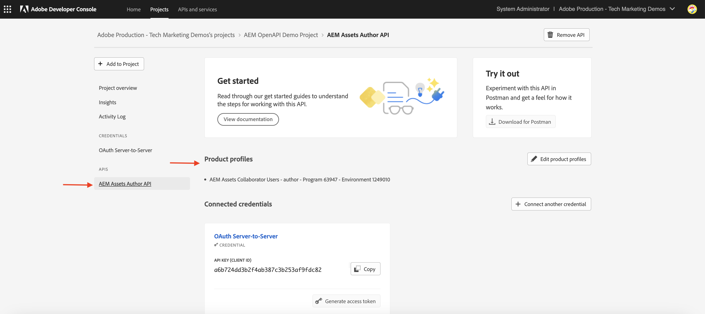

# 使用OAuth服务器到服务器身份验证调用基于OpenAPI的AEM API

了解如何使用&#x200B;_OAuth服务器到服务器_&#x200B;身份验证，从自定义应用程序在AEM as a Cloud Service上调用基于OpenAPI的AEM API。

OAuth服务器到服务器身份验证非常适用于需要API访问而不进行用户交互的后端服务。 它使用OAuth 2.0 _client_credentials_&#x200B;授权类型来验证客户端应用程序。

## 你将学到的内容{#what-you-learn}

在本教程中，您将学习如何：

- 配置Adobe Developer Console (ADC)项目以使用&#x200B;_OAuth服务器到服务器身份验证_&#x200B;访问Assets创作API。

- 开发一个示例NodeJS应用程序，该应用程序调用Assets创作API以检索特定资源的元数据。

开始之前，请确保已查看以下内容：

- [访问Adobe API和相关概念](../overview.md#accessing-adobe-apis-and-related-concepts)部分。
- [设置基于OpenAPI的AEM API](../setup.md)文章。

## 先决条件

要完成本教程，您需要：

- 包含以下内容的现代化AEM as a Cloud Service环境：
   - AEM版本`2024.10.18459.20241031T210302Z`或更高版本。
   - 新样式产品配置文件（如果环境是在2024年11月之前创建的）

  有关更多详细信息，请参阅[设置基于OpenAPI的AEM API](../setup.md)文章。

- 必须在其上部署示例[WKND Sites](https://github.com/adobe/aem-guides-wknd?#aem-wknd-sites-project)项目。

- 访问[Adobe Developer Console](https://developer.adobe.com/developer-console/docs/guides/getting-started)。

- 在本地计算机上安装[Node.js](https://nodejs.org/en/)以运行示例NodeJS应用程序。

## 开发步骤

高级开发步骤包括：

1. 配置ADC项目
   1. 添加Assets创作API
   1. 将其身份验证方法配置为OAuth服务器到服务器
   1. 将产品配置文件与身份验证配置关联
1. 配置AEM实例以启用ADC项目通信
1. 开发示例NodeJS应用程序
1. 验证端到端流量

## 配置ADC项目

配置ADC项目步骤是&#x200B;_重复_，来自[设置基于OpenAPI的AEM API](../setup.md)。 重复添加Assets创作API并将其身份验证方法配置为OAuth服务器到服务器。

>[!TIP]
>
>确保您已完成&#x200B;**设置基于OpenAPI的AEM API**&#x200B;文章中的[启用AEM API访问](../setup.md#enable-aem-apis-access)步骤。 如果没有该选项，“服务器到服务器”身份验证选项将不可用。


1. 从[Adobe Developer Console](https://developer.adobe.com/console/projects)中，打开所需的项目。

1. 要添加AEM API，请单击&#x200B;**添加API**&#x200B;按钮。

   

1. 在&#x200B;_添加API_&#x200B;对话框中，按&#x200B;_Experience Cloud_&#x200B;筛选，选择&#x200B;**AEM Assets创作API**&#x200B;卡片，然后单击&#x200B;**下一步**。
如果您需要其他基于OpenAPI的AEM API，请参阅[Adobe Developer文档](https://developer.adobe.com/experience-cloud/experience-manager-apis/#openapi-based-apis)以查找与您的用例相匹配的API。

   以下示例介绍如何添加&#x200B;**AEM Assets创作API**。

   

   >[!TIP]
   >
   >如果所需的&#x200B;**AEM API卡**&#x200B;已禁用，_为什么禁用了此卡？_&#x200B;信息显示&#x200B;**需要许可证**&#x200B;消息，原因之一可能是您没有使您的AEM as a Cloud Service环境现代化，有关详细信息，请参阅[AEM as a Cloud Service环境现代化](../setup.md#modernization-of-aem-as-a-cloud-service-environment)。

1. 接下来，在&#x200B;_配置API_&#x200B;对话框中，选择&#x200B;**服务器到服务器**&#x200B;身份验证选项，然后单击&#x200B;**下一步**。 服务器到服务器身份验证非常适用于需要API访问而不需要用户交互的后端服务。

   

   >[!TIP]
   >
   >如果您看不到服务器到服务器身份验证选项，则意味着设置集成的用户不会作为开发人员添加到与服务相关联的产品配置文件中。 有关详细信息，请参阅[启用服务器到服务器身份验证](../setup.md#enable-server-to-server-authentication)。

1. 重命名凭据以便于识别（如果需要），然后单击&#x200B;**下一步**。 出于演示目的，使用默认名称。

   

1. 选择&#x200B;**AEM Assets Collaborator Users - author - Program XXX - Environment XXX** Product Profile，然后单击&#x200B;**保存**。 如您所见，仅与AEM Assets API Users服务关联的产品配置文件可供选择。

   

1. 审查AEM API和身份验证配置。

   

   

## 配置AEM实例以启用ADC项目通信

按照[设置基于OpenAPI的AEM API](../setup.md#configure-the-aem-instance-to-enable-adc-project-communication)文章中的说明配置AEM实例以启用ADC项目通信。

## 开发示例NodeJS应用程序

让我们开发一个调用Assets创作API的示例NodeJS应用程序。

您可以使用其他编程语言（如Java、Python等）来开发应用程序。

出于测试目的，您可以使用[Postman](https://www.postman.com/)、[curl](https://curl.se/)或任何其他REST客户端调用AEM API。

### 审查API

在开发应用程序之前，让我们从[Assets创作API](https://developer.adobe.com/experience-cloud/experience-manager-apis/api/experimental/assets/author/#operation/getAssetMetadata)查看&#x200B;_交付指定资源的元数据_&#x200B;端点。 API语法为：

```http
GET https://{bucket}.adobeaemcloud.com/adobe/../assets/{assetId}/metadata
```

要检索特定资源的元数据，您需要`bucket`和`assetId`值。 `bucket`是没有Adobe域名(.adobeaemcloud.com)的AEM实例名称，例如`author-p63947-e1420428`。

`assetId`是前缀为`urn:aaid:aem:`的资源的JCR UUID，例如`urn:aaid:aem:a200faf1-6d12-4abc-bc16-1b9a21f870da`。 有多种方法可获取`assetId`：

- 附加AEM资源路径`.json`扩展以获取资源元数据。 例如，`https://author-p63947-e1420429.adobeaemcloud.com/content/dam/wknd-shared/en/adventures/cycling-southern-utah/adobestock-221043703.jpg.json`并查找`jcr:uuid`属性。

- 或者，您可以通过检查浏览器元素检查器中的资产来获取`assetId`。 查找`data-id="urn:aaid:aem:..."`属性。

  

### 使用浏览器调用API

在开发应用程序之前，让我们使用&#x200B;**API文档**&#x200B;中的[尝试它](https://developer.adobe.com/experience-cloud/experience-manager-apis/api/stable/assets/author/)功能调用API。

1. 在浏览器中打开[Assets创作API文档](https://developer.adobe.com/experience-cloud/experience-manager-apis/api/stable/assets/author/)。

1. 展开&#x200B;_元数据_&#x200B;部分，然后单击&#x200B;**交付指定资源的元数据**&#x200B;选项。

1. 在右窗格中，单击&#x200B;**尝试它**&#x200B;按钮。
   

1. 输入以下值：

   | 分区 | 参数 | 值 |
   | --- | --- | --- |
   |  | 分段 | AEM实例名称不带Adobe域名(.adobeaemcloud.com)，例如`author-p63947-e1420428`。 |
   | **安全性** | 持有者令牌 | 使用ADC项目的OAuth服务器到服务器凭据中的访问令牌。 |
   | **安全性** | X-Api-Key | 使用ADC项目的OAuth服务器到服务器凭据中的`ClientID`值。 |
   | **参数** | 资产ID | AEM中资源的唯一标识符，例如`urn:aaid:aem:a200faf1-6d12-4abc-bc16-1b9a21f870da` |
   | **参数** | X-Adobe-Accept-Experimental | 1 |

   

   

1. 单击&#x200B;**发送**&#x200B;以调用API，并在&#x200B;**响应**&#x200B;选项卡中查看响应。

   

上述步骤确认了AEM as a Cloud Service环境的现代化，从而可启用AEM API访问。 它还确认已成功配置ADC项目，以及与AEM Author实例的OAuth服务器到服务器凭据ClientID通信。

### 示例NodeJS应用程序

让我们开发一个示例NodeJS应用程序。

若要开发应用程序，可以使用&#x200B;_Run-the-sample-application_&#x200B;或&#x200B;_逐步开发_&#x200B;说明。

>[!BEGINTABS]

>[!TAB Run-the-sample-application]

1. 下载示例[demo-nodejs-app-to-invoke-aem-openapi](../assets/s2s/demo-nodejs-app-to-invoke-aem-openapi.zip)应用程序zip文件并将其解压缩。

1. 导航到提取的文件夹并安装依赖项。

   ```bash
   $ npm install
   ```

1. 将`.env`文件中的占位符替换为ADC项目的OAuth服务器到服务器凭据中的实际值。

1. 将`<BUCKETNAME>`文件中的`<ASSETID>`和`src/index.js`替换为实际值。

1. 运行NodeJS应用程序。

   ```bash
   $ node src/index.js
   ```

>[!TAB 逐步开发]

1. 创建新的NodeJS项目。

   ```bash
   $ mkdir demo-nodejs-app-to-invoke-aem-openapi
   $ cd demo-nodejs-app-to-invoke-aem-openapi
   $ npm init -y
   ```

1. 安装&#x200B;_fetch_&#x200B;和&#x200B;_dotenv_&#x200B;库以分别发出HTTP请求和读取环境变量。

   ```bash
   $ npm install node-fetch
   $ npm install dotenv
   ```

1. 在您喜爱的代码编辑器中打开项目并更新`package.json`文件以将`type`添加到`module`。

   ```json
   {
       ...
       "version": "1.0.0",
       "type": "module",
       "main": "index.js",
       ...
   }
   ```

1. 创建`.env`文件并添加以下配置。 将占位符替换为ADC项目的OAuth服务器到服务器凭据中的实际值。

   ```properties
   CLIENT_ID=<ADC Project OAuth Server-to-Server credential ClientID>
   CLIENT_SECRET=<ADC Project OAuth Server-to-Server credential Client Secret>
   SCOPES=<ADC Project OAuth Server-to-Server credential Scopes>
   ```

1. 创建`src/index.js`文件并添加以下代码，然后将`<BUCKETNAME>`和`<ASSETID>`替换为实际值。

   ```javascript
   // Import the dotenv configuration to load environment variables from the .env file
   import "dotenv/config";
   
   // Import the fetch function to make HTTP requests
   import fetch from "node-fetch";
   
   // REPLACE THE FOLLOWING VALUES WITH YOUR OWN
   const bucket = "<BUCKETNAME>"; // Bucket name is the AEM instance name (e.g. author-p63947-e1420428)
   const assetId = "<ASSETID>"; // Asset ID is the unique identifier for the asset in AEM (e.g. urn:aaid:aem:a200faf1-6d12-4abc-bc16-1b9a21f870da). You can get it by inspecting the asset in browser's element inspector, look for data-id="urn:aaid:aem:..."
   
   // Load environment variables for authentication
   const clientId = process.env.CLIENT_ID; // Adobe IMS client ID
   const clientSecret = process.env.CLIENT_SECRET; // Adobe IMS client secret
   const scopes = process.env.SCOPES; // Scope for the API access
   
   // Adobe IMS endpoint for obtaining an access token
   const adobeIMSV3TokenEndpointURL =
   "https://ims-na1.adobelogin.com/ims/token/v3";
   
   // Function to obtain an access token from Adobe IMS
   const getAccessToken = async () => {
       console.log("Getting access token from IMS"); // Log process initiation
       //console.log("Client ID: " + clientId); // Display client ID for debugging purposes
   
       // Configure the HTTP POST request to fetch the access token
       const options = {
           method: "POST",
           headers: {
           "Content-Type": "application/x-www-form-urlencoded", // Specify form data content type
           },
           // Send client ID, client secret, and scopes as the request body
           body: `grant_type=client_credentials&client_id=${clientId}&client_secret=${clientSecret}&scope=${scopes}`,
       };
   
       // Make the HTTP request to fetch the access token
       const response = await fetch(adobeIMSV3TokenEndpointURL, options);
   
       //console.log("Response status: " + response.status); // Log the HTTP status for debugging
   
       const responseJSON = await response.json(); // Parse the JSON response
   
       console.log("Access token received"); // Log success message
   
       // Return the access token
       return responseJSON.access_token;
   };
   
   // Function to retrieve metadata for a specific asset from AEM
   const getAssetMetadat = async () => {
       // Fetch the access token using the getAccessToken function
       const accessToken = await getAccessToken();
   
       console.log("Getting asset metadata from AEM");
   
       // Invoke the Assets Author API to retrieve metadata for a specific asset
       const resp = await fetch(
           `https://${bucket}.adobeaemcloud.com/adobe/../assets/${assetId}/metadata`, // Construct the URL with bucket and asset ID
           {
           method: "GET",
           headers: {
               "If-None-Match": "string", // Header to handle caching (not critical for this tutorial)
               "X-Adobe-Accept-Experimental": "1", // Header to enable experimental Adobe API features
               Authorization: "Bearer " + accessToken, // Provide the access token for authorization
               "X-Api-Key": clientId, // Include the OAuth S2S ClientId for identification
           },
           }
       );
   
       const data = await resp.json(); // Parse the JSON response
   
       console.log("Asset metadata received"); // Log success message
       console.log(data); // Display the retrieved metadata
   };
   
   // Call the getAssets function to start the process
   getAssetMetadat();
   ```

1. 运行NodeJS应用程序。

   ```bash
   $ node src/index.js
   ```

>[!ENDTABS]

### API响应

成功执行后，控制台中会显示API响应。 响应包含指定资源的元数据。

```json
{
  "assetId": "urn:aaid:aem:9c09ff70-9ee8-4b14-a5fa-ec37baa0d1b3",
  "assetMetadata": {    
    ...
    "dc:title": "A Young Mountain Biking Couple Takes A Minute To Take In The Scenery",
    "xmp:CreatorTool": "Adobe Photoshop Lightroom Classic 7.5 (Macintosh)",
    ...
  },
  "repositoryMetadata": {
    ...
    "repo:name": "adobestock-221043703.jpg",
    "repo:path": "/content/dam/wknd-shared/en/adventures/cycling-southern-utah/adobestock-221043703.jpg",
    "repo:state": "ACTIVE",
    ...
  }
}
```

恭喜！您已成功使用OAuth服务器到服务器身份验证从自定义应用程序中调用基于OpenAPI的AEM API。

### 查看应用程序代码

示例NodeJS应用程序代码中的关键标注为：

1. **IMS身份验证**：使用ADC项目中的OAuth服务器到服务器凭据设置获取访问令牌。

   ```javascript
   // Function to obtain an access token from Adobe IMS
   const getAccessToken = async () => {
   
       // Configure the HTTP POST request to fetch the access token
       const options = {
           method: "POST",
           headers: {
           "Content-Type": "application/x-www-form-urlencoded", // Specify form data content type
           },
           // Send client ID, client secret, and scopes as the request body
           body: `grant_type=client_credentials&client_id=${clientId}&client_secret=${clientSecret}&scope=${scopes}`,
       };
   
       // Make the HTTP request to fetch the access token from Adobe IMS token endpoint https://ims-na1.adobelogin.com/ims/token/v3
       const response = await fetch(adobeIMSV3TokenEndpointURL, options);
   
       const responseJSON = await response.json(); // Parse the JSON response
   
       // Return the access token
       return responseJSON.access_token;
   };
   ...
   ```

1. **API调用**：调用Assets创作API，通过提供授权访问令牌来检索特定资源的元数据。

   ```javascript
   // Function to retrieve metadata for a specific asset from AEM
   const getAssetMetadat = async () => {
       // Fetch the access token using the getAccessToken function
       const accessToken = await getAccessToken();
   
       console.log("Getting asset metadata from AEM");
   
       // Invoke the Assets Author API to retrieve metadata for a specific asset
       const resp = await fetch(
           `https://${bucket}.adobeaemcloud.com/adobe/../assets/${assetId}/metadata`, // Construct the URL with bucket and asset ID
           {
           method: "GET",
           headers: {
               "If-None-Match": "string", // Header to handle caching (not critical for this tutorial)
               "X-Adobe-Accept-Experimental": "1", // Header to enable experimental Adobe API features
               Authorization: "Bearer " + accessToken, // Provide the access token for authorization
               "X-Api-Key": clientId, // Include the OAuth S2S ClientId for identification
           },
           }
       );
   
       const data = await resp.json(); // Parse the JSON response
   
       console.log("Asset metadata received"); // Log success message
       console.log(data); // Display the retrieved metadata
   };
   ...
   ```

## 深入了解

成功调用API后，将在AEM创作服务中创建表示ADC项目的OAuth服务器到服务器凭据的用户，以及匹配产品配置文件和服务配置的用户组。 _技术帐户用户_&#x200B;与产品配置文件和&#x200B;_服务_&#x200B;用户组相关联，该用户组具有&#x200B;_读取_&#x200B;资产元数据的必要权限。

要验证技术帐户用户和用户组的创建情况，请执行以下步骤：

- 在ADC项目中，导航到&#x200B;**OAuth服务器到服务器**&#x200B;凭据配置。 记下&#x200B;**技术帐户电子邮件**&#x200B;值。

  

- 在AEM Author服务中，导航到&#x200B;**工具** > **安全性** > **用户**，并搜索&#x200B;**技术帐户电子邮件**&#x200B;值。

  

- 单击技术帐户用户以查看用户详细信息，如&#x200B;**组**&#x200B;成员资格。 如下所示，技术帐户用户与&#x200B;**AEM Assets Collaborator Users - author - Program XXX - Environment XXX**&#x200B;和&#x200B;**AEM Assets Collaborator Users - Service**&#x200B;用户组相关联。

  

- 请注意，技术帐户用户与&#x200B;**AEM Assets Collaborator Users - author - Program XXX - Environment XXX**&#x200B;产品配置文件相关联。 产品配置文件与&#x200B;**AEM Assets API用户**&#x200B;和&#x200B;**AEM Assets Collaborator用户**&#x200B;服务相关联。

  

- 可以在&#x200B;**产品配置文件**&#x200B;的&#x200B;**API凭据**&#x200B;选项卡中验证产品配置文件和技术帐户用户关联。

  

## 非GET请求出现403错误

要&#x200B;_读取_&#x200B;资源元数据，为OAuth服务器到服务器凭据创建的技术帐户用户通过服务用户组(例如，AEM Assets Collaborator Users - Service)具有必要权限。

但是，要&#x200B;_创建、更新、删除_ (CUD)资产元数据，技术帐户用户需要其他权限。 您可以通过调用具有非GET请求(例如，PATCH、DELETE)的API来验证它，并观察到403错误响应。

让我们调用&#x200B;_PATCH_&#x200B;请求以更新资源元数据并观察403错误响应。

- 在浏览器中打开[Assets创作API文档](https://developer.adobe.com/experience-cloud/experience-manager-apis/api/experimental/assets/author/)。

- 输入以下值：

  | 分区 | 参数 | 值 |
  | --- | --- | --- |
  | **存储桶** |  | AEM实例名称不带Adobe域名(.adobeaemcloud.com)，例如`author-p63947-e1420428`。 |
  | **安全性** | 持有者令牌 | 使用ADC项目的OAuth服务器到服务器凭据中的访问令牌。 |
  | **安全性** | X-Api-Key | 使用ADC项目的OAuth服务器到服务器凭据中的`ClientID`值。 |
  | **正文** |  | `[{ "op": "add", "path": "foo","value": "bar"}]` |
  | **参数** | 资产ID | AEM中资源的唯一标识符，例如`urn:aaid:aem:a200faf1-6d12-4abc-bc16-1b9a21f870da` |
  | **参数** | X-Adobe-Accept-Experimental | * |
  | **参数** | X-Adobe-Accept-Experimental | 1 |

- 单击&#x200B;**发送**&#x200B;以调用&#x200B;_PATCH_&#x200B;请求并观察403错误响应。

  

要修复403错误，您有两个选项：

- 在ADC项目中，使用相应的产品配置文件更新OAuth服务器到服务器凭据的产品配置文件，该产品配置文件具有&#x200B;_创建、更新、删除_ (CUD)资产元数据的必要权限，例如，**AEM管理员 — 作者 — 程序XXX — 环境XXX**。 有关详细信息，请参阅[如何 — API的已连接凭据和产品配置文件管理](../how-to/credentials-and-product-profile-management.md)文章。

- 使用AEM项目，在AEM Author中更新关联的AEM Service用户组(例如，AEM Assets Collaborator Users - Service)的权限，以允许创建、更新和删除&#x200B;_(CUD)资源元数据。_&#x200B;有关详细信息，请参阅[如何 — AEM服务用户组权限管理](../how-to/services-user-group-permission-management.md)文章。

## 摘要

在本教程中，您已了解如何从自定义应用程序调用基于OpenAPI的AEM API。 您已启用AEM API访问，并创建和配置了Adobe Developer Console (ADC)项目。
在ADC项目中，您添加了AEM API，配置了其身份验证类型，并关联了产品配置文件。 您还配置了AEM实例以启用ADC项目通信，并开发了一个调用Assets创作API的示例NodeJS应用程序。

## 其他资源

- [OAuth 服务器到服务器凭据实施指南](https://developer.adobe.com/developer-console/docs/guides/authentication/ServerToServerAuthentication/implementation)

