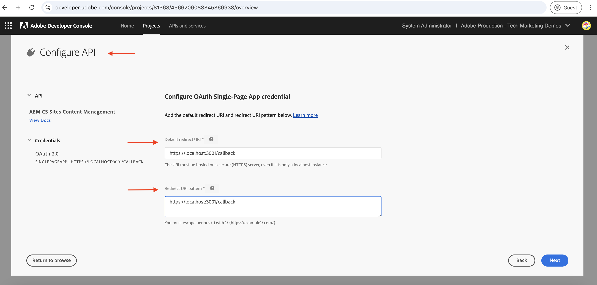

# 使用OAuth单页应用程序调用基于OpenAPI的AEM API

了解如何使用&#x200B;**OAuth单页应用程序身份验证**&#x200B;在AEM as a Cloud Service上调用基于OpenAPI的AEM API。 它遵循用于单页应用程序(SPA)中基于用户的身份验证的OAuth 2.0 PKCE（代码交换的Proof Key）流程。

OAuth单页面应用程序身份验证非常适用于在浏览器中运行的基于JavaScript的应用程序。 无论客户是缺少后端服务器，还是需要获取访问令牌以代表用户与AEM API交互。

PKCE流扩展了OAuth 2.0 _authorization_code_&#x200B;授权类型，通过阻止授权代码拦截增强了安全性。 有关详细信息，请参阅[OAuth服务器到服务器与Web应用程序与单页应用程序凭据的区别](../overview.md#difference-between-oauth-server-to-server-vs-web-app-vs-single-page-app-credentials)部分。

## 你将学到的内容{#what-you-learn}

在本教程中，您将学习如何：

- 将Adobe Developer Console (ADC)项目配置为使用&#x200B;_OAuth单页应用程序_&#x200B;身份验证或通常称为&#x200B;_OAuth 2.0 PKCE流_&#x200B;访问基于OpenAPI的AEM API。

- 在自定义SPA中实施OAuth单页面应用程序身份验证流程。
   - IMS用户身份验证和应用程序授权。
   - 使用OAuth 2.0 PKCE流程访问令牌检索。
   - 使用访问令牌可调用基于OpenAPI的AEM API。

开始之前，请确保已查看以下内容：

- [访问Adobe API和相关概念](../overview.md#accessing-adobe-apis-and-related-concepts)部分。
- [设置基于OpenAPI的AEM API](../setup.md)文章。

## WKND SPA概述和功能流{#wknd-spa-overview-and-functional-flow}

让我们探索什么是WKND SPA，它是如何构建的，以及它如何运行。

WKND SPA是一个基于&#x200B;**React的单页应用程序**，它演示了如何安全地获取特定于用户的访问令牌并直接从客户端与AEM API交互。 它通过Adobe IMS实施OAuth 2.0 PKCE身份验证流程，并与两个关键AEM API集成：

1. **站点API**：用于访问内容片段模型
1. **Assets API**：用于管理DAM文件夹

Adobe Developer Console (ADC)项目配置为启用OAuth单页应用程序身份验证，提供启动该OAuth 2.0 PKCE流所需的&#x200B;**client_id**。

>[!IMPORTANT]
>
>ADC项目未提供&#x200B;_client_secret_。 SPA而是生成&#x200B;_code_verifier_&#x200B;和&#x200B;_code_challenge_，以安全地交换&#x200B;_访问令牌_&#x200B;的授权代码。 它无需在客户端存储客户端密钥，增强了安全性。


>[!VIDEO](https://video.tv.adobe.com/v/3456964?quality=12&learn=on)


下图说明了WKND SPA _获取特定于用户的访问令牌以调用基于OpenAPI的AEM API_&#x200B;的功能流：


1. SPA通过授权请求将用户定向到Adobe Identity Management System (IMS)来启动身份验证流程。
1. 作为授权请求的一部分，SPA将按照OAuth 2.0 PKCE流程将&#x200B;_client_id_、_redirect_uri_&#x200B;和&#x200B;_code_challenge_&#x200B;发送到IMS。 SPA生成一个随机&#x200B;_code_verifier_，使用SHA-256对其进行哈希处理，Base64对结果编码以创建&#x200B;_code_challenge_。
1. IMS对用户进行身份验证，在成功身份验证后，发出&#x200B;_authorization_code_，通过&#x200B;_redirect_uri_&#x200B;发送回SPA。
1. SPA通过向IMS令牌端点发送POST请求来交换&#x200B;_访问令牌_&#x200B;的&#x200B;_authorization_code_。 它在验证先前发送的&#x200B;_code_challenge_&#x200B;的请求中包含了&#x200B;_code_verifier_。 这样可以确保授权请求（步骤2）和令牌请求（步骤4）链接到相同的身份验证流，从而防止拦截攻击。
1. IMS验证&#x200B;_code_verifier_&#x200B;并返回特定于用户的&#x200B;_访问令牌_。
1. SPA在对AEM的API请求中包含&#x200B;_访问令牌_，以验证和检索用户特定内容。

WKND SPA是基于[React](https://react.dev/)的应用程序，它使用[React上下文](https://react.dev/reference/react/createContext)进行身份验证状态管理，[React路由器](https://reactrouter.com/home)进行导航。

其他SPA框架(如Angular、Vue或vanilla JavaScript)可用于创建与Adobe API集成的SPA，具体方法请参见本教程中所述。

## 如何使用本教程{#how-to-use-this-tutorial}

您可以通过两种方式学习本教程：

- [查看SPA密钥代码片段](#review-spa-key-code-snippets)：了解OAuth单页应用程序身份验证流程，并探索WKND SPA中的密钥API调用实施。
- [设置并运行SPA](#setup-and-run-the-spa)：按照分步说明在本地计算机上配置和运行WKND SPA。

选择最适合您需求的路径！

## 查看SPA关键代码片段{#review-spa-key-code-snippets}

让我们深入了解WKND SPA中的关键代码片段，这些代码片段演示了如何：

- 使用OAuth单页应用程序身份验证流程获取特定于用户的访问令牌。

- 直接从客户端调用基于OpenAPI的AEM API。

这些代码片段可帮助您了解SPA中的身份验证过程和API交互。

### 下载SPA代码{#download-the-spa-code}

1. 下载[WKND SPA和AEM API — 演示应用程序](../assets/spa/wknd-spa-with-aemapis-demo.zip) zip文件并将其解压缩。

1. 导航到提取的文件夹，并在您最喜爱的代码编辑器中打开`.env.example`文件。 查看所需的配置参数。

   ```plaintext
   ########################################################################
   # Adobe IMS, Adobe Developer Console (ADC), and AEM as a Cloud Service Information
   ########################################################################
   # Adobe IMS OAuth endpoints
   REACT_APP_ADOBE_IMS_AUTHORIZATION_ENDPOINT=https://ims-na1.adobelogin.com/ims/authorize/v2
   REACT_APP_ADOBE_IMS_TOKEN_ENDPOINT=https://ims-na1.adobelogin.com/ims/token/v3
   
   # Adobe Developer Console (ADC) Project's OAuth Single-Page App credential
   REACT_APP_ADC_CLIENT_ID=<ADC Project OAuth Single-Page App credential ClientID>
   REACT_APP_ADC_SCOPES=<ADC Project OAuth Single-Page App credential Scopes>
   
   # AEM Assets Information
   REACT_APP_AEM_ASSET_HOSTNAME=<AEMCS Hostname, e.g., https://author-p63947-e1502138.adobeaemcloud.com/>
   
   ################################################
   # Single Page Application Information
   ################################################
   
   # Enable HTTPS for local development
   HTTPS=true
   PORT=3001
   
   # SSL Certificate and Key for local development 
   SSL_CRT_FILE=./ssl/server.crt
   SSL_KEY_FILE=./ssl/server.key
   
   # The URL to which the user will be redirected after the OAuth flow is complete
   REACT_APP_REDIRECT_URI=https://localhost:3000/callback
   ```

   您需要使用Adobe Developer Console (ADC)项目和AEM as a Cloud Service Assets实例中的实际值替换占位符。

### IMS用户身份验证和SPA授权{#ims-user-authentication-and-spa-authorization}

让我们探索用于处理IMS用户身份验证和SPA授权的代码。 要检索内容片段模型和DAM文件夹，用户必须使用Adobe IMS进行身份验证，并授予WKND SPA权限以代表他们访问AEM API。

在初始登录期间，系统会提示用户提供同意，以允许WKND SPA安全访问所需的资源。


1. 在`src/context/IMSAuthContext.js`文件中，`login`函数启动IMS用户身份验证和应用程序授权流程。 它生成一个随机`code_verifier`和`code_challenge`以安全地交换`code`作为访问令牌。 `code_verifier`存储在本地存储中供以后使用。 如前所述，SPA不存储或使用`client_secret`，它会动态生成一个，并分两个步骤使用它：`authorize`和`token`请求。

   ```javascript
   ...
   const login = async () => {
       try {
           const codeVerifier = generateCodeVerifier();
           const codeChallenge = generateCodeChallenge(codeVerifier);
   
           localStorage.setItem(STORAGE_KEYS.CODE_VERIFIER, codeVerifier);
   
           const params = new URLSearchParams(
               getAuthParams(AUTH_METHODS.S256, codeChallenge, codeVerifier)
           );
   
           window.location.href = `${
               APP_CONFIG.adobe.ims.authorizationEndpoint //https://ims-na1.adobelogin.com/ims/authorize/v2
           }?${params.toString()}`;
       } catch (error) {
           console.error("Login initialization failed:", error);
           throw error;
       }
   };
   ...
   
   // Generate a random code verifier
   export function generateCodeVerifier() {
       const array = new Uint8Array(32);
       window.crypto.getRandomValues(array);
       const wordArray = CryptoJS.lib.WordArray.create(array);
       return base64URLEncode(wordArray);
   }
   
   // Generate code challenge using SHA-256
   export function generateCodeChallenge(codeVerifier) {
       const hash = CryptoJS.SHA256(codeVerifier);
       return base64URLEncode(hash);
   }
   
   // Get authorization URL parameters
   const getAuthParams = useCallback((method, codeChallenge, codeVerifier) => {
       const baseParams = {
           client_id: APP_CONFIG.adobe.adc.clientId, // ADC Project OAuth Single-Page App credential ClientID
           scope: APP_CONFIG.adobe.adc.scopes, // ADC Project OAuth Single-Page App credential Scopes
           response_type: "code",
           redirect_uri: APP_CONFIG.adobe.spa.redirectUri, // SPA redirect URI https://localhost:3000/callback
           code_challenge_method: method, // S256 or plain
       };
   
       return {
           ...baseParams,
           code_challenge:
               method === AUTH_METHODS.S256 ? codeChallenge : codeVerifier,
           };
   }, []);    
   ...
   ```

   如果用户没有通过Adobe IMS进行身份验证，则会显示Adobe ID登录页面，要求用户进行身份验证。

   如果已经过身份验证，用户将被重定向回使用&#x200B;_authorization_code_&#x200B;的WKND SPA的指定&#x200B;_redirect_uri_。

### 使用OAuth 2.0 PKCE流程访问令牌检索{#access-token-retrieval-using-oauth-20-pkce-flow}

WKND SPA使用&#x200B;_client_id_&#x200B;和&#x200B;_code_verifier_&#x200B;将&#x200B;_authorization_code_&#x200B;与Adobe IMS安全地交换特定于用户的访问令牌。

1. 在`src/context/IMSAuthContext.js`文件中，`exchangeCodeForToken`函数将&#x200B;_authorization_code_&#x200B;交换为特定于用户的访问令牌。

   ```javascript
   ...
   // Handle the callback from the Adobe IMS authorization endpoint
   const handleCallback = async (code) => {
       if (authState.isProcessingCallback) return;
   
       try {
           updateAuthState({ isProcessingCallback: true });
   
           const data = await exchangeCodeForToken(code);
   
           if (data.access_token) {
               handleStorageToken(data.access_token);
               localStorage.removeItem(STORAGE_KEYS.CODE_VERIFIER);
           }
       } catch (error) {
           console.error("Error exchanging code for token:", error);
           throw error;
       } finally {
           updateAuthState({ isProcessingCallback: false });
       }
   };
   
   ...
   // Exchange the authorization code for an access token
   const exchangeCodeForToken = useCallback(async (code) => {
       const codeVerifier = localStorage.getItem(STORAGE_KEYS.CODE_VERIFIER);
   
       if (!codeVerifier) {
           throw new Error("No code verifier found");
       }
   
       //https://ims-na1.adobelogin.com/ims/token/v3
       const response = await fetch(APP_CONFIG.adobe.ims.tokenEndpoint, {
           method: "POST",
           headers: { "Content-Type": "application/x-www-form-urlencoded" },
           body: new URLSearchParams({
               grant_type: "authorization_code",
               client_id: APP_CONFIG.adobe.adc.clientId, // ADC Project OAuth Single-Page App credential ClientID
               code_verifier: codeVerifier, // Code verifier generated during login
               code, // Authorization code received from the IMS
               redirect_uri: `${window.location.origin}/callback`,
           }),
       });
   
       if (!response.ok) {
           throw new Error("Token request failed");
       }
   
       return response.json();
   }, []);
   
   const handleStorageToken = useCallback(
       (token) => {
           if (token) {
               localStorage.setItem(STORAGE_KEYS.ACCESS_TOKEN, token);
               updateAuthState({ isLoggedIn: true, accessToken: token });
           }
       },
       [updateAuthState]
   );
   ...
   ```

   访问令牌存储在浏览器的本地存储中，并用于对AEM API的后续API调用。

### 使用访问令牌访问基于OpenAPI的AEM API{#accessing-openapi-based-aem-apis-using-the-access-token}

WKND SPA使用用户特定的访问令牌来调用内容片段模型和DAM文件夹API端点。

在`src/components/InvokeAemApis.js`文件中，`fetchContentFragmentModels`函数演示如何使用访问令牌从客户端调用基于OpenAPI的AEM API。

```javascript
    ...
  // Fetch Content Fragment Models
  const fetchContentFragmentModels = useCallback(async () => {
    try {
      updateState({ isLoading: true, error: null });
      const data = await makeApiRequest({
        endpoint: `${API_PATHS.CF_MODELS}?cursor=0&limit=10&projection=summary`,
      });
      updateState({ cfModels: data.items });
    } catch (err) {
      updateState({ error: err.message });
      console.error("Error fetching CF models:", err);
    } finally {
      updateState({ isLoading: false });
    }
  }, [makeApiRequest, updateState]);

  // Common API request helper
  const makeApiRequest = useCallback(
    async ({ endpoint, method = "GET", passAPIKey = false, body = null }) => {
    
      // Get the access token from the local storage
      const token = localStorage.getItem("adobe_ims_access_token");
      if (!token) {
        throw new Error("No access token available. Please login again.");
      }

      const headers = {
        Authorization: `Bearer ${token}`,
        "Content-Type": "application/json",
        ...(passAPIKey && { "x-api-key": APP_CONFIG.adobe.adc.clientId }),
      };

      const response = await fetch(
        `${APP_CONFIG.adobe.aem.hostname}${endpoint}`,
        {
          method,
          headers,
          ...(body && { body: JSON.stringify(body) }),
        }
      );

      if (!response.ok) {
        throw new Error(`API request failed: ${response.statusText}`);
      }

      return method === "DELETE" ? null : response.json();
    },
    []
  );
  ...
```

## 设置和运行SPA{#setup-and-run-the-spa}

让我们在本地计算机上配置和运行WKND SPA，以了解OAuth单页面应用程序身份验证流程和API调用。

### 先决条件{#prerequisites}

要完成本教程，您需要：

- 包含以下内容的现代化AEM as a Cloud Service环境：
   - AEM版本`2024.10.18459.20241031T210302Z`或更高版本。
   - 新样式产品配置文件（如果环境是在2024年11月之前创建的）

  有关更多详细信息，请参阅[设置基于OpenAPI的AEM API](../setup.md)文章。

- 必须在其上部署示例[WKND Sites](https://github.com/adobe/aem-guides-wknd?#aem-wknd-sites-project)项目。

- 访问[Adobe Developer Console](https://developer.adobe.com/developer-console/docs/guides/getting-started)。

- 在本地计算机上安装[Node.js](https://nodejs.org/en/)以运行示例NodeJS应用程序。

### 开发步骤{#development-steps}

高级开发步骤包括：

1. 配置ADC项目
   1. 添加Assets和站点API。
   1. 配置OAuth单页面应用程序凭据。
1. 配置AEM实例
   1. 启用ADC项目通信
   1. 通过配置CORS设置，允许SPA访问AEM API。
1. 在本地计算机上配置和运行WKND SPA
1. 验证端到端流量

### 配置ADC项目{#configure-adc-project}

配置ADC项目步骤是&#x200B;_重复_，来自[设置基于OpenAPI的AEM API](../setup.md)。 可重复添加Assets、站点API并将其身份验证方法配置为OAuth单页应用程序。

1. 从[Adobe Developer Console](https://developer.adobe.com/console/projects)中，打开所需的项目。

1. 要添加AEM API，请单击&#x200B;**添加API**&#x200B;按钮。

   

1. 在&#x200B;_添加API_&#x200B;对话框中，按&#x200B;_Experience Cloud_&#x200B;筛选，选择&#x200B;**AEM CS Sites内容管理**&#x200B;卡片，然后单击&#x200B;**下一步**。

   

   >[!TIP]
   >
   >如果所需的&#x200B;**AEM API卡**&#x200B;已禁用，_为什么禁用了此卡？_&#x200B;信息显示&#x200B;**需要许可证**&#x200B;消息，原因之一可能是您没有使您的AEM as a Cloud Service环境现代化，有关详细信息，请参阅[AEM as a Cloud Service环境现代化](../setup.md#modernization-of-aem-as-a-cloud-service-environment)。

1. 接下来，在&#x200B;_配置API_&#x200B;对话框中，选择&#x200B;**用户身份验证**&#x200B;身份验证选项，然后单击&#x200B;**下一步**。

   

1. 在下一个&#x200B;_配置API_&#x200B;对话框中，选择&#x200B;**OAuth单页应用程序**&#x200B;身份验证选项，然后单击&#x200B;**下一步**。

   

1. 在&#x200B;_配置OAuth单页应用程序_&#x200B;对话框中，输入以下详细信息，然后单击&#x200B;**下一步**。
   - 默认重定向URI： `https://localhost:3001/callback`
   - 重定向URI模式： `https://localhost:3001/callback`

   

1. 查看可用的作用域，然后单击&#x200B;**保存配置的API**。

   

1. 重复上述步骤以添加&#x200B;**AEM Assets创作API**。

1. 审查AEM API和身份验证配置。

   

   

### 配置AEM实例以启用ADC项目通信{#configure-aem-instance-to-enable-adc-project-communication}

按照[设置基于OpenAPI的AEM API](../setup.md#configure-the-aem-instance-to-enable-adc-project-communication)文章中的说明配置AEM实例以启用ADC项目通信。

### AEM CORS配置{#aem-cors-configuration}

AEM as a Cloud Service的跨源资源共享(CORS)有助于非AEM Web资产对AEM API进行基于浏览器的客户端调用。

1. 在AEM项目中，从`com.adobe.granite.cors.impl.CORSPolicyImpl~wknd-graphql.cfg.json`文件夹中找到或创建`/ui.config/src/main/content/jcr_root/apps/wknd/osgiconfig/config.author/`文件。

   

1. 将以下配置添加到该文件中。

   ```json
   {
       "alloworigin":[
         ""
       ],
       "alloworiginregexp":[
         "https://localhost:.*",
         "http://localhost:.*"
       ],
       "allowedpaths": [
         "/adobe/sites/.*",
         "/graphql/execute.json.*",
         "/content/_cq_graphql/wknd-shared/endpoint.json",
         "/content/experience-fragments/.*"
       ],
       "supportedheaders": [
         "Origin",
         "Accept",
         "X-Requested-With",
         "Content-Type",
         "Access-Control-Request-Method",
         "Access-Control-Request-Headers",
         "Authorization"
       ],
       "supportedmethods":[
         "GET",
         "HEAD",
         "POST"
       ],
       "maxage:Integer": 1800,
       "supportscredentials": true,
       "exposedheaders":[ "" ]
   }
   ```

1. 提交配置更改并将更改推送到Cloud Manager管道所连接的远程Git存储库。

1. 在Cloud Manager中使用FullStack管道部署上述更改。

### 配置和运行SPA{#configure-and-run-the-spa}

1. 下载[WKND SPA和AEM API — 演示应用程序](../assets/spa/wknd-spa-with-aemapis-demo.zip) zip文件并将其解压缩。

1. 导航到提取的文件夹，并将`.env.example`文件复制到`.env`。

1. 使用Adobe Developer Console (ADC)项目和AEM as a Cloud Service环境中的所需配置参数更新`.env`文件。 例如：

   ```plaintext
   ########################################################################
   # Adobe IMS, Adobe Developer Console (ADC), and AEM as a Cloud Service Information
   ########################################################################
   # Adobe IMS OAuth endpoints
   REACT_APP_ADOBE_IMS_AUTHORIZATION_ENDPOINT=https://ims-na1.adobelogin.com/ims/authorize/v2
   REACT_APP_ADOBE_IMS_TOKEN_ENDPOINT=https://ims-na1.adobelogin.com/ims/token/v3
   REACT_APP_ADOBE_IMS_USERINFO_ENDPOINT=https://ims-na1.adobelogin.com/ims/userinfo/v2
   
   # Adobe Developer Console (ADC) Project's OAuth Single-Page App credential
   REACT_APP_ADC_CLIENT_ID=ddsfs455a4a440c48c7474687c96945d
   REACT_APP_ADC_SCOPES=AdobeID,openid,aem.folders,aem.assets.author,aem.fragments.management
   
   # AEM Assets Information
   REACT_APP_AEM_ASSET_HOSTNAME=https://author-p69647-e1453424.adobeaemcloud.com/
   
   ################################################
   # Single Page Application Information
   ################################################
   
   # Enable HTTPS for local development
   HTTPS=true
   PORT=3001
   
   # SSL Certificate and Key for local development 
   SSL_CRT_FILE=./ssl/server.crt
   SSL_KEY_FILE=./ssl/server.key
   
   # The URL to which the user will be redirected after the OAuth flow is complete
   REACT_APP_REDIRECT_URI=https://localhost:3000/callback
   ```

1. 打开终端并导航到提取的文件夹。 安装所需的依赖项并使用以下命令启动WKND SPA。

   ```bash
   $ npm install
   $ npm start
   ```

### 验证端到端流量{#verify-the-end-to-end-flow}

1. 打开浏览器并导航到`https://localhost:3001`以访问WKND SPA。 接受自签名证书警告。

   

1. 单击&#x200B;**Adobe IMS登录**&#x200B;按钮以启动OAuth单页应用程序身份验证流程。

1. 根据Adobe IMS进行身份验证并提供同意，以允许WKND SPA代表您访问资源。

1. 在成功进行身份验证后，您将被重定向回WKND SPA的`/invoke-aem-apis`路由，并且访问令牌存储在浏览器的本地存储中。

   

1. 从`https://localhost:3001/invoke-aem-apis`路由中，单击&#x200B;**获取内容片段模型**&#x200B;按钮以调用内容片段模型API。 SPA显示内容片段模型的列表。

   

1. 同样，在&#x200B;**Assets — 文件夹API**&#x200B;选项卡中，您可以列出、创建和删除DAM文件夹。

   

1. 在浏览器的开发人员工具中，您可以检查网络请求和响应，以了解API调用。

   

>[!IMPORTANT]
>
>如果经过身份验证的用户缺少列出、创建或删除AEM资源所需的权限，则API调用会失败，并出现403 Forbidden错误。 它确保即使用户经过身份验证并拥有有效的IMS访问令牌，在没有所需权限的情况下也无法访问AEM资源。

### 查看SPA代码{#review-the-spa-code}

让我们回顾一下WKND SPA的高级代码结构和主要入口点。 SPA是使用React框架构建的，并使用React上下文API进行身份验证和状态管理。

1. `src/App.js`文件是WKND SPA的主要入口点。 应用程序组件封装整个应用程序并初始化`IMSAuthProvider`上下文。

1. `src/context/IMSAuthContext.js`创建Adobe IMSAuthContext以便为子组件提供身份验证状态。 它包括login、logout和handleCallback函数，用于启动OAuth单页应用程序身份验证流程。

1. `src/components`文件夹包含各种用于演示对AEM API的API调用的组件。 `InvokeAemApis.js`组件演示如何使用访问令牌调用AEM API。

1. `src/config/config.js`文件从`.env`文件加载环境变量并将其导出以用于应用程序。

1. `src/utils/auth.js`文件包含用于为OAuth 2.0 PKCE流生成代码验证器和代码质询的实用程序函数。

1. `ssl`文件夹包含运行本地SSL HTTP代理的自签名证书和密钥文件。

您可以使用本教程中介绍的方法开发现有SPA或将现有SPA与Adobe API集成。

## 摘要{#summary}

在本教程中，您已了解如何通过OAuth 2.0 PKCE流程从单页应用程序(SPA)中使用基于用户的身份验证，在AEM as a Cloud Service上调用基于OpenAPI的AEM API。

## 其他资源{#additional-resources}

- [Adobe Experience Manager as a Cloud Service API](https://developer.adobe.com/experience-cloud/experience-manager-apis/)
- [用户身份验证实施指南](https://developer.adobe.com/developer-console/docs/guides/authentication/UserAuthentication/implementation)
- [授权请求](https://developer.adobe.com/developer-console/docs/guides/authentication/UserAuthentication/ims#authorize-request)
- [正在获取访问令牌](https://developer.adobe.com/developer-console/docs/guides/authentication/UserAuthentication/ims#fetching-access-tokens)
