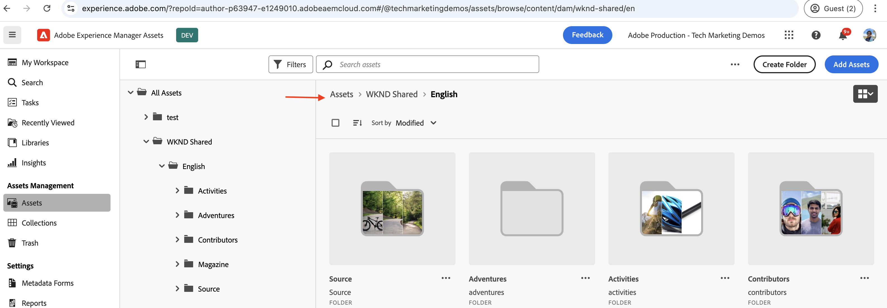

# 使用OAuth Web应用程序身份验证调用基于OpenAPI的AEM API

了解如何使用基于用户的身份验证，从使用OAuth Web应用程序的自定义Web应用程序在AEM as a Cloud Service上调用基于OpenAPI的AEM API。

OAuth Web应用程序身份验证非常适用于具有前端和&#x200B;_后端_&#x200B;组件的Web应用程序，这些组件需要代表用户&#x200B;**访问AEM API**。 它使用OAuth 2.0 _authorization_code_&#x200B;授权类型代表用户获取访问令牌以访问AEM API。 有关详细信息，请参阅[OAuth服务器到服务器与OAuth Web应用程序/单页应用程序凭据之间的区别](../overview.md#difference-between-oauth-server-to-server-and-oauth-web-appsingle-page-app-credentials)。

>[!AVAILABILITY]
>
>基于OpenAPI的AEM API作为早期访问计划的一部分提供。 如果您有兴趣访问它们，我们建议您通过电子邮件向[aem-apis@adobe.com](mailto:aem-apis@adobe.com)发送用例说明。

## 您学到的内容{#what-you-learn}

在本教程中，您将学习如何：

- 配置Adobe Developer Console (ADC)项目以使用&#x200B;_OAuth Web App_&#x200B;身份验证访问Assets创作API。

- 在自定义Web应用程序中实施OAuth Web应用程序身份验证流程。
   - IMS用户身份验证和应用程序授权。
   - 用户特定的访问令牌检索。
   - 使用特定于用户的访问令牌访问基于OpenAPI的AEM API。

开始之前，请确保已查看以下内容：

- [访问Adobe API和相关概念](../overview.md#accessing-adobe-apis-and-related-concepts)部分。
- [设置基于OpenAPI的AEM API](../setup.md)文章。

## 示例Web应用程序：WKND-PIM概述和功能流程

让我们了解一下示例Web应用程序WKND产品信息管理(PIM)及其功能流程。

WKND PIM应用程序是一个示例Web应用程序，旨在管理存储在AEM as a Cloud Service中的产品属性及其资源元数据。 此示例演示了Web应用程序如何与Adobe API无缝集成，以提供高效、以用户为中心的工作流。

Adobe Developer Console (ADC)项目配置为使用OAuth Web应用程序身份验证访问Assets创作API。 它向WKND-PIM Web应用提供了必要的&#x200B;_client_id_&#x200B;和&#x200B;_client_secret_，以启动&#x200B;_authorization_code_&#x200B;授权流。

>[!VIDEO](https://video.tv.adobe.com/v/3442757?quality=12&learn=on)


下图说明了WKND-PIM Web应用程序&#x200B;_获取用户特定的访问令牌以与Assets创作API交互的功能流程_。


1. Web应用程序通过将用户重定向到Adobe Identity Management System (IMS)进行身份验证来启动该流程。
1. 除了重定向之外，Web应用还将所需的&#x200B;_client_id_&#x200B;和&#x200B;_redirect_uri_&#x200B;传递到IMS。
1. IMS对用户进行身份验证，并使用&#x200B;_authorization_code_&#x200B;将它们发送回指定的&#x200B;_redirect_uri_。
1. Web应用使用其&#x200B;_client_id_&#x200B;和&#x200B;_client_secret_，将&#x200B;_authorization_code_&#x200B;与IMS交换用户特定的访问令牌。
1. 成功验证后，IMS会发出特定于用户的&#x200B;_访问令牌_。
1. Web应用安全地使用&#x200B;_访问令牌_&#x200B;与Assets创作API交互，使用户能够检索或更新产品资源元数据。

WKND-PIM Web应用程序是使用[Node.js](https://nodejs.org/en)和[Express](https://expressjs.com/)开发的。 Express充当服务器，可安全地管理私有密钥和特定于用户的访问令牌。

其他Web栈栈（Java、Python、基于.NET等）可用于创建使用本教程中所述的方法与Adobe API集成的Web应用程序。

## 如何使用本教程{#how-to-use-this-tutorial}

您可以[查看Web应用程序密钥代码片段](#review-web-app-key-code-snippets)部分，以了解在WKND-PIM Web应用程序中使用的OAuth Web应用程序身份验证流程和API调用代码片段。 或直接进入[设置并运行Web应用程序](#setup-run-web-app)部分，在本地计算机上设置和运行WKND-PIM Web应用程序，以了解OAuth Web应用程序身份验证流程和API调用。

## 查看Web应用程序密钥代码段{#review-web-app-key-code-snippets}

让我们回顾一下WKND-PIM Web应用程序中使用的关键代码片段，以了解OAuth Web应用程序身份验证流程和API调用。

### 下载WKND-PIM Web应用程序代码

1. 下载[WKND-PIM Web应用程序](../assets/web-app/wknd-pim-demo-web-app.zip) zip文件并将其解压缩。

1. 导航到提取的文件夹，并在您最喜爱的代码编辑器中打开`.env.example`文件。 查看所需的配置参数。

   ```plaintext
   ########################################################################
   # Adobe IMS, Adobe Developer Console (ADC), and AEM Assets Information
   ########################################################################
   # Adobe IMS OAuth endpoints
   ADOBE_IMS_AUTHORIZATION_ENDPOINT=https://ims-na1.adobelogin.com/ims/authorize/v2
   ADOBE_IMS_TOKEN_ENDPOINT=https://ims-na1.adobelogin.com/ims/token/v3
   ADOBE_IMS_USERINFO_ENDPOINT=https://ims-na1.adobelogin.com/ims/userinfo/v2
   
   # Adobe Developer Console (ADC) Project's OAuth Web App credential
   ADC_CLIENT_ID=<ADC Project OAuth Server-to-Server credential ClientID>
   ADC_CLIENT_SECRET=<ADC Project OAuth Server-to-Server credential Client Secret>
   ADC_SCOPES=<ADC Project OAuth Server-to-Server credential Scopes>
   
   # AEM Assets Information
   AEM_ASSET_HOSTNAME=<AEM Assets Hostname, e.g., https://author-p63947-e1502138.adobeaemcloud.com/>
   AEM_ASSET_IDS=< AEM Asset IDs Comma Seperated, e.g., urn:aaid:aem:9f20a8ce-934a-4560-8720-250e529fbb17,urn:aaid:aem:6e0123cd-8a67-4d1f-b721-1b3da987d831>
   
   ################################################
   # Web App Information
   ################################################
   # The port number on which this server (web app) will run
   PORT = 3000
   
   # The URL to which the user will be redirected after the OAuth flow is complete
   REDIRECT_URI=https://localhost:3001/callback
   
   # The Express (express-session) uses this secret to encrypt and verify the authenticity of that cookie
   EXPRESS_SESSION_SECRET=<Express Session Secret>
   ```

   您需要使用Adobe Developer Console (ADC)项目和AEM as a Cloud Service Assets实例中的实际值替换占位符。

### IMS用户身份验证和应用程序授权

让我们查看启动IMS用户身份验证和应用程序授权的代码。 要查看或更新资源元数据，用户必须根据Adobe IMS进行身份验证，并授权WKND-PIM Web应用程序代表他们访问Assets创作API。

在首次登录尝试时，用户必须提供同意以允许WKND-PIM Web应用程序代表他们访问Assets创作API。


1. `routes/update-product-attributes.js`文件验证用户的[快速会话](https://www.npmjs.com/package/express-session)是否具有访问令牌。 如果没有，它将用户重定向到`/auth`路由。

   ```javascript
   ...
   // The update-product-attributes route, shows the product attributes form with tabs
   router.get("/update-product-attributes", async (req, res) => {
     // Check if the user is authenticated, if not redirect to the auth route
     if (!req.session.accessToken) {
         return res.redirect("/auth");
     }
     ...
   });
   ```

1. 在`routes/adobe-ims-auth.js`文件中，`/auth`路由启动IMS用户身份验证和应用程序授权流。 请注意传递给Adobe IMS授权端点的&#x200B;_client_id_、_redirect_uri_&#x200B;和&#x200B;_response_type_&#x200B;参数。

   ```javascript
   ...
   // Route to initiate Adobe IMS user authentication
   router.get("/auth", (req, res) => {
     // Redirect user to Adobe IMS authorization endpoint
     try {
         // Constructing the authorization URL
         const params = new URLSearchParams({
         client_id: adobeADCConfig.clientId,
         redirect_uri: redirectUri,
         response_type: "code",
         });
   
         // Append scopes if defined in configuration
         if (adobeADCConfig?.scopes) params.append("scope", adobeADCConfig.scopes);
   
         // Redirect user to Adobe IMS authorization URL
         const imsAuthorizationUrl = `${
         adobeIMSConfig.authorizationEndpoint
         }?${params.toString()}`;
   
         res.redirect(imsAuthorizationUrl);
     } catch (error) {
         console.error("Error initiating Adobe IMS authentication:", error);
         res.status(500).send("Unable to initiate authentication");
     }
   });
   ...
   ```

如果用户没有通过Adobe IMS进行身份验证，则会显示Adobe ID登录页面，要求用户进行身份验证。

如果已验证，用户将被重定向回使用&#x200B;_authorization_code_&#x200B;的WKND-PIM Web应用的指定&#x200B;_redirect_uri_。

### 访问令牌检索

WKND-PIM Web应用程序使用ADC项目的OAuth Web应用程序凭据的&#x200B;_client_id_&#x200B;和&#x200B;_client_secret_，将&#x200B;_authorization_code_&#x200B;与Adobe IMS安全交换特定于用户的访问令牌。

在`routes/adobe-ims-auth.js`文件中，`/callback`路由将&#x200B;_authorization_code_&#x200B;与Adobe IMS交换用户特定的访问令牌。

```javascript
...
// Callback route to exchange authorization code for access token
router.get("/callback", async (req, res) => {
  // Extracting authorization code from the query parameters
  const authorizationCode = req.query.code;

  if (!authorizationCode) {
    return res.status(400).send("Missing authorization code");
  }

  // Exchange authorization code for access token
  try {
    // Fetch access token from Adobe IMS token endpoint
    const response = await fetch(adobeIMSConfig.tokenEndpoint, {
      method: "POST",
      headers: {
        "Content-Type": "application/x-www-form-urlencoded",
        Authorization: `Basic ${Buffer.from(
          `${adobeADCConfig.clientId}:${adobeADCConfig.clientSecret}`
        ).toString("base64")}`,
      },
      body: new URLSearchParams({
        code: authorizationCode,
        grant_type: "authorization_code",
      }),
    });

    if (!response.ok) {
      console.error("Failed to fetch access token:", response.statusText);
      return res.status(500).send("Failed to fetch access token");
    }

    const data = await response.json();

    if (!data.access_token) {
      console.error("Access token missing in the response:", data);
      return res.status(500).send("Invalid response from token endpoint");
    }

    // For debugging purposes
    console.log("Access token:", data.access_token);

    // Store the access token in the session
    req.session.accessToken = data.access_token;

    // Redirect user to update product attributes
    res.redirect("/update-product-attributes");
  } catch (error) {
    console.error("Error exchanging authorization code:", error);
    res.status(500).send("Error during token exchange");
  }
});
```

访问令牌存储在[Express会话](https://www.npmjs.com/package/express-session)中，以供后续请求使用Assets创作API。

### 使用访问令牌访问基于OpenAPI的AEM API

WKND-PIM Web应用程序安全地使用特定于用户的访问令牌与Assets创作API交互，使用户能够检索或更新产品资源元数据。

在`routes/invoke-aem-apis.js`文件中，`/api/getAEMAssetMetadata`和`/api/updateAEMAssetMetadata`路由使用访问令牌调用Assets创作API。

```javascript
...
// API Route: Get AEM Asset Metadata
router.get("/api/getAEMAssetMetadata", async (req, res) => {
  const assetId = req.query.assetId;
  const bucketName = getBucketName(aemAssetsConfig.hostname);

  if (!assetId || !bucketName) {
    return res.status(400).json({ error: "Missing AEM Information" });
  }

  // Get the access token from the session
  const accessToken = req.session.accessToken;

  if (!accessToken) {
    return res.status(401).json({ error: "Not Authenticated with Adobe IMS" });
  }

  try {
    const assetMetadata = await invokeGetAssetMetadataAPI(
      bucketName,
      assetId,
      accessToken
    );

    const filteredMetadata = getFilteredMetadata(JSON.parse(assetMetadata));
    res.status(200).json(filteredMetadata);
  } catch (error) {
    console.error("Error getting asset metadata:", error.message);
    res.status(500).json({ error: `Internal Server Error: ${error.message}` });
  }
});

// Helper function to invoke the AEM API to get asset metadata
async function invokeGetAssetMetadataAPI(bucketName, assetId, accessToken) {
  const apiUrl = `https://${bucketName}.adobeaemcloud.com/adobe/assets/${assetId}/metadata`;


  // For debugging purposes
  console.log("API URL:", apiUrl);
  console.log("Access Token:", accessToken);
  console.log("API Key:", adobeADCConfig.clientId);

  try {
    const response = await fetch(apiUrl, {
      method: "GET",
      headers: {
        "If-None-Match": "string",
        "X-Adobe-Accept-Experimental": "1",
        Authorization: `Bearer ${accessToken}`,
        "X-Api-Key": adobeADCConfig.clientId,
      },
    });

    console.log("Response Status:", response.status);

    if (!response.ok) {
      throw new Error(`AEM API Error: ${response.statusText}`);
    }

    return await response.text();
  } catch (error) {
    throw new Error(`Failed to fetch asset metadata: ${error.message}`);
  }
}

// Helper function to filter the metadata properties like pim: and dc:
function getFilteredMetadata(data) {
  if (!data || !data.assetMetadata) {
    throw new Error("Invalid metadata structure received from API");
  }

  const properties = data.assetMetadata;
  return Object.keys(properties).reduce((filtered, key) => {
    if (
      key.startsWith("pim:") ||
      key === "dc:title" ||
      key === "dc:description"
    ) {
      filtered[key] = properties[key];
    }
    return filtered;
  }, {});
}

// API Route: Update AEM Asset Metadata
router.post("/api/updateAEMAssetMetadata", async (req, res) => {
  const { assetId, metadata } = req.body;

  if (!assetId || !metadata || typeof metadata !== "object") {
    return res.status(400).json({ error: "Invalid or Missing Metadata" });
  }

  const bucketName = getBucketName(aemAssetsConfig.hostname);
  if (!bucketName) {
    return res.status(400).json({ error: "Missing AEM Information" });
  }

  const accessToken = req.session.accessToken;
  if (!accessToken) {
    return res.status(401).json({ error: "Not Authenticated with Adobe IMS" });
  }

  try {
    const updatedMetadata = await invokePatchAssetMetadataAPI(
      bucketName,
      assetId,
      metadata,
      accessToken
    );
    res.status(200).json(updatedMetadata);
  } catch (error) {
    console.error("Error updating asset metadata:", error.message);
    res.status(500).json({ error: `Internal Server Error: ${error.message}` });
  }
});

// Helper function to invoke the AEM API to update asset metadata
async function invokePatchAssetMetadataAPI(
  bucketName,
  assetId,
  metadata,
  accessToken
) {
  const apiUrl = `https://${bucketName}.adobeaemcloud.com/adobe/assets/${assetId}/metadata`;
  const headers = {
    "Content-Type": "application/json-patch+json",
    "If-Match": "*",
    "X-Adobe-Accept-Experimental": "1",
    Authorization: `Bearer ${accessToken}`,
    "X-Api-Key": adobeADCConfig.clientId,
  };

  try {
    const response = await fetch(apiUrl, {
      method: "PATCH",
      headers,
      body: JSON.stringify(getTransformedMetadata(metadata)),
    });

    if (!response.ok) {
      throw new Error(`AEM API Error: ${response.statusText}`);
    }

    return await response.json();
  } catch (error) {
    throw new Error(`Failed to update asset metadata: ${error.message}`);
  }
}

// Helper function to transform metadata into JSON Patch format, e.g. [{ op: "add", path: "dc:title", value: "New Title" }]
function getTransformedMetadata(metadata) {
  return Object.keys(metadata).map((key) => ({
    op: "add",
    path: `/${key}`,
    value: metadata[key],
  }));
}
```

基于OpenAPI的AEM API调用是从服务器端（Express中间件）发出的，而不是直接从客户端（浏览器）发出的，以确保安全管理访问令牌且不会向客户端公开。

### 刷新访问令牌

要在访问令牌过期前对其进行刷新，您可以实施刷新令牌流程。 但是，为了简化教程，WKND-PIM Web应用程序不实施刷新令牌流。


>[!TIP]
>
>您可以按照下一部分在本地计算机上尝试WKND-PIM Web应用程序，并获得OAuth Web应用程序身份验证流和API调用的实践体验。

## 设置和运行Web应用程序

让我们在本地计算机上配置和运行WKND-PIM Web应用程序，以了解OAuth Web应用程序身份验证流程和API调用。

### 前提条件

要完成本教程，您需要：

- 包含以下内容的现代化AEM as a Cloud Service环境：
   - AEM版本`2024.10.18459.20241031T210302Z`或更高版本。
   - 新样式产品配置文件（如果环境是在2024年11月之前创建的）

  有关更多详细信息，请参阅[设置基于OpenAPI的AEM API](../setup.md)文章。

- 必须在其上部署示例[WKND Sites](https://github.com/adobe/aem-guides-wknd?#aem-wknd-sites-project)项目。

- 访问[Adobe Developer Console](https://developer.adobe.com/developer-console/docs/guides/getting-started/)。

- 在本地计算机上安装[Node.js](https://nodejs.org/en/)以运行示例NodeJS应用程序。

- 在本地计算机上安装[local-ssl-proxy](https://www.npmjs.com/package/local-ssl-proxy#local-ssl-proxy)，以使用自签名证书创建本地SSL HTTP代理。


### 开发步骤

高级开发步骤包括：

1. 配置ADC项目
   1. 添加Assets创作API
   1. 配置OAuth Web应用程序凭据
1. 配置AEM实例以启用ADC项目通信
1. 在AEM中，创建和应用资源元数据架构
1. 配置和运行WKND-PIM Web应用程序
1. 验证端到端流量

### 配置ADC项目

配置ADC项目步骤是&#x200B;_重复_，来自[设置基于OpenAPI的AEM API](../setup.md)。 请重复添加Assets创作API并将其身份验证方法配置为OAuth Web应用程序。

1. 从[Adobe Developer Console](https://developer.adobe.com/console/projects)中，打开所需的项目。

1. 要添加AEM API，请单击&#x200B;**添加API**&#x200B;按钮。

   

1. 在&#x200B;_添加API_&#x200B;对话框中，按&#x200B;_Experience Cloud_&#x200B;筛选，选择&#x200B;**AEM Assets创作API**&#x200B;卡片，然后单击&#x200B;**下一步**。

   

1. 接下来，在&#x200B;_配置API_&#x200B;对话框中，选择&#x200B;**用户身份验证**&#x200B;身份验证选项，然后单击&#x200B;**下一步**。

   

1. 在下一个&#x200B;_配置API_&#x200B;对话框中，选择&#x200B;**OAuth Web应用程序**&#x200B;身份验证选项，然后单击&#x200B;**下一步**。

   

1. 在&#x200B;_配置OAuth Web应用程序_&#x200B;对话框中，输入以下详细信息，然后单击&#x200B;**下一步**。
   - 默认重定向URI： `https://localhost:3001/callback`
   - 重定向URI模式： `https://localhost:3001/callback`

   

1. 查看可用的作用域，然后单击&#x200B;**保存配置的API**。

   

1. 审查AEM API和身份验证配置。

   

   

### 配置AEM实例以启用ADC项目通信

按照[设置基于OpenAPI的AEM API](../setup.md#configure-the-aem-instance-to-enable-adc-project-communication)文章中的说明配置AEM实例以启用ADC项目通信。

### 创建和应用资源元数据架构

默认情况下，WKND Sites项目没有显示产品属性所需的资产元数据架构。 让我们在AEM实例中创建资源元数据架构并将其应用到资源文件夹。

1. 登录到AEM as a Cloud Service资源实例。 使用[资产视图](https://experienceleague.adobe.com/en/docs/experience-manager-learn/assets/authoring/switch-views)导航到`/content/dam/wknd-shared/en`文件夹。

   

1. 创建&#x200B;**PIM**，并在其中创建&#x200B;**Camping**&#x200B;文件夹，然后在&#x200B;**Camping**&#x200B;文件夹中上传[示例图像](../assets/web-app/camping-gear-imgs.zip)。

   

接下来，让我们创建特定于PIM属性的元数据架构，并将其应用于&#x200B;**PIM**&#x200B;文件夹。

1. 从左边栏导航到&#x200B;**设置** > **元数据Forms**&#x200B;选项，然后单击&#x200B;**创建**&#x200B;按钮。

1. 在&#x200B;**创建元数据表单**&#x200B;对话框中，输入以下详细信息，然后单击&#x200B;**创建**。
   - 名称：`PIM`
   - 将现有的表单结构用作模板： `Check`
   - 选择自： `default`

   

1. 单击&#x200B;**+**&#x200B;图标以添加新的&#x200B;**PIM**&#x200B;选项卡并向其中添加&#x200B;**单行文本**&#x200B;组件。 元数据属性名称应以`pim:`前缀开头。

   

   | 标签 | 占位符 | 元数据属性 |
   | --- | --- | --- |
   | SKU | 输入SKU ID | `pim:sku` |
   | 产品类型 | 例如，背包、帐篷、夹克 | `pim:productType` |
   | 产品类别 | 例如，露营、远足、攀岩 | `pim:productCategory` |
   | 制造商 | 输入制造商名称 | `pim:manufacturer` |
   | 模型 | 输入模型名称 | `pim:model` |
   | 品牌名称 | 输入品牌名称 | `pim:brandName` |

1. 单击&#x200B;**保存**&#x200B;和&#x200B;**关闭**&#x200B;以保存元数据表单。

1. 最后，将&#x200B;**PIM**&#x200B;元数据架构应用于&#x200B;**PIM**&#x200B;文件夹。

   

通过以上步骤，**PIM**&#x200B;文件夹中的资源已准备好存储产品属性元数据。

### 配置和运行WKND-PIM Web应用程序

1. 下载[WKND-PIM Web应用程序](../assets/web-app/wknd-pim-demo-web-app.zip) zip文件并将其解压缩。

1. 导航到提取的文件夹，并将`.env.example`文件复制到`.env`。

1. 使用Adobe Developer Console (ADC)项目和AEM as a Cloud Service Assets实例中的所需配置参数更新`.env`文件。

   ```plaintext
   ########################################################################
   # Adobe IMS, Adobe Developer Console (ADC), and AEM Assets Information
   ########################################################################
   # Adobe IMS OAuth endpoints
   ADOBE_IMS_AUTHORIZATION_ENDPOINT=https://ims-na1.adobelogin.com/ims/authorize/v2
   ADOBE_IMS_TOKEN_ENDPOINT=https://ims-na1.adobelogin.com/ims/token/v3
   ADOBE_IMS_USERINFO_ENDPOINT=https://ims-na1.adobelogin.com/ims/userinfo/v2
   
   # Adobe Developer Console (ADC) Project OAuth Web App credential
   ADC_CLIENT_ID=e1adsfsd59384320bbe4f9298f00b7ab
   ADC_CLIENT_SECRET=p8e-Mdfgfdsg43RHugVRTEOyWlmEU5m
   ADC_SCOPES=AdobeID,openid,aem.folders,aem.assets.author
   
   # AEM Assets Information
   AEM_ASSET_HOSTNAME=https://author-p3947-e1542138.adobeaemcloud.com/
   AEM_ASSET_IDS=urn:aaid:aem:aa689a9f-04da-4fbb-b460-74a5b6a69090,urn:aaid:aem:e4fdb6f6-1007-4e84-9726-a9522931786a
   
   ################################################
   # Web App Information
   ################################################
   # The port number on which this server (web app) will run
   PORT = 3000
   
   # The URL to which the user will be redirected after the OAuth flow is complete
   REDIRECT_URI=http://localhost:3000/auth/callback
   
   # The Express (express-session) uses this secret to encrypt and verify the authenticity of that cookie
   # For demonstration purposes, this is a simple secret. In production, you should use a strong secret
   EXPRESS_SESSION_SECRET=1234554321
   ```

   `AEM_ASSET_IDS`是&#x200B;**Camping**&#x200B;文件夹中已上传图像的`jcr:uuid`属性值。 有关更多详细信息，请参阅此[部分](./invoke-api-using-oauth-s2s.md#review-the-api)。

1. 打开终端并导航到提取的文件夹。 使用以下命令安装所需的依赖项。

   ```bash
   $ npm install
   ```

1. 使用以下命令启动WKND-PIM Web应用程序。

   ```bash
   $ npm start
   ```

1. 使用以下命令运行本地SSL HTTP代理。

   ```bash
   $ local-ssl-proxy --source 3001 --target 3000 --cert ./ssl/server.crt --key ./ssl/server.key
   ```

   本地SSL HTTP代理用于IMS要求重定向URI为HTTPS。

### 验证端到端流量

1. 打开浏览器并导航到`https://localhost:3001`以访问WKND-PIM Web应用。 接受自签名证书警告。

   

1. 单击&#x200B;**立即尝试**&#x200B;以查看和更新产品属性元数据。 它会启动IMS用户身份验证和应用程序授权流程。

1. 使用您的Adobe ID凭据登录，并提供允许WKND-PIM Web应用程序代表您访问Assets创作API的同意。

1. 从`https://localhost:3001/update-product-attributes`路由/页面中，单击&#x200B;**AEM资产属性**&#x200B;选项卡。 从&#x200B;**资源ID**&#x200B;下拉列表中，选择一个资源ID以查看资源元数据。

   

1. 更新资源元数据，然后单击&#x200B;**更新AEM资源属性**&#x200B;以更新资源元数据。

   

>[!IMPORTANT]
>
>如果经过身份验证的用户缺少查看或更新资源元数据的必要权限，则基于OpenAPI的AEM API将返回403禁止错误。 它确保即使用户经过身份验证并拥有有效的IMS访问令牌，在没有所需权限的情况下也无法访问AEM资源。


### 查看应用程序代码

让我们回顾一下WKND-PIM Web应用程序的高级代码结构和主要入口点。 该应用程序使用Node.js + Express进行开发。

1. `app.js`是应用程序的主要入口点。 它会初始化Express应用程序、设置会话并装载路由。

1. `public`文件夹包含CSS、JavaScript和图像等静态资源。 `script.js`文件包含用于与Express `/api/getAEMAssetMetadata`和`/api/updateAEMAssetMetadata`路由交互的客户端JavaScript代码。

1. `routes`文件夹包含快速路由：
   1. `index.js`：呈现主页的主路由。
   1. `update-product-attributes.js`：呈现带选项卡的产品属性表单的路由，也验证访问令牌的快速会话。
   1. `adobe-ims-auth.js`：启动Adobe IMS用户身份验证和应用程序授权流的路由。
   1. `invoke-aem-apis.js`：使用特定于用户的访问令牌调用基于OpenAPI的AEM API的路由。

1. `views`文件夹包含用于呈现HTML页面的EJS模板。

1. `utils`文件夹包含实用工具功能。

1. `ssl`文件夹包含运行本地SSL HTTP代理的自签名证书和密钥文件。

您可以使用其他服务器端技术（如Java、Python或.NET）开发现有的Web应用程序或将其与Adobe API集成。

## 摘要

在本教程中，您已了解如何使用OAuth Web应用程序身份验证，从自定义Web应用程序在AEM as a Cloud Service上调用基于OpenAPI的AEM API。 您已查看WKND-PIM Web应用程序中使用的关键代码片段，以了解OAuth Web应用程序身份验证流程。

可参考参考本教程，将基于OpenAPI的AEM API与您的自定义Web应用程序集成，以提供高效、以用户为中心的工作流。

## 其他资源

- [用户身份验证实施指南](https://developer.adobe.com/developer-console/docs/guides/authentication/UserAuthentication/implementation/)
- [授权请求](https://developer.adobe.com/developer-console/docs/guides/authentication/UserAuthentication/IMS/#authorize-request)
- [正在获取访问令牌](https://developer.adobe.com/developer-console/docs/guides/authentication/UserAuthentication/IMS/#fetching-access-tokens)
- [正在刷新访问令牌](https://developer.adobe.com/developer-console/docs/guides/authentication/UserAuthentication/IMS/#refreshing-access-tokens)

