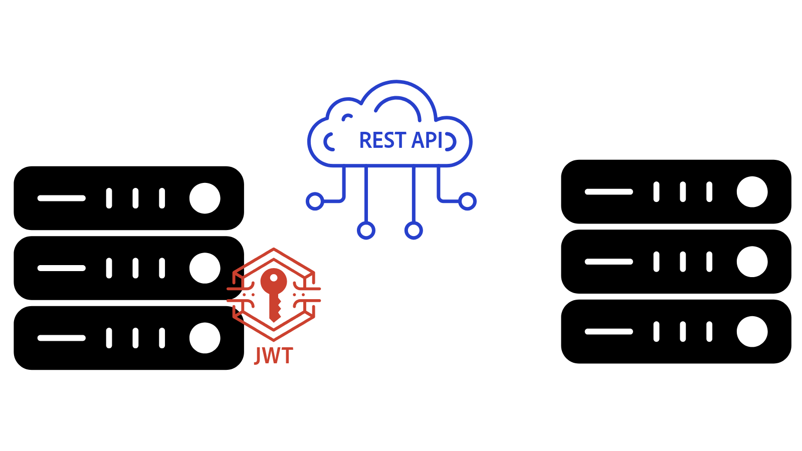

# AEM API概述{#aem-apis-overview}

了解Adobe Experience Manager (AEM)中不同类型的API，并了解为您的集成选择哪个API。

要在AEM中创建、读取、更新和删除内容、资源和表单，开发人员可以使用各种API。 开发人员可通过这些API创建与AEM交互的自定义应用程序。

让我们来探索AEM中的各种API类型，并了解为您的集成选择哪种API。

## AEM API的类型{#types-of-aem-apis}

AEM提供以下API以便与其创作和发布服务类型进行交互。

| AEM API类型 | 描述 | 可用性 | 用例 | API示例 |
| --- | --- | --- | --- | --- |
| 基于OpenAPI的AEM API | 适用于Assets、Sites和Forms的机器可读的标准化API。 | **仅限AEM as a Cloud Service** | API优先开发，现代应用程序 | [Assets创作API](https://developer.adobe.com/experience-cloud/experience-manager-apis/api/experimental/assets/author/)、[文件夹API](https://developer.adobe.com/experience-cloud/experience-manager-apis/api/experimental/folders/)、[AEM Sites API](https://developer.adobe.com/experience-cloud/experience-manager-apis/api/experimental/sites/delivery/)、[Forms Acrobat服务](https://developer.adobe.com/experience-cloud/experience-manager-apis/api/experimental/document/)等 |
| RESTful API | 用于与AEM资源交互的传统REST端点。 | AEM 6.X、AEM as a Cloud Service | CRUD操作，现代应用程序 | [Assets HTTP API](https://experienceleague.adobe.com/zh-hans/docs/experience-manager-cloud-service/content/assets/admin/mac-api-assets)、[工作流REST API](https://experienceleague.adobe.com/en/docs/experience-manager-65/content/implementing/developing/extending-aem/extending-workflows/workflows-program-interaction#using-the-workflow-rest-api)、[内容服务的JSON导出程序](https://experienceleague.adobe.com/en/docs/experience-manager-cloud-service/content/implementing/developing/full-stack/components-templates/json-exporter)等 |
| GRAPHQL API | 针对通过灵活查询高效地检索结构化内容进行了优化。 | AEM 6.X、AEM as a Cloud Service | Headless CMS、SPA、移动应用程序 | [GraphQL API](https://experienceleague.adobe.com/en/docs/experience-manager-cloud-service/content/headless/graphql-api/content-fragments) |
| 传统（非RESTful） API | 旧版API，如JCR、Sling模型、查询生成器等。 | AEM 6.X、AEM as a Cloud Service | 旧版集成，向后兼容性 | [查询生成器API](https://experienceleague.adobe.com/en/docs/experience-manager-cloud-service/content/implementing/developing/full-stack/search/query-builder-api)及其他 |

有关更多详细信息，请参阅[Adobe Experience Manager as a Cloud Service API](https://developer.adobe.com/experience-cloud/experience-manager-apis/)页面。

## 要选择的API{#which-api-to-choose}

在为集成选择API时，请考虑以下因素：

- **用例**：确定AEM API是否支持您的用例。 尽可能地，_使用基于OpenAPI的AEM API_，因为它们提供了与AEM交互的标准化现代方法。 如果基于OpenAPI的API不可用，请考虑使用RESTful API或GraphQL API，作为最后手段，使用传统API。

- **兼容性**：确保选定的API与您的AEM版本兼容。 例如，基于&#x200B;_OpenAPI的AEM API专属于AEM as a Cloud Service_，在AEM 6.X中不可用。

- **AEM服务类型：创作与发布**：API的选择还取决于它是在Author还是Publish服务上运行，因为它们的访问模型不同。 AEM Author服务用于创建内容，并且始终需要身份验证。 AEM Publish服务用于内容交付，并且可能不需要身份验证，具体取决于用例。

- **身份验证**：验证API是否支持您计划使用的身份验证方法。 例如：
   - **基于OpenAPI的AEM API**：支持OAuth 2.0身份验证，包括客户端凭据（服务器到服务器）、授权代码（Web应用程序）和代码交换（单页应用程序）授权类型的验证密钥。 其他AEM API不支持OAuth 2.0身份验证。
   - **RESTful API**：支持JSON Web令牌(JWT)身份验证，也称为基于令牌的身份验证。

## JSON Web令牌(JWT)和OAuth 2.0之间的区别{#difference-between-jwt-and-oauth}

让我们比较JSON Web令牌(JWT)和OAuth 2.0，AEM API中使用的两种常见身份验证机制：

| 功能 | JSON Web令牌(JWT) | OAuth 2.0 |
| --- | --- | --- |
| 使用位置 | RESTful API | 基于OpenAPI的AEM API（在RESTful或其他API中不支持） |
| 用途 | 服务身份验证 | 用户或服务身份验证 |
| 用户交互 | 无需用户交互 | 授权代码和单页应用程序授予类型所需的用户交互 |
| 最适合 | 服务器到服务器API调用 | 应用程序和用户的安全、允许的访问 |
| 所需信息 | 用于签署JWT的私钥 | OAuth 2.0的客户端ID和客户端密钥 |
| 令牌过期 | 短期，通常需要更新 | 访问令牌的生命周期短。 刷新令牌的生命周期长，用于获取新的访问令牌 |
| 凭据管理 | [AEM Developer Console](https://experienceleague.adobe.com/en/docs/experience-manager-learn/cloud-service/debugging/debugging-aem-as-a-cloud-service/developer-console) | [Adobe Developer Console](https://developer.adobe.com/developer-console/) |

## 基于OpenAPI的AEM API

在[基于OpenAPI的AEM API](./openapis/overview.md)指南中了解有关基于OpenAPI的Adobe API以及访问AEM API的重要概念的更多信息。

### 用例

<!-- CARDS
{target = _self}

* ./openapis/use-cases/invoke-api-using-oauth-s2s.md
  {title = Invoke API using Server-to-Server authentication}
  {description = Learn how to invoke OpenAPI-based AEM APIs from a custom NodeJS application using OAuth Server-to-Server authentication.}
  {image = ./openapis/assets/s2s/OAuth-S2S.png}
* ./openapis/use-cases/invoke-api-using-oauth-web-app.md
  {title = Invoke API using Web App authentication}
  {description = Learn how to invoke OpenAPI-based AEM APIs from a custom web application using OAuth Web App authentication.}
  {image = ./openapis/assets/web-app/OAuth-WebApp.png} 
* ./openapis/use-cases/invoke-api-using-oauth-single-page-app.md
  {title = Invoke API using OAuth Single Page App}
  {description = Learn how to invoke OpenAPI-based AEM APIs from a custom Single Page App (SPA) using OAuth 2.0 PKCE flow.}
  {image = ./openapis/assets/spa/OAuth-SPA.png}
-->
<!-- START CARDS HTML - DO NOT MODIFY BY HAND -->

    

        

            

                <figure class="image x-is-16by9">
                    
                </figure>
            

            

                

                    

                        <a href="./openapis/use-cases/invoke-api-using-oauth-s2s.md" target="_self" rel="referrer" title="使用服务器到服务器身份验证调用API">使用服务器到服务器身份验证调用API</a>
                    

                    
了解如何使用OAuth服务器到服务器身份验证从自定义NodeJS应用程序调用基于OpenAPI的AEM API。

                

                <a href="./openapis/use-cases/invoke-api-using-oauth-s2s.md" target="_self" rel="referrer" class="spectrum-Button spectrum-Button--outline spectrum-Button--primary spectrum-Button--sizeM" style="align-self: flex-start; margin-top: 1rem;">
                    了解详情
                </a>
            

        

    

    

        

            

                <figure class="image x-is-16by9">
                    
                </figure>
            

            

                

                    

                        <a href="./openapis/use-cases/invoke-api-using-oauth-web-app.md" target="_self" rel="referrer" title="使用Web应用程序身份验证调用API">使用Web应用程序身份验证调用API</a>
                    

                    
了解如何使用OAuth Web应用程序身份验证，从自定义Web应用程序调用基于OpenAPI的AEM API。

                

                <a href="./openapis/use-cases/invoke-api-using-oauth-web-app.md" target="_self" rel="referrer" class="spectrum-Button spectrum-Button--outline spectrum-Button--primary spectrum-Button--sizeM" style="align-self: flex-start; margin-top: 1rem;">
                    了解详情
                </a>
            

        

    

    

        

            

                <figure class="image x-is-16by9">
                    
                </figure>
            

            

                

                    

                        <a href="./openapis/use-cases/invoke-api-using-oauth-single-page-app.md" target="_self" rel="referrer" title="使用OAuth单页应用程序调用API">使用OAuth单页应用程序调用API</a>
                    

                    
了解如何使用OAuth 2.0 PKCE流程从自定义单页应用程序(SPA)调用基于OpenAPI的AEM API。

                

                <a href="./openapis/use-cases/invoke-api-using-oauth-single-page-app.md" target="_self" rel="referrer" class="spectrum-Button spectrum-Button--outline spectrum-Button--primary spectrum-Button--sizeM" style="align-self: flex-start; margin-top: 1rem;">
                    了解详情
                </a>
            

        

    

<!-- END CARDS HTML - DO NOT MODIFY BY HAND -->

## GraphQL API — 示例

在[AEM Headless快速入门 — GraphQL](https://experienceleague.adobe.com/en/docs/experience-manager-learn/getting-started-with-aem-headless/graphql/overview)中了解有关GraphQL API以及如何使用它们的更多信息

### 用例

<!-- CARDS
{target = _self}

* https://experienceleague.adobe.com/en/docs/experience-manager-learn/getting-started-with-aem-headless/deployments/spa#example-single-page-app
  {title = Single Page Application (SPA)}
  {description = Learn how to build a Single Page Application (SPA) that fetches content from AEM using GraphQL APIs.}
  {image = ./assets/react-app-card.png}
* https://experienceleague.adobe.com/en/docs/experience-manager-learn/getting-started-with-aem-headless/deployments/mobile#example-mobile-apps
  {title = Mobile App}
  {description = Learn how to build a mobile app that fetches content from AEM using GraphQL APIs.}
  {image = ./assets/ios-app-card.png}
* https://experienceleague.adobe.com/en/docs/experience-manager-learn/getting-started-with-aem-headless/deployments/web-component#example-web-component
  {title = Web Component}
  {description = Learn how to build a web component that fetches content from AEM using GraphQL APIs.}
  {image = ./assets/web-component-card.png}
-->
<!-- START CARDS HTML - DO NOT MODIFY BY HAND -->

    

        

            

                <figure class="image x-is-16by9">
                    
                </figure>
            

            

                

                    

                        <a href="https://experienceleague.adobe.com/en/docs/experience-manager-learn/getting-started-with-aem-headless/deployments/spa#example-single-page-app" target="_self" rel="referrer" title="单页应用程序(SPA)">单页应用程序(SPA)</a>
                    

                    
了解如何使用GraphQL API构建可从AEM中提取内容的单页应用程序(SPA)。

                

                <a href="https://experienceleague.adobe.com/en/docs/experience-manager-learn/getting-started-with-aem-headless/deployments/spa#example-single-page-app" target="_self" rel="referrer" class="spectrum-Button spectrum-Button--outline spectrum-Button--primary spectrum-Button--sizeM" style="align-self: flex-start; margin-top: 1rem;">
                    了解详情
                </a>
            

        

    

    

        

            

                <figure class="image x-is-16by9">
                    
                </figure>
            

            

                

                    

                        <a href="https://experienceleague.adobe.com/en/docs/experience-manager-learn/getting-started-with-aem-headless/deployments/mobile#example-mobile-apps" target="_self" rel="referrer" title="移动应用程序">移动应用</a>
                    

                    
了解如何使用GraphQL API构建可从AEM获取内容的移动应用程序。

                

                <a href="https://experienceleague.adobe.com/en/docs/experience-manager-learn/getting-started-with-aem-headless/deployments/mobile#example-mobile-apps" target="_self" rel="referrer" class="spectrum-Button spectrum-Button--outline spectrum-Button--primary spectrum-Button--sizeM" style="align-self: flex-start; margin-top: 1rem;">
                    了解详情
                </a>
            

        

    

    

        

            

                <figure class="image x-is-16by9">
                    
                </figure>
            

            

                

                    

                        <a href="https://experienceleague.adobe.com/en/docs/experience-manager-learn/getting-started-with-aem-headless/deployments/web-component#example-web-component" target="_self" rel="referrer" title="Web组件">Web组件</a>
                    

                    
了解如何使用GraphQL API构建可从AEM中提取内容的Web组件。

                

                <a href="https://experienceleague.adobe.com/en/docs/experience-manager-learn/getting-started-with-aem-headless/deployments/web-component#example-web-component" target="_self" rel="referrer" class="spectrum-Button spectrum-Button--outline spectrum-Button--primary spectrum-Button--sizeM" style="align-self: flex-start; margin-top: 1rem;">
                    了解详情
                </a>
            

        

    

<!-- END CARDS HTML - DO NOT MODIFY BY HAND -->

## RESTful API — 示例

详细了解RESTful API，如[Assets HTTP API](https://experienceleague.adobe.com/zh-hans/docs/experience-manager-cloud-service/content/assets/admin/mac-api-assets)和[JSON导出程序](https://experienceleague.adobe.com/en/docs/experience-manager-cloud-service/content/implementing/developing/full-stack/components-templates/json-exporter)。

### 用例

<!-- CARDS
{target = _self}

* https://experienceleague.adobe.com/en/docs/experience-manager-learn/getting-started-with-aem-headless/content-services/overview
  {title = Invoke API using Server-to-Server authentication}
  {description = Learn how to build a native mobile app that fetches content from AEM using Content Services RESTful APIs.}
  {image = ./assets/RESTful-Content-Service.png}
* https://experienceleague.adobe.com/en/docs/experience-manager-learn/getting-started-with-aem-headless/authentication/overview
  {title = Token-based Authentication for RESTful APIs}
  {description = Learn how to invoke RESTful APIs using JSON Web Token (JWT) authentication.}
  {image = ./assets/RESTful-TokenAuth.png}
-->
<!-- START CARDS HTML - DO NOT MODIFY BY HAND -->

    

        

            

                <figure class="image x-is-16by9">
                    
                </figure>
            

            

                

                    

                        <a href="https://experienceleague.adobe.com/en/docs/experience-manager-learn/getting-started-with-aem-headless/content-services/overview" target="_self" rel="referrer" title="使用服务器到服务器身份验证调用API">使用服务器到服务器身份验证调用API</a>
                    

                    
了解如何使用Content Services RESTful API构建可从AEM中提取内容的本机移动应用程序。

                

                <a href="https://experienceleague.adobe.com/en/docs/experience-manager-learn/getting-started-with-aem-headless/content-services/overview" target="_self" rel="referrer" class="spectrum-Button spectrum-Button--outline spectrum-Button--primary spectrum-Button--sizeM" style="align-self: flex-start; margin-top: 1rem;">
                    了解详情
                </a>
            

        

    

    

        

            

                <figure class="image x-is-16by9">
                    
                </figure>
            

            

                

                    

                        针对RESTful API的<a href="https://experienceleague.adobe.com/en/docs/experience-manager-learn/getting-started-with-aem-headless/authentication/overview" target="_self" rel="referrer" title="针对RESTful API的基于令牌的身份验证">基于令牌的身份验证</a>
                    

                    
了解如何使用JSON Web令牌(JWT)身份验证调用RESTful API。

                

                <a href="https://experienceleague.adobe.com/en/docs/experience-manager-learn/getting-started-with-aem-headless/authentication/overview" target="_self" rel="referrer" class="spectrum-Button spectrum-Button--outline spectrum-Button--primary spectrum-Button--sizeM" style="align-self: flex-start; margin-top: 1rem;">
                    了解详情
                </a>
            

        

    

<!-- END CARDS HTML - DO NOT MODIFY BY HAND -->

