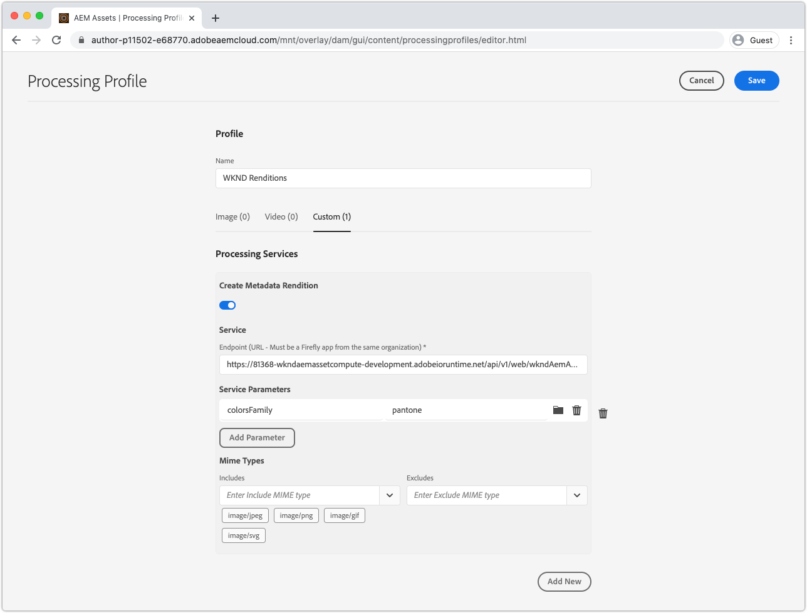
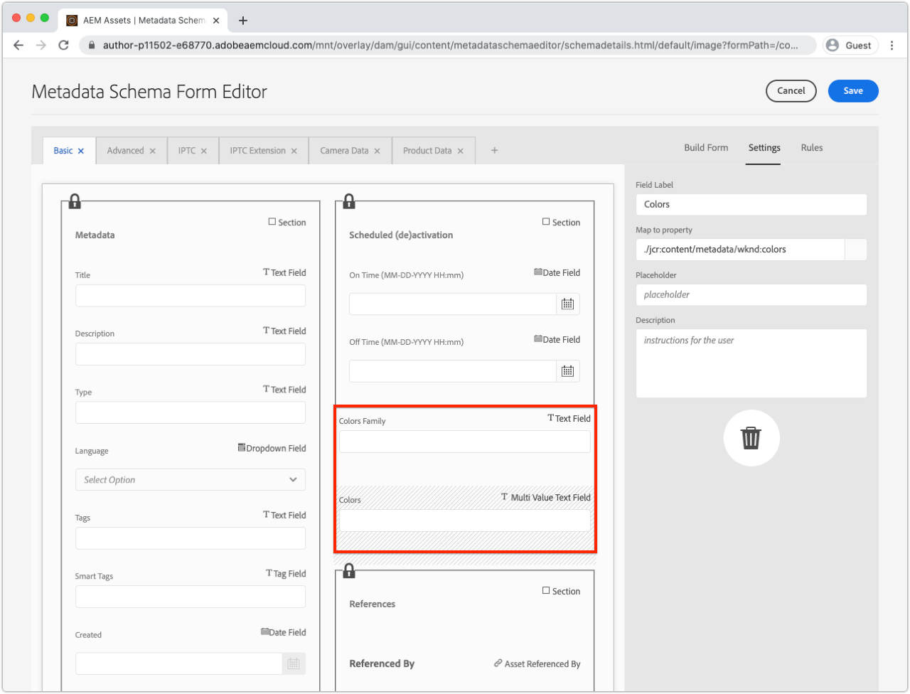

# 开发Asset compute元数据工作程序

自定义Asset compute工作进程可以生成发送回AEM的XMP (XML)数据，并将其作为元数据存储在资源上。

常见用例包括：

+ 与第三方系统(如PIM （产品信息管理系统）)的集成，在这些第三方系统中，必须检索其他元数据并将其存储在资源上
+ 与Adobe服务（例如Content and Commerce AI）集成，通过其他机器学习属性来增强资产元数据
+ 从资产的二进制文件中获取有关资产的元数据，并将其存储为AEMas a Cloud Service中的资产元数据

## 您将做什么

>[!VIDEO](https://video.tv.adobe.com/v/327313?quality=12&learn=on)

在本教程中，我们将创建一个Asset compute元数据工作程序，该程序可派生图像资源中最常用的颜色，并将这些颜色的名称写回资源的AEM元数据。 虽然工作器本身是基础函数，但本教程将使用该函数来探索如何使用Asset compute工作器将元数据写回AEMas a Cloud Service中的资源。

## asset compute元数据工作程序调用的逻辑流

对Asset compute元数据工作程序的调用与的调用几乎相同 [二进制演绎版生成工作程序](../develop/worker.md)，主要区别在于返回类型是XMP (XML)演绎版，其值也将写入资源的元数据。

asset compute工作程序可在中实施Asset computeSDK工作程序API合同 `renditionCallback(...)` 函数，其概念为：

+ __输入：__ AEM资产的原始二进制文件和处理配置文件参数
+ __输出：__ XMP (XML)演绎版作为演绎版保留在AEM资源中，并保留在资源的元数据中


1. AEM Author服务调用Asset compute元数据工作程序，提供资源的 __(1a)__ 原始二进制文件，和 __(1b)__ 处理配置文件中定义的任何参数。
1. asset computeSDK可协调自定义Asset compute元数据工作程序的执行 `renditionCallback(...)` 函数，基于资产的二进制文件派生XMP (XML)演绎版 __(1a)__ 和任何处理配置文件参数 __(1b)__.
1. asset compute工作进程将XMP (XML)表示形式保存到 `rendition.path`.
1. 写入的XMP (XML)数据 `rendition.path` 通过Asset computeSDK传输到AEM创作服务，并将其公开为 __(4a)__ 文本呈现版本和 __(4b)__ 保留到资源的元数据节点。

## 配置manifest.yml{#manifest}

所有Asset compute工作程序都必须在 [manifest.yml](../develop/manifest.md).

打开项目的 `manifest.yml` 并添加用于配置新工作进程的工作进程条目，在本例中 `metadata-colors`.

_记住 `.yml` 区分空格。_

```
packages:
  __APP_PACKAGE__:
    license: Apache-2.0
    actions: 
      worker:
        function: actions/worker/index.js 
        web: 'yes' 
        runtime: 'nodejs:12'
        limits:
          timeout: 60000 # in ms
          memorySize: 512 # in MB
          concurrency: 10 
        annotations:
          require-adobe-auth: true
      metadata-colors:
        function: actions/metadata-colors/index.js 
        web: 'yes' 
        runtime: 'nodejs:12'
        limits:
          memorySize: 512 # in MB   
```

`function` 指向在中创建的工作程序实施 [下一步](#metadata-worker). 在语义上命名工作人员(例如， `actions/worker/index.js` 也许更适合指名 `actions/rendition-circle/index.js`)，如下所示 [工作人员的URL](#deploy) 并确定 [工作程序的测试包文件夹名称](#test).

此 `limits` 和 `require-adobe-auth` 是按每个工作人员离散配置的。 在这个工人中， `512 MB` 当代码检查（潜在）大的二进制图像数据时，分配存储器的容量。 另一个 `limits` 删除以使用默认值。

## 开发元数据工作程序{#metadata-worker}

在路径下的Asset compute项目中创建新的元数据工作器JavaScript文件 [为新工作进程定义了manifest.yml](#manifest)，位于 `/actions/metadata-colors/index.js`

### 安装npm模块

安装额外的npm模块([@adobe/asset-compute-xmp](https://www.npmjs.com/package/@adobe/asset-compute-xmp?activeTab=versions)， [get-image-colors](https://www.npmjs.com/package/get-image-colors)、和 [color-name](https://www.npmjs.com/package/color-namer))，该Asset compute工作进程中使用了该参数。

```
$ npm install @adobe/asset-compute-xmp
$ npm install get-image-colors
$ npm install color-namer
```

### 元数据工作进程代码

此工作人员看起来与 [节目生成工作程序](../develop/worker.md)的主要区别是，它将XMP (XML)数据写入 `rendition.path` 以保存回AEM。


```javascript
"use strict";

const { worker, SourceCorruptError } = require("@adobe/asset-compute-sdk");
const fs = require("fs").promises;

// Require the @adobe/asset-compute-xmp module to create XMP 
const { serializeXmp } = require("@adobe/asset-compute-xmp");

// Require supporting npm modules to derive image colors from image data
const getColors = require("get-image-colors");
// Require supporting npm modules to convert image colors to color names
const namer = require("color-namer");

exports.main = worker(async (source, rendition, params) => {
  // Perform any necessary source (input) checks
  const stats = await fs.stat(source.path);
  if (stats.size === 0) {
    // Throw appropriate errors whenever an erring condition is met
    throw new SourceCorruptError("source file is empty");
  }
  const MAX_COLORS = 10;
  const DEFAULT_COLORS_FAMILY = 'basic';

  // Read the color family parameter to use to derive the color names
  let colorsFamily = rendition.instructions.colorsFamily || DEFAULT_COLORS_FAMILY;

  if (['basic', 'hex', 'html', 'ntc', 'pantone', 'roygbiv'].indexOf(colorsFamily) === -1) { 
      colorsFamily = DEFAULT_COLORS_FAMILY;
  }
  
  // Use the `get-image-colors` module to derive the most common colors from the image
  let colors = await getColors(source.path, { options: MAX_COLORS });

  // Convert the color Chroma objects to their closest names
  let colorNames = colors.map((color) => getColorName(colorsFamily, color));

  // Serialize the data to XMP metadata
  // These properties are written to the [dam:Asset]/jcr:content/metadata resource
  // This stores
  // - The list of color names is stored in a JCR property named `wknd:colors`
  // - The colors family used to derive the color names is stored in a JCR property named `wknd:colorsFamily`
  const xmp = serializeXmp({
      // Use a Set to de-duplicate color names
      "wknd:colors": [...new Set(colorNames)],
      "wknd:colorsFamily": colorsFamily
    }, {
      // Define any property namespaces used in the above property/value definition
      // These namespaces are automatically registered in AEM if they do not yet exist
      namespaces: {
        wknd: "https://wknd.site/assets/1.0/",
      },
    }
  );

  // Save the XMP metadata to be written back to the asset's metadata node
  await fs.writeFile(rendition.path, xmp, "utf-8");
});

/**
 * Helper function that derives the closest color name for the color, based on the colors family
 * 
 * @param {*} colorsFamily the colors name family to use
 * @param {*} color the color to convert to a name
 */
function getColorName(colorsFamily, color) {
    if ('hex' === colorsFamily) {  return color; }

    let names = namer(color.rgb())[colorsFamily];

    if (names.length >= 1) { return names[0].name; }
}
```

## 在本地运行元数据工作程序{#development-tool}

在工作程序代码完成后，可以使用本地Asset compute开发工具执行该代码。

因为我们的Asset compute项目包含两个工作进程(前一个 [循环演绎版](../develop/worker.md) 以及这个 `metadata-colors` worker)， [asset compute开发工具的](../develop/development-tool.md) 配置文件定义列出了两个工作人员的执行配置文件。 第二个配置文件定义指向新的 `metadata-colors` 工作人员。


1. 从Asset compute项目的根目录
1. 执行 `aio app run` 启动Asset compute开发工具
1. 在 __选择文件……__ 下拉列表，选择 [示例图像](../assets/samples/sample-file.jpg) 待处理
1. 在第二个用户档案定义配置中，它指向 `metadata-colors` 工作人员，更新 `"name": "rendition.xml"` 在此工作线程生成XMP (XML)演绎版时。 （可选）添加 `colorsFamily` 参数（支持的值） `basic`， `hex`， `html`， `ntc`， `pantone`， `roygbiv`)。

   ```json
   {
       "renditions": [
           {
               "worker": "...",
               "name": "rendition.xml",
               "colorsFamily": "pantone"
           }
       ]
   }
   ```

1. 点按 __运行__ 并等待XML演绎版生成
   + 由于这两个工作人员都在用户档案定义中列出，因此将生成这两个演绎版。 （可选）顶部配置文件定义指向 [循环演绎版工作人员](../develop/worker.md) 可删除，以避免从开发工具中执行该操作。
1. 此 __演绎版__ 部分预览生成的解释。 点按 `rendition.xml` 要下载它，请在VS Code（或您喜爱的XML/文本编辑器）中打开它以进行审查。

## 测试工作程序{#test}

可以使用测试元数据工作程序 [与二进制格式副本相同的Asset compute测试框架](../test-debug/test.md). 唯一的区别是 `rendition.xxx` 测试用例中的文件必须是预期的XMP (XML)演绎版。

1. 在Asset compute项目中创建以下结构：

   ```
   /test/asset-compute/metadata-colors/success-pantone/
   
       file.jpg
       params.json
       rendition.xml
   ```

2. 使用 [示例文件](../assets/samples/sample-file.jpg) 作为测试用例的 `file.jpg`.
3. 将以下JSON添加到 `params.json`.

   ```
   {
       "fmt": "xml",
       "colorsFamily": "pantone"
   }
   ```

   请注意 `"fmt": "xml"` 指示测试包生成 `.xml` 基于文本的演绎版。

4. 在中提供所需的XML `rendition.xml` 文件。 这可以通过以下方式获得：
   + 通过开发工具运行测试输入文件并保存（已验证的） XML演绎版。

   ```
   <?xml version="1.0" encoding="UTF-8"?><rdf:RDF xmlns:rdf="http://www.w3.org/1999/02/22-rdf-syntax-ns#" xmlns:wknd="https://wknd.site/assets/1.0/"><rdf:Description><wknd:colors><rdf:Seq><rdf:li>Silver</rdf:li><rdf:li>Black</rdf:li><rdf:li>Outer Space</rdf:li></rdf:Seq></wknd:colors><wknd:colorsFamily>pantone</wknd:colorsFamily></rdf:Description></rdf:RDF>
   ```

5. 执行 `aio app test` 从Asset compute项目的根目录执行所有测试包。

### 将工作人员部署到Adobe I/O Runtime{#deploy}

要从AEM Assets调用此新元数据工作程序，必须使用命令将其部署到Adobe I/O Runtime：

```
$ aio app deploy
```


请注意，这将部署项目中的所有工作程序。 查看 [未删节的部署指令](../deploy/runtime.md) 了解如何部署到暂存和生产工作区。

### 与AEM处理配置文件集成{#processing-profile}

通过创建新或修改现有的自定义处理配置文件服务从AEM调用工作进程，该服务将调用此部署的工作进程。



1. 以AEMas a Cloud Service作者服务的身份登录 __AEM管理员__
1. 导航到 __工具>资产>处理配置文件__
1. __创建__ 新的，或 __编辑__ 和现有，处理配置文件
1. 点按 __自定义__ 选项卡，然后点按 __新增__
1. 定义新服务
   + __创建元数据演绎版__：切换到活动状态
   + __端点：__ `https://...adobeioruntime.net/api/v1/web/wkndAemAssetCompute-0.0.1/metadata-colors`
      + 这是工作人员的URL，获取时间是 [部署](#deploy) 或使用命令 `aio app get-url`. 根据AEMas a Cloud Service环境，确保URL指向正确的工作区。
   + __服务参数__
      + 点按 __添加参数__
         + 键: `colorFamily`
         + 价值: `pantone`
            + 支持的值： `basic`， `hex`， `html`， `ntc`， `pantone`， `roygbiv`
   + __Mime 类型__
      + __包括：__ `image/jpeg`， `image/png`， `image/gif`， `image/svg`
         + 这些是第三方npm模块支持的唯一用于派生颜色的MIME类型。
      + __不包括：__ `Leave blank`
1. 点按 __保存__ 右上角
1. 将处理配置文件应用到AEM Assets文件夹（如果尚未这样做）

### 更新元数据架构{#metadata-schema}

要查看颜色元数据，请将图像元数据架构上的两个新字段映射到工作进程填充的新元数据数据属性。



1. 在AEM作者服务中，导航到 __工具>资产>元数据架构__
1. 导航到 __默认__ 并选择并编辑 __图像__ 和添加只读表单字段以公开生成的颜色元数据
1. 添加 __单行文本__
   + __字段标签__: `Colors Family`
   + __映射到属性__: `./jcr:content/metadata/wknd:colorsFamily`
   + __规则>字段>禁用编辑__：已选中
1. 添加 __多值文本__
   + __字段标签__: `Colors`
   + __映射到属性__: `./jcr:content/metadata/wknd:colors`
1. 点按 __保存__ 右上角

## 正在处理资产


1. 在AEM作者服务中，导航到 __资产>文件__
1. 导航到文件夹或子文件夹，处理配置文件将应用于
1. 将新图像(JPEG、PNG、GIF或SVG)上传到文件夹，或使用更新的重新处理现有图像 [处理配置文件](#processing-profile)
1. 处理完成后，选择资产，然后点按 __属性__ 以显示其元数据
1. 查看 `Colors Family` 和 `Colors` [元数据字段](#metadata-schema) 对于从自定义Asset compute元数据工作器回写的元数据。

将颜色元数据写入资产的元数据后，在 `[dam:Asset]/jcr:content/metadata` 对资源索引提高通过搜索使用这些术语的资源发现能力，如果超过该时间，甚至可以将它们写回资源的二进制文件 __DAM元数据写回__ 在其上调用工作流。

### AEM Assets中的元数据演绎版


asset compute元数据工作进程生成的实际XMP文件也作为离散格式副本存储在资源上。 通常不使用此文件，而是使用对资源的元数据节点应用的值，但工作进程的原始XML输出在AEM中可用。

## Github上的metadata-colors工作代码

决赛 `metadata-colors/index.js` 可在Github上获取，网址为：

+ [aem-guides-wknd-asset-compute/actions/metadata-colors/index.js](https://github.com/adobe/aem-guides-wknd-asset-compute/blob/master/actions/metadata-colors/index.js)

决赛 `test/asset-compute/metadata-colors` Github上的测试套件位于：

+ [aem-guides-wknd-asset-compute/test/asset-compute/metadata-colors](https://github.com/adobe/aem-guides-wknd-asset-compute/blob/master/test/asset-compute/metadata-colors)
