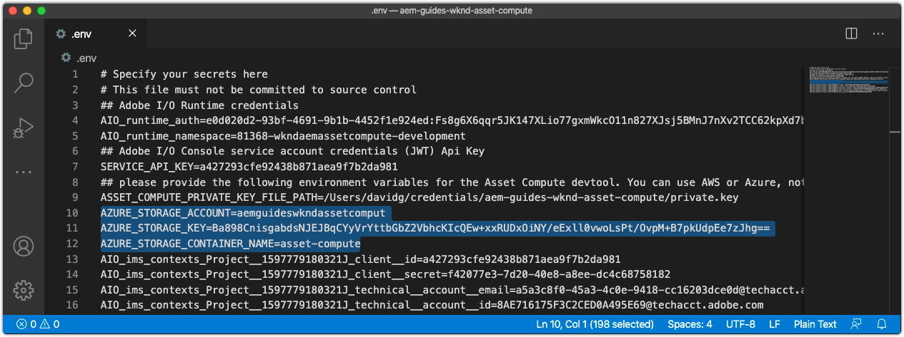

# 配置环境变量


在开始开发Asset Compute工作人员之前，请确保该项目配置了Adobe I/O和云存储信息。 此信息存储在项目的`.env`中，仅用于本地开发，而不保存在Git中。 `.env`文件提供了一种简便的方法，用于将键/值对公开到本地Asset Compute本地开发环境。 将[Asset Compute工作进程部署到Adobe I/O Runtime时，未使用`.env`文件，而是通过环境变量传入值的子集。 ](../deploy/runtime.md)其他自定义参数和密钥也可以存储在`.env`文件中，例如第三方Web服务的开发凭据。

## 引用`private.key`


打开`.env`文件，取消注释`ASSET_COMPUTE_PRIVATE_KEY_FILE_PATH`密钥，并提供文件系统上与Adobe I/O App Builder项目中添加的公共证书配对的`private.key`的绝对路径。

+ 如果您的密钥对由Adobe I/O生成，则它作为`config.zip`的一部分自动下载。
+ 如果您向Adobe I/O提供了公钥，则您还应拥有匹配的私钥。
+ 如果您没有这些密钥对，则可以在底部生成新的密钥对或上传新的公钥：
  [https://console.adobe.com](https://console.adobe.io) >您的Asset Compute App Builder项目>工作区@开发>服务帐户(JWT)。

请记住，不应将`private.key`文件签入Git，因为它包含密钥，而是应存储在项目外部的安全位置。

例如，在macOS上，这可能如下所示：

```
...
ASSET_COMPUTE_PRIVATE_KEY_FILE_PATH=/Users/example-user/credentials/aem-guides-wknd-asset-compute/private.key
...
```

## 配置云存储凭据

Asset Compute工作程序的本地开发需要访问[云存储](../set-up/accounts-and-services.md#cloud-storage)。 用于本地开发的云存储凭据在`.env`文件中提供。

本教程倾向于使用Azure Blob Storage，但可以改用Amazon S3及其`.env`文件中的相应密钥。

### 使用Azure Blob存储

在`.env`文件中取消注释并填充以下键，然后使用Azure门户上找到的已设置云存储的值填充这些键。


1. `AZURE_STORAGE_CONTAINER_NAME`键的值
1. `AZURE_STORAGE_ACCOUNT`键的值
1. `AZURE_STORAGE_KEY`键的值

例如，它类似于（值仅供说明）：

```
...
AZURE_STORAGE_ACCOUNT=aemguideswkndassetcomput
AZURE_STORAGE_KEY=Va9CnisgdbdsNJEJBqXDyNbYppbGbZ2V...OUNY/eExll0vwoLsPt/OvbM+B7pkUdpEe7zJhg==
AZURE_STORAGE_CONTAINER_NAME=asset-compute
...
```

结果`.env`文件如下所示：



如果您未使用Microsoft Azure Blob Storage，请删除或保留这些已注释掉的内容（使用`#`作为前缀）。

### 使用Amazon S3云存储{#amazon-s3}

如果您使用的是Amazon S3云存储，请取消注释并在`.env`文件中填充以下密钥。

例如，它类似于（值仅供说明）：

```
...
S3_BUCKET=aemguideswkndassetcompute
AWS_ACCESS_KEY_ID=KKIXZLZYNLXJLV24PLO6
AWS_SECRET_ACCESS_KEY=Ba898CnisgabdsNJEJBqCYyVrYttbGbZ2...OiNYExll0vwoLsPtOv
AWS_REGION=us-east-1
...
```

## 验证项目配置

在配置生成的Asset Compute项目后，请在更改代码之前验证配置，以确保在`.env`文件中配置支持服务。

要启动适用于Asset Compute项目的Asset Compute开发工具，请执行以下操作：

1. 在Asset Compute项目根目录中打开命令行（在VS Code中，这可以直接在IDE中通过“终端”>“新建终端”打开），然后执行命令：

   ```
   $ aio app run
   ```

1. 本地Asset Compute开发工具将在默认Web浏览器中打开，网址为&#x200B;__http://localhost:9000__。

   

1. 在开发工具初始化时，请观察命令行输出和Web浏览器中的错误消息。
1. 要停止Asset Compute开发工具，请点按执行`aio app run`的窗口中的`Ctrl-C`以终止进程。

## 疑难解答

+ [由于缺少private.key，开发工具无法启动](../troubleshooting.md#missing-private-key)
