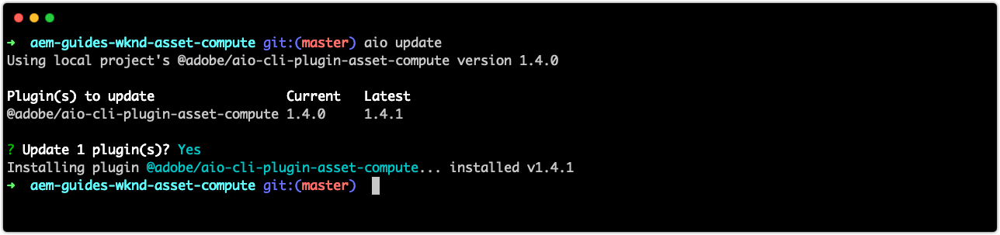

# 调试资产计算工作者

资产计算工作程序可以通过多种方式进行调试，从简单的调试日志语句，到将附加的VS代码作为远程调试器，再到为从AEM作为Cloud Service启动的Adobe I/O Runtime激活提取日志。

## 记录

调试资产计算工作线程的最基本形式在工作线程代码 `console.log(..)` 中使用传统的语句。 JavaScript `console` 对象是隐式的全局对象，因此无需导入或要求它，因为它始终存在于所有上下文中。

根据资产计算工作人员的执行方式，这些日志语句可以以不同方式进行审阅：

+ 从打 `aio app run`印到标准输出和开发工 [具的激活日志](../develop/development-tool.md) 。
   
+ 从， `aio app test`日志打印到 `/build/test-results/test-worker/test.log`
   
+ 使用 `wskdebug`时，日志语句将打印到VS代码调试控制台(“视图”>“调试控制台”)、标准输出
   
+ 使用 `aio app logs`时，日志语句将打印到激活日志输出

## 通过附加调试器进行远程调试

>[!WARNING]
>
>使用Microsoft Visual Studio代码1.48.0或更高版本，与wskdebug兼容

wskdebug [](https://www.npmjs.com/package/@openwhisk/wskdebug) npm模块支持将调试器附加到资产计算工作器，包括在VS代码中设置断点并遍历代码。

>[!VIDEO](https://video.tv.adobe.com/v/40383/?quality=12&learn=on)

_使用wskdebug调试资产计算工作器的点进（无音频）_

1. 确 [保已安](../set-up/development-environment.md#wskdebug) 装wskdebug [和ngrok](../set-up/development-environment.md#ngork) npm模块
1. 确 [保Docker Desktop和支持的Docker映像](../set-up/development-environment.md#docker) ，已安装并运行
1. 关闭开发工具的任何正在运行的实例。
1. 使用部署的最新代 `aio app deploy` 码并记录已部署的操作名称(在之间 `[...]`的名称)。 此操作将用于更新 `launch.json` 步骤8中的。

   ```
   ℹ Info: Deploying package [wkndAemAssetCompute-0.0.1]...
   ```
1. 使用命令开始资产计算开发工具的新实例 `npx adobe-asset-compute devtool`
1. 在VS代码中，点按左侧导航中的调试图标
   + 如果出现提示， __请点按“创建launch.json文件”>“Node.js__ ”以创建新 `launch.json` 文件。
   + 否则，点按 __启动项目__ (Launch)下拉 __框右侧的齿轮图标__ ，以打开编辑器 `launch.json` 中的现有图标。
1. 将以下JSON对象配置添加到数 `configurations` 组：

   ```json
   {
       "type": "pwa-node",
       "request": "launch",
       "name": "wskdebug",
       "attachSimplePort": 0,
       "runtimeExecutable": "wskdebug",
       "args": [
           "wkndAemAssetCompute-0.0.1/__secured_worker",  // Version must match your Asset Compute worker's version
           "${workspaceFolder}/actions/worker/index.js",  // Points to your worker
           "-l",
           "--ngrok"
       ],
       "localRoot": "${workspaceFolder}",
       "remoteRoot": "/code",
       "outputCapture": "std",
       "timeout": 30000
   }
   ```

1. 从下拉菜单中选择 __新的__ wskdebug
1. 点按wskdebug下 __拉菜__ 单左侧的绿色“运 __行”按钮__
1. 打 `/actions/worker/index.js` 开并点按行号左侧以添加断点1。 导航到在步骤6中打开的“资产计算开发工具Web浏览器”窗口
1. 点按“ __运行__ ”按钮以执行该工作器
1. 导航回VS代码， `/actions/worker/index.js` 遍历代码
1. 要退出可调试的开发工具，请点 `Ctrl-C` 击第6步中运行命 `npx adobe-asset-compute devtool` 令的终端

## 访问来自Adobe I/O Runtime的日志{#aio-app-logs}

[AEM作为Cloud Service，通过在Adobe I/O Runtime直接调用资产计算工作器](../deploy/processing-profiles.md) ，通过处理用户档案利用资产计算工作器。 由于这些调用不涉及本地开发，因此无法使用本地工具（如Asset Compute Development Tool或wskdebug）调试它们的执行。 相反，AdobeI/O CLI可用于从Adobe I/O Runtime某特定工作区执行的工作器中提取日志。

1. 确保 [根据需要调试的工作区](../deploy/runtime.md) ，通过 `AIO_runtime_namespace` 和设置特定于工作 `AIO_runtime_auth`区的环境变量。
1. 从命令行执行 `aio app logs`
   + 如果工作区产生大量流量，请通过以下标志扩展激活日志 `--limit` 数：
      `$ aio app logs --limit=25`
1. 最近（最多提供）的激活 `--limit`日志将作为命令的输出返回以供审阅。

   

## 疑难解答

### 调试器不附加

+ __错误__:处理启动时出错：错误：无法连接到调试目标...
+ __原因__:Docker Desktop未在本地系统上运行。 通过查看VS代码调试控制台(视图>调试控制台)验证此错误，确认报告了此错误。
+ __解决方案__:开始 [Docker Desktop并确认安装了必需的Docker图像](../set-up/development-environment.md#docker)。

### 断点未暂停

+ __错误__:当从可调试的开发工具运行资产计算工作器时，VS代码不会在断点暂停。

#### VS代码调试器未连接

+ __原因：__ VS代码调试器已停止／断开连接。
+ __解决方案：__ 重新启动VS代码调试器，并通过观看VS代码调试输出控制台(“视图”>“调试控制台”)验证它是否连接。

#### VS在工作器执行开始后附加的代码调试器

+ __原因：__ 在点击“在开发工具中运行”之前，VS代码调 __试器__ 未连接。
+ __解决方案：__ 通过查看VS代码的调试控制台(“视图”>“调试控制台”)，确保已附加调试器，然后从开发工具重新运行资产计算工作器。

### 调试时工作者超时

+ __错误__:调试控制台报告“操作将以-XXX毫秒为单位超时”，或 [者资产计算开发工具的再现预览无](../develop/development-tool.md) 限期旋转，或者无限旋转
+ __原因__:在调试过程中，超出了manifest. [yml中定义的工](../develop/manifest.md) 作器超时。
+ __解决方案__:在manifest.yml中临时增加工作者的超 [时时间](../develop/manifest.md) ，或加速调试活动。

### 无法终止调试器进程

+ __错误__: `Ctrl-C` 命令行不终止调试器进程(`npx adobe-asset-compute devtool`)。
+ __原因__:1.3. `@adobe/aio-cli-plugin-asset-compute` x中出现错误，导致 `Ctrl-C` 无法识别为终止命令。
+ __解决方案__:更 `@adobe/aio-cli-plugin-asset-compute` 新到版本1.4.1+

   ```
   $ aio update
   ```

   