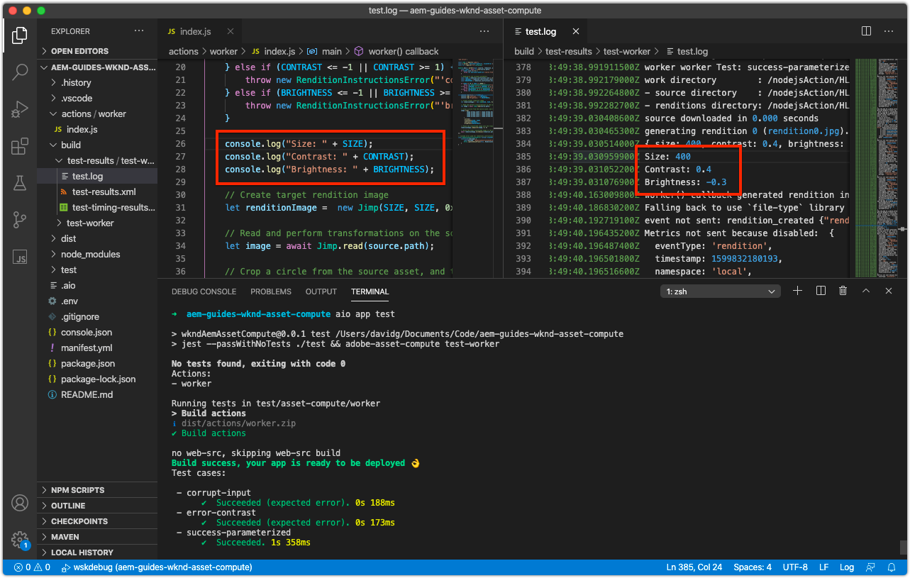

# 调试Asset compute工作程序

asset compute工作程序可以通过多种方式进行调试，从简单的调试日志语句，到作为远程调试器附加的VS Code ，再到为从AEM as a Cloud Service启动的Adobe I/O Runtime中的激活提取日志。

## 日志记录

最基本的调试Asset compute工作程序使用传统 `console.log(..)` 工作代码中的语句。 的 `console` JavaScript对象是隐式的全局对象，因此无需导入或要求导入，因为它始终存在于所有上下文中。

根据Asset compute工作程序的执行方式，这些日志语句可以以不同的方式进行审阅：

+ 从 `aio app run`，日志将打印为标准输出， [开发工具的](../develop/development-tool.md) 激活日志
   
+ 从 `aio app test`，日志打印到 `/build/test-results/test-worker/test.log`
   
+ 使用 `wskdebug`，日志语句将打印到VS代码调试控制台（查看>调试控制台），标准输出
   
+ 使用 `aio app logs`，日志语句将打印到激活日志输出

## 通过附加的调试器进行远程调试

>[!WARNING]
>
>为了与wskdebug兼容，请使用Microsoft Visual Studio代码1.48.0或更高版本

的 [wsdebug](https://www.npmjs.com/package/@openwhisk/wskdebug) npm模块，支持将调试器附加到Asset compute工作程序，包括能够在VS代码中设置断点并逐步完成代码。

>[!VIDEO](https://video.tv.adobe.com/v/40383?quality=12&learn=on)

_使用wskdebug调试Asset compute工作程序的点进（无音频）_

1. 确保 [wsdebug](../set-up/development-environment.md#wskdebug) 和 [恩格罗克](../set-up/development-environment.md#ngork) npm模块已安装
1. 确保 [Docker Desktop和支持Docker映像](../set-up/development-environment.md#docker) 安装并运行
1. 关闭开发工具的任何活动运行实例。
1. 使用部署最新代码 `aio app deploy`  和记录已部署的操作名称( `[...]`)。 用于更新 `launch.json` 中。

   ```
   ℹ Info: Deploying package [wkndAemAssetCompute-0.0.1]...
   ```


1. 使用命令启动Asset compute开发工具的新实例 `npx adobe-asset-compute devtool`
1. 在VS代码中，点按左侧导航中的调试图标
   + 如果出现提示，请点按 __创建launch.json文件> Node.js__ 创建新 `launch.json` 文件。
   + 否则，点按 __齿轮__ 图标 __启动计划__ 用于打开现有 `launch.json` 在编辑器中。
1. 将以下JSON对象配置添加到 `configurations` 数组：

   ```json
   {
       "type": "pwa-node",
       "request": "launch",
       "name": "wskdebug",
       "attachSimplePort": 0,
       "runtimeExecutable": "wskdebug",
       "args": [
           "wkndAemAssetCompute-0.0.1/__secured_worker",  // Version must match your Asset Compute worker's version
           "${workspaceFolder}/actions/worker/index.js",  // Points to your worker
           "-l",
           "--ngrok"
       ],
       "localRoot": "${workspaceFolder}",
       "remoteRoot": "/code",
       "outputCapture": "std",
       "timeout": 30000
   }
   ```

1. 选择新 __wsdebug__ 从下拉菜单中
1. 点按绿色 __运行__ 按钮 __wsdebug__ 下拉列表
1. 打开 `/actions/worker/index.js` 然后点按行号左侧以添加断点1。 导航到在步骤6中打开的Asset compute开发工具Web浏览器窗口
1. 点按 __运行__ 用于执行工作程序的按钮
1. 导航回VS代码，再导航回 `/actions/worker/index.js` 并逐步完成代码
1. 要退出可调试的开发工具，请点按 `Ctrl-C` 在航站楼里 `npx adobe-asset-compute devtool` 步骤6中的命令

## 从Adobe I/O Runtime访问日志{#aio-app-logs}

[AEMas a Cloud Service通过处理用户档案来利用Asset compute工作程序](../deploy/processing-profiles.md) 直接在Adobe I/O Runtime调用。 由于这些调用不涉及本地开发，因此无法使用本地工具(如Asset compute开发工具或wskdebug)来调试其执行。 相反，可以使用Adobe I/OCLI从在Adobe I/O Runtime的特定工作区中执行的工作程序中获取日志。

1. 确保 [特定于工作区的环境变量](../deploy/runtime.md) 通过 `AIO_runtime_namespace` 和 `AIO_runtime_auth`，基于需要调试的工作区。
1. 从命令行中执行 `aio app logs`
   + 如果工作区遇到大量流量，请通过 `--limit` 标记：
      `$ aio app logs --limit=25`
1. 最近的(截至提供的 `--limit`)激活日志将作为命令的输出返回以供审阅。

   

## 疑难解答

+ [调试器未附加](../troubleshooting.md#debugger-does-not-attach)
+ [断点不会暂停](../troubleshooting.md#breakpoints-no-pausing)
+ [未附加VS代码调试器](../troubleshooting.md#vs-code-debugger-not-attached)
+ [工作程序开始执行后附加的VS代码调试器](../troubleshooting.md#vs-code-debugger-attached-after-worker-execution-began)
+ [调试时工作程序超时](../troubleshooting.md#worker-times-out-while-debugging)
+ [无法终止调试器进程](../troubleshooting.md#cannot-terminate-debugger-process)
