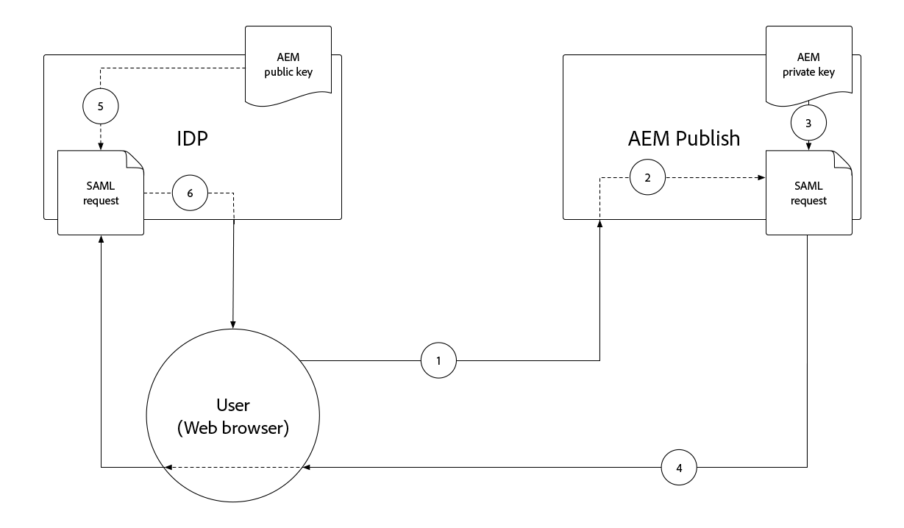

# SAML 2.0身份验证{#saml-2-0-authentication}

了解如何设置最终用户(而非AEM作者)并对所选的SAML 2.0兼容IDP进行身份验证。

## 什么是AEMas a Cloud Service的SAML?

与AEM发布（或预览）的SAML 2.0集成，允许基于AEM的Web体验的最终用户对非AdobeIDP（身份提供程序）进行身份验证，并以指定的授权用户身份访问AEM。

|  | AEM Author | AEM 发布 |
|-----------------------|:----------:|:-----------:|
| SAML 2.0支持 | ✘ | ✔ |

+++ 了解使用AEM的SAML 2.0流程

AEM发布SAML集成的典型流程如下：

1. 用户向AEM发布请求，指示需要身份验证。
   + 用户请求CUG/ACL保护的资源。
   + 用户请求受身份验证要求约束的资源。
   + 用户遵循指向AEM登录端点(即 `/system/sling/login`)，以明确请求登录操作。
1. AEM向IDP发出AuthnRequest，请求IDP启动身份验证过程。
1. 用户向IDP进行身份验证。
   + IDP会提示用户输入凭据。
   + 用户已通过IDP的身份验证，因此无需提供进一步的凭据。
1. IDP生成包含用户数据的SAML断言，并使用IDP的专用证书对其进行签名。
1. IDP通过用户的Web浏览器，通过HTTPPOST将SAML断言发送到AEM发布。
1. AEM发布接收SAML断言，并使用IDP公共证书验证SAML断言的完整性和真实性。
1. AEM发布基于SAML 2.0 OSGi配置和SAML断言的内容管理AEM用户记录。
   + 创建用户
   + 同步用户属性
   + 更新AEM用户群组成员资格
1. AEM Publish设置AEM `login-token` HTTP响应上的Cookie，用于验证对AEM发布的后续请求。
1. AEM发布会将用户重定向到AEM发布上的URL，具体如 `saml_request_path` cookie。

+++

## 配置演练

>[!VIDEO](https://video.tv.adobe.com/v/343040/?quality=12&learn=on)

此视频将演示如何设置与AEMas a Cloud Service发布服务的SAML 2.0集成，以及如何使用Okta作为IDP。

## 前提条件

在设置SAML 2.0身份验证时，需要满足以下条件：

+ 对Cloud Manager的部署管理器访问权限
+ AEM管理员对AEMas a Cloud Service环境的访问权限
+ 对IDP的管理员访问权限
+ （可选）访问用于加密SAML负载的公共/私有密钥对

仅支持使用AEM发布或预览对SAML 2.0进行身份验证。 要使用和IDP管理AEM作者的身份验证， [将IDP与Adobe IMS集成。](https://helpx.adobe.com/cn/enterprise/using/set-up-identity.html).


## 在AEM上安装IDP公共证书

IDP的公共证书将添加到AEM全局信任存储，并用于验证由IDP发送的SAML断言是有效的。

+++SAML断言签名流程


1. 用户向IDP进行身份验证。
1. IDP生成包含用户数据的SAML断言。
1. IDP使用IDP的专用证书对SAML断言进行签名。
1. IDP将启动到AEM发布的SAML端点的客户端HTTPPOST(`.../saml_login`)，其中包含已签名的SAML断言。
1. AEM发布接收包含已签名SAML断言的HTTPPOST，可以使用IDP公共证书验证签名。

+++


1. 获取 __公共证书__ 文件。 此证书允许AEM验证IDP提供给AEM的SAML断言。

   证书采用PEM格式，应类似于：

   ```
   -----BEGIN CERTIFICATE-----
   MIIC4jCBAcoCCQC33wnybT5QZDANBgkqhkiG9w0BAQsFADAyMQswCQYDVQQGEwJV
   ...
   m0eo2USlSRTVl7QHRTuiuSThHpLKQQ==
   -----END CERTIFICATE-----
   ```

1. 以AEM管理员身份登录到AEM作者。
1. 导航到 __工具>安全>信任存储__.
1. 创建或打开全局信任存储。 如果创建全局信任存储，请将密码存储到安全的位置。
1. 展开 __从CER文件添加证书__.
1. 选择 __选择证书文件__，并上传IDP提供的证书文件。
1. 离开 __将证书映射到用户__ 空白。
1. 选择&#x200B;__提交__。
1. 新添加的证书显示在 __从CRT文件添加证书__ 中。
1. 记下 __别名__，因为此值在 [SAML 2.0身份验证处理程序OSGi配置](#saml-2-0-authentication-handler-osgi-configuration).
1. 选择 __保存并关闭__.

全局信任存储在AEM作者上配置了IDP的公共证书，但由于SAML仅在AEM发布上使用，因此必须将全局信任存储复制到AEM发布，IDP公共证书才能在此处访问。


1. 导航到 __工具>部署>包__.
1. 创建资源包
   + 包名称： `Global Trust Store`
   + 版本: `1.0.0`
   + 组: `com.your.company`
1. 编辑新 __全局信任存储__ 包。
1. 选择 __过滤器__ ，并为根路径添加过滤器 `/etc/truststore`.
1. 选择 __完成__ 然后 __保存__.
1. 选择 __生成__ 按钮 __全局信任存储__ 包。
1. 生成后，选择 __更多__ > __复制__ 激活全局信任存储节点(`/etc/truststore`)到AEM发布。

## 安装AEM公钥/私钥对{#install-aem-public-private-key-pair}

_安装AEM公钥/私钥对是可选的_

可以将AEM发布配置为对AuthnRequests（对IDP）进行签名，并加密SAML断言(对AEM)。 这是通过为AEM发布提供私钥来实现的，它将公钥与IDP匹配。

+++ 了解AuthnRequest签名流程（可选）

AuthnRequest（AEM Publish中对IDP的请求，该请求将启动登录过程）可由AEM Publish签名。 为此，AEM Publish会使用私钥对AuthnRequest进行签名，IDP随后会使用公钥验证签名。 这可保证IDP AuthnRequest是由AEM Publish发起和请求的，而不是恶意第三方。



1. 用户向AEM发布发出HTTP请求，从而对IDP发出SAML身份验证请求。
1. AEM发布会生成要发送到IDP的SAML请求。
1. AEM发布使用AEM私钥对SAML请求进行签名。
1. AEM发布会启动AuthnRequest，该AuthnRequest是一个HTTP客户端重定向，指向包含已签名的SAML请求的IDP。
1. IDP接收AuthnRequest，并使用AEM公钥验证签名，从而保证AEM发布启动了AuthnRequest。
1. 然后，AEM发布使用IDP公共证书验证解密的SAML断言的完整性和真实性。

+++

+++ 了解SAML断言加密流程（可选）

IDP和AEM Publish之间的所有HTTP通信都应通过HTTPS，因此默认情况下是安全的。 但是，如果需要，在HTTPS提供的SAML声明之外需要额外保密的情况下，可以对其进行加密。 为此，IDP使用私钥加密SAML断言数据，AEM发布使用私钥解密SAML断言。


1. 用户向IDP进行身份验证。
1. IDP生成包含用户数据的SAML断言，并使用IDP的专用证书对其进行签名。
1. 然后，IDP使用AEM公钥加密SAML断言，该公钥需要AEM私钥才能解密。
1. 加密的SAML断言通过用户的Web浏览器发送到AEM发布。
1. AEM发布接收SAML断言，并使用AEM私钥对其解密。
1. IDP会提示用户进行身份验证。

+++

AuthnRequest签名和SAML断言加密都是可选的，但是，它们都通过 [SAML 2.0身份验证处理程序OSGi配置属性 `useEncryption`](#saml-20-authenticationsaml-2-0-authentication)，这表示既不能使用也不能使用。


1. 获取用于对AuthnRequest进行签名并加密SAML断言的公钥、私钥（PKCS#8格式）和证书链文件（这可能是公钥）。 密钥通常由IT组织的安全团队提供。

   + 可使用 __openssl__:

   ```
   $ openssl req -x509 -sha256 -days 365 -newkey rsa:4096 -keyout aem-private.key -out aem-public.crt
   
   # Provide a password (keep in safe place), and other requested certificate information
   
   # Convert the keys to AEM's required format 
   $ openssl rsa -in aem-private.key -outform der -out aem-private.der
   $ openssl pkcs8 -topk8 -inform der -nocrypt -in aem-private.der -outform der -out aem-private-pkcs8.der
   ```

1. 将公共密钥上传到IDP。
   + 使用 `openssl` 方法，公钥为 `aem-public.crt` 文件。
1. 以AEM管理员身份登录AEM作者，以上传私钥。
1. 导航到 __工具>安全>信任存储__，然后选择 __身份验证服务__ 用户，然后选择 __属性__ 中。
1. 导航到 __工具>安全>用户__，然后选择 __身份验证服务__ 用户，然后选择 __属性__ 中。
1. 选择 __密钥库__ 选项卡。
1. 创建或打开密钥库。 如果创建密钥库，请保护密码安全。
1. 选择 __从DER文件添加私钥__，并将私钥和链文件添加到AEM:
   + __别名__:提供有意义的名称，通常是IDP的名称。
   + __私钥文件__:上载私钥文件（DER格式的PKCS#8）。
      + 使用 `openssl` 方法，这是 `aem-private-pkcs8.der` 文件
   + __选择证书链文件__:上传随附的链文件（这可能是公钥）。
      + 使用 `openssl` 方法，这是 `aem-public.crt` 文件
   + 选择 __提交__
1. 新添加的证书显示在 __从CRT文件添加证书__ 中。
   + 记下 __别名__ 因为 [SAML 2.0身份验证处理程序OSGi配置](#saml-20-authentication-handler-osgi-configuration)
1. 选择 __保存并关闭__.
1. 选择 __身份验证服务__ 用户，然后选择 __激活__ 中。

## 配置SAML 2.0身份验证处理程序{#configure-saml-2-0-authentication-handler}

AEM SAML配置通过 __AdobeGranite SAML 2.0身份验证处理程序__ OSGi配置。
该配置是OSGi工厂配置，这意味着单个AEMas a Cloud Service发布服务可能具有多个覆盖存储库离散资源树的SAML配置；这对于多站点AEM部署非常有用。

+++ SAML 2.0身份验证处理程序OSGi配置术语表

### AdobeGranite SAML 2.0身份验证处理程序OSGi配置{#configure-saml-2-0-authentication-handler-osgi-configuration}

|  | OSGi属性 | 必填 | 值格式 | 默认值 | 描述 |
|-----------------------------------|-------------------------------|:--------:|:---------------------:|---------------------------|-------------|
| 路径 | `path` | ✔ | 字符串数组 | `/` | AEM路径此身份验证处理程序用于。 |
| IDP URL | `idpUrl` | ✔ | 字符串 |  | 发送SAML身份验证请求的IDP URL。 |
| IDP证书别名 | `idpCertAlias` | ✔ | 字符串 |  | 在AEM全局信任存储中找到的IDP证书的别名 |
| IDP HTTP重定向 | `idpHttpRedirect` | ✘ | 布尔型 | `false` | 指示是否向IDP URL进行HTTP重定向，而不是发送AuthnRequest。 设置为 `true` IDP启动的身份验证。 |
| IDP标识符 | `idpIdentifier` | ✘ | 字符串 |  | 唯一IDP Id，可确保AEM用户和组的唯一性。 如果为空，则 `serviceProviderEntityId` 的值。 |
| 断言使用者服务URL | `assertionConsumerServiceURL` | ✘ | 字符串 |  | 的 `AssertionConsumerServiceURL` AuthnRequest中的URL属性，指定 `<Response>` 消息必须发送到AEM。 |
| SP实体ID | `serviceProviderEntityId` | ✔ | 字符串 |  | 唯一标识IDP的AEM;通常为AEM主机名。 |
| SP加密 | `useEncryption` | ✘ | 布尔型 | `true` | 指示IDP是否加密SAML断言。 需要 `spPrivateKeyAlias` 和 `keyStorePassword` 设置。 |
| SP私钥别名 | `spPrivateKeyAlias` | ✘ | 字符串 |  | 中私钥的别名 `authentication-service` 用户的密钥库。 如果 `useEncryption` 设置为 `true`. |
| SP密钥存储密码 | `keyStorePassword` | ✘ | 字符串 |  | “authentication-service”用户密钥存储的密码。 如果 `useEncryption` 设置为 `true`. |
| 默认重定向 | `defaultRedirectUrl` | ✘ | 字符串 | `/` | 成功身份验证后的默认重定向URL。 可以是相对于AEM主机的(例如， `/content/wknd/us/en/html`)。 |
| 用户Id属性 | `userIDAttribute` | ✘ | 字符串 | `uid` | 包含AEM用户ID的SAML断言属性的名称。 将留空以使用 `Subject:NameId`. |
| 自动创建AEM用户 | `createUser` | ✘ | 布尔型 | `true` | 指示AEM用户是否在成功验证时创建。 |
| AEM用户中间路径 | `userIntermediatePath` | ✘ | 字符串 |  | 创建AEM用户时，此值将用作中间路径(例如， `/home/users/<userIntermediatePath>/jane@wknd.com`)。 需要 `createUser` 设置为 `true`. |
| AEM用户属性 | `synchronizeAttributes` | ✘ | 字符串数组 |  | 要在AEM用户上存储的SAML属性映射列表，格式为 `[ "saml-attribute-name=path/relative/to/user/node" ]` (例如， `[ "firstName=profile/givenName" ]`)。 请参阅 [本机AEM属性的完整列表](#aem-user-attributes). |
| 将用户添加到AEM组 | `addGroupMemberships` | ✘ | 布尔型 | `true` | 指示AEM用户在成功身份验证后是否自动添加到AEM用户组。 |
| AEM组成员资格属性 | `groupMembershipAttribute` | ✘ | 字符串 | `groupMembership` | SAML断言属性的名称，该属性包含应添加用户的AEM用户组列表。 需要 `addGroupMemberships` 设置为 `true`. |
| 默认AEM组 | `defaultGroups` | ✘ | 字符串数组 |  | 经过身份验证的AEM用户组列表始终会添加到(例如， `[ "wknd-user" ]`)。 需要 `addGroupMemberships` 设置为 `true`. |
| NameIDPolicy格式 | `nameIdFormat` | ✘ | 字符串 | `urn:oasis:names:tc:SAML:2.0:nameid-format:transient` | 要在AuthnRequest消息中发送的NameIDPolicy格式参数的值。 |
| 存储SAML响应 | `storeSAMLResponse` | ✘ | 布尔型 | `false` | 指示 `samlResponse` 值存储在AEM中 `cq:User` 节点。 |
| 处理注销 | `handleLogout` | ✘ | 布尔型 | `false` | 指示注销请求是否由此SAML身份验证处理程序处理。 需要 `logoutUrl` 设置。 |
| 注销URL | `logoutUrl` | ✘ | 字符串 |  | 将SAML注销请求发送到的IDP的URL。 如果 `handleLogout` 设置为 `true`. |
| 时钟容差 | `clockTolerance` | ✘ | 整数 | `60` | 验证SAML断言时，IDP和AEM(SP)时钟偏差容限。 |
| 摘要方法 | `digestMethod` | ✘ | 字符串 | `http://www.w3.org/2001/04/xmlenc#sha256` | IDP在对SAML消息进行签名时使用的摘要算法。 |
| 签名方法 | `signatureMethod` | ✘ | 字符串 | `http://www.w3.org/2001/04/xmldsig-more#rsa-sha256` | IDP在对SAML消息进行签名时使用的签名算法。 |
| 身份同步类型 | `identitySyncType` | ✘ | `default` 或 `idp` | `default` | 不要更改 `from` 默认设置AEMas a Cloud Service。 |
| 服务排名 | `service.ranking` | ✘ | 整数 | `5002` | 对于相同的配置，更高的排名 `path`. |

### AEM用户属性{#aem-user-attributes}

AEM使用以下用户属性，该属性可通过 `synchronizeAttributes` AdobeGranite SAML 2.0身份验证处理程序OSGi配置中的属性。  任何IDP属性都可以同步到任何AEM用户属性，但映射到AEM使用属性属性（如下所列）允许AEM自然使用它们。

| 用户属性 | 相对属性路径 `rep:User` 节点 |
|--------------------------------|--------------------------|
| 标题(例如， `Mrs`) | `profile/title` |
| 给定名称（即名字） | `profile/givenName` |
| 姓氏 | `profile/familyName` |
| 职务 | `profile/jobTitle` |
| 电子邮件地址 | `profile/email` |
| 街道地址 | `profile/street` |
| 城市 | `profile/city` |
| 邮政编码 | `profile/postalCode` |
| 国家/地区 | `profile/country` |
| 电话号码 | `profile/phoneNumber` |
| 自我介绍 | `profile/aboutMe` |

+++

1. 在您的项目中创建OSGi配置文件(位于 `/ui.config/src/main/content/jcr_root/wknd-examples/osgiconfig/config.publish/com.adobe.granite.auth.saml.SamlAuthenticationHandler~saml.cfg.json` 并在IDE中打开。
   + 更改 `/wknd-examples/` 至 `/<project name>/`
   + 标识符后面的 `~` 文件名中应唯一标识此配置，因此它可能是IDP的名称，例如 `...~okta.cfg.json`. 值应为带连字符的字母数字。
1. 将以下JSON粘贴到 `com.adobe.granite.auth.saml.SamlAuthenticationHandler~...cfg.json` 文件，并更新 `wknd` 根据需要引用。

   ```json
   {
       "path": [ "/content/wknd", "/content/dam/wknd" ], 
       "idpCertAlias": "$[env:SAML_IDP_CERT_ALIAS;default=certalias___1652125559800]",
       "idpIdentifier": "$[env:SAML_IDP_ID;default=http://www.okta.com/exk4z55r44Jz9C6am5d7]",
       "idpUrl": "$[env:SAML_IDP_URL;default=https://dev-5511372.okta.com/app/dev-5511372_aemasacloudservice_1/exk4z55r44Jz9C6am5d7/sso/saml]",
       "serviceProviderEntityId": "$[env:SAML_AEM_ID;default=https://publish-p123-e456.adobeaemcloud.com]",
       "useEncryption": false,
       "createUser": true,
       "userIntermediatePath": "wknd/idp",
       "synchronizeAttributes":[
           "firstName=profile/givenName"
       ],
       "addGroupMemberships": true,
       "defaultGroups": [ 
           "wknd-users"
       ]
   }
   ```

1. 根据项目需要更新值。 请参阅 __SAML 2.0身份验证处理程序OSGi配置术语表__ 上方的配置属性说明
1. 当值可能与发布周期不同步而发生更改，或者类似的环境类型/服务层之间的值不同时，建议使用OSGi环境变量和密钥，但不是必需的。 默认值可以使用 `$[env:..;default=the-default-value]"` 语法，如上所示。

每个环境的OSGi配置(`config.publish.dev`, `config.publish.stage`和 `config.publish.prod`)。

### 使用加密

When [加密AuthnRequest和SAML断言](#encrypting-the-authnrequest-and-saml-assertion)，则需要以下属性： `useEncryption`, `spPrivateKeyAlias`和 `keyStorePassword`. 的 `keyStorePassword` 包含密码，因此值不得存储在OSGi配置文件中，而是使用 [密码配置值](https://experienceleague.adobe.com/docs/experience-manager-cloud-service/content/implementing/deploying/configuring-osgi.html#secret-configuration-values)

+++或者，更新OSGi配置以使用加密

1. 打开 `/ui.config/src/main/content/jcr_root/wknd-examples/osgiconfig/config.publish/com.adobe.granite.auth.saml.SamlAuthenticationHandler~saml.cfg.json` 在IDE中。
1. 添加三个属性 `useEncryption`, `spPrivateKeyAlias`和 `keyStorePassword` 如下所示。

   ```json
   {
   "path": [ "/content/wknd", "/content/dam/wknd" ], 
   "idpCertAlias": "$[env:SAML_IDP_CERT_ALIAS;default=certalias___1234567890]",
   "idpIdentifier": "$[env:SAML_IDP_ID;default=http://www.okta.com/abcdef1235678]",
   "idpUrl": "$[env:SAML_IDP_URL;default=https://dev-5511372.okta.com/app/dev-123567890_aemasacloudservice_1/abcdef1235678/sso/saml]",
   "serviceProviderEntityId": "$[env:SAML_AEM_ID;default=https://publish-p123-e456.adobeaemcloud.com]",
   "useEncryption": true,
   "spPrivateKeyAlias": "$[env:SAML_AEM_KEYSTORE_ALIAS;default=aem-saml-encryption]",
   "keyStorePassword": "$[secret:SAML_AEM_KEYSTORE_PASSWORD]",
   "createUser": true,
   "userIntermediatePath": "wknd/idp"
   "synchronizeAttributes":[
       "firstName=profile/givenName"
   ],
   "addGroupMemberships": true,
   "defaultGroups": [ 
       "wknd-users"
   ]
   }
   ```

1. 加密所需的三个OSGi配置属性包括：

+ `useEncryption` 设置为 `true`
+ `spPrivateKeyAlias` 包含SAML集成所用私钥的密钥库条目别名。
+ `keyStorePassword` 包含 [OSGi密钥配置变量](https://experienceleague.adobe.com/docs/experience-manager-cloud-service/content/implementing/deploying/configuring-osgi.html#secret-configuration-values) 包含 `authentication-service` 用户密钥库的密码。

+++

## 配置反向链接过滤器

在SAML身份验证过程中，IDP会向AEM发布启动客户端HTTPPOST `.../saml_login` 终点。 如果IDP和AEM发布存在于不同的源上，则AEM发布的 __反向链接过滤器__ 已通过OSGi配置进行配置，以允许来自IDP源的HTTP POST。

1. 在您的项目中创建（或编辑）OSGi配置文件(位于 `/ui.config/src/main/content/jcr_root/wknd-examples/osgiconfig/config.publish/org.apache.sling.security.impl.ReferrerFilter.cfg.json`.
   + 更改 `/wknd-examples/` 至 `/<project name>/`
1. 确保 `allow.empty` 值设置为 `true`, `allow.hosts` (或者，如果你愿意， `allow.hosts.regexp`)包含IDP的来源，以及 `filter.methods` 包括 `POST`. OSGi配置应类似于：

   ```json
   {
       "allow.empty": true,
       "allow.hosts.regexp": [ ],
       "allow.hosts": [ 
           "$[env:SAML_IDP_REFERRER;default=dev-123567890.okta.com]"
       ],
       "filter.methods": [
           "POST",
       ],
       "exclude.agents.regexp": [ ]
   }
   ```

AEM发布支持单个反向链接过滤器配置，因此可将SAML配置要求与任何现有配置合并。

每个环境的OSGi配置(`config.publish.dev`, `config.publish.stage`和 `config.publish.prod`) `allow.hosts` (或 `allow.hosts.regex`)因环境而异。

## 配置跨域资源共享(CORS)

在SAML身份验证过程中，IDP会向AEM发布启动客户端HTTPPOST `.../saml_login` 终点。 如果IDP和AEM发布存在于不同的主机/域上，则AEM发布的 __CRoss-Origin资源共享(CORS)__ 必须配置为允许来自IDP主机/域的HTTP POST。

此HTTPPOST请求的 `Origin` 标头的值通常与AEM发布主机不同，因此需要配置CORS。

在本地AEM SDK上测试SAML身份验证时(`localhost:4503`),IDP可以将 `Origin` 标题至 `null`. 如果是，请添加 `"null"` 到 `alloworigin` 列表。

1. 在您的项目中创建OSGi配置文件(位于 `/ui.config/src/main/content/jcr_root/wknd-examples/osgiconfig/config.publish/com.adobe.granite.cors.impl.CORSPolicyImpl~saml.cfg.json`
   + 更改 `/wknd-examples/` 至项目名称
   + 标识符后面的 `~` 文件名中应唯一标识此配置，因此它可能是IDP的名称，例如 `...CORSPolicyImpl~okta.cfg.json`. 值应为带连字符的字母数字。
1. 将以下JSON粘贴到 `com.adobe.granite.cors.impl.CORSPolicyImpl~...cfg.json` 文件。

```json
{
    "alloworigin": [ 
        "$[env:SAML_IDP_ORIGIN;default=https://dev-1234567890.okta.com]", 
        "null"
    ],
    "allowedpaths": [ 
        ".*/saml_login"
    ],
    "supportedmethods": [ 
        "POST"
    ]
}
```

每个环境的OSGi配置(`config.publish.dev`, `config.publish.stage`和 `config.publish.prod`) `alloworigin` 和 `allowedpaths` 因环境而异。

## 配置AEM Dispatcher以允许SAML HTTP POST

成功对IDP进行身份验证后，IDP将编排一个HTTPPOST回AEM已注册 `/saml_login` 端点（在IDP中配置）。 此HTTPPOST `/saml_login` 默认情况下在Dispatcher处被阻止，因此必须明确允许使用以下Dispatcher规则：

1. 打开 `dispatcher/src/conf.dispatcher.d/filters/filters.any` 在IDE中。
1. 在文件底部添加一个允许将HTTP POST添加到以 `/saml_login`.

```
...

# Allow SAML HTTP POST to ../saml_login end points
/0190 { /type "allow" /method "POST" /url "*/saml_login" }
```

如果配置了Apache Web服务器上的URL重写(`dispatcher/src/conf.d/rewrites/rewrite.rules`)，请确保向 `.../saml_login` 端点不会意外损坏。

## 启用数据同步

在AEM发布中SAML身份验证流程创建用户后，必须在AEM发布层中同步用户记录。 至 [启用数据同步](https://experienceleague.adobe.com/docs/experience-manager-cloud-service/content/sites/authoring/personalization/user-and-group-sync-for-publish-tier.html#data-synchronization)，向Adobe客户支持(通过 [AdminConsole](https://adminconsole.adobe.com) >支持)请求启用它。

## 部署SAML配置

必须将OSGi配置提交到Git，并使用Cloud Manager将其部署到AEMas a Cloud Service。

```
$ git remote -v            
adobe   https://git.cloudmanager.adobe.com/myOrg/myCloudManagerGit/ (fetch)
adobe   https://git.cloudmanager.adobe.com/myOrg/myCloudManagerGit/ (push)
$ git add .
$ git commit -m "SAML 2.0 configurations"
$ git push adobe saml-auth:develop
```

部署目标Cloud Manager Git分支(在此示例中， `develop`)，使用完整堆栈部署管道。
