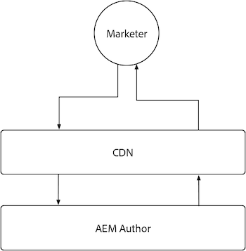

# AEM 作者

由于AEM Author提供的内容高度动态且对权限敏感，因此其缓存有限。 通常，建议不要自定义AEM Author的缓存，而是依赖Adobe提供的缓存配置来确保性能体验。

{align="center"}

我们建议不要在AEM Author上自定义缓存，但是了解AEM Author具有Adobe管理的CDN，但不具有AEM Dispatcher会很有帮助。 请记住，所有AEM Dispatcher配置在AEM Author上都将被忽略，因为它没有AEM Dispatcher。

## CDN

AEM创作服务使用CDN，但其目的是增强产品资源的交付，因此不应对其进行广泛配置，而应使其按原样工作。

{align="center"}

AEM Author CDN位于最终用户（通常是营销人员或内容作者）和AEM Author之间。 它会缓存不可变文件(例如支持AEM创作体验的静态资源)，而不是创作内容。

AEM Author的CDN确实缓存了多种可能感兴趣的资源，包括对持久查询[&#128279;](https://experienceleague.adobe.com/docs/experience-manager-cloud-service/content/headless/graphql-api/persisted-queries.html?author-instances)的可自定义TTL和对自定义客户端库[&#128279;](https://experienceleague.adobe.com/docs/experience-manager-cloud-service/content/implementing/content-delivery/caching.html#client-side-libraries)的长TTL。

### 默认缓存期限

以下面向客户的资源由AEM Author CDN缓存，并具有以下默认缓存期限：

| 内容类型 | 默认CDN缓存期限 |
|:------------ |:---------- |
| [持久查询(JSON)](https://experienceleague.adobe.com/docs/experience-manager-cloud-service/content/headless/graphql-api/persisted-queries.html?author-instances) | 1 分钟 |
| [客户端库(JS/CSS)](https://experienceleague.adobe.com/docs/experience-manager-cloud-service/content/implementing/content-delivery/caching.html#client-side-libraries) | 30 天 |
| [所有其他](https://experienceleague.adobe.com/docs/experience-manager-cloud-service/content/implementing/content-delivery/caching.html#other-content) | 未缓存 |

## AEM Dispatcher

AEM Author服务不包括AEM Dispatcher，仅使用[CDN](#cdn)进行缓存。
