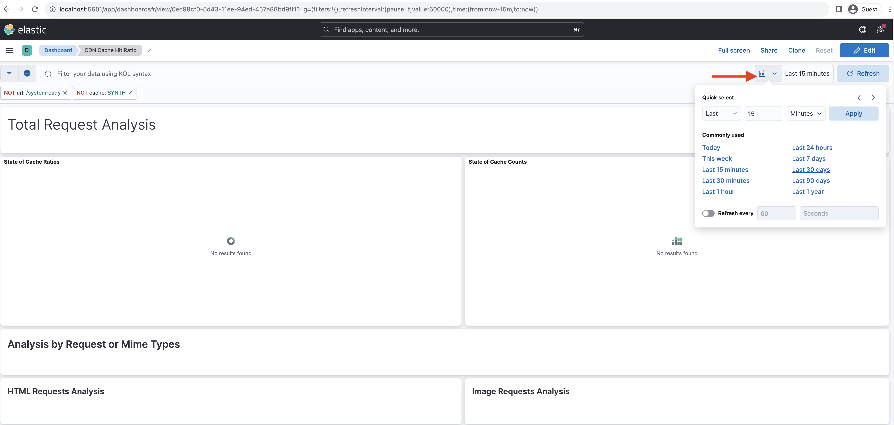
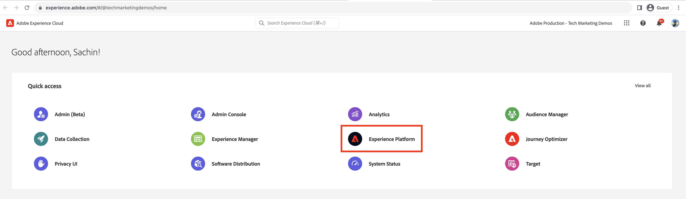
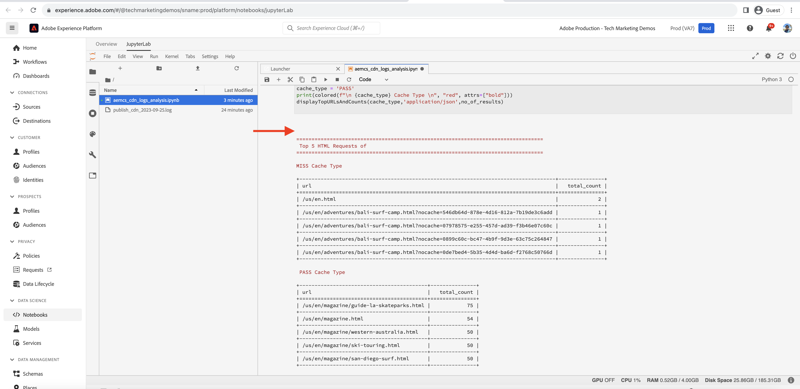

# CDN缓存命中率分析

在CDN中缓存的内容可减少网站用户遇到的延迟，这些用户无需等待请求返回Apache/Dispatcher或AEM发布。 考虑到这一点，优化CDN缓存命中率以最大限度地增加CDN可缓存的内容量是值得的。

了解如何分析AEM as a Cloud Service提供的&#x200B;**CDN日志**，并获得&#x200B;**缓存命中率**&#x200B;以及&#x200B;_MISS_&#x200B;和&#x200B;_PASS_&#x200B;缓存类型&#x200B;**的**&#x200B;顶级URL等见解，以进行优化。

CDN日志以JSON格式提供，其中包含各种字段，包括`url`、`cache`。 有关详细信息，请参阅[CDN日志格式](https://experienceleague.adobe.com/docs/experience-manager-cloud-service/content/implementing/developing/logging.html?lang=en#cdn-log:~:text=Toggle%20Text%20Wrapping-,Log%20Format,-The%20CDN%20logs)。 `cache`字段提供了有关缓存&#x200B;_的_&#x200B;状态的信息，其可能值为HIT、MISS或PASS。 让我们查看可能值的详细信息。

| 缓存的状态 可能值 | 描述 |
|------------------------------------|:-----------------------------------------------------:|
| 点击 | 请求的数据在CDN缓存中找到&#x200B;_，不需要向AEM服务器发出fetch_&#x200B;请求。 |
| 小姐 | 在CDN缓存中找不到请求的数据&#x200B;_，必须从AEM服务器请求_。 |
| 通过 | 所请求的数据是&#x200B;_显式设置为不缓存_，并且始终从AEM服务器中检索。 |

在本教程中，[AEM WKND项目](https://github.com/adobe/aem-guides-wknd)部署到AEM as a Cloud Service环境，并使用[Apache JMeter](https://jmeter.apache.org/)触发小规模性能测试。

本教程旨在引导您完成以下过程：

1. 通过Cloud Manager下载CDN日志
1. 通过分析这些CDN日志，可通过两种方法执行该操作：本地安装的仪表板或远程访问的Splunk或Jupityer Notebook(适用于许可Adobe Experience Platform的用户)
1. 优化CDN缓存配置

## 下载CDN日志

要下载CDN日志，请执行以下步骤：

1. 在[my.cloudmanager.adobe.com](https://my.cloudmanager.adobe.com/)登录Cloud Manager并选择您的组织和程序。

1. 对于所需的AEMCS环境，请从省略号菜单中选择&#x200B;**下载日志**。

   {width="500" zoomable="yes"}

1. 在&#x200B;**下载日志**&#x200B;对话框中，从下拉菜单中选择&#x200B;**Publish**&#x200B;服务，然后单击&#x200B;**CDN**&#x200B;行旁边的下载图标。

   {width="500" zoomable="yes"}

如果下载的日志文件来自&#x200B;_today_，则文件扩展名为`.log`，否则对于过去的日志文件，扩展名为`.log.gz`。

## 分析下载的CDN日志

要获得诸如缓存命中率以及MISS和PASS缓存类型的顶级URL等见解，请分析下载的CDN日志文件。 这些见解有助于优化[CDN缓存配置](https://experienceleague.adobe.com/zh-hans/docs/experience-manager-cloud-service/content/implementing/content-delivery/caching)并增强站点性能。

要分析CDN日志，本教程提供了三个选项：

1. **Elasticsearch、Logstash和Kibana (ELK)**： [ELK仪表板工具](https://github.com/adobe/AEMCS-CDN-Log-Analysis-Tooling/blob/main/ELK/README.md)可以本地安装。
1. **Splunk**： [Splunk仪表板工具](https://github.com/adobe/AEMCS-CDN-Log-Analysis-Tooling/blob/main/Splunk/README.md)需要访问Splunk并启用[AEMCS日志转发](https://experienceleague.adobe.com/en/docs/experience-manager-cloud-service/content/implementing/developing/logging#splunk-logs)以摄取CDN日志。
1. **Jupyter Notebook**：对于拥有Adobe Experience Platform许可证的客户，可以作为[Adobe Experience Platform](https://experienceleague.adobe.com/en/docs/experience-platform/data-science-workspace/jupyterlab/analyze-your-data)的一部分远程访问它，而无需安装其他软件。

### 选项1：使用ELK仪表板工具

[ELK栈栈](https://www.elastic.co/elastic-stack)是一组工具，可提供可伸缩的解决方案，以搜索、分析和可视化数据。 它由Elasticsearch、Logstash和Kibana组成。

若要识别关键详细信息，请使用[AEMCS-CDN-Log-Analysis-Tooling](https://github.com/adobe/AEMCS-CDN-Log-Analysis-Tooling)项目。 此项目提供了ELK栈栈的Docker容器和预配置的Kibana仪表板来分析CDN日志。

1. 按照[如何设置ELK Docker容器](https://github.com/adobe/AEMCS-CDN-Log-Analysis-Tooling/blob/main/ELK/README.md#how-to-set-up-the-elk-docker-containerhow-to-setup-the-elk-docker-container)中的步骤操作，并确保导入&#x200B;**CDN缓存命中率** Kibana仪表板。

1. 要识别CDN缓存命中率和顶级URL，请执行以下步骤：

   1. 将下载的CDN日志文件复制到特定于环境的日志文件夹中，例如`ELK/logs/stage`。

   1. 单击左上角的&#x200B;_导航菜单> Analytics >功能板> CDN缓存命中率_，打开&#x200B;**CDN缓存命中率**&#x200B;功能板。

      {width="500" zoomable="yes"}

   1. 从右上角选择所需的时间范围。

      {width="500" zoomable="yes"}

   1. **CDN缓存命中率**&#x200B;仪表板不言自明。

   1. _请求分析总数_&#x200B;部分显示以下详细信息：
      - 按高速缓存类型列出的高速缓存比率
      - 按缓存类型列出的缓存计数

      {width="500" zoomable="yes"}

   1. _按请求或Mime类型分析_&#x200B;显示以下详细信息：
      - 按高速缓存类型列出的高速缓存比率
      - 按缓存类型列出的缓存计数
      - 主要缺失和通过URL

      {width="500" zoomable="yes"}

#### 按环境名称或项目ID筛选

要按环境名称筛选摄取的日志，请执行以下步骤：

1. 在CDN缓存命中率仪表板中，单击&#x200B;**添加过滤器**&#x200B;图标。

   {width="500" zoomable="yes"}

1. 在&#x200B;**添加筛选器**&#x200B;模式中，从下拉菜单中选择`aem_env_name.keyword`字段，并为下一个字段选择`is`运算符和所需的环境名称，最后单击&#x200B;_添加筛选器_。

   {width="500" zoomable="yes"}

#### 按主机名筛选

要按主机名过滤摄取的日志，请执行以下步骤：

1. 在CDN缓存命中率仪表板中，单击&#x200B;**添加过滤器**&#x200B;图标。

   {width="500" zoomable="yes"}

1. 在&#x200B;**添加筛选器**&#x200B;模式中，从下拉菜单中选择`host.keyword`字段，并为下一个字段选择`is`运算符和所需的主机名，最后单击&#x200B;_添加筛选器_。

   {width="500" zoomable="yes"}

同样，根据分析要求向功能板添加更多过滤器。

### 选项2：使用Splunk操控板工具

[Splunk](https://www.splunk.com/)是一种常用的日志分析工具，可帮助汇总、分析日志和创建可视化图表以进行监控和故障排除。

若要识别关键详细信息，请使用[AEMCS-CDN-Log-Analysis-Tooling](https://github.com/adobe/AEMCS-CDN-Log-Analysis-Tooling)项目。 此项目提供了一个Splunk功能板来分析CDN日志。

1. 按照[用于AEMCS CDN日志分析的Splunk仪表板](https://github.com/adobe/AEMCS-CDN-Log-Analysis-Tooling/blob/main/Splunk/README.md)中的步骤操作，并确保导入&#x200B;**CDN缓存命中率** Splunk仪表板。
1. 如果需要，请在Splunk功能板中更新&#x200B;_Index、Source Type和其他_&#x200B;筛选器值。

   {width="500" zoomable="yes"}

>[!NOTE]
>
>splunk操控板中的UI和图形与ELK操控板不同，但关键细节是相似的。

### 选项3：使用Jupyter Notebook

对于那些不愿意在本地安装软件的用户（即上一节中的ELK功能板工具），还有一个选项，但需要拥有Adobe Experience Platform的许可证。

[Jupyter Notebook](https://jupyter.org/)是一个开源Web应用程序，它允许您创建包含代码、文本和可视化图表的文档。 它用于数据转换、可视化和统计建模。 它可以作为Adobe Experience Platform](https://experienceleague.adobe.com/en/docs/experience-platform/data-science-workspace/jupyterlab/analyze-your-data)的一部分被远程访问[。

#### 下载交互式Python笔记本文件

首先，下载[AEM-as-a-CloudService - CDN日志分析 — Jupyter Notebook](./assets/cdn-logs-analysis/aemcs_cdn_logs_analysis.ipynb)文件，该文件将有助于进行CDN日志分析。 这个“交互式Python笔记本”文件不言自明，但每个部分的关键亮点包括：

- **安装其他库**：安装`termcolor`和`tabulate` Python库。
- **加载CDN日志**：使用`log_file`变量值加载CDN日志文件；请确保更新其值。 它还会将此CDN日志转换为[Pandas DataFrame](https://pandas.pydata.org/docs/reference/frame.html)。
- **执行分析**：第一个代码块是&#x200B;_显示总计、HTML、JS/CSS和图像请求的分析结果_；它提供缓存命中率百分比、条形图和饼图。
第二个代码块是_HTML、JS/CSS和图像的前5个未命中和传递请求URL_；它以表格格式显示URL及其计数。

#### 运行Jupyter Notebook

接下来，在Adobe Experience Platform中运行Jupyter Notebook，请执行以下步骤：

1. 登录到[Adobe Experience Cloud](https://experience.adobe.com/)，在主页> **快速访问**&#x200B;部分中>单击&#x200B;**Experience Platform**

   {width="500" zoomable="yes"}

1. 在Adobe Experience Platform主页>数据科学部分>中，单击&#x200B;**Notebooks**&#x200B;菜单项。 要启动Jupyter Notebooks环境，请单击&#x200B;**JupyterLab**&#x200B;选项卡。

   {width="500" zoomable="yes"}

1. 在JupyterLab菜单中，使用&#x200B;**上载文件**&#x200B;图标，上载下载的CDN日志文件和`aemcs_cdn_logs_analysis.ipynb`文件。

   {width="500" zoomable="yes"}

1. 通过双击打开`aemcs_cdn_logs_analysis.ipynb`文件。

1. 在笔记本的&#x200B;**加载CDN日志文件**&#x200B;部分中，更新`log_file`值。

   {width="500" zoomable="yes"}

1. 要运行选定的单元格并前进，请单击&#x200B;**播放**&#x200B;图标。

   {width="500" zoomable="yes"}

1. 运行&#x200B;**显示总计、HTML、JS/CSS和图像请求的分析结果**&#x200B;代码单元格后，输出将显示缓存命中率百分比、条形图和饼图。

   {width="500" zoomable="yes"}

1. 运行HTML、JS/CSS和图像&#x200B;**代码单元格的**&#x200B;前5个未命中和传递请求URL后，输出显示前5个未命中和传递请求URL。

   {width="500" zoomable="yes"}

您可以增强Jupyter Notebook以根据您的要求分析CDN日志。

## 优化CDN缓存配置

在分析CDN日志后，您可以优化CDN缓存配置以提高站点性能。 AEM最佳实践是使缓存命中率达到90%或更高。

有关详细信息，请参阅[优化CDN缓存配置](https://experienceleague.adobe.com/zh-hans/docs/experience-manager-cloud-service/content/implementing/content-delivery/caching)。

AEM WKND项目具有引用CDN配置，有关详细信息，请参阅`wknd.vhost`文件中的[CDN配置](https://github.com/adobe/aem-guides-wknd/blob/main/dispatcher/src/conf.d/available_vhosts/wknd.vhost#L137-L190)。
