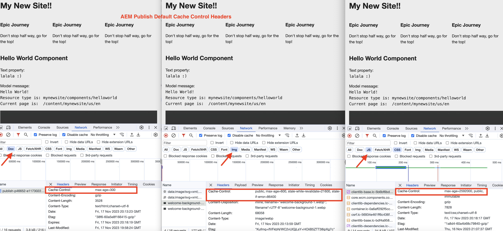

# 如何启用CDN缓存

了解如何在AEM as a Cloud Service的CDN中启用HTTP响应缓存。 响应的缓存由`Cache-Control`、`Surrogate-Control`或`Expires` HTTP响应缓存标头控制。

这些缓存标头通常在使用`mod_headers`的AEM Dispatcher vhost配置中进行设置，但也可以在AEM Publish本身中运行的自定义Java™代码中进行设置。

## 默认缓存行为

当自定义配置不存在时，将使用默认值。 在以下屏幕截图中，您可以看到在部署基于[的](https://github.com/adobe/aem-project-archetype)AEM项目原型`mynewsite`的AEM项目时，AEM Publish和Author的默认缓存行为。

{width="800" zoomable="yes"}

查看[AEM Publish — 默认缓存生命周期](https://experienceleague.adobe.com/docs/experience-manager-learn/cloud-service/caching/publish.html?lang=zh-Hans#cdn-cache-life)和[AEM Author — 默认缓存生命周期](https://experienceleague.adobe.com/docs/experience-manager-learn/cloud-service/caching/author.html?lang=zh-Hans&#default-cache-life)以了解更多信息。

总之，AEM as a Cloud Service在AEM Publish中缓存了大部分内容类型(HTML、JSON、JS、CSS和Assets)，在AEM Author中缓存了少数几种内容类型(JS、CSS)。

## 启用缓存

要更改默认缓存行为，您可以通过两种方式更新缓存标头。

1. **Dispatcher vhost配置：**&#x200B;仅可用于AEM发布。
1. **自定义Java™代码：**&#x200B;可用于AEM发布和创作。

让我们回顾一下这些选项。

### Dispatcher vhost配置

此选项是启用缓存的推荐方法，但它仅适用于AEM Publish。 要更新缓存标头，请使用Apache HTTP Server的vhost文件中的`mod_headers`模块和`<LocationMatch>`指令。 一般语法如下：

```
<LocationMatch "$URL$ || $URL_REGEX$">
    # Removes the response header of this name, if it exists. If there are multiple headers of the same name, all will be removed.
    Header unset Cache-Control
    Header unset Surrogate-Control
    Header unset Expires

    # Instructs the web browser and CDN to cache the response for 'max-age' value (XXX) seconds. The 'stale-while-revalidate' and 'stale-if-error' attributes controls the stale state treatment at CDN layer.
    Header set Cache-Control "max-age=XXX,stale-while-revalidate=XXX,stale-if-error=XXX"
    
    # Instructs the CDN to cache the response for 'max-age' value (XXX) seconds. The 'stale-while-revalidate' and 'stale-if-error' attributes controls the stale state treatment at CDN layer.
    Header set Surrogate-Control "max-age=XXX,stale-while-revalidate=XXX,stale-if-error=XXX"
    
    # Instructs the web browser and CDN to cache the response until the specified date and time.
    Header set Expires "Sun, 31 Dec 2023 23:59:59 GMT"
</LocationMatch>
```

下面总结了每个&#x200B;**标头**&#x200B;的用途以及适用于标头的&#x200B;**属性**。

|                     | Web浏览器 | CDN | 描述 |
|---------------------|:-----------:|:---------:|:-----------:|
| Cache-Control | ✔ | ✔ | 此标头可控制Web浏览器和CDN缓存的生命周期。 |
| Surrogate-Control | ✘ | ✔ | 此标头控制CDN缓存的生命周期。 |
| 过期 | ✔ | ✔ | 此标头可控制Web浏览器和CDN缓存的生命周期。 |


- **max-age**：此属性控制响应内容的TTL或“生存时间”（以秒为单位）。
- **stale-while-revalidate**：当收到的请求在指定时间段内（以秒为单位）时，此属性控制CDN层响应内容的&#x200B;_过时状态_&#x200B;处理。 _过时状态_&#x200B;是TTL过期之后和重新验证响应之前的时间段。
- **stale-if-error**：当源服务器不可用且收到的请求在指定的时间段内（以秒为单位）时，此属性控制CDN层响应内容的&#x200B;_过时状态_&#x200B;处理。

有关详细信息，请查看[失效和重新验证](https://developer.fastly.com/learning/concepts/edge-state/cache/stale/)的详细信息。

#### 示例

要将&#x200B;**HTML内容类型**&#x200B;的Web浏览器和CDN缓存生命周期增加到&#x200B;_10分钟_，而不进行过时的状态处理，请执行以下步骤：

1. 在AEM项目中，从`dispatcher/src/conf.d/available_vhosts`目录中找到所需的vhsot文件。
1. 按如下方式更新vhost （例如`wknd.vhost`）文件：

   ```
   <LocationMatch "^/content/.*\.(html)$">
       # Removes the response header if present
       Header unset Cache-Control
   
       # Instructs the web browser and CDN to cache the response for max-age value (600) seconds.
       Header set Cache-Control "max-age=600"
   </LocationMatch>
   ```

   `dispatcher/src/conf.d/enabled_vhosts`目录中的vhost文件是&#x200B;**目录中文件的**&#x200B;符号链接`dispatcher/src/conf.d/available_vhosts`，因此请确保创建符号链接（如果不存在）。
1. 使用[Cloud Manager - Web层配置管道](https://experienceleague.adobe.com/docs/experience-manager-cloud-service/content/implementing/using-cloud-manager/cicd-pipelines/introduction-ci-cd-pipelines.html?lang=zh-Hans&#web-tier-config-pipelines)或[RDE命令](https://experienceleague.adobe.com/docs/experience-manager-learn/cloud-service/developing/rde/how-to-use.html?lang=zh-Hans#deploy-apache-or-dispatcher-configuration)，将vhost更改部署到所需的AEM as a Cloud Service环境。

但是，要使Web浏览器和CDN缓存的生命周期值不同，可以使用上例中的`Surrogate-Control`标头。 同样，要在特定的日期和时间使缓存过期，您可以使用`Expires`标头。 此外，使用`stale-while-revalidate`和`stale-if-error`属性，您可以控制响应内容的过时状态处理。 AEM WKND项目具有[引用过时状态处理](https://github.com/adobe/aem-guides-wknd/blob/main/dispatcher/src/conf.d/available_vhosts/wknd.vhost#L150-L155) CDN缓存配置。

同样，您还可以更新其他内容类型(JSON、JS、CSS和Assets)的缓存标头。

### 自定义Java™代码

此选项对AEM Publish和Author均可用。 但是，不建议在AEM Author中启用缓存并保留默认缓存行为。

要更新缓存标头，请使用自定义Java™代码（Sling servlet、Sling servlet过滤器）中的`HttpServletResponse`对象。 一般语法如下：

```java
// Instructs the web browser and CDN to cache the response for 'max-age' value (XXX) seconds. The 'stale-while-revalidate' and 'stale-if-error' attributes controls the stale state treatment at CDN layer.
response.setHeader("Cache-Control", "max-age=XXX,stale-while-revalidate=XXX,stale-if-error=XXX");

// Instructs the CDN to cache the response for 'max-age' value (XXX) seconds. The 'stale-while-revalidate' and 'stale-if-error' attributes controls the stale state treatment at CDN layer.
response.setHeader("Surrogate-Control", "max-age=XXX,stale-while-revalidate=XXX,stale-if-error=XXX");

// Instructs the web browser and CDN to cache the response until the specified date and time.
response.setHeader("Expires", "Sun, 31 Dec 2023 23:59:59 GMT");
```
