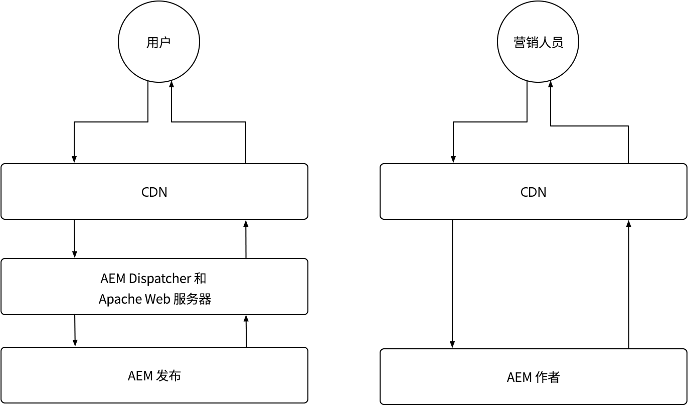
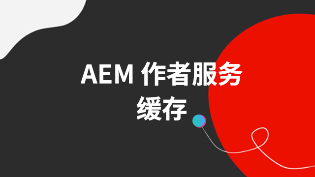

# AEMas a Cloud Service缓存

在AEMas a Cloud Service中，了解缓存至关重要。 缓存涉及存储和重用之前获取的数据，以提高系统效率并减少加载时间。 此机制可显着加快内容交付、提升网站性能并优化用户体验。

AEMas a Cloud Service具有多个缓存层，并且Author和Publish服务中的策略有所不同。

{align="center"}

## AEM缓存

AEMas a Cloud Service具有强大、可配置的多层缓存策略，包括CDN、AEM Dispatcher和可选的客户管理的CDN。 可以微调跨层的缓存以优化性能，从而确保AEM仅提供最佳体验。 AEM对Author和Publish服务的缓存存在不同疑虑。 探索以下每项服务的缓存策略。

    

    

        

          <figure class="image is-16by9">
            
          </figure>
        

        

          

            
<a href="./publish.md" title="AEM Publish服务缓存">AEM Publish服务缓存</a>

            
AEM Publish服务使用托管的CDN和AEM Dispatcher来优化最终用户Web体验。

            <a href="./publish.md" class="spectrum-Button spectrum-Button--outline spectrum-Button--primary spectrum-Button--sizeM">
              学习
            </a>
          

        

      

    

    

        

            

            <figure class="image is-16by9">
                
            </figure>
            

            

            

                
<a href="./author.md" title="AEM Author服务缓存">AEM Author服务缓存</a>

                
AEM Author服务使用托管的CDN来提供优化的创作体验。

                <a href="./author.md" class="spectrum-Button spectrum-Button--outline spectrum-Button--primary spectrum-Button--sizeM">
                学习
                </a>
            

            

        

    

