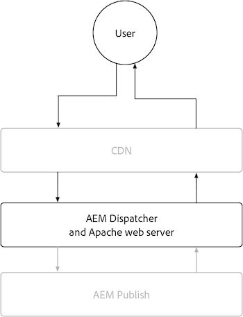

# AEM 发布

AEM Publish服务有两个主要缓存层，即AEMas a Cloud ServiceCDN和AEM Dispatcher。 或者，可以将客户管理的CDN放置在AEMas a Cloud ServiceCDN之前。 AEMas a Cloud ServiceCDN提供内容的边缘交付，确保为全球各地的用户提供低延迟的体验。 AEM Dispatcher直接在AEM Publish之前提供缓存，并用于减轻AEM Publish本身不必要的负载。

{align="center"}

## CDN

AEMas a Cloud Service的CDN缓存由HTTP响应缓存标头控制，旨在缓存内容以优化新鲜度和性能之间的平衡。 CDN位于最终用户和AEM Dispatcher之间，用于缓存尽可能接近最终用户的内容，确保性能体验。

{align="center"}

配置CDN如何缓存内容时，仅限设置有关HTTP响应的缓存标头。 通常使用以下方式在AEM Dispatcher vhost配置中设置这些缓存标头 `mod_headers`，也可以在AEM Publish本身运行的自定义Java™代码中进行设置。

### 何时缓存HTTP请求/响应？

AEMas a Cloud ServiceCDN仅缓存HTTP响应，并且必须满足以下所有条件：

+ HTTP请求状态为 `2xx` 或 `3xx`
+ HTTP请求方法为 `GET` 或 `HEAD`
+ 至少存在以下HTTP响应标头之一： `Cache-Control`， `Surrogate-Control`，或  `Expires`
+ HTTP响应可以是任何内容类型，包括HTML、JSON、CSS、JS和二进制文件。

默认情况下，不缓存HTTP响应 [AEM调度程序](#aem-dispatcher) 自动删除任何HTTP响应缓存标头，以避免CDN上的缓存。 可以通过仔细覆盖此行为 `mod_headers` 使用 `Header always set ...` 指令。

### 缓存了哪些内容？

AEMas a Cloud ServiceCDN缓存以下内容：

+ HTTP响应正文
+ HTTP响应标头

通常，对单个URL的HTTP请求/响应会缓存为单个对象。 但是，当 `Vary` 标头是在HTTP响应中设置的。 避免指定 `Vary` 对于其值没有严格控制的值集的标头，因为这可能会导致许多缓存未命中，从而降低缓存命中率。 要在AEM Dispatcher中支持缓存各种请求，请执行以下操作： [查看变体缓存文档](https://experienceleague.adobe.com/docs/experience-manager-learn/cloud-service/developing/advanced/variant-caching.html).

### 缓存期限{#cdn-cache-life}

AEM Publish CDN基于TTL（生存时间），这意味着缓存生命周期由 `Cache-Control`， `Surrogate-Control`，或 `Expires` HTTP响应标头。 如果项目未设置HTTP响应缓存标头，并且 [合格标准](#when-are-http-requestsresponses-cached) 如果满足，Adobe将默认缓存生命周期设置为10分钟（600秒）。

以下是缓存标头对CDN缓存生命周期的影响：

+ [`Cache-Control`](https://developer.fastly.com/reference/http/http-headers/Cache-Control/) HTTP响应标头会指示Web浏览器和CDN将响应缓存多长时间。 该值以秒为单位。 例如， `Cache-Control: max-age=3600` 告知Web浏览器将响应缓存一小时。 在以下情况下，此值会被CDN忽略： `Surrogate-Control` HTTP响应标头也存在。
+ [`Surrogate-Control`](https://developer.fastly.com/reference/http/http-headers/Surrogate-Control/) HTTP响应标头会指示AEM CDN将响应缓存多长时间。 该值以秒为单位。 例如， `Surrogate-Control: max-age=3600` 告知CDN将响应缓存一小时。
+ [`Expires`](https://developer.fastly.com/reference/http/http-headers/Expires/) HTTP响应标头会指示AEM CDN（和Web浏览器）缓存的响应有效的时长。 该值是一个日期。 例如， `Expires: Sat, 16 Sept 2023 09:00:00 EST` 告知Web浏览器在指定的日期和时间之前缓存响应。

使用 `Cache-Control` 在浏览器和CDN的缓存生命周期相同的情况下，控制缓存的生命周期。 使用 `Surrogate-Control` Web浏览器应在与CDN不同的持续时间内缓存响应。

#### 默认缓存期限

如果HTTP响应符合AEM Dispatcher缓存的条件 [每个上述限定符](#when-are-http-requestsresponses-cached)，除非存在自定义配置，否则以下为默认值。

| 内容类型 | 默认CDN缓存期限 |
|:------------ |:---------- |
| [HTML/JSON/XML](https://experienceleague.adobe.com/docs/experience-manager-cloud-service/content/implementing/content-delivery/caching.html#html-text) | 5 分钟 |
| [资产（图像、视频、文档等）](https://experienceleague.adobe.com/docs/experience-manager-cloud-service/content/implementing/content-delivery/caching.html#images) | 10 分钟 |
| [持久查询(JSON)](https://experienceleague.adobe.com/docs/experience-manager-cloud-service/content/headless/graphql-api/persisted-queries.html?publish-instances) | 2 小时 |
| [客户端库(JS/CSS)](https://experienceleague.adobe.com/docs/experience-manager-cloud-service/content/implementing/content-delivery/caching.html#client-side-libraries) | 30 天 |
| [其他](https://experienceleague.adobe.com/docs/experience-manager-cloud-service/content/implementing/content-delivery/caching.html#other-content) | 未缓存 |

### 如何自定义缓存规则

[配置CDN如何缓存内容](https://experienceleague.adobe.com/docs/experience-manager-cloud-service/content/implementing/content-delivery/caching.html#disp) 仅限于在HTTP响应中设置缓存标头。 这些缓存标头通常在AEM Dispatcher中设置 `vhost` 配置使用 `mod_headers`，也可以在AEM Publish本身运行的自定义Java™代码中进行设置。

## AEM Dispatcher

{align="center"}

### 何时缓存HTTP请求/响应？

当满足以下所有条件时，将缓存相应HTTP请求的HTTP响应：

+ HTTP请求方法为 `GET` 或 `HEAD`
   + `HEAD` HTTP请求仅缓存HTTP响应标头。 他们没有反应机构。
+ HTTP响应状态为 `200`
+ HTTP响应不适用于二进制文件。
+ HTTP请求URL路径以扩展结尾，例如： `.html`， `.json`， `.css`， `.js`，等等。
+ HTTP请求不包含授权，并且未由AEM进行身份验证。
   + 但是，缓存经过身份验证的请求 [可全局启用](https://experienceleague.adobe.com/docs/experience-manager-dispatcher/using/configuring/dispatcher-configuration.html#caching-when-authentication-is-used) 或者选择通过 [权限敏感型缓存](https://experienceleague.adobe.com/docs/experience-manager-dispatcher/using/configuring/permissions-cache.html?lang=zh-Hans).
+ http请求不包含查询参数。
   + 但是，配置 [忽略的查询参数](https://experienceleague.adobe.com/docs/experience-manager-dispatcher/using/configuring/dispatcher-configuration.html?lang=en#ignoring-url-parameters) 允许从缓存中缓存/提供包含已忽略查询参数的HTTP请求。
+ HTTP请求的路径 [与允许Dispatcher规则匹配，与拒绝规则不匹配](https://experienceleague.adobe.com/docs/experience-manager-dispatcher/using/configuring/dispatcher-configuration.html#specifying-the-documents-to-cache).
+ HTTP响应不具有AEM Publish设置的以下任何HTTP响应标头：

   + `no-cache`
   + `no-store`
   + `must-revalidate`

### 缓存了哪些内容？

AEM Dispatcher缓存以下内容：

+ HTTP响应正文
+ 在Dispatcher的 [缓存标头配置](https://experienceleague.adobe.com/docs/experience-manager-dispatcher/using/configuring/dispatcher-configuration.html#caching-http-response-headers). 查看附带的默认配置 [AEM项目原型](https://github.com/adobe/aem-project-archetype/blob/develop/src/main/archetype/dispatcher.cloud/src/conf.dispatcher.d/available_farms/default.farm#L106-L113).
   + `Cache-Control`
   + `Content-Disposition`
   + `Content-Type`
   + `Expires`
   + `Last-Modified`
   + `X-Content-Type-Options`

### 缓存期限

AEM Dispatcher使用以下方法缓存HTTP响应：

+ 直到通过发布或取消发布内容等机制触发失效。
+ TTL（生存时间），当明确指定 [在Dispatcher配置中配置](https://experienceleague.adobe.com/docs/experience-manager-dispatcher/using/configuring/dispatcher-configuration.html#configuring-time-based-cache-invalidation-enablettl). 请参阅中的默认配置 [AEM项目原型](https://github.com/adobe/aem-project-archetype/blob/develop/src/main/archetype/dispatcher.cloud/src/conf.dispatcher.d/available_farms/default.farm#L122-L127) 通过查看 `enableTTL` 配置。

#### 默认缓存期限

如果HTTP响应符合AEM Dispatcher缓存的条件 [每个上述限定符](#when-are-http-requestsresponses-cached-1)，除非存在自定义配置，否则以下为默认值。

| 内容类型 | 默认CDN缓存期限 |
|:------------ |:---------- |
| [HTML/JSON/XML](https://experienceleague.adobe.com/docs/experience-manager-cloud-service/content/implementing/content-delivery/caching.html#html-text) | 直到失效 |
| [资产（图像、视频、文档等）](https://experienceleague.adobe.com/docs/experience-manager-cloud-service/content/implementing/content-delivery/caching.html#images) | 无 |
| [持久查询(JSON)](https://experienceleague.adobe.com/docs/experience-manager-cloud-service/content/headless/graphql-api/persisted-queries.html?publish-instances) | 1分钟 |
| [客户端库(JS/CSS)](https://experienceleague.adobe.com/docs/experience-manager-cloud-service/content/implementing/content-delivery/caching.html#client-side-libraries) | 30 天 |
| [其他](https://experienceleague.adobe.com/docs/experience-manager-cloud-service/content/implementing/content-delivery/caching.html#other-content) | 直到失效 |

### 如何自定义缓存规则

AEM Dispatcher的缓存可以通过以下方式配置 [Dispatcher配置](https://experienceleague.adobe.com/docs/experience-manager-dispatcher/using/configuring/dispatcher-configuration.html?lang=en#configuring-the-dispatcher-cache-cache) 包括：

+ 缓存的内容
+ 发布/取消发布时缓存的哪些部分无效
+ 评估缓存时会忽略哪些HTTP请求查询参数
+ 缓存了哪些HTTP响应标头
+ 启用或禁用TTL缓存
+ ...等等

使用 `mod_headers` 要设置缓存标头 `vhost` 配置将不会影响Dispatcher缓存（基于TTL），因为AEM Dispatcher处理响应后，会将它们添加到HTTP响应中。 要通过HTTP响应标头影响Dispatcher缓存，需要在AEM Publish中运行的自定义Java™代码来设置相应的HTTP响应标头。
