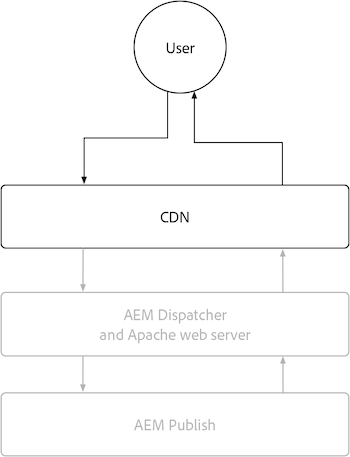

# AEM 发布

AEM Publish服务有两个主要缓存层，即AEM as a Cloud Service CDN和AEM Dispatcher。 或者，可以将客户管理的CDN放在AEM as a Cloud Service CDN之前。 AEM as a Cloud Service CDN提供边缘内容交付，确保为全球范围内的用户提供低延迟的体验。 AEM Dispatcher直接在AEM Publish之前提供缓存，并用于减轻AEM Publish本身不必要的负载。

{align="center"}

## CDN

AEM as a Cloud Service的CDN缓存由HTTP响应缓存标头控制，旨在缓存内容以优化新鲜度和性能之间的平衡。 CDN位于最终用户和AEM Dispatcher之间，用于缓存尽可能接近最终用户的内容，确保性能体验。

{align="center"}

配置CDN如何缓存内容时，仅限设置有关HTTP响应的缓存标头。 这些缓存标头通常在使用`mod_headers`的AEM Dispatcher vhost配置中进行设置，但也可以在AEM Publish本身中运行的自定义Java™代码中进行设置。

### 何时缓存HTTP请求/响应？

AEM as a Cloud Service CDN仅缓存HTTP响应，并且必须满足以下所有条件：

+ HTTP响应状态为`2xx`或`3xx`
+ HTTP请求方法为`GET`或`HEAD`
+ 至少存在以下HTTP响应标头之一： `Cache-Control`、`Surrogate-Control`或`Expires`
+ HTTP响应可以是任何内容类型，包括HTML、JSON、CSS、JS和二进制文件。

默认情况下，[AEM Dispatcher](#aem-dispatcher)未缓存的HTTP响应会自动删除任何HTTP响应缓存标头，以避免在CDN上缓存。 如有必要，可以使用`mod_headers`和`Header always set ...`指令仔细覆盖此行为。

### 缓存了哪些内容？

AEM as a Cloud Service CDN缓存以下内容：

+ HTTP响应正文
+ HTTP响应标头

通常，对单个URL的HTTP请求/响应会缓存为单个对象。 但是，如果在HTTP响应上设置`Vary`标头，则CDN可以处理单个URL的多个对象的缓存。 避免在值没有严格控制的值集的标头上指定`Vary`，因为这可能会导致许多缓存未命中，从而降低缓存命中率。 为了支持在AEM Dispatcher中缓存各种请求，[请查看变量缓存文档](https://experienceleague.adobe.com/docs/experience-manager-learn/cloud-service/developing/advanced/variant-caching.html)。

### 缓存期限{#cdn-cache-life}

AEM Publish CDN基于TTL（生存时间），这意味着缓存生命周期由`Cache-Control`、`Surrogate-Control`或`Expires` HTTP响应标头决定。 如果项目未设置HTTP响应缓存标头，并且符合[资格标准](#when-are-http-requestsresponses-cached)，则Adobe将默认缓存生命周期设置为10分钟（600秒）。

以下是缓存标头对CDN缓存生命周期的影响：

+ [`Cache-Control`](https://developer.fastly.com/reference/http/http-headers/Cache-Control/) HTTP响应标头指示Web浏览器和CDN将响应缓存多长时间。 该值以秒为单位。 例如，`Cache-Control: max-age=3600`告诉Web浏览器将响应缓存一小时。 如果还存在`Surrogate-Control` HTTP响应标头，此值将被CDN忽略。
+ [`Surrogate-Control`](https://developer.fastly.com/reference/http/http-headers/Surrogate-Control/) HTTP响应标头将指示AEM CDN将响应缓存多长时间。 该值以秒为单位。 例如，`Surrogate-Control: max-age=3600`告知CDN将响应缓存一小时。
+ [`Expires`](https://developer.fastly.com/reference/http/http-headers/Expires/) HTTP响应标头将指示AEM CDN（和Web浏览器）缓存的响应有效的时长。 该值是一个日期。 例如，`Expires: Sat, 16 Sept 2023 09:00:00 EST`告知Web浏览器在指定的日期和时间之前缓存响应。

当浏览器和CDN的缓存生命周期相同时，可使用`Cache-Control`来控制缓存生命周期。 当Web浏览器应缓存与CDN不同的响应持续时间时，请使用`Surrogate-Control`。

#### 默认缓存期限

如果HTTP响应符合上述限定符[&#128279;](#when-are-http-requestsresponses-cached)的AEM Dispatcher缓存的条件，则除非存在自定义配置，否则以下是默认值。

| 内容类型 | 默认CDN缓存期限 |
|:------------ |:---------- |
| [HTML/JSON/XML](https://experienceleague.adobe.com/docs/experience-manager-cloud-service/content/implementing/content-delivery/caching.html#html-text) | 5 分钟 |
| [Assets（图像、视频、文档等）](https://experienceleague.adobe.com/docs/experience-manager-cloud-service/content/implementing/content-delivery/caching.html#images) | 10 分钟 |
| [持久查询(JSON)](https://experienceleague.adobe.com/docs/experience-manager-cloud-service/content/headless/graphql-api/persisted-queries.html?publish-instances) | 2 小时 |
| [客户端库(JS/CSS)](https://experienceleague.adobe.com/docs/experience-manager-cloud-service/content/implementing/content-delivery/caching.html#client-side-libraries) | 30 天 |
| [其他](https://experienceleague.adobe.com/docs/experience-manager-cloud-service/content/implementing/content-delivery/caching.html#other-content) | 未缓存 |

### 如何自定义缓存规则

[将CDN缓存内容的方式](https://experienceleague.adobe.com/docs/experience-manager-cloud-service/content/implementing/content-delivery/caching.html#disp)限制为在HTTP响应中设置缓存标头。 这些缓存标头通常在使用`mod_headers`的AEM Dispatcher `vhost`配置中进行设置，但也可以在AEM Publish本身中运行的自定义Java™代码中进行设置。

## AEM Dispatcher

{align="center"}

### 何时缓存HTTP请求/响应？

当满足以下所有条件时，将缓存相应HTTP请求的HTTP响应：

+ HTTP请求方法为`GET`或`HEAD`
   + `HEAD` HTTP请求仅缓存HTTP响应标头。 他们没有反应机构。
+ HTTP响应状态为`200`
+ HTTP响应不适用于二进制文件。
+ HTTP请求URL路径以扩展名结尾，例如： `.html`、`.json`、`.css`、`.js`等。
+ HTTP请求不包含授权，并且未由AEM进行身份验证。
   + 但是，身份验证请求[的缓存可以全局启用](https://experienceleague.adobe.com/docs/experience-manager-dispatcher/using/configuring/dispatcher-configuration.html#caching-when-authentication-is-used)，也可以选择性地通过[权限敏感型缓存](https://experienceleague.adobe.com/docs/experience-manager-dispatcher/using/configuring/permissions-cache.html?lang=zh-hans)启用。
+ http请求不包含查询参数。
   + 但是，通过配置[忽略的查询参数](https://experienceleague.adobe.com/docs/experience-manager-dispatcher/using/configuring/dispatcher-configuration.html?lang=en#ignoring-url-parameters)，可以从缓存中缓存/提供具有忽略的查询参数的HTTP请求。
+ HTTP请求的路径[与允许Dispatcher规则匹配，与拒绝规则](https://experienceleague.adobe.com/docs/experience-manager-dispatcher/using/configuring/dispatcher-configuration.html#specifying-the-documents-to-cache)不匹配。
+ HTTP响应不具有AEM Publish设置的以下任何HTTP响应标头：

   + `no-cache`
   + `no-store`
   + `must-revalidate`

### 缓存了哪些内容？

AEM Dispatcher缓存以下内容：

+ HTTP响应正文
+ Dispatcher的[缓存标头配置](https://experienceleague.adobe.com/docs/experience-manager-dispatcher/using/configuring/dispatcher-configuration.html#caching-http-response-headers)中指定的HTTP响应标头。 查看[AEM项目原型](https://github.com/adobe/aem-project-archetype/blob/develop/src/main/archetype/dispatcher.cloud/src/conf.dispatcher.d/available_farms/default.farm#L106-L113)附带的默认配置。
   + `Cache-Control`
   + `Content-Disposition`
   + `Content-Type`
   + `Expires`
   + `Last-Modified`
   + `X-Content-Type-Options`

### 缓存期限

AEM Dispatcher使用以下方法缓存HTTP响应：

+ 直到通过发布或取消发布内容等机制触发失效。
+ 在Dispatcher配置[&#128279;](https://experienceleague.adobe.com/docs/experience-manager-dispatcher/using/configuring/dispatcher-configuration.html#configuring-time-based-cache-invalidation-enablettl)中明确配置时的TTL （生存时间）。 通过查看`enableTTL`配置，查看[AEM项目原型](https://github.com/adobe/aem-project-archetype/blob/develop/src/main/archetype/dispatcher.cloud/src/conf.dispatcher.d/available_farms/default.farm#L122-L127)中的默认配置。

#### 默认缓存期限

如果HTTP响应符合上述限定符[&#128279;](#when-are-http-requestsresponses-cached-1)的AEM Dispatcher缓存的条件，则除非存在自定义配置，否则以下是默认值。

| 内容类型 | 默认CDN缓存期限 |
|:------------ |:---------- |
| [HTML/JSON/XML](https://experienceleague.adobe.com/docs/experience-manager-cloud-service/content/implementing/content-delivery/caching.html#html-text) | 直到失效 |
| [Assets（图像、视频、文档等）](https://experienceleague.adobe.com/docs/experience-manager-cloud-service/content/implementing/content-delivery/caching.html#images) | 无 |
| [持久查询(JSON)](https://experienceleague.adobe.com/docs/experience-manager-cloud-service/content/headless/graphql-api/persisted-queries.html?publish-instances) | 1 分钟 |
| [客户端库(JS/CSS)](https://experienceleague.adobe.com/docs/experience-manager-cloud-service/content/implementing/content-delivery/caching.html#client-side-libraries) | 30 天 |
| [其他](https://experienceleague.adobe.com/docs/experience-manager-cloud-service/content/implementing/content-delivery/caching.html#other-content) | 直到失效 |

### 如何自定义缓存规则

AEM Dispatcher的缓存可以通过[Dispatcher配置](https://experienceleague.adobe.com/docs/experience-manager-dispatcher/using/configuring/dispatcher-configuration.html?lang=en#configuring-the-dispatcher-cache-cache)进行配置，包括：

+ 缓存的内容
+ 发布/取消发布时缓存的哪些部分无效
+ 评估缓存时会忽略哪些HTTP请求查询参数
+ 缓存了哪些HTTP响应标头
+ 启用或禁用TTL缓存
+ ...等等

使用`mod_headers`设置缓存标头`vhost`配置不会影响Dispatcher缓存（基于TTL），因为在AEM Dispatcher处理响应后，这些将添加到HTTP响应中。 要通过HTTP响应标头影响Dispatcher缓存，需要在AEM Publish中运行可设置相应HTTP响应标头的自定义Java™代码。
