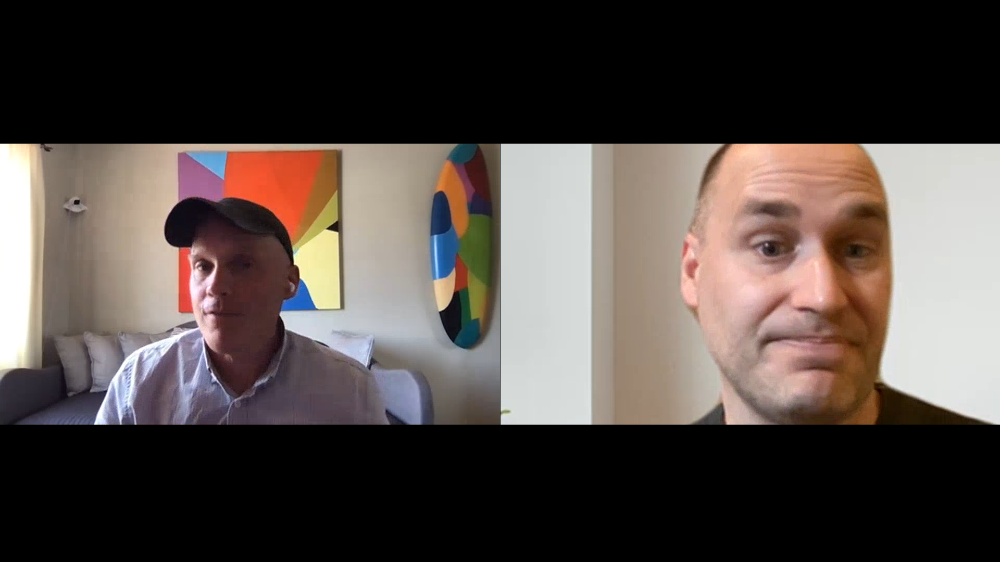

# 云5

>[!VIDEO](https://video.tv.adobe.com/v/346567)

## 简介

欢迎观看第二季的AEM Engineering云5系列。 任何产品的实施阶段的主要问题之一是，有足够的代码示例和/或这些示例、工具或API的实时演示。 此系列的目标是在5分钟或更短的时间内提供有关AEMas a Cloud Service的有用信息。

## 建议框

访问 [建议框](https://forms.office.com/r/74P5Xz4UH0) 提交主题想法。

## 第2季

每个季节的时长各不相同，并按固定时间表发布。 第2季的主题主要源于我们在与客户和合作伙伴的日常接触中遇到的过去的请求。 访问此页面可获取每周更新，或在您选择的社交网络上关注我们。

<table>
    <tr>
        <td>
            
            

                <a href="season-2/cloud5-experience-v-content-fragments.md"><strong>片段</strong></a>        
                 <em>Darin Kuntze &amp; James Talbot，云高级架构师</em>
            

            

                 
                充分利用体验和内容片段之间的差异。 剧透：每个人都会赢。
            

        </td>   
         <td>
            
            

                <a href="season-2/cloud5-repo-modernizer.md"><strong>Repository Modernizer</strong></a> 
                <em>Darin Kuntze &amp; James Talbot，云高级架构师</em>
            

            

                 
                快速了解如何使用repository modernizer将现有项目包重构为与AEM as a cloud service兼容的离散包。
            

         </td>
         <td>
            
            

                  <a href="season-2/cloud5-admin-console.md"><strong>Admin Console</strong></a>
                <em>Darin Kuntze &amp; James Talbot，云高级架构师</em>
            

            

             
               达林和詹姆士讨论了有关管理控制台、配置和访问的一些常见问题。
            

         </td> 
  </tr>
  <tr>
         <td>
            
            

                  <a href="season-2/cloud5-sling-job-scheduler.md"><strong>Sling作业</strong></a>
                <em>Darin Kuntze &amp; James Talbot，云高级架构师</em>
            

            

             
               达林和詹姆斯讨论了AEM as a cloud service中的作业计划和使用情况的难题和需要注意的事项。
            

         </td> 
         <td>
            
            

                  <a href="season-2/cloud5-repoinit.md"><strong>Sling存储库初始值设定项</strong></a>
                <em>Darin Kuntze &amp; James Talbot，云高级架构师</em>
            

            

             
              了解使用Sling存储库初始值设定项（即重新指示）发挥功能的一些技巧。
            

         </td>   
     <td>
            
      

         <a href="season-2/cloud5-fix-your-cache.md"><strong>修复您……缓存</strong></a>
          <em>与Damian Langsweirdt和James Talbot，高级云架构师</em>
      

      

          
             浏览可优化缓存并加快网站在AEMas a Cloud Service上运行的区域。
      

   </td> 
  </tr>
<tr>
   <td>
           
      

            <a href="season-2/cloud5-fix-your-rewrites.md"><strong>修复您……重写</strong></a>
          <em>Darin Kuntze &amp; James Talbot，云高级架构师</em>
      

      

         
         快速了解有助于加快在AEM as a Cloud Service上重写开发和优化的内容。
      

     </td>   
     <td>
            
      

            <a href="season-2/cloud5-mocm-experience-audit.md"><strong>Cloud Manager的奥秘……体验审核</strong></a>
          <em>与高级云架构师Darin Kuntze合作</em>
      

      

         
        了解Cloud Manager及其体验审核功能的基础知识。
      

   </td>
     <td>
            
      

            <a href="season-2/cloud5-mocm-unit-tests.md"><strong>Cloud Manager的奥秘……单元测试</strong></a>
          <em>与高级云架构师Darin Kuntze &amp; Bryan Stopp合作</em>
      

      

         
        Darin和Bryan讨论了Cloud Manager如何将单元测试执行和代码覆盖报告集成到其CI/CD管道中，以帮助鼓励和推广单元测试AEM代码的最佳实践。
      

   </td> 
  </tr>
    <tr>
        <td>
               
            

                <a href="season-2/cloud5-mocm-functional-tests.md"><strong>Cloud Manager的奥秘……功能测试</strong> </a>        
                <em>与高级云架构师Darin Kuntze &amp; Bryan Stopp合作</em>
            

            
 
                达林和布赖恩讨论了AEMas a Cloud Service部署过程中内置的不同类型的功能测试，以确保代码的质量和可靠性。
            

        </td>
        <td></td>
        <td></td>
    </tr>
</table>
