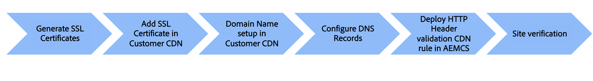

# 具有客户管理的CDN的自定义域名

了解如何将自定义域名添加到使用&#x200B;**客户管理的CDN**&#x200B;的AEM as a Cloud Service网站。

在本教程中，通过使用客户管理的CDN添加具有传输层安全性(TLS)的HTTPS可寻址自定义域名`wkndviaawscdn.enablementadobe.com`，增强了示例[AEM WKND](https://github.com/adobe/aem-guides-wknd)站点的品牌化。 在本教程中，AWS CloudFront用作客户管理的CDN，但任何CDN提供商都应与AEM as a Cloud Service兼容。

>[!VIDEO](https://video.tv.adobe.com/v/3432561?quality=12&learn=on)

高级步骤包括：

具有客户CDN的{width="800" zoomable="yes"}

## 先决条件

>[!VIDEO](https://video.tv.adobe.com/v/3432562?quality=12&learn=on)

- 本地计算机上安装了[OpenSSL](https://www.openssl.org/)和[dig](https://www.isc.org/blogs/dns-checker/)。
- 访问第三方服务：
   - 证书颁发机构(CA) — 为您的站点域（如[DigitCert](https://www.digicert.com/)）请求已签名的证书
   - 客户CDN — 设置客户CDN并添加SSL证书和域详细信息，如AWS CloudFront、Azure CDN或Akamai。
   - 域名系统(DNS)托管服务 — 为您的自定义域添加DNS记录，如Azure DNS或AWS Route 53。
- 访问[Adobe Cloud Manager](https://my.cloudmanager.adobe.com/)以将HTTP标头验证CDN规则部署到AEM as a Cloud Service环境。
- 示例[AEM WKND](https://github.com/adobe/aem-guides-wknd)站点已部署到[生产程序](https://experienceleague.adobe.com/zh-hans/docs/experience-manager-cloud-service/content/implementing/using-cloud-manager/programs/introduction-production-programs)类型的AEM as a Cloud Service环境。

如果您无权访问第三方服务，请&#x200B;_与您的安全或托管团队协作以完成步骤_。

## 生成SSL证书

>[!VIDEO](https://video.tv.adobe.com/v/3441503?quality=12&learn=on&captions=chi_hans)

您有两个选项：

1. 使用`openssl`命令行工具 — 可以为站点域生成私钥和证书签名请求(CSR)。 要请求已签名的证书，请将CSR提交到证书颁发机构(CA)。
1. 您的托管团队为您的站点提供所需的私钥和签名证书。

让我们回顾一下第一个选项的步骤。

要生成私钥和CSR，请运行以下命令并在出现提示时提供所需信息：

```bash
# Generate a private key and a CSR
$ openssl req -newkey rsa:2048 -keyout <YOUR-SITE-NAME>.key -out <YOUR-SITE-NAME>.csr -nodes
```

要请求已签名的证书，请按照相应文档向CA提供生成的CSR。 CA签署CSR后，您会收到已签名的证书文件。

### 查看签名证书

好的做法是在将已签署的证书添加到Cloud Manager之前对其进行审查。 您可以使用以下命令查看证书详细信息：

```bash
# Review the certificate details
$ openssl crl2pkcs7 -nocrl -certfile <YOUR-SIGNED-CERT>.crt | openssl pkcs7 -print_certs -noout
```

签名证书可以包含证书链，证书链包括根证书和中间证书以及终端实体证书。

Adobe Cloud Manager在单独的表单字段&#x200B;_中接受最终实体证书和证书链_，因此您必须从已签名的证书中提取最终实体证书和证书链。

在本教程中，以`*.enablementadobe.com`域颁发的[DigitCert](https://www.digicert.com/)签名证书为例。 通过在文本编辑器中打开签名证书并复制`-----BEGIN CERTIFICATE-----`和`-----END CERTIFICATE-----`标记之间的内容来提取最终实体和证书链。

## 设置客户管理的CDN

>[!VIDEO](https://video.tv.adobe.com/v/3432563?quality=12&learn=on)

设置客户CDN，如AWS CloudFront、Azure CDN或Akamai，并添加SSL证书和域详细信息。 本教程以AWS CloudFront为例。 但是，根据您的CDN供应商，步骤可能有所不同。 关键标注：

- 将SSL证书添加到CDN。
- 将自定义域名添加到CDN。
- 配置CDN以缓存内容，如图像、CSS和JavaScript文件。
- 将`X-Forwarded-Host` HTTP标头添加到CDN设置，以便您的CDN在发送给AEMCD源的所有请求中均包含此标头。
- 确保将`Host`标头值设置为包含项目和环境ID且以`adobeaemcloud.com`结尾的默认AEM as a Cloud Service域。 从客户CDN传递到Adobe CDN的HTTP主机标头值必须是默认的AEM as a Cloud Service域，任何其他值都会导致错误状态。

## 配置DNS记录

>[!VIDEO](https://video.tv.adobe.com/v/3432564?quality=12&learn=on)

要为自定义域配置DNS记录，请执行以下步骤，

1. 为指向CDN域名的自定义域添加CNAME记录。

本教程将自定义域`wkndviaawscdn.enablementadobe.com`的CNAME记录添加到Azure DNS中，并将其指向AWS CloudFront分发域名。

### 站点验证

通过使用自定义域名访问站点来验证自定义域名。
此操作不一定有效，具体取决于AEM as a Cloud Service环境中的vhhost配置。

关键的安全步骤是将HTTP标头验证CDN规则部署到AEM as a Cloud Service环境。 规则可确保请求来自客户CDN，而不是来自任何其他源。

## 当前工作状态，无HTTP标头验证CDN规则

>[!VIDEO](https://video.tv.adobe.com/v/3432565?quality=12&learn=on)

如果没有HTTP标头验证CDN规则，`Host`标头值将设置为包含项目和环境ID且以`adobeaemcloud.com`结尾的默认AEM as a Cloud Service域。 仅当部署了HTTP标头验证CDN规则时，Adobe CDN才会将`Host`标头值转换为从客户CDN接收的`X-Forwarded-Host`的值。 否则，`Host`标头值将按原样传递到AEM as a Cloud Service环境，并且不使用`X-Forwarded-Host`标头。

### 用于打印主机标头值的示例servlet代码

以下servlet代码打印JSON响应中的`Host`、`X-Forwarded-*`、`Referer`和`Via` HTTP标头值。

```java
package com.adobe.aem.guides.wknd.core.servlets;

import java.io.IOException;
import java.util.Enumeration;

import javax.servlet.Servlet;
import javax.servlet.ServletException;

import org.apache.sling.api.SlingHttpServletRequest;
import org.apache.sling.api.SlingHttpServletResponse;
import org.apache.sling.api.resource.ResourceResolverFactory;
import org.apache.sling.api.servlets.HttpConstants;
import org.apache.sling.api.servlets.ServletResolverConstants;
import org.apache.sling.api.servlets.SlingSafeMethodsServlet;
import org.osgi.service.component.annotations.Component;
import org.osgi.service.component.annotations.Reference;

@Component(service = Servlet.class, property = {
        ServletResolverConstants.SLING_SERVLET_PATHS + "=/bin/verify-headers",
        ServletResolverConstants.SLING_SERVLET_METHODS + "=" + HttpConstants.METHOD_GET
})
public class VerifyHeadersServlet extends SlingSafeMethodsServlet {

    @Reference
    private ResourceResolverFactory resourceResolverFactory;

    @Override
    protected void doGet(SlingHttpServletRequest request, SlingHttpServletResponse response)
            throws ServletException, IOException {
        response.setContentType("application/json");
        response.setCharacterEncoding("UTF-8");

        // Create JSON response
        StringBuilder jsonResponse = new StringBuilder();
        jsonResponse.append("{");

        Enumeration<String> headerNames = request.getHeaderNames();
        boolean firstHeader = true;

        while (headerNames.hasMoreElements()) {
            String headerName = headerNames.nextElement();

            if (headerName.startsWith("X-Forwarded-") || headerName.startsWith("Host")
                    || headerName.startsWith("Referer") || headerName.startsWith("Via")) {
                if (!firstHeader) {
                    jsonResponse.append(",");
                }
                jsonResponse.append("\"").append(headerName).append("\": \"").append(request.getHeader(headerName))
                        .append("\"");
                firstHeader = false;
            }
        }

        jsonResponse.append("}");

        response.getWriter().write(jsonResponse.toString());
    }
}
```

要测试servlet，请使用以下配置更新`../dispatcher/src/conf.dispatcher.d/filters/filters.any`文件。 同时确保CDN配置为&#x200B;**不缓存** `/bin/*`路径。

```plaintext
# Testing purpose bin
/0300 { /type "allow" /extension "json" /path "/bin/*"}
/0301 { /type "allow" /path "/bin/*"}
/0302 { /type "allow" /url "/bin/*"}
```

## 配置和部署HTTP标头验证CDN规则

>[!VIDEO](https://video.tv.adobe.com/v/3432566?quality=12&learn=on)

要配置和部署HTTP标头验证CDN规则，请执行以下步骤：

- 在`cdn.yaml`文件中添加HTTP标头验证CDN规则，下面提供了一个示例。

  ```yaml
  kind: "CDN"
  version: "1"
  metadata:
    envTypes: ["prod"]
  data:
    authentication:
      authenticators:
        - name: edge-auth
          type: edge
          edgeKey1: ${{CDN_EDGEKEY_080124}}
          edgeKey2: ${{CDN_EDGEKEY_110124}}
      rules:
        - name: edge-auth-rule
          when: { reqProperty: tier, equals: "publish" }
          action:
            type: authenticate
            authenticator: edge-auth
  ```

- 使用Cloud Manager UI创建机密类型环境变量(CDN_EDGEKEY_080124、CDN_EDGEKEY_110124)。
- 使用Cloud Manager管道将HTTP标头验证CDN规则部署到AEM as a Cloud Service环境。

## 在X-AEM-Edge-Key HTTP标头中传递密钥

>[!VIDEO](https://video.tv.adobe.com/v/3445055?quality=12&learn=on&captions=chi_hans)

更新客户CDN以在`X-AEM-Edge-Key` HTTP标头中传递密钥。 Adobe CDN使用该密钥来验证请求是否来自客户CDN，并将`Host`标头值转换为从客户CDN接收的`X-Forwarded-Host`的值。

## 端到端视频

您还可以观看演示上述步骤的端到端视频，将具有客户管理的CDN的自定义域名添加到AEM as a Cloud Service托管的站点。

>[!VIDEO](https://video.tv.adobe.com/v/3432568?quality=12&learn=on)
