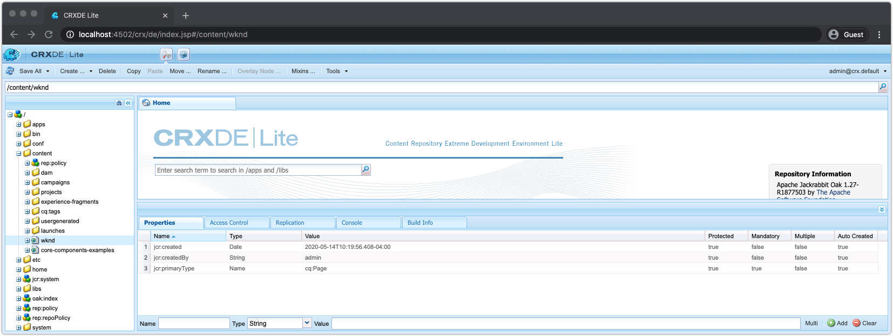

# 用于调试AEM SDK的其他工具

其他各种工具可帮助在AEM SDK的本地快速启动中调试应用程序。

## CRXDE Lite

CRXDE Lite是基于Web的界面，用于与JCR AEM数据存储库进行交互。 CRXDE Lite提供对JCR的完全可见性，包括节点、属性、属性值和权限。

CRXDE Lite位于：

+ 工具>常规>CRXDE Lite
+ 或直接在[http://localhost:4502/crx/de/index.jsp](http://localhost:4502/crx/de/index.jsp)上访问

## 说明查询

解释AEM SDK本地快速入门中基于Web的查询工具，该工具提供了AEM如何解释和执行查询的关键分析，并且是一款非常宝贵的工具，可确保AEM以性能方式执行查询。

解释查询位于：

+ “工具”>“诊断”>“查询性能”>“说明查询”选项卡
+ [http://localhost:4502/libs/granite/operations/content/diagnosistools/queryPerformance.html](http://localhost:4502/libs/granite/operations/content/diagnosistools/queryPerformance.html)  > Explain Query选项卡

## QueryBuilder Debugger

QueryBuilder调试器是一个基于Web的工具，可帮助您使用AEM [QueryBuilder](https://experienceleague.adobe.com/docs/experience-manager-65/developing/platform/query-builder/querybuilder-api.html)语法来调试和了解搜索查询。

QueryBuilder Debugger位于：

+ [http://localhost:4502/libs/cq/search/content/querydebug.html](http://localhost:4502/libs/cq/search/content/querydebug.html)

