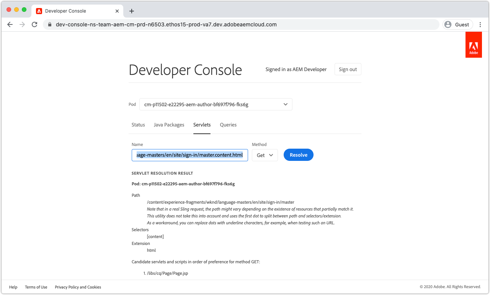

# 使用Developer Console调试AEM as a Cloud Service

AEM as a Cloud Service为每个环境提供了一个Developer Console，该环境会公开运行中有助于调试的AEM服务的各种详细信息。

每个AEM as a Cloud Service环境都有自己的Developer Console。

## 导航到Developer Console

通过Cloud Manager，每个AEM as a Cloud Service环境可访问Developer Console。

1. 导航到&#x200B;__[Cloud Manager](https://my.cloudmanager.adobe.com/)__
2. 打开包含AEM as a Cloud Service环境的&#x200B;__项目__&#x200B;以打开Developer Console。
3. 找到&#x200B;__环境__，然后选择`...`。
4. 从下拉列表中选择&#x200B;__Developer Console__。

## Developer Console访问权限

要访问和使用Developer Console，必须通过[Adobe的Adobe ID](https://adminconsole.adobe.com)向开发人员的Admin Console授予以下权限。

1. 确保在Adobe组织切换器中看到Adobe组织，该组织与您要在Developer Console中检查的环境相关。
1. 为了能够登录到Developer Console，开发人员必须是以下任意角色的成员：
   + [Cloud Manager产品的&#x200B;__开发人员 — Cloud Service__&#x200B;产品配置文件](https://experienceleague.adobe.com/docs/experience-manager-cloud-service/content/onboarding/journey/assign-profiles-cloud-manager.html#assign-developer)：在这种情况下，开发人员将看到选定Developer Console URL下可用环境的完整列表；如果已在Cloud Manager中选择开发环境或RDE，则可能会显示同一程序中的其他开发环境或RDE。
   + [__AEM Author__](https://experienceleague.adobe.com/docs/experience-manager-cloud-service/content/onboarding/journey/assign-profiles-aem.html#aem-product-profiles)上的AEM Administrators __产品配置文件：在这种情况下，上一个项目符号中描述的环境列表将限制为分配此角色的相关产品配置文件。__
1. 开发人员必须是AEM Author和/或Publish[&#128279;](https://experienceleague.adobe.com/docs/experience-manager-cloud-service/content/onboarding/journey/assign-profiles-aem.html#aem-product-profiles)上的&#x200B;__AEM Users__&#x200B;或&#x200B;__AEM Administrators__&#x200B;产品配置文件的成员。
   + 如果此成员资格不存在，则[状态](#status)转储将超时，并出现401未授权错误。

### Developer Console访问疑难解答

#### 登录时，我没有看到所查找的环境已列出

确保以下各项：

+ 通过通过Cloud Manager单击选定环境的三个圆点，然后选择Developer Console，您已选择正确的Developer Console URL。
+ 您或者拥有[Cloud Manager产品的&#x200B;__开发人员 — Cloud Service__&#x200B;产品配置文件](https://experienceleague.adobe.com/docs/experience-manager-cloud-service/content/onboarding/journey/assign-profiles-cloud-manager.html#assign-developer)以查看环境的完整列表，或者您是未找到环境的&#x200B;__AEM作者__[&#128279;](https://experienceleague.adobe.com/docs/experience-manager-cloud-service/content/onboarding/journey/assign-profiles-aem.html#aem-product-profiles)上的&#x200B;__AEM管理员__&#x200B;产品配置文件的一部分。

#### 401转储状态时发生未授权错误

如果转储任何状态时报告了“401未授权错误”，则表示您的用户尚不存在，且在AEM as a Cloud Service中具有必要权限，或者使用的登录令牌无效或已过期。

要解决401未授权问题，请执行以下操作：

1. 确保您的用户是Developer Console关联的AEM as a Cloud Service产品实例相应的Adobe IMS产品配置文件(AEM管理员或AEM用户)的成员。
   + 请记住，Developer Console访问2个Adobe IMS产品实例；AEM as a Cloud Service创作和发布产品实例，因此请确保根据需要通过Developer Console访问的服务层使用正确的产品配置文件。
1. 登录到AEM as a Cloud Service（创作或发布），并确保您的用户和组已正确同步到AEM中。
   + Developer Console要求在相应的AEM服务层中创建您的用户记录，以便对该服务层进行身份验证。
1. 清除您的浏览器Cookie以及应用程序状态（本地存储）并重新登录到Developer Console，以确保Developer Console使用的访问令牌正确且未过期。

## Pod

AEM as a Cloud Service Author和Publish服务分别由多个实例组成，以便在不停机的情况下处理流量可变性和滚动更新。 这些实例称为Pod。 Developer Console中的Pod选择定义将通过其他控件公开的数据范围。

+ Pod是属于AEM服务（创作或发布）的离散实例
+ Pod是瞬态的，这意味着AEM as a Cloud Service会根据需要创建和销毁它们
+ 只有属于关联AEM as a Cloud Service环境的Pod才会列在该环境的Developer Console的Pod切换器中。
+ 在Pod切换器的底部，方便选项允许按服务类型选择Pod：
   + 所有作者
   + 所有发布者
   + 所有实例

## 状态

状态提供用于以文本或JSON输出形式输出特定AEM运行时状态的选项。 Developer Console提供了与AEM SDK的本地快速入门的OSGi Web控制台类似的信息，两者的显着区别在于Developer Console为只读。

### 包

包列出了AEM中的所有OSGi包。 此功能类似于[AEM SDK在`/system/console/bundles`的本地OSGi包](http://localhost:4502/system/console/bundles)。

捆绑包可帮助进行以下调试：

+ 列出部署到AEM即服务的所有OSGi包
+ 列出每个OSGi捆绑包的状态；包括它们是否处于活动状态
+ 提供导致OSGi捆绑包变为活动状态的未解析依赖项的详细信息

### 组件

组件列出了AEM中的所有OSGi组件。 此功能类似于[AEM SDK在`/system/console/components`的本地Quickstart的OSGi组件](http://localhost:4502/system/console/components)。

组件通过以下方式帮助进行调试：

+ 列出部署到AEM as a Cloud Service的所有OSGi组件
+ 提供每个OSGi组件的状态；包括它们是活动的还是不满足的
+ 向不满足的服务引用提供详细信息可能会导致OSGi组件变为活动状态
+ 列出绑定到OSGi组件的OSGi属性及其值。
   + 这将显示通过[OSGi环境配置变量](https://experienceleague.adobe.com/docs/experience-manager-cloud-service/content/implementing/deploying/configuring-osgi.html#environment-specific-configuration-values)插入的实际值。

### 配置

配置列出了所有OSGi组件的配置（OSGi属性和值）。 此功能类似于[AEM SDK在`/system/console/configMgr`的本地Quickstart的OSGi Configuration Manager](http://localhost:4502/system/console/configMgr)。

配置可通过以下方式帮助进行调试：

+ 按OSGi组件列出OSGi属性及其值
   + 这不会显示通过[OSGi环境配置变量](https://experienceleague.adobe.com/docs/experience-manager-cloud-service/content/implementing/deploying/configuring-osgi.html#environment-specific-configuration-values)插入的实际值。 有关插入的值，请参阅上面的[组件](#components)。
+ 查找和识别配置错误的属性

### Oak索引

Oak索引提供`/oak:index`下定义的节点的转储。 请记住，这不会显示合并的索引，在修改AEM索引时会发生这种情况。

Oak索引通过以下方式帮助进行调试：

+ 列出所有Oak索引定义，深入分析如何在AEM中执行搜索查询。 请记住，此处不反映对AEM索引所做的修改。 此视图仅对由AEM单独提供或仅由自定义代码提供的索引有用。

### OSGi服务

组件列出了所有OSGi服务。 此功能类似于[AEM SDK在`/system/console/services`的本地Quickstart OSGi服务](http://localhost:4502/system/console/services)。

OSGi Services帮助通过以下方式调试：

+ 列出AEM中的所有OSGi服务，以及其提供的OSGi捆绑包和使用该捆绑包的所有OSGi捆绑包

### Sling 作业

Sling作业列出了所有Sling作业队列。 此功能类似于[AEM SDK在`/system/console/slingevent`的本地快速入门作业](http://localhost:4502/system/console/slingevent)。

Sling作业通过以下方式帮助进行调试：

+ Sling作业队列及其配置列表
+ 提供对活动、已排队和已处理Sling作业数量的分析，这有助于在AEM中调试工作流、瞬态工作流和Sling作业执行的其他工作中存在的问题。

## Java包

Java包允许检查Java包和版本是否可以在AEM as a Cloud Service中使用。 此功能与[AEM SDK在`/system/console/depfinder`的本地快速入门依赖项查找器](http://localhost:4502/system/console/depfinder)相同。

Java包用于对由于未解析的导入或脚本（HTL、JSP等）中的类未解析而导致捆绑包无法启动进行故障排除。 如果Java包报告没有捆绑包导出Java包（或版本与OSGi捆绑包导入的版本不匹配）：

+ 确保项目的AEM API Maven依赖项的版本与环境的AEM发行版本匹配（如果可能，请将所有内容更新为最新版本）。
+ 如果在Maven项目中使用额外的Maven依赖项
   + 确定是否可改用AEM SDK API依赖项提供的替代API。
   + 如果需要额外的依赖关系，请确保它作为OSGi捆绑包（而不是纯Jar）提供，并且嵌入到项目的代码包(`ui.apps`)中，类似于核心OSGi捆绑包嵌入到`ui.apps`包中的方式。

## Servlet

Servlet用于提供有关AEM如何将URL解析为最终处理请求的Java servlet或脚本(HTL、JSP)的分析。 此功能与[AEM SDK在`/system/console/servletresolver`的本地Sling Servlet解析程序](http://localhost:4502/system/console/servletresolver)相同。

Servlet有助于调试确定：

+ 如何将URL分解为其可寻址部分（资源、选择器、扩展）。
+ URL解析到的servlet或脚本，可帮助识别格式错误的URL或注册错误的servlet/脚本。

## 查询

查询有助于深入分析在AEM上执行搜索查询的内容和方式。 此功能与[AEM SDK的本地快速入门工具>查询性能](http://localhost:4502/libs/granite/operations/content/diagnosistools/queryPerformance.html)控制台相同。

仅当选择了特定的面板时，查询才起作用，因为它打开该面板的查询性能Web控制台，要求开发人员有权登录到AEM服务。

查询可通过以下方式帮助进行调试：

+ 解释Oak如何解释、分析和执行查询。 在跟踪为什么查询速度缓慢并了解如何加快查询速度时，这一点非常重要。
+ 列出在AEM中运行的最受欢迎的查询，并可解释这些查询。
+ 列出在AEM中运行最慢的查询，并可解释这些查询。
