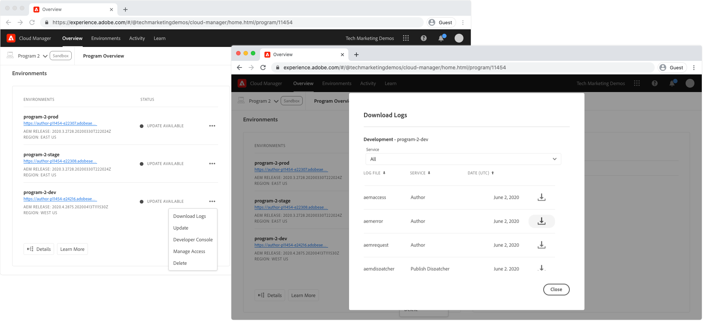

# 使用日志调试AEMas a Cloud Service

日志是调试AEMas a Cloud Service中的AEM应用程序的首选工具，但是需要取决于已部署的AEM应用程序中是否有足够的日志记录。

给定环境的AEM服务（创作、发布/发布Dispatcher）的所有日志活动都合并到一个日志文件中，即使该服务中的其他pod生成日志语句也是如此。

每个log语句中均提供面板ID，并允许过滤或整理log语句。 面板ID的格式为：

+ `cm-p<PROGRAM ID>-e<ENVIRONMENT ID>-aem-<author|publish>-<POD NAME>`
+ 示例: `cm-p12345-e56789-aem-author-abcdefabde-98765`

## 自定义日志文件

AEM as aCloud Service不支持自定义日志文件，但它支持自定义日志记录。

对于可在AEMas a Cloud Service中使用的Java日志(通过 [Cloud Manager](#cloud-manager) 或 [ADOBE I/OCLI](#aio))，自定义日志语句必须写入 `error.log`. 写入自定义命名日志的日志，例如 `example.log`将无法从AEMas a Cloud Service访问。

日志可以写入 `error.log` 在应用程序的 `org.apache.sling.commons.log.LogManager.factory.config~example.cfg.json` 文件。

```
{
   ...
   "org.apache.sling.commons.log.file": "logs/error.log"
   ...
}
```

## AEM创作和发布服务日志

AEM创作和发布服务都提供AEM运行时服务器日志：

+ `aemerror` 是Java错误日志(位于 `/crx-quickstart/logs/error.log` (在AEM SDK本地快速入门中)。 以下是 [建议的日志级别](#log-levels) 对于每种环境类型的自定义记录器：
   + 开发: `DEBUG`
   + 暂存: `WARN`
   + 生产: `ERROR`
+ `aemaccess` 列出对AEM服务的HTTP请求及其详细信息
+ `aemrequest` 列出向AEM服务发出的HTTP请求及其对应的HTTP响应

## AEM发布Dispatcher日志

只有AEM发布Dispatcher提供Apache Web Server和Dispatcher日志，因为这些方面仅存在于AEM发布层，而不存在于AEM创作层。

+ `httpdaccess` 列出对AEM服务的Apache Web Server/Dispatcher发出的HTTP请求。
+ `httperror`  列出来自Apache Web Server的日志消息，并帮助调试支持的Apache模块，例如 `mod_rewrite`.
   + 开发: `DEBUG`
   + 暂存: `WARN`
   + 生产: `ERROR`
+ `aemdispatcher` 列出来自Dispatcher模块的日志消息，包括从缓存消息中进行筛选和服务。
   + 开发: `DEBUG`
   + 暂存: `WARN`
   + 生产: `ERROR`

## Cloud Manager{#cloud-manager}

AdobeCloud Manager允许通过环境的“下载日志”操作，按天下载日志。



可以通过任何日志分析工具下载并检查这些日志。

## 使用Cloud Manager插件Adobe I/OCLI{#aio}

AdobeCloud Manager支持通过访问AEMas a Cloud Service日志 [ADOBE I/OCLI](https://github.com/adobe/aio-cli) 使用 [用于Adobe I/OCLI的Cloud Manager插件](https://github.com/adobe/aio-cli-plugin-cloudmanager).

首先， [使用Cloud Manager插件设置Adobe I/O](../../local-development-environment/development-tools.md#aio-cli).

确保已识别相关的项目ID和环境ID，并使用 [list-available-log-options](https://github.com/adobe/aio-cli-plugin-cloudmanager#aio-cloudmanagerlist-available-log-options-environmentid) 列出用于 [尾](#aio-cli-tail-logs) 或 [下载](#aio-cli-download-logs) 日志。

```
$ aio cloudmanager:list-programs
Program Id Name      Enabled 
14304      Program 1 true    
11454      Program 2 true 
11502      Program 3 true    

$ aio config:set cloudmanager_programid <PROGRAM ID>

$ aio cloudmanager:list-environments        
Environment Id Name            Type  Description 
22295          program-3-dev   dev               
22310          program-3-prod  prod              
22294          program-3-stage stage   

$ aio cloudmanager:list-available-log-options <ENVIRONMENT ID>
Environment Id Service    Name          
22295          author     aemaccess     
22295          author     aemerror      
22295          author     aemrequest    
22295          publish    aemaccess     
22295          publish    aemerror      
22295          publish    aemrequest    
22295          dispatcher httpdaccess   
22295          dispatcher httpderror    
22295          dispatcher aemdispatcher 
```

### 尾随日志{#aio-cli-tail-logs}

Adobe I/OCLI通过使用实时跟踪AEMas a Cloud Service中的日志 [尾日志](https://github.com/adobe/aio-cli-plugin-cloudmanager#aio-cloudmanagertail-log-environmentid-service-name) 命令。 在AEMas a Cloud Service环境中执行操作时，跟踪对于监视实时日志活动很有用。

```
$ aio config:set cloudmanager_programid <PROGRAM ID>
$ aio cloudmanager:tail-logs <ENVIRONMENT ID> <SERVICE> <NAME>
```

其他命令行工具，例如 `grep` 可以和一起使用 `tail-logs` 例如，要帮助隔离感兴趣的日志语句，请执行以下操作：

```
$ aio cloudmanager:tail-logs 12345 author | grep com.example.MySlingModel
```

...仅显示从生成的日志语句 `com.example.MySlingModel` 或包含该字符串。

### 正在下载日志{#aio-cli-download-logs}

Adobe I/OCLI允许使用从AEMas a Cloud Service下载日志 [download-logs](https://github.com/adobe/aio-cli-plugin-cloudmanager#aio-cloudmanagerdownload-logs-environmentid-service-name-days))命令。 这将提供与从Cloud Manager Web UI下载日志相同的最终结果，不同之处在于 `download-logs` 命令根据请求的日志天数，跨天整合日志。

```
$ aio config:set cloudmanager_programid <PROGRAM ID>
$ aio cloudmanager:download-logs <ENVIRONMENT> <SERVICE> <NAME> <DAYS>
```

## 了解日志

AEMas a Cloud Service中的日志有多个Pod向其写入Log语句。 由于多个AEM实例会写入同一个日志文件，因此了解如何在调试时分析并减少噪音非常重要。 为了说明，请遵循以下步骤 `aemerror` 使用了日志片段：

```
01.01.2020 12:00:00.000 [cm-p12345-e56789-aem-author-abcdefg-1111] *DEBUG* [qtp2078364989-269] com.example.components.impl.ExampleModelImpl Preparing to collect resources
01.01.2020 12:00:01.002 [cm-p12345-e56789-aem-author-abcdefg-2222] *WARN*  [qtp40782847611-87] com.example.services.impl.ExampleServiceImpl Unable to resolve resource [ /content/example ] to a resource. Aborting.
01.01.2020 12:00:02.003 [cm-p12345-e56789-aem-author-abcdefg-1111] *ERROR* [qtp2078364989-269] com.example.components.impl.ExampleModelImpl Unable to collect any resources
```

使用Pod ID（日期和时间之后的数据点），可以由Pod或服务中的AEM实例整理日志，从而更容易跟踪和了解代码执行。

__Pod cm-p12345-e56789-aem-author-abcdefg-1111__

```
01.01.2020 12:00:00.000 [cm-p12345-e56789-aem-author-abcdefg-1111] *DEBUG* [qtp2078364989-269] com.example.components.impl.ExampleModelImpl Preparing to collect resources
01.01.2020 12:00:02.003 [cm-p12345-e56789-aem-author-abcdefg-1111] *ERROR* [qtp2078364989-269] com.example.components.impl.ExampleModelImpl Unable to collect any resources
```

__Pod cm-p12345-e56789-aem-author-abcdefg-2222__

```
01.01.2020 12:00:01.002 [cm-p12345-e56789-aem-author-abcdefg-2222] *WARN*  [qtp2078364989-269] com.example.services.impl.ExampleServiceImpl Unable to resolve resource [ /content/example ] to a resource. Aborting.
```

## 建议的日志级别{#log-levels}

Adobe关于每个AEMas a Cloud Service环境的日志级别的一般指导包括：

+ 本地开发(AEM SDK)： `DEBUG`
+ 开发: `DEBUG`
+ 暂存: `WARN`
+ 生产: `ERROR`

为每种环境类型设置最合适的日志级别是使用AEMas a Cloud Service，日志级别在代码中维护

+ Java日志配置在OSGi配置中进行维护
+ Dispatcher项目中的Apache Web Server和Dispatcher日志级别

...因此，需要更改部署。

### 用于设置Java日志级别的特定于环境的变量

除了为每个环境设置静态的已知Java日志级别之外，另一种方法是使用AEM作为Cloud Service [特定于环境的变量](https://experienceleague.adobe.com/docs/experience-manager-cloud-service/implementing/deploying/configuring-osgi.html#environment-specific-configuration-values) 参数化日志级别，允许通过动态更改值 [使用Cloud Manager插件Adobe I/OCLI](#aio-cli).

这需要更新日志记录OSGi配置以使用特定于环境的变量占位符。 [默认值](https://experienceleague.adobe.com/docs/experience-manager-cloud-service/implementing/deploying/configuring-osgi.html#default-values) （对于日志级别），应按以下方式设置 [Adobe推荐](#log-levels). 例如：

`/apps/example/config/org.apache.sling.commons.log.LogManager.factory.config~example.cfg.json`

```
{
    ...
    "org.apache.sling.commons.log.names": ["com.example"],
    "org.apache.sling.commons.log.level": "$[env:LOG_LEVEL;default=DEBUG]"
    ...
}
```

这一方针的弊端必须被考虑在内：

+ [允许的环境变量数量有限](https://experienceleague.adobe.com/docs/experience-manager-cloud-service/implementing/deploying/configuring-osgi.html#number-of-variables)，并创建变量以管理日志级别将使用一个。
+ 可以通过以编程方式管理环境变量 [Cloud Manager](https://experienceleague.adobe.com/docs/experience-manager-cloud-service/content/implementing/using-cloud-manager/environment-variables.html)， [ADOBE I/OCLI](https://github.com/adobe/aio-cli-plugin-cloudmanager#aio-cloudmanagerset-environment-variables-environmentid)、和 [Cloud Manager HTTP API](https://experienceleague.adobe.com/docs/experience-manager-cloud-service/implementing/deploying/configuring-osgi.html#cloud-manager-api-format-for-setting-properties).
+ 对环境变量的更改必须由支持的工具手动重置。 如果忘记将高流量环境（如生产）重置为较不详细的日志级别，可能会淹没日志并影响AEM性能。

_特定于环境的变量不适用于Apache Web Server或Dispatcher日志配置，因为这些配置未通过OSGi配置进行配置。_
