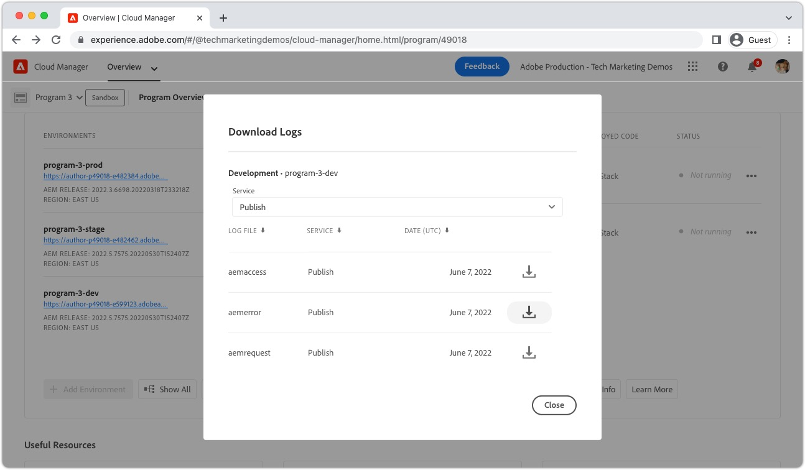
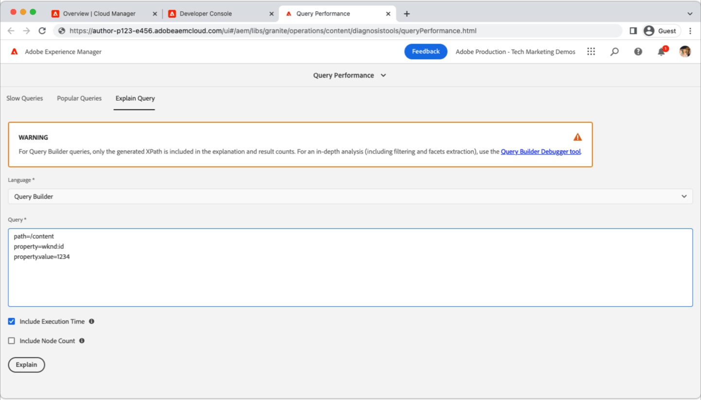

# 遍历警告

>[!TIP]
>请将此页加入书签以供将来参考。

_什么是遍历警告？_

遍历警告是&#x200B;__aemerror__ log语句，指示正在AEM Publish服务上执行性能不佳的查询。 遍历警告通常以两种方式显示在AEM中：

1. __查询速度慢__&#x200B;不使用索引，导致响应时间慢。
1. __查询失败__，抛出`RuntimeNodeTraversalException`，导致体验中断。

允许取消选中遍历警告会减慢AEM性能，并可能导致用户体验受损。

## 如何解决遍历警告

可通过三个简单的步骤来缓解遍历警告：分析、调整和验证。 在确定最优调整之前，需要多次反复调整和验证。

<div class="columns is-multiline">

<!-- Analyze -->
<div class="column is-half-tablet is-half-desktop is-one-third-widescreen" aria-label="Analyze" tabindex="0">
   <div class="x-card">
       <div class="card-image">
           <figure class="image is-16by9">
               <a href="#analyze" title="分析" tabindex="-1">
                   
               </a>
           </figure>
       </div>
       <div class="card-content is-padded-small">
           <div class="content">
                <p class="headline is-size-5 has-text-weight-bold">分析问题</p>
               <p class="is-size-6">识别并了解正在遍历的查询。</p>
               <a href="#analyze" class="spectrum-Button spectrum-Button--outline spectrum-Button--primary spectrum-Button--sizeM">
                   <span class="spectrum-Button-label has-no-wrap has-text-weight-bold">分析</span>
               </a>
           </div>
       </div>
   </div>
</div>

<!-- Adjust -->
<div class="column is-half-tablet is-half-desktop is-one-third-widescreen" aria-label="Adjust" tabindex="0">
   <div class="x-card">
       <div class="card-image">
           <figure class="image is-16by9">
               <a href="#adjust" title="调整" tabindex="-1">
                   
               </a>
           </figure>
       </div>
       <div class="card-content is-padded-small">
           <div class="content">
                <p class="headline is-size-5 has-text-weight-bold">调整代码或配置</p>
               <p class="is-size-6">更新查询和索引以避免查询遍历。</p>
               <a href="#adjust" class="spectrum-Button spectrum-Button--outline spectrum-Button--primary spectrum-Button--sizeM">
                   <span class="spectrum-Button-label has-no-wrap has-text-weight-bold">调整</span>
               </a>
           </div>
       </div>
   </div>
</div>

<!-- Verify -->
<div class="column is-half-tablet is-half-desktop is-one-third-widescreen" aria-label="Verify" tabindex="0">
   <div class="x-card">
       <div class="card-image">
           <figure class="image is-16by9">
               <a href="#verify" title="验证" tabindex="-1">
                   
               </a>
           </figure>
       </div>
       <div class="card-content is-padded-small">
           <div class="content">
                <p class="headline is-size-5 has-text-weight-bold">验证调整是否有效</p>                       
               <p class="is-size-6">验证对查询和索引的更改将移除遍历。</p>
               <a href="#verify" class="spectrum-Button spectrum-Button--outline spectrum-Button--primary spectrum-Button--sizeM">
                   <span class="spectrum-Button-label has-no-wrap has-text-weight-bold">验证</span>
               </a>
           </div>
       </div>
   </div>
</div>

</div>

## 1.分析{#analyze}

首先，识别哪些AEM Publish服务显示遍历警告。 为此，请从Cloud Manager中[下载过去&#x200B;__三天__&#x200B;所有环境（开发、暂存和生产环境）中的Publish服务`aemerror`日志](https://experienceleague.adobe.com/docs/experience-manager-learn/cloud-service/debugging/debugging-aem-as-a-cloud-service/logs.html#cloud-manager){target="_blank"}。



打开日志文件并搜索Java™类`org.apache.jackrabbit.oak.plugins.index.Cursors$TraversingCursor`。 包含遍历警告的日志包含一系列类似于以下内容的语句：

```log
24.05.2022 14:18:46.146 [cm-p123-e456-aem-author-9876-edcba] *WARN* [192.150.10.214 [1653401908419] GET /content/wknd/us/en/example.html HTTP/1.1] 
org.apache.jackrabbit.oak.plugins.index.Cursors$TraversingCursor Traversed 5000 nodes with filter 
Filter(query=select [jcr:path], [jcr:score], * from [nt:base] as a where [xyz] = 'abc' and isdescendantnode(a, '/content') 
/* xpath: /jcr:root/content//element(*, nt:base)[(@xyz = 'abc')] */, path=/content//*, property=[xyz=[abc]]) 
called by apps.wknd.components.search.example__002e__jsp._jspService; 
consider creating an index or changing the query
```

根据查询执行的上下文，日志语句可能包含有关查询发起者的有用信息：

+ 与查询执行关联的HTTP请求URL

   + 示例： `GET /content/wknd/us/en/example.html HTTP/1.1`

+ Oak查询语法

   + 示例： `select [jcr:path], [jcr:score], * from [nt:base] as a where [xyz] = 'abc' and isdescendantnode(a, '/content')`

+ XPath查询

   + 示例： `/jcr:root/content//element(*, nt:base)[(@xyz = 'abc')] */, path=/content//*, property=[xyz=[abc]])`

+ 执行查询的代码

   + 示例： `apps.wknd.components.search.example__002e__jsp._jspService` → `/apps/wknd/components/search/example.html`

__失败的查询__&#x200B;后跟`RuntimeNodeTraversalException`语句，类似于：

```log
24.05.2022 14:18:47.240 [cm-p123-e456-aem-author-9876-edcba] *WARN* [192.150.10.214 [1653401908419] GET /content/wknd/us/en/example.html HTTP/1.1] 
org.apache.jackrabbit.oak.query.FilterIterators The query read or traversed more than 100000 nodes.
org.apache.jackrabbit.oak.query.RuntimeNodeTraversalException: 
    The query read or traversed more than 100000 nodes. To avoid affecting other tasks, processing was stopped.
    ...
```

## 2.调整{#adjust}

一旦发现违规查询及其调用代码，必须进行调整。 可以进行两种类型的调整以缓解遍历警告：

### 调整查询

__更改查询__&#x200B;以添加新的查询限制，这些限制可解析为现有的索引限制。 如果可能，最好更改查询而不是更改索引。

+ [了解如何优化查询性能](https://experienceleague.adobe.com/docs/experience-manager-65/developing/bestpractices/troubleshooting-slow-queries.html#query-performance-tuning){target="_blank"}

### 调整索引

__更改（或创建）AEM索引__，以使现有查询限制可解析为索引更新。

+ [了解如何优化现有索引](https://experienceleague.adobe.com/docs/experience-manager-65/developing/bestpractices/troubleshooting-slow-queries.html#query-performance-tuning){target="_blank"}
+ [了解如何创建索引](https://experienceleague.adobe.com/docs/experience-manager-65/developing/bestpractices/troubleshooting-slow-queries.html#create-a-new-index){target="_blank"}

## 3.验证{#verify}

必须验证对查询、索引或这两者所做的调整，以确保它们缓解遍历警告。



如果只对查询](#adjust-the-query)进行了[调整，则可以通过Developer Console的[Explain查询](https://experienceleague.adobe.com/docs/experience-manager-learn/cloud-service/debugging/debugging-aem-as-a-cloud-service/developer-console.html#queries){target="_blank"}直接在AEM as a Cloud Service上测试该查询。 解释查询是针对AEM Author服务运行的，但是，由于索引定义在Author和Publish服务中是相同的，因此验证AEM Author服务的查询便已足够。

如果对索引](#adjust-the-index)进行了[调整，则必须将该索引部署到AEM as a Cloud Service。 部署索引调整后，Developer Console的[Explain查询](https://experienceleague.adobe.com/docs/experience-manager-learn/cloud-service/debugging/debugging-aem-as-a-cloud-service/developer-console.html#queries){target="_blank"}可用于进一步执行和优化查询。

最终，所有更改（查询和代码）都会提交到Git并使用Cloud Manager部署到AEM as a Cloud Service。 部署后，重新测试与原始遍历警告关联的代码路径，并验证`aemerror`日志中是否不再显示遍历警告。

## 其他资源

查看这些其他有用资源，以了解AEM索引、搜索和遍历警告。

<div class="columns is-multiline">

<!-- Cloud 5 - Search &amp; Indexing -->
<div class="column is-half-tablet is-half-desktop is-one-third-widescreen" aria-label="Cloud 5 - Search &amp; Indexing" tabindex="0">
   <div class="card">
       <div class="card-image">
           <figure class="image is-16by9">
               <a href="https://experienceleague.adobe.com/docs/experience-manager-learn/cloud-service/expert-resources/cloud-5/cloud5-aem-search-and-indexing.html" title="Cloud 5 — 搜索和索引" tabindex="-1"></a>
           </figure>
       </div>
       <div class="card-content is-padded-small">
           <div class="content">
               <p class="headline is-size-6 has-text-weight-bold"><a href="https://experienceleague.adobe.com/docs/experience-manager-learn/cloud-service/expert-resources/cloud-5/cloud5-aem-search-and-indexing.html" title="Cloud 5 — 搜索和索引">Cloud 5 — 搜索和索引</a></p>
               <p class="is-size-6">Cloud 5团队展示如何在AEM as a Cloud Service上探索搜索和索引的细节。</p>
               <a href="https://experienceleague.adobe.com/docs/experience-manager-learn/cloud-service/expert-resources/cloud-5/cloud5-aem-search-and-indexing.html" class="spectrum-Button spectrum-Button--outline spectrum-Button--primary spectrum-Button--sizeM">
                   <span class="spectrum-Button-label has-no-wrap has-text-weight-bold">了解详情</span>
               </a>
           </div>
       </div>
   </div>
</div>

<!-- Content Search and Indexing -->
<div class="column is-half-tablet is-half-desktop is-one-third-widescreen" aria-label="Content Search and Indexing
" tabindex="0">
   <div class="card">
       <div class="card-image">
           <figure class="image is-16by9">
               <a href="https://experienceleague.adobe.com/docs/experience-manager-cloud-service/content/operations/indexing.html" title="内容搜索与索引" tabindex="-1">
                   
               </a>
           </figure>
       </div>
       <div class="card-content is-padded-small">
           <div class="content">
               <p class="headline is-size-6 has-text-weight-bold"><a href="https://experienceleague.adobe.com/docs/experience-manager-cloud-service/content/operations/indexing.html" title="内容搜索与索引">内容搜索和索引文档</a></p>
               <p class="is-size-6">了解如何在AEM as a Cloud Service中创建和管理索引。</p>
               <a href="https://experienceleague.adobe.com/docs/experience-manager-cloud-service/content/operations/indexing.html" class="spectrum-Button spectrum-Button--outline spectrum-Button--primary spectrum-Button--sizeM">
                   <span class="spectrum-Button-label has-no-wrap has-text-weight-bold">了解详情</span>
               </a>
           </div>
       </div>
   </div>
</div>

<!-- Modernizing your Oak indexes -->
<div class="column is-half-tablet is-half-desktop is-one-third-widescreen" aria-label="Modernizing your Oak indexes" tabindex="0">
   <div class="card">
       <div class="card-image">
           <figure class="image is-16by9">
               <a href="https://experienceleague.adobe.com/docs/experience-manager-learn/cloud-service/migration/moving-to-aem-as-a-cloud-service/search-and-indexing.html" title="实现Oak索引的现代化" tabindex="-1">
                   
               </a>
           </figure>
       </div>
       <div class="card-content is-padded-small">
           <div class="content">
               <p class="headline is-size-6 has-text-weight-bold"><a href="https://experienceleague.adobe.com/docs/experience-manager-learn/cloud-service/migration/moving-to-aem-as-a-cloud-service/search-and-indexing.html" title="实现Oak索引的现代化">实现Oak索引的现代化</a></p>
               <p class="is-size-6">了解如何将AEM 6 Oak索引定义转换为与AEM as a Cloud Service兼容的定义，并在以后维护这些索引。</p>
               <a href="https://experienceleague.adobe.com/docs/experience-manager-learn/cloud-service/migration/moving-to-aem-as-a-cloud-service/search-and-indexing.html" class="spectrum-Button spectrum-Button--outline spectrum-Button--primary spectrum-Button--sizeM">
                   <span class="spectrum-Button-label has-no-wrap has-text-weight-bold">了解详情</span>
               </a>
           </div>
       </div>
   </div>
</div>

<!-- Index definition documentation -->
<div class="column is-half-tablet is-half-desktop is-one-third-widescreen" aria-label="Index definition documentation" tabindex="0">
   <div class="card">
       <div class="card-image">
           <figure class="image is-16by9">
               <a href="https://jackrabbit.apache.org/oak/docs/query/lucene.html" title="索引定义文档" tabindex="-1">
                   
               </a>
           </figure>
       </div>
       <div class="card-content is-padded-small">
           <div class="content">
               <p class="headline is-size-6 has-text-weight-bold"><a href="https://jackrabbit.apache.org/oak/docs/query/lucene.html" title="索引定义文档">Lucene索引文档</a></p>
               <p class="has-ellipsis is-size-6">Apache Oak Jackrabbit Lucene索引引用记录了所有受支持的Lucene索引配置。</p>
               <a href="https://jackrabbit.apache.org/oak/docs/query/lucene.html" class="spectrum-Button spectrum-Button--outline spectrum-Button--primary spectrum-Button--sizeM">
                   <span class="spectrum-Button-label has-no-wrap has-text-weight-bold">了解详情</span>
               </a>
           </div>
       </div>
   </div>
</div>

</div>
