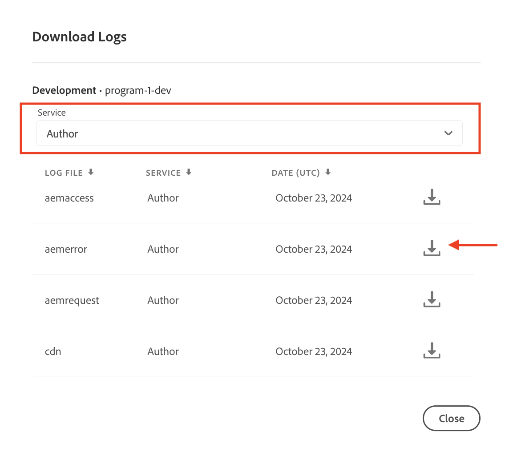

# 如何在AEM as a Cloud Service中的领导者实例上运行作业

了解如何在AEM as a Cloud Service中的AEM Author服务中的领导实例上运行作业，并了解如何将其配置为仅运行一次。

Sling作业是在后台运行的异步任务，旨在处理系统或用户触发的事件。 默认情况下，这些作业在集群中的所有实例(pod)之间均匀分布。

有关详细信息，请参阅[Apache Sling事件和作业处理](https://sling.apache.org/documentation/bundles/apache-sling-eventing-and-job-handling.html)。

## 创建和处理作业

为演示目的，让我们创建一个简单的&#x200B;_作业，以指示作业处理器记录消息_。

### 创建作业

使用以下代码来&#x200B;_创建_ Apache Sling作业：

```java
package com.adobe.aem.guides.wknd.core.sling.jobs.impl;

import java.util.HashMap;
import java.util.Map;

import org.apache.sling.event.jobs.JobManager;
import org.osgi.service.component.annotations.Activate;
import org.osgi.service.component.annotations.Component;
import org.osgi.service.component.annotations.Reference;
import org.slf4j.Logger;
import org.slf4j.LoggerFactory;

@Component(immediate = true)
public class SimpleJobCreaterImpl {

    private static final Logger log = LoggerFactory.getLogger(SimpleJobCreaterImpl.class);

    // Define the topic on which the job will be created
    protected static final String TOPIC = "wknd/simple/job/topic";

    // Inject a JobManager
    @Reference
    private JobManager jobManager;

    @Activate
    protected final void activate() throws Exception {
        log.info("SimpleJobCreater activated successfully");
        createJob();
        log.info("SimpleJobCreater created a job");
    }

    private void createJob() {
        // Create a job and add it on the above defined topic
        Map<String, Object> jobProperties = new HashMap<>();
        jobProperties.put("action", "log");
        jobProperties.put("message", "Job metadata is: Created in activate method");
        jobManager.addJob(TOPIC, jobProperties);
    }
}
```

上述代码中的要注意事项包括：

- 作业有效负载有两个属性： `action`和`message`。
- 使用[JobManager](https://javadoc.io/doc/com.adobe.aem/aem-sdk-api/latest/org/apache/sling/event/jobs/JobManager.html)的`addJob(...)`方法，将作业添加到主题`wknd/simple/job/topic`。

### 处理作业

使用以下代码来&#x200B;_处理_&#x200B;上述Apache Sling作业：

```java
package com.adobe.aem.guides.wknd.core.sling.jobs.impl;

import org.apache.sling.event.jobs.Job;
import org.apache.sling.event.jobs.consumer.JobConsumer;
import org.osgi.service.component.annotations.Component;
import org.slf4j.Logger;
import org.slf4j.LoggerFactory;

@Component(service = JobConsumer.class, property = {
        JobConsumer.PROPERTY_TOPICS + "=" + SimpleJobCreaterImpl.TOPIC
}, immediate = true)
public class SimpleJobConsumerImpl implements JobConsumer {

    private static final Logger log = LoggerFactory.getLogger(SimpleJobConsumerImpl.class);

    @Override
    public JobResult process(Job job) {
        // Get the action and message properties
        String action = job.getProperty("action", String.class);
        String message = job.getProperty("message", String.class);

        // Log the message
        if ("log".equals(action)) {
            log.info("Processing WKND Job, and {}", message);
        }

        // Return a successful result
        return JobResult.OK;
    }

}
```

上述代码中的要注意事项包括：

- `SimpleJobConsumerImpl`类实现`JobConsumer`接口。
- 这是已注册以使用主题`wknd/simple/job/topic`中的作业的服务。
- `process(...)`方法通过记录作业有效负载的`message`属性来处理该作业。

### 默认作业处理

当您将上述代码部署到AEM as a Cloud Service环境并在AEM Author服务(作为具有多个AEM Author JVM的集群运行)上运行它时，作业将在每个AEM Author实例(pod)上运行一次，这意味着创建的作业数量与pod的数量相匹配。 Pod的数量将始终大于1（对于非RDE环境），但会因AEM as a Cloud Service的内部资源管理而波动。

作业在每个AEM Author实例(pod)上运行，因为`wknd/simple/job/topic`与AEM的主队列相关联，该主队列将作业分发到所有可用实例。

如果作业负责更改状态（如创建或更新资源或外部服务），则这通常会出现问题。

如果希望作业在AEM Author服务上只运行一次，请添加如下所述的[作业队列配置](#how-to-run-a-job-on-the-leader-instance)。

您可以通过在[Cloud Manager](https://experienceleague.adobe.com/zh-hans/docs/experience-manager-learn/cloud-service/debugging/debugging-aem-as-a-cloud-service/logs#cloud-manager)中查看AEM Author服务的日志来验证它。

所有实例已处理


您应会看到：

```
<DD.MM.YYYY HH:mm:ss.SSS> [cm-pxxxx-exxxx-aem-author-68775db964-nxxcx] *INFO* [sling-oak-observation-15] org.apache.sling.event.impl.jobs.queues.JobQueueImpl.<main queue> Starting job queue <main queue>
<DD.MM.YYYY HH:mm:ss.SSS> INFO [com.adobe.aem.guides.wknd.core.sling.jobs.impl.SimpleJobConsumerImpl] Processing WKND Job, and Job metadata is: Created in activate method

<DD.MM.YYYY HH:mm:ss.SSS> [cm-pxxxx-exxxx-aem-author-68775db964-r4zk7] *INFO* [sling-oak-observation-11] org.apache.sling.event.impl.jobs.queues.JobQueueImpl.<main queue> Starting job queue <main queue>
<DD.MM.YYYY HH:mm:ss.SSS> INFO [com.adobe.aem.guides.wknd.core.sling.jobs.impl.SimpleJobConsumerImpl] Processing WKND Job, and Job metadata is: Created in activate method
```

有两个日志条目，每个AEM Author实例（`68775db964-nxxcx`和`68775db964-r4zk7`）各一个，指示每个实例(pod)已处理作业。

## 如何在领导实例上运行作业

要在AEM Author服务上仅运行作业&#x200B;_一次_，请创建类型为&#x200B;**Ordered**&#x200B;的新Sling作业队列，并将您的作业主题(`wknd/simple/job/topic`)与此队列关联。 使用此配置时，将仅允许前导AEM创作实例(pod)处理作业。

在您的AEM项目的`ui.config`模块中，创建一个OSGi配置文件(`org.apache.sling.event.jobs.QueueConfiguration~wknd.cfg.json`)并将其存储在`ui.config/src/main/content/jcr_root/apps/wknd/osgiconfig/config.author`文件夹中。

```json
{
    "queue.name":"WKND Queue - ORDERED",
    "queue.topics":[
      "wknd/simple/job/topic"
    ],
    "queue.type":"ORDERED",
    "queue.retries":1,
    "queue.maxparallel":1.0
  }
```

上述配置中需要注意的要点包括：

- 队列主题设置为`wknd/simple/job/topic`。
- 队列类型设置为`ORDERED`。
- 最大并行作业数设置为`1`。

在部署上述配置后，作业将仅由领导实例处理，确保它在整个AEM Author服务中仅运行一次。

```
<DD.MM.YYYY HH:mm:ss.SSS> [cm-pxxxx-exxxx-aem-author-7475cf85df-qdbq5] *INFO* [FelixLogListener] Events.Service.org.apache.sling.event Service [QueueMBean for queue WKND Queue - ORDERED,7755, [org.apache.sling.event.jobs.jmx.StatisticsMBean]] ServiceEvent REGISTERED
<DD.MM.YYYY HH:mm:ss.SSS> INFO [com.adobe.aem.guides.wknd.core.sling.jobs.impl.SimpleJobConsumerImpl] Processing WKND Job, and Job metadata is: Created in activate method
<DD.MM.YYYY HH:mm:ss.SSS> [com.adobe.aem.guides.wknd.core.sling.jobs.impl.SimpleJobConsumerImpl] Processing WKND Job, and Job metadata is: Created in activate method
```
