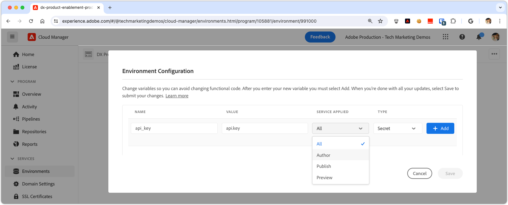

# 在AEM as a Cloud Service中管理密钥

管理密钥（如API密钥和密码）对于维护应用程序安全至关重要。 Adobe Experience Manager (AEM) as a Cloud Service提供了可靠的工具来安全地处理密钥。

在本教程中，您将学习在AEM中管理密钥的最佳实践。 我们将介绍AEM为保护您的敏感信息而提供的工具和技术，以确保您的应用程序保持安全和机密。

本教程假定您具有AEM Java开发、OSGi服务、Sling模型和AdobeCloud Manager的工作知识。

## 密码管理器OSGi服务

在AEM as a Cloud Service中，通过OSGi服务管理密钥提供了一种可扩展且安全的方法。 可以将OSGi服务配置为处理敏感信息，例如API密钥和密码，这些敏感信息是通过OSGi配置定义的，并通过Cloud Manager进行设置。

### OSGi服务实施

我们将逐步完成自定义OSGi服务的开发，该服务将[从OSGi配置](https://experienceleague.adobe.com/en/docs/experience-manager-cloud-service/content/implementing/deploying/configuring-osgi#secret-configuration-values)中公开密钥。

该实现通过`@Activate`方法从OSGi配置中读取密钥，并通过`getSecret(String secretName)`方法公开它们。 或者，可以为每个密钥创建离散方法，如`getApiKey()`，但此方法需要更多维护，因为添加或删除了密钥。

```java
package com.example.core.util.impl;

import com.example.core.util.SecretsManager;
import org.osgi.service.component.annotations.*;
import org.slf4j.Logger;
import org.slf4j.LoggerFactory;
import org.apache.sling.api.resource.ValueMap;
import org.apache.sling.api.resource.ValueMapDecorator;
import java.util.Map;

@Component(
    service = { SecretsManager.class }
)
public class SecretsManagerImpl implements SecretsManager {
    private static final Logger log = LoggerFactory.getLogger(SecretsManagerImpl.class);
 
    private ValueMap secrets;

    @Override
    public String getSecret(String secretName) {
        return secrets.get(secretName, String.class);
    }

    @Activate
    @Modified
    protected void activate(Map<String, Object> properties) {
        secrets = new ValueMapDecorator(properties);
    }
}
```

作为OSGi服务，最好通过Java界面注册和使用它。 下面是一个简单的界面，允许使用者按OSGi属性名称获取密钥。

```java
package com.example.core.util;

import org.osgi.annotation.versioning.ConsumerType;

@ConsumerType
public interface SecretsManager {
    String getSecret(String secretName);
}
```

## 将密码映射到OSGi配置

要公开OSGi服务中的密码值，请使用[OSGi密码配置值](https://experienceleague.adobe.com/en/docs/experience-manager-cloud-service/content/implementing/deploying/configuring-osgi#secret-configuration-values)将它们映射到OSGi配置。 将OSGi属性名称定义为从`SecretsManager.getSecret()`方法检索机密值的密钥。

在AEM Maven项目的OSGi配置文件`/apps/example/osgiconfig/config/com.example.core.util.impl.SecretsManagerImpl.cfg.json`中定义密钥。 每个属性都表示在AEM中公开的一个密钥，其值通过Cloud Manager设置。 密钥是OSGi属性名称，用于从`SecretsManager`服务检索机密值。

```json
{
    "api.key": "$[secret:api_key]",
    "service.password": "$[secret:service_password]"
}
```

除了使用共享密钥管理器OSGi服务之外，您还可以直接在使用这些密钥的特定服务的OSGi配置中包含这些密钥。 如果只有单个OSGi服务需要密钥，而未在多个服务之间共享密钥，则此方法很有用。 在这种情况下，密码值在特定服务的OSGi配置文件中定义，并通过`@Activate`方法在该服务的Java代码中访问。

## 使用密钥

可以从OSGi服务以各种方式使用密钥，例如从Sling模型或其他OSGi服务。 以下是如何同时使用这两个文件中的密钥的示例。

### 来自Sling模型

Sling模型通常为AEM站点组件提供业务逻辑。 `SecretsManager` OSGi服务可以通过`@OsgiService`注释使用，并在Sling模型内用于检索机密值。

```java
import com.example.core.util.SecretsManager;
import org.apache.sling.api.resource.Resource;
import org.apache.sling.api.servlets.SlingHttpServletRequest;
import org.apache.sling.models.annotations.Model;
import org.apache.sling.models.annotations.OsgiService;

@Model(
    adaptables = {SlingHttpServletRequest.class, Resource.class},
    adapters = {ExampleDatabaseModel.class}
)
public class ExampleDatabaseModelImpl implements ExampleDatabaseModel {

    @OsgiService
    SecretsManager secretsManager;

    @Override 
    public String doWork() {
        final String secret = secretsManager.getSecret("api.key");
        // Do work with secret
    }
}
```

### 来自OSGi服务

OSGi服务通常会在AEM中公开可重用的业务逻辑，可供Sling模型、AEM服务（如工作流）或其他自定义OSGi服务使用。 `SecretsManager` OSGi服务可以通过`@Reference`注释使用，并在OSGi服务中用于检索机密值。

```java
import com.example.core.util.SecretsManager;
import org.osgi.service.component.annotations.Component;
import org.osgi.service.component.annotations.Reference;

@Component
public class ExampleSecretConsumerImpl implements ExampleSecretConsumer {

    @Reference
    SecretsManager secretsManager;

    public void doWork() {
        final String secret = secretsManager.getSecret("service.password");
        // Do work with the secret
    }
}
```

## 在Cloud Manager中设置密钥

设置好OSGi服务和配置后，最后一步是在Cloud Manager中设置机密值。

可通过[Cloud Manager API](https://developer.adobe.com/experience-cloud/cloud-manager/reference/api/#tag/Variables)设置密码值，更常见的是，通过[Cloud Manager UI](https://experienceleague.adobe.com/en/docs/experience-manager-cloud-service/content/implementing/using-cloud-manager/environment-variables#overview)来设置。 要通过Cloud Manager UI应用机密变量，请执行以下操作：



1. 登录到[AdobeCloud Manager](https://my.cloudmanager.adobe.com)。
1. 选择要为其设置密码的AEM程序和环境。
1. 在“环境详细信息”视图中，选择&#x200B;**配置**&#x200B;选项卡。
1. 选择&#x200B;**添加**。
1. 在环境配置对话框中：
   - 输入OSGi配置中引用的机密变量名称（例如`api_key`）。
   - 输入密码值。
   - 选择密码应用到哪个AEM服务。
   - 选择&#x200B;**密钥**&#x200B;作为类型。
1. 选择&#x200B;**添加**&#x200B;以保留密码。
1. 根据需要添加任意数量的密钥。 完成后，选择&#x200B;**保存**&#x200B;以将更改立即应用到AEM环境。

将Cloud Manager配置用于密码可提供以下好处：将不同的值应用于不同的环境或服务，以及无需重新部署AEM应用程序即可旋转密码。
