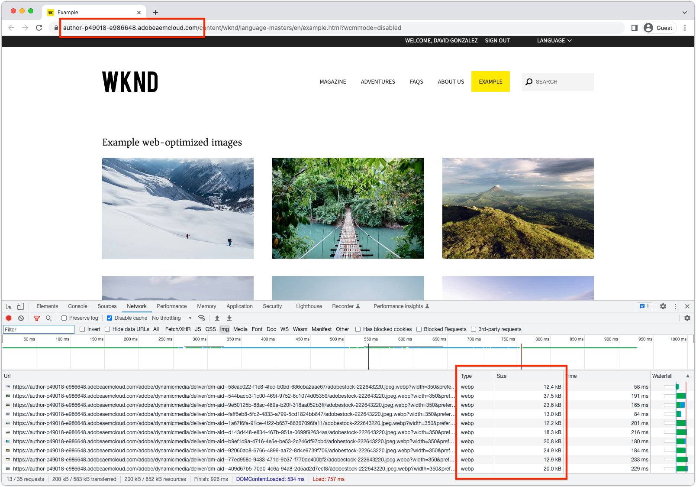

# Web优化图像交付Java™ API

了解如何使用AEM as a Cloud Service的Web优化图像交付Java™ API开发高性能的Web体验。

AEM as a Cloud Service支持[Web优化图像投放](https://experienceleague.adobe.com/docs/experience-manager-core-components/using/developing/web-optimized-image-delivery.html?lang=zh-Hans)，该投放可自动生成资产的优化图像Web演绎版。 Web优化图像投放可以使用三种主要方法：

1. [使用AEM核心WCM组件](https://experienceleague.adobe.com/docs/experience-manager-core-components/using/introduction.html?lang=zh-Hans)
2. 创建[扩展AEM核心WCM组件图像组件](https://experienceleague.adobe.com/docs/experience-manager-learn/getting-started-wknd-tutorial-develop/project-archetype/custom-component.html?lang=zh-Hans#tackling-the-image-problem)的自定义组件
3. 创建自定义组件，该组件使用AssetDelivery Java™ API生成Web优化图像URL。

本文探讨如何在自定义组件中使用Web优化图像Java™ API，以便允许基于代码的方式在AEM as a Cloud Service和AEM SDK上正常运行。

## Java™ API

[AssetDelivery API](https://javadoc.io/doc/com.adobe.aem/aem-sdk-api/latest/com/adobe/cq/wcm/spi/AssetDelivery.html)是一个OSGi服务，它为图像资产生成Web优化投放URL。 `AssetDelivery.getDeliveryURL(...)`允许的选项[记录在此处](https://experienceleague.adobe.com/docs/experience-manager-core-components/using/developing/web-optimized-image-delivery.html?lang=zh-Hans#can-i-use-web-optimized-image-delivery-with-my-own-component%3F)。

仅在AEM as a Cloud Service中运行时才满足`AssetDelivery` OSGi服务。 在AEM SDK上，对`AssetDelivery` OSGi服务的引用返回`null`。 在AEM as a Cloud Service上运行时，最好有条件地使用Web优化URL，并在AEM SDK上使用替代图像URL。 通常，资产的Web演绎版是一个足够的后备。


### OSGi服务中使用的API

在自定义OSGi服务中将`AssetDelivery`引用标记为可选，以便自定义OSGi服务在AEM SDK上保持可用。

```java
import com.adobe.cq.wcm.spi.AssetDelivery;
...
@Reference(cardinality = ReferenceCardinality.OPTIONAL)
private volatile AssetDelivery assetDelivery;
```

### Sling模型中使用的API

在自定义Sling模型中将`AssetDelivery`引用标记为可选，以便自定义Sling模型在AEM SDK上保持可用。

```java
import com.adobe.cq.wcm.spi.AssetDelivery;
...
@OSGiService(injectionStrategy = InjectionStrategy.OPTIONAL)
private AssetDelivery assetDelivery;
```

### 有条件地使用API

根据`AssetDelivery` OSGi服务的可用性，有条件地返回Web优化图像URL或回退URL。 条件使用允许代码在AEM SDK上运行代码时正常运行。

```java
if (assetDelivery != null ) {
    // When running on AEM as a Cloud Service use the real web-optimized image URL.
    return assetDelivery.getDeliveryURL(...);
} else {
    // When running on AEM SDK, use some fallback image so the experience does not break.
    // What the fallback is up to you! 
    return getFallbackURL(...);
}
```

## 示例代码

以下代码创建一个示例组件，该组件使用Web优化图像URL显示图像资产列表。

当代码在AEM as a Cloud Service上运行时，会在自定义组件中使用Web优化的Web图像演绎版。

AEM as a Cloud Service上的

_AEM as a Cloud Service支持AssetDelivery API，因此使用Web优化的Web演绎版_

当代码在AEM SDK上运行时，将使用不太理想的静态Web演绎版，从而使组件在本地开发期间正常工作。

AEM SDK上的

_AEM SDK不支持AssetDelivery API，因此使用了回退静态Web演绎版(PNG或JPEG)_

此实施分为三个逻辑部分：

1. `WebOptimizedImage` OSGi服务用作AEM提供的`AssetDelivery` OSGi服务的“智能代理”，该服务可以处理在AEM as a Cloud Service和AEM SDK中运行的情况。
2. `ExampleWebOptimizedImages` Sling模型提供了用于收集要显示的图像资产及其Web优化URL列表的业务逻辑。
3. `example-web-optimized-images` AEM组件实现HTL以显示Web优化图像列表。

可以在代码库中复制以下示例代码，并根据需要进行更新。

### OSGi服务

`WebOptimizedImage` OSGi服务被拆分为可寻址公共接口(`WebOptimizedImage`)和内部实现(`WebOptimizedImageImpl`)。 在AEM as a Cloud Service上运行`WebOptimizedImageImpl`时，它会返回一个优化了Web的图像URL，并在AEM SDK上返回一个静态Web演绎版URL，从而使该组件在AEM SDK上保持正常运行。

#### 接口

界面定义其他代码（如Sling模型）可以与的OSGi服务合同。

```java
package com.adobe.aem.guides.wknd.core.images;

import org.apache.sling.api.resource.ResourceResolver;
import org.osgi.annotation.versioning.ProviderType;

import java.util.Map;

/**
 * OSGi Service that acts as a facade for the AssetDelivery API, such that a fallback can be automatically served on the AEM SDK.
 *
 * This service can be extended to provide additional functionality, such as srcsets, etc.
 */
@ProviderType
public interface WebOptimizedImage {
    /**
     * Returns the Web Optimized Image URL.
     * @param resourceResolver the user's resource resolver
     * @param path the path to the asset
     * @param options the options to pass to the AssetDelivery API
     * @return the Web Optimized Image URL
     */
    String getDeliveryURL(ResourceResolver resourceResolver, String path, Map<String, Object> options);
}
```

#### 实施

OSGi服务实现包括对AEM的`AssetDelivery` OSGi服务的可选引用，以及在AEM SDK上`AssetDelivery`为`null`时用于选择合适图像URL的回退逻辑。 可以根据要求更新回退逻辑。

```java
package com.adobe.aem.guides.wknd.core.images.impl;

import com.adobe.aem.guides.wknd.core.images.WebOptimizedImage;
import com.adobe.cq.wcm.spi.AssetDelivery;
import com.day.cq.dam.api.Asset;
import com.day.cq.dam.api.Rendition;
import com.day.cq.dam.api.RenditionPicker;
import com.day.cq.dam.commons.util.DamUtil;
import org.apache.commons.lang3.StringUtils;
import org.apache.sling.api.resource.Resource;
import org.apache.sling.api.resource.ResourceResolver;
import org.osgi.service.component.annotations.Component;
import org.osgi.service.component.annotations.Reference;
import org.osgi.service.component.annotations.ReferenceCardinality;

import java.util.Map;
@Component
public class WebOptimizedImageImpl implements WebOptimizedImage {
    private static final String DEFAULT_FORMAT = "webp";
    @Reference(cardinality = ReferenceCardinality.OPTIONAL)
    private volatile AssetDelivery assetDelivery;

    /**
     * Returns the Web Optimized Image URL.
     * @param resourceResolver the user's resource resolver
     * @param path the path to the asset
     * @param options the options to pass to the AssetDelivery API
     * @return the Web Optimized Image URL
     */
    @Override
    public String getDeliveryURL(ResourceResolver resourceResolver, String path, Map<String, Object> options) {
        if (assetDelivery != null) {
            return getWebOptimizedUrl(resourceResolver, path, options);
        } else {
            return getFallbackUrl(resourceResolver, path);
        }
    }
    /**
     * Uses the AssetDelivery API to get the Web Optimized Image URL.
     * @param resourceResolver the user's resource resolver
     * @param path the path to the asset
     * @param options the options to pass to the AssetDelivery API
     * @return the Web Optimized Image URL
     */
    private String getWebOptimizedUrl(ResourceResolver resourceResolver, String path, Map<String, Object> options) {
        Resource resource = resourceResolver.getResource(path);
        Asset asset = DamUtil.resolveToAsset(resource);

        // These 3 options are required for the AssetDelivery API to work, else it will return null
        options.put("path", asset.getPath());
        options.put("format", StringUtils.defaultString((String) options.get("format"), DEFAULT_FORMAT));
        options.put("seoname", StringUtils.defaultString((String) options.get("seoname"), asset.getName()));

        // The resource only provides the security context into AEM so the asset's UUID can be looked up for the Web Optimized Image URL
        return assetDelivery.getDeliveryURL(resource, options);
    }

    /**
     * Fallback to the static web rendition if the AssetDelivery API is not available, meaning the code is running on the AEM SDK.
     * @param resourceResolver the user's resource resolver
     * @param path the path to the asset
     * @return the path to the web rendition
     */
    private String getFallbackUrl(ResourceResolver resourceResolver, String path) {
        Resource resource = resourceResolver.getResource(path);
        Asset asset = DamUtil.resolveToAsset(resource);

        return asset.getRendition(WebRenditionPicker).getPath();
    }

    /**
     * Picks the web rendition of the asset.
     */
    private static final RenditionPicker WebRenditionPicker = new RenditionPicker() {
        @Override
        public Rendition getRendition(Asset asset) {
            return asset.getRenditions().stream().filter(rendition -> StringUtils.startsWith(rendition.getName(), "cq5dam.web.")).findFirst().orElse(asset.getOriginal());
        }
    };
}
```

### Sling模型

`ExampleWebOptimizedImages` Sling模型被拆分为可寻址公共接口(`ExampleWebOptimizedImages`)和内部实现(`ExampleWebOptimizedImagesImpl`)；

`ExampleWebOptimizedImagesImpl` Sling模型收集要显示的图像资源列表，并调用自定义`WebOptimizedImage` OSGi服务以获取Web优化图像URL。 由于此Sling模型表示一个AEM组件，因此它具有常用方法，例如`isEmpty()`、`getId()`和`getData()`，但这些方法与使用Web优化图像没有直接关系。

#### 接口

界面定义Sling模型契约，其他代码（如HTL）可以与之交互。

```java
package com.adobe.aem.guides.wknd.core.models;

import com.adobe.cq.wcm.core.components.models.datalayer.ComponentData;
import com.fasterxml.jackson.annotation.JsonProperty;

import java.util.List;

public interface ExampleWebOptimizedImages {

    /**
     * @return a list of web optimized images for the component to display. Each item in the list has necessary information to render the image.
     */
    List getImages();

    /**
     * @return true if this component has no images to display.
     */
    boolean isEmpty();

    /**
     * @return String representing the unique identifier of the ExampleWebOptimizedImages component on a page
     */
    String getId();

    /**
     * @return JSON data to populate the data layer
     */
    @JsonProperty("dataLayer")
    default ComponentData getData() {
        return null;
    }

    /**
     * Describes a web optimized image.
     */
    interface Img {
        /**
         * @return the URL to the web optimized rendition of the image.
         */
        String getSrc();

        /**
         * @return the alt text of the web optimized image.
         */
        String getAlt();

        /**
         * @return the height of the web optimized image.
         */
        String getHeight();
        /**
         * @return the width of the web optimized image.
         */
        String getWidth();
    }
}
```

#### 实施

Sling模型使用自定义`WebOptimizeImage` OSGi服务为其组件显示的图像资源收集Web优化图像URL。

在此示例中，使用简单查询来收集图像资产。

```java
package com.adobe.aem.guides.wknd.core.models.impl;

import com.adobe.aem.guides.wknd.core.images.WebOptimizedImage;
import com.adobe.aem.guides.wknd.core.models.ExampleWebOptimizedImages;
import com.adobe.cq.wcm.core.components.models.datalayer.ComponentData;
import com.adobe.cq.wcm.core.components.models.datalayer.builder.DataLayerBuilder;
import com.adobe.cq.wcm.core.components.util.ComponentUtils;
import com.day.cq.dam.api.Asset;
import com.day.cq.dam.commons.util.DamUtil;
import com.day.cq.wcm.api.Page;
import com.day.cq.wcm.api.components.ComponentContext;
import org.apache.sling.api.SlingHttpServletRequest;
import org.apache.sling.api.resource.Resource;
import org.apache.sling.models.annotations.DefaultInjectionStrategy;
import org.apache.sling.models.annotations.Model;
import org.apache.sling.models.annotations.Required;
import org.apache.sling.models.annotations.injectorspecific.OSGiService;
import org.apache.sling.models.annotations.injectorspecific.ScriptVariable;
import org.apache.sling.models.annotations.injectorspecific.Self;

import java.util.*;

@Model(
        adaptables = {SlingHttpServletRequest.class},
        adapters = {ExampleWebOptimizedImages.class},
        resourceType = {ExampleWebOptimizedImagesImpl.RESOURCE_TYPE},
        defaultInjectionStrategy = DefaultInjectionStrategy.OPTIONAL
)
public class ExampleWebOptimizedImagesImpl implements ExampleWebOptimizedImages {

    protected static final String RESOURCE_TYPE = "wknd/components/example-web-optimized-images";

    private static final int MAX_RESULTS = 10;

    @Self
    @Required
    private SlingHttpServletRequest request;

    @OSGiService
    private WebOptimizedImage webOptimizedImage;

    @ScriptVariable
    private Page currentPage;

    @ScriptVariable
    protected ComponentContext componentContext;

    private List images;

    // XPath query to find image assets to display
    private static final String XPATH_QUERY = "/jcr:root/content/dam/wknd-shared/en/adventures//element(*, dam:Asset) [ (jcr:contains(jcr:content/metadata/@dc:format, 'image/')) ]";
    @Override
    public List getImages() {

        if (images == null) {
            images = new ArrayList<>();

            // Set the AssetDelivery options to request a web-optimized rendition.
            // These options can be set as required by the implementation (Dialog, pass in from HTL via @RequestAttribute)
            final Map<String, Object> options = new HashMap<>();
            options.put("format", "webp");
            options.put("preferwebp", "true");
            options.put("width", "350");
            options.put("height", "350");

            final Iterator<Resource> results = request.getResourceResolver().findResources(XPATH_QUERY, "xpath");

            while (results.hasNext() && images.size() < MAX_RESULTS) {
                Resource resource = results.next();
                Asset asset = DamUtil.resolveToAsset(resource);

                // Get the image URL; the web-optimized rendition on AEM as a Cloud Service, or the static web rendition fallback on AEM SDK
                final String url = webOptimizedImage.getDeliveryURL(request.getResourceResolver(), resource.getPath(), options);

                // Add the image to the list that is passed to the HTL component to display
                // We'll add some extra attributes so that the HTL can display the image in a performant, SEO-friendly, and accessible way
                // ImgImpl can be extended to add additional attributes, such as srcset, etc.
                images.add(new ImgImpl(url, asset.getName(), (String) options.get("height"), (String) options.get("width")));
            }
        }

        return this.images;
    }

    @Override
    public boolean isEmpty() {
        return getImages().isEmpty();
    }

    @Override
    public String getId() {
        return ComponentUtils.getId(request.getResource(), currentPage, componentContext);
    }

    @Override
    public ComponentData getData() {
        if (ComponentUtils.isDataLayerEnabled(request.getResource())) {
            return DataLayerBuilder.forComponent()
                    .withId(() -> getId())
                    .withType(() -> RESOURCE_TYPE)
                    .build();
        }
        return null;
    }

    class ImgImpl implements Img {
        private final String url;
        private final String alt;
        private final int height;
        private final int width;

        public ImgImpl(String url, String alt, String height, String width) {
            this.url = url;
            this.alt = alt;
            this.height = Integer.parseInt(height);
            this.width = Integer.parseInt(width);
        }

        @Override
        public String getSrc() {
            return url;
        }

        @Override
        public String getAlt() {
            return alt;
        }

        @Override
        public String getHeight() {
            return height + "px";
        }

        @Override
        public String getWidth() {
            return width + "px";
        }
    }
}
```

### AEM组件

AEM组件已绑定到`WebOptimizedImagesImpl` Sling模型实施的Sling资源类型，并负责显示图像列表。


组件通过`Img`接收`getImages()`对象的列表，其中包含在AEM as a Cloud Service上运行时优化的Web WEBP图像。 该组件通过`Img`接收`getImages()`对象的列表，其中包括在AEM SDK上运行的静态PNG/JPEG Web图像。

#### HTL

HTL使用`WebOptimizedImages` Sling模型，并由`Img`返回呈现`getImages()`对象的列表。

```html
<style>
    .cmp-example-web-optimized-images__list {
        width: 100%;
        list-style: none;
        padding: 0;
        display: flex;
        flex-wrap: wrap;
        justify-content: space-between;
        gap: 2rem;
    }

    .cmp-example-web-optimized-images-list__item {
        margin: 0;
        padding: 0;
    }
</style>

<div data-sly-use.exampleImages="com.adobe.aem.guides.wknd.core.models.ExampleWebOptimizedImages"
     data-sly-use.placeholderTemplate="core/wcm/components/commons/v1/templates.html"
     data-sly-test.hasContent="${!exampleImages.empty}"
     data-cmp-data-layer="${exampleImages.data.json}">

    <h3>Example web-optimized images</h3>

    <ul class="cmp-example-web-optimized-images__list"
        data-sly-list.item="${exampleImages.images}">
        <li class="cmp-example-web-optimized-images-list__item">
            
        </li>
    </ul>
</div>
<sly data-sly-call="${placeholderTemplate.placeholder @ isEmpty=!hasContent, classAppend='cmp-example-web-optimized-images'}"></sly>
```
