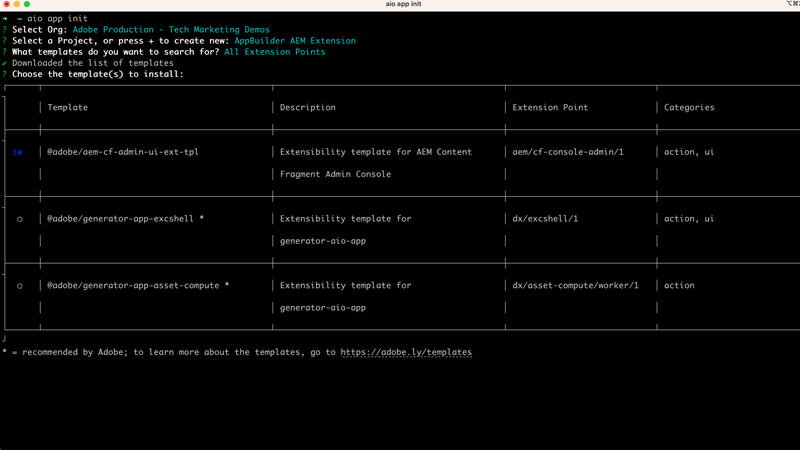

# AEM内容片段控制台扩展

[AEM内容片段控制台](https://experienceleague.adobe.com/docs/experience-manager-cloud-service/content/sites/administering/content-fragments/content-fragments-console.html) 扩展可通过两个扩展点添加：中的按钮 [内容片段控制台的](https://experienceleague.adobe.com/docs/experience-manager-cloud-service/content/sites/administering/content-fragments/content-fragments-console.html) 标题菜单或操作栏。 这些扩展使用作为App Builder应用程序运行的JavaScript编写，可以实施自定义Web UI和无服务器Adobe I/O Runtime操作，以执行更密集、长时间运行的工作。

{align="center"}

| 扩展类型 | 描述 | 参数 |
| :--- | :--- | :--- |
| 标题菜单 | 将按钮添加到以下情况下显示的标题： __零__ 已选择内容片段。 | 无。 |
| 操作栏 | 向操作栏添加一个按钮，该按钮在 __一个或多个__ 已选择内容片段。 | 所选内容片段的路径的数组。 |

单个AEM内容片段控制台扩展可以包含零个或一个标题菜单，以及零个或一个操作栏扩展类型。 如果需要同一类型的多个扩展类型，则必须创建多个AEM内容片段控制台扩展。

AEM内容片段控制台扩展，需要 [Adobe Developer控制台项目](https://developer.adobe.com/uix/docs/services/aem-cf-console-admin/extension-development/#create-a-project-in-adobe-developer-console) 和 [App Builder应用程序](https://developer.adobe.com/uix/docs/services/aem-cf-console-admin/code-generation) 使用 `@adobe/aem-cf-admin-ui-ext-tpl` 模板，与Adobe Developer Console项目关联。

在生成App Builder应用程序时，根据扩展的用途，从以下功能中进行选择。 可以在扩展中使用任何选项组合。

|  | 将按钮添加到 [标题菜单](./header-menu.md) | 将按钮添加到 [操作栏](./action-bar.md) | 显示 [模态](./modal.md) | 添加 [服务器端处理程序](./runtime-action.md) |
| ------------------------------------------ | :-----------------------: | :----------------------: | :--------: | :--------------------:  |
| 未选择内容片段时可用 | ✔ |  |  |  |
| 在选择一个或多个内容片段时可用 |  | ✔ |  |  |
| 从用户处收集自定义输入 |  |  | ✔️ |  |
| 向用户显示自定义反馈 |  |  | ✔️ |  |
| 调用AEM的HTTP请求 |  |  |  | ✔ |
| 调用HTTP请求以Adobe/第三方服务 |  |  |  | ✔ |

## Adobe Developer文档

Adobe Developer包含有关AEM内容片段控制台扩展的开发人员详细信息。 请查看 [Adobe Developer内容，了解更多技术详细信息](https://developer.adobe.com/uix/docs/).

## 开发扩展

按照下面列出的步骤了解如何为AEMas a Cloud Service生成、开发和部署AEM内容片段控制台扩展。

    <!-- Create Adobe Developer Project -->
    

        

            

                <figure class="image is-16by9">
                    
                </figure>
            

            

                

                    
1.创建项目

                    
创建一个Adobe Developer Console项目，以定义对其他Adobe服务的访问权限，并管理其部署。

                    <a href="./adobe-developer-console-project.md" class="spectrum-Button spectrum-Button--outline spectrum-Button--primary spectrum-Button--sizeM">
                        创建Adobe Developer项目
                    </a>
                

            

        

    

    <!-- Generate an Extension app -->
    

        

            

                <figure class="image is-16by9">
                    
                </figure>
            

            

                

                    
2.初始化扩展应用程序

                    
初始化一个AEM内容片段控制台扩展应用程序生成器应用程序，该应用程序定义扩展出现的位置及其执行的工作。

                    <a href="./app-initialization.md" class="spectrum-Button spectrum-Button--outline spectrum-Button--primary spectrum-Button--sizeM">
                        初始化扩展应用程序
                    </a>
                

            

        

    

    <!-- Extension registration -->
    

        

            

                <figure class="image is-16by9">
                    
                </figure>
            

            

                

                    
3.延期登记

                    
在AEM内容片段控制台中，将该扩展注册为标题菜单或操作栏扩展类型。

                    <a href="./extension-registration.md" class="spectrum-Button spectrum-Button--outline spectrum-Button--primary spectrum-Button--sizeM">
                        注册扩展
                    </a>
                

            

        

    

    <!-- Header Menu -->
    

        

            

                <figure class="image is-16by9">
                    
                </figure>
            

            

                

                    
4a. 标题菜单

                    
了解如何创建AEM内容片段控制台标题菜单扩展。

                    <a href="./header-menu.md" class="spectrum-Button spectrum-Button--outline spectrum-Button--primary spectrum-Button--sizeM">
                        扩展标题菜单
                    </a>
                

            

        

    

    <!-- Action Bar -->
    

        

            

                <figure class="image is-16by9">
                    
                </figure>
            

            

                

                    
4b. 操作栏

                    
了解如何创建AEM内容片段控制台操作栏扩展。

                    <a href="./action-bar.md" class="spectrum-Button spectrum-Button--outline spectrum-Button--primary spectrum-Button--sizeM">
                        扩展操作栏
                    </a>
                

            

        

    

    <!-- Modal -->
    

        

            

                <figure class="image is-16by9">
                    
                </figure>
            

            

                

                    
5.模态

                    
向扩展中添加自定义模式窗口，以便用于为用户创建定制体验。 模型通常会收集用户的输入，并显示操作的结果。

                    <a href="./modal.md" class="spectrum-Button spectrum-Button--outline spectrum-Button--primary spectrum-Button--sizeM">
                        添加模态
                    </a>
                

            

        

    

    <!-- Adobe I/O Runtime action -->
    

        

            

                <figure class="image is-16by9">
                    
                </figure>
            

            

                

                    
6.Adobe I/O Runtime行动

                    
添加无服务器Adobe I/O Runtime操作，扩展可以调用该操作与内容片段和AEM交互，以执行自定义业务操作。

                    <a href="./runtime-action.md" class="spectrum-Button spectrum-Button--outline spectrum-Button--primary spectrum-Button--sizeM">
                        添加Adobe I/O Runtime操作
                    </a>
                

            

        

    

    <!-- Test -->
    

        

            

                <figure class="image is-16by9">
                    
                </figure>
            

            

                

                    
7.测试

                    
在开发过程中测试扩展，并使用特殊URL将已完成的扩展共享到QA或UAT测试者。

                    <a href="./test.md" class="spectrum-Button spectrum-Button--outline spectrum-Button--primary spectrum-Button--sizeM">
                        测试扩展
                    </a>
                

            

        

    

    <!-- Extension deployment -->
    

        

            

                <figure class="image is-16by9">
                    
                </figure>
            

            

                

                    
8.生产部署

                    
将扩展部署到Adobe I/O，以使其可供AEM用户使用。 也可以更新和删除扩展。

                    <a href="./deploy.md" class="spectrum-Button spectrum-Button--outline spectrum-Button--primary spectrum-Button--sizeM">
                        部署到生产
                    </a>
                

            

        

    

## 扩展示例

示例AEM内容片段控制台扩展。

    <!-- Bulk property update extension -->
    

        

            

                <figure class="image is-16by9">
                    
                </figure>
            

            

                

                    
批量属性更新扩展

                    
探索批量更新选定内容片段上属性的操作栏扩展示例。

                    <a href="./example-extensions/bulk-property-update.md" class="spectrum-Button spectrum-Button--outline spectrum-Button--primary spectrum-Button--sizeM">
                        探索扩展示例
                    </a>
                

            

        

    

    <!-- Image Generartion update extension -->
    

        

            

                <figure class="image is-16by9">
                    
                </figure>
            

            

                

                    
基于OpenAI的图像生成和上传到AEM扩展

                    
探索一个示例操作栏扩展，该扩展使用OpenAI生成图像，将其上传到AEM并更新所选内容片段上的图像属性。

                    <a href="./example-extensions/image-generation-and-image-upload.md" class="spectrum-Button spectrum-Button--outline spectrum-Button--primary spectrum-Button--sizeM">
                        探索扩展示例
                    </a>
                

            

        

    

