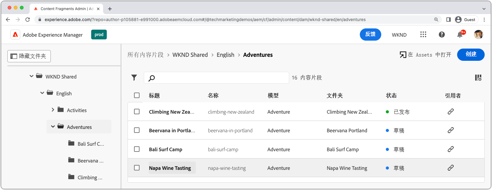
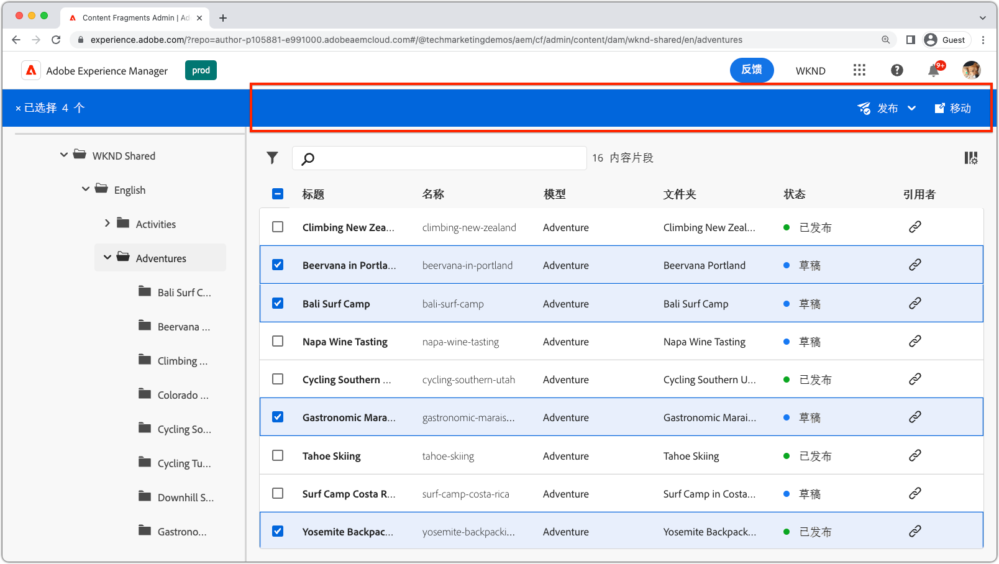
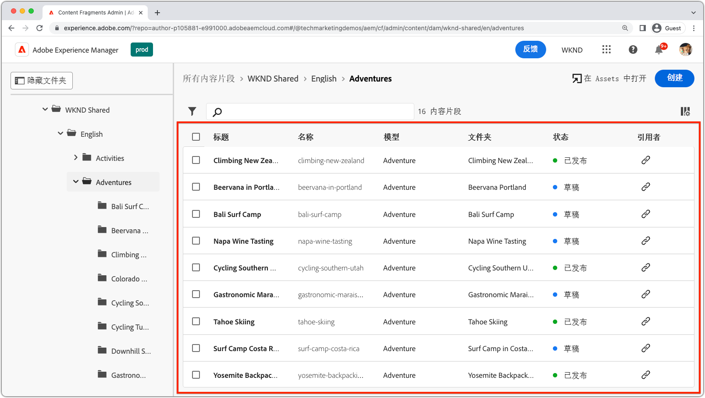
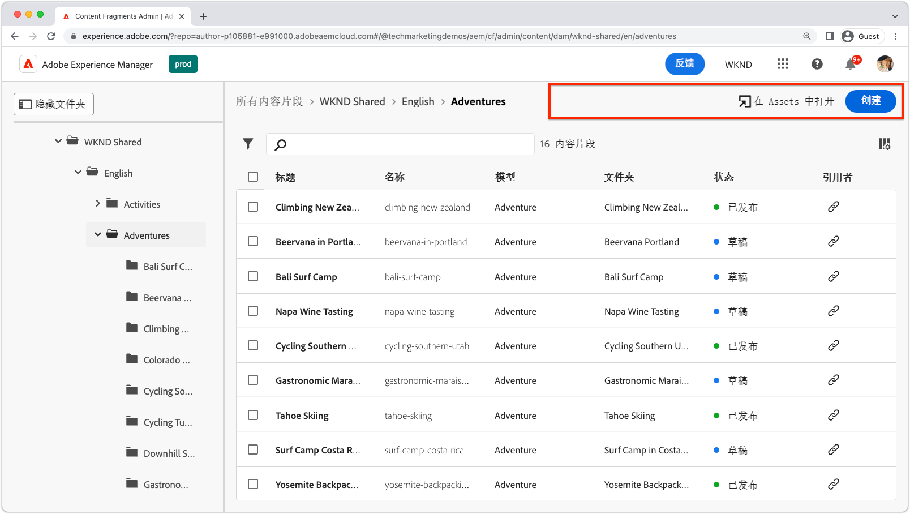
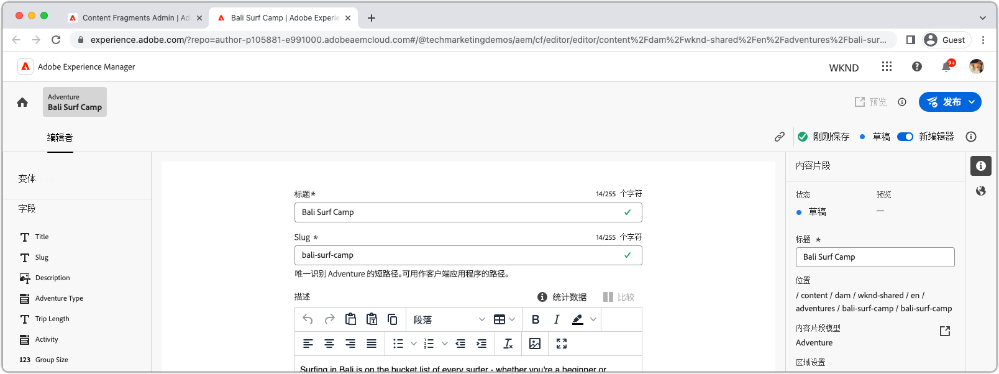
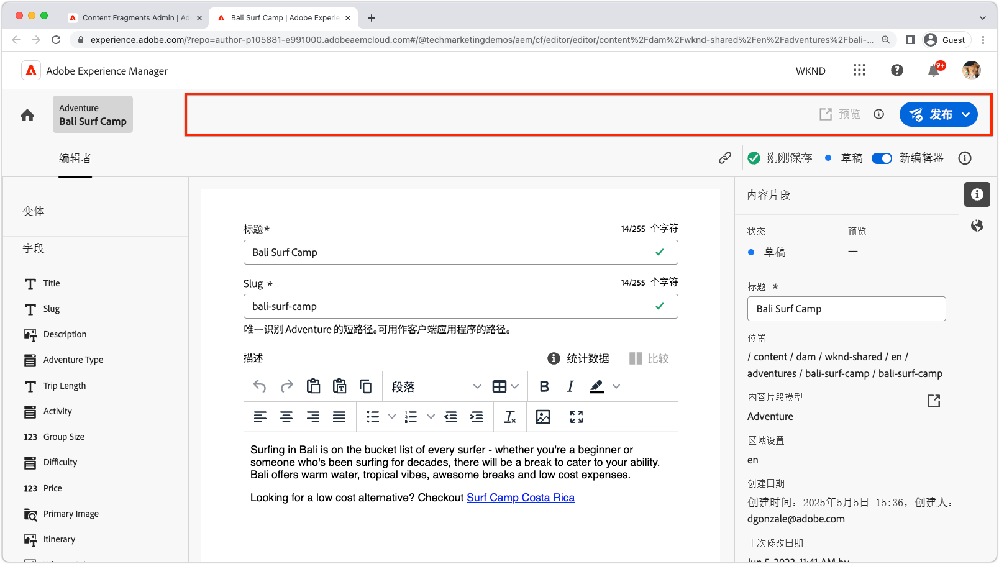
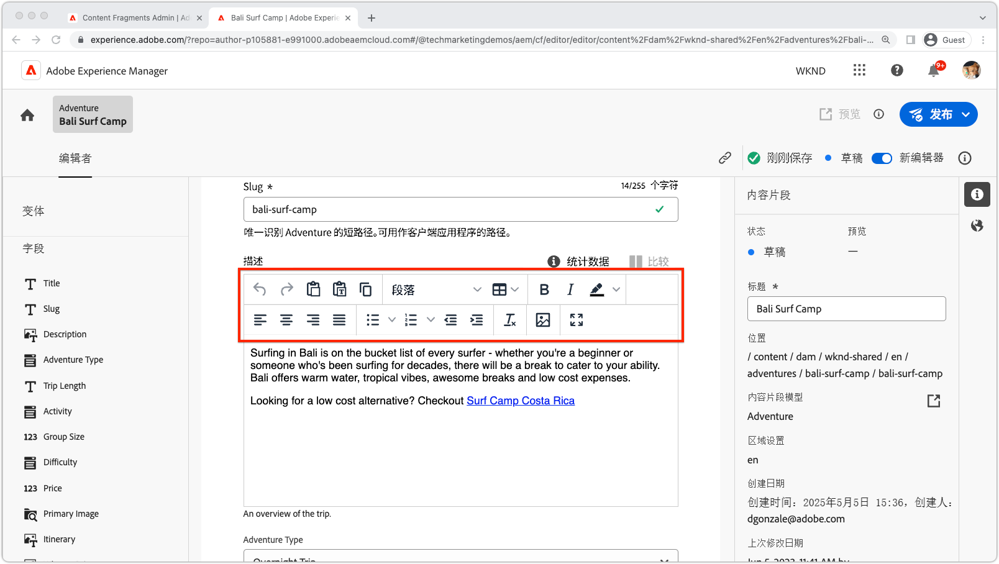
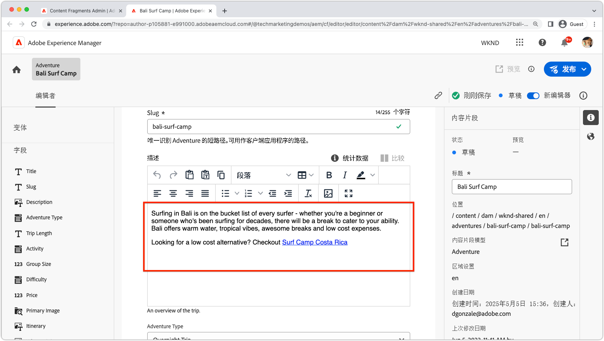
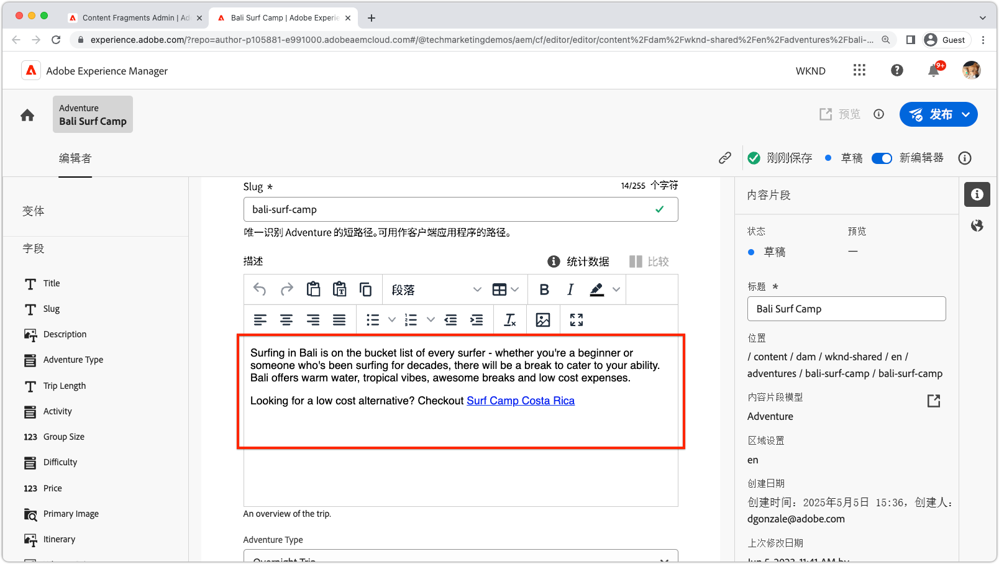

# AEM内容片段可扩展性

AEM内容片段UI是一个功能强大的可扩展UI，用于管理创建、管理和编辑内容片段。 有多个扩展点可用于自定义UI以满足您的需求。 根据要扩展的UI，可使用不同的扩展点。

## 内容片段控制台扩展点

AEM (Adobe Experience Manager)中的内容片段控制台是一个用户界面，它为管理和组织内容片段提供了一个集中的位置。 它提供了一组全面的工具和功能来创建、编辑、发布和跟踪内容片段，使用户能够有效地跨各种渠道和接触点管理结构化内容。

[AEM内容片段控制台](https://experienceleague.adobe.com/docs/experience-manager-cloud-service/content/sites/administering/content-fragments/content-fragments-console.html) 是用于列出和管理内容片段的可扩展UI。 [已创建AEM内容片段控制台扩展](https://developer.adobe.com/uix/docs/services/aem-cf-console-admin/code-generation) 使用 `@adobe/aem-cf-admin-ui-ext-tpl` 应用程序生成器模板。

可以使用以下内容片段控制台扩展点：

      

        

          

            <figure class="image is-16by9">
              
            </figure>
          

          

            

              
<a href="https://developer.adobe.com/uix/docs/services/aem-cf-console-admin/api/action-bar/" title="操作栏" target="_blank" rel="referrer">操作栏</a>

              
自定义选择一个或多个内容片段时的操作。

              <a href="https://developer.adobe.com/uix/docs/services/aem-cf-console-admin/api/action-bar/" class="spectrum-Button spectrum-Button--outline spectrum-Button--primary spectrum-Button--sizeM" target="_blank" rel="referrer">
                查看文档
              </a>
            

          

        

      

  

    

      

        <figure class="image is-16by9">
          
        </figure>
      

      

        

          
<a href="https://developer.adobe.com/uix/docs/services/aem-cf-console-admin/api/grid-columns/" title="网格列" target="_blank" rel="referrer">网格列</a>

          
自定义内容片段列表中显示的数据。

          <a href="https://developer.adobe.com/uix/docs/services/aem-cf-console-admin/api/grid-columns/" class="spectrum-Button spectrum-Button--outline spectrum-Button--primary spectrum-Button--sizeM" target="_blank" rel="referrer">
            查看文档
          </a>
        

      

    

  

  

    

      

        <figure class="image is-16by9">
          
        </figure>
      

      

        

          
<a href="https://developer.adobe.com/uix/docs/services/aem-cf-console-admin/api/header-menu/" title="标题菜单" target="_blank" rel="referrer">标题菜单</a>

          
自定义未选择内容片段时的操作。

          <a href="https://developer.adobe.com/uix/docs/services/aem-cf-console-admin/api/header-menu/" class="spectrum-Button spectrum-Button--outline spectrum-Button--primary spectrum-Button--sizeM" target="_blank" rel="referrer">
            查看文档
          </a>
        

      

    

  
  

## 内容片段编辑器扩展点

AEM (Adobe Experience Manager)中的内容片段编辑器是一个用户界面组件，允许用户创建、编辑和管理内容片段。 它提供了一个直观且用户友好的环境，可用于处理结构化内容，使用户能够定义和组织内容元素、应用模板、管理变体以及预览内容在不同渠道中的显示方式。 内容片段编辑器简化了创建可重用和模块化内容的过程，这些内容可以轻松地跨多个数字体验进行分发和发布。

AEM内容片段编辑器是用于编辑内容片段的可扩展UI。 [已创建AEM内容片段编辑器扩展](https://developer.adobe.com/uix/docs/services/aem-cf-editor/code-generation/) 使用 `@adobe/aem-cf-editor-ui-ext-tpl` 应用程序生成器模板。

以下内容片段编辑器扩展点可用：

    

      

        

          <figure class="image is-16by9">
            
          </figure>
        

        

          

            
<a href="https://developer.adobe.com/uix/docs/services/aem-cf-editor/api/header-menu/" title="标题菜单" target="_blank" rel="referrer">标题菜单</a>

            
自定义内容片段编辑器标题菜单中的操作。

            <a href="https://developer.adobe.com/uix/docs/services/aem-cf-editor/api/header-menu" class="spectrum-Button spectrum-Button--outline spectrum-Button--primary spectrum-Button--sizeM" target="_blank" rel="referrer">
              查看文档
            </a>
          

        

      

    

  

    

      

        <figure class="image is-16by9">
          
        </figure>
      

      

        

          
<a href="https://developer.adobe.com/uix/docs/services/aem-cf-editor/api/rte-toolbar/" title="富文本编辑器工具栏"  target="_blank" rel="referrer">富文本编辑器工具栏</a>

          
将自定义按钮添加到内容片段编辑器的富文本编辑器(RTE)。

          <a href="https://developer.adobe.com/uix/docs/services/aem-cf-editor/api/rte-toolbar/" class="spectrum-Button spectrum-Button--outline spectrum-Button--primary spectrum-Button--sizeM" target="_blank" rel="referrer">
            查看文档
          </a>
        

      

    

  

    

      

        <figure class="image is-16by9">
          
        </figure>
      

      

        

          
<a href="https://developer.adobe.com/uix/docs/services/aem-cf-editor/api/rte-widgets/" title="富文本编辑器小组件" target="_blank" rel="referrer">富文本编辑器小组件</a>

          
自定义RTE中绑定到击键的操作。

          <a href="https://developer.adobe.com/uix/docs/services/aem-cf-editor/api/rte-widgets/" class="spectrum-Button spectrum-Button--outline spectrum-Button--primary spectrum-Button--sizeM" target="_blank" rel="referrer">
            查看文档
          </a>
        

      

    

  

  

    

      

        <figure class="image is-16by9">
          
        </figure>
      

      

        

          
<a href="https://developer.adobe.com/uix/docs/services/aem-cf-editor/api/rte-badges/ " title="富文本编辑器徽章" target="_blank" rel="referrer">富文本编辑器徽章</a>

          
自定义RTE中不可编辑的样式块。

          <a href="https://developer.adobe.com/uix/docs/services/aem-cf-editor/api/rte-badges/" class="spectrum-Button spectrum-Button--outline spectrum-Button--primary spectrum-Button--sizeM" target="_blank" rel="referrer">
            查看文档
          </a>
        

      

    

  

## 扩展示例

欢迎使用一系列AEM UI可扩展性代码示例！ 此资源旨在为您提供有关扩展Adobe Experience Manager (AEM)用户界面的实用演示和见解。 无论您是希望增强AEM功能的开发人员，这些代码示例都可用作有价值的参考。

  

    

      

        <figure class="image is-16by9">
          
        </figure>
      

      

        

          
<a href="./examples/console-bulk-property-update.md" title="批量属性更新">批量内容片段属性更新</a>

          
包含模式和Adobe I/O Runtime操作的内容片段控制台操作栏扩展。

          <a href="./examples/console-bulk-property-update.md" class="spectrum-Button spectrum-Button--outline spectrum-Button--primary spectrum-Button--sizeM">
            查看示例
          </a>
        

      

    

  

  

        

            

                <figure class="image is-16by9">
                    
                </figure>
            

            

                

                    
<a href="./examples/console-image-generation-and-image-upload.md" title="基于OpenAI的图像生成和上传到AEM扩展">OpenAPI图像生成</a>

                    
探索一个示例操作栏扩展，该扩展使用OpenAI生成图像，将其上传到AEM并更新所选内容片段上的图像属性。

                    <a href="./examples/console-image-generation-and-image-upload.md" class="spectrum-Button spectrum-Button--outline spectrum-Button--primary spectrum-Button--sizeM">
                        查看示例
                    </a>
                

            

        

    
    
  

    

      

        <figure class="image is-16by9">
          
        </figure>
      

      

        

          
<a href="./examples/custom-grid-columns.md" title="自定义列">自定义列</a>

          
向内容片段控制台添加自定义列。

          <a href="./examples/custom-grid-columns.md" class="spectrum-Button spectrum-Button--outline spectrum-Button--primary spectrum-Button--sizeM">
            查看示例
          </a>
        

      

    

  
    
  

    

      

        <figure class="image is-16by9">
          
        </figure>
      

      

        

          
<a href="./examples/editor-export-to-xml.md" title="导出到XML">导出到XML</a>

          
从内容片段编辑器将内容片段导出为XML。

          <a href="./examples/editor-export-to-xml.md" class="spectrum-Button spectrum-Button--outline spectrum-Button--primary spectrum-Button--sizeM">
            查看示例
          </a>
        

      

    

  
    

