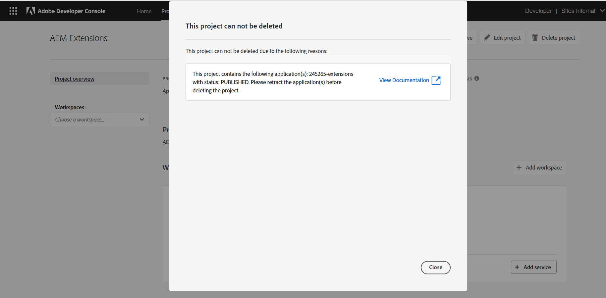

# 部署扩展

要在AEM as a Cloud Service环境中使用，必须部署和批准App Builder扩展应用程序。

部署扩展App Builder应用程序时，需要注意以下几个事项：

+ 扩展将部署到Adobe Developer Console项目工作区。 默认工作区为：
   + __生产__&#x200B;工作区包含所有AEM as a Cloud Service中可用的扩展部署。
   + __阶段__工作区充当开发人员工作区。 部署到暂存工作区的扩展在AEM as a Cloud Service中不可用。
Adobe Developer Console工作区与AEM as a Cloud Service环境类型没有任何直接关联。
+ 部署到生产工作区的扩展将显示在Adobe组织中该扩展存在的所有AEM as a Cloud Service环境中。
通过添加检查AEM as a Cloud Service主机名[&#128279;](https://developer.adobe.com/uix/docs/guides/publication/#enabling-extension-only-on-specific-aem-environments)的条件逻辑，不能将扩展限制为它所注册的环境。
+ AEM as a Cloud Service上可以使用多个扩展。 Adobe建议使用每个App Builder应用程序扩展来解决单个业务目标。 也就是说，一个扩展App Builder应用程序可以实施多个扩展点，以支持共同的业务目标。

## 初始部署

要使扩展在AEM as a Cloud Service环境中可用，必须将其部署到Adobe Developer Console。

部署过程分为两个逻辑步骤：

1. 开发人员将App Builder扩展应用程序部署到Adobe Developer Console。
1. 部署经理或业务负责人审批扩展。

### 部署扩展

将扩展部署到生产工作区。 部署到生产工作区的扩展会自动添加到部署该扩展的Adobe组织中的所有AEM as a Cloud Service创作服务。

1. 打开一个命令行，指向已更新的App Builder扩展应用程序的根路径。
1. 确保生产工作区处于活动状态

   ```shell
   $ aio app use -w Production
   ```

   将任何更改合并到`.env`和`.aio`。

1. 部署更新后的App Builder扩展应用程序。

   ```shell
   $ aio app deploy
   ```

#### 请求部署审批

{align="center"}

1. 登录到[Adobe Developer Console](https://developer.adobe.com)
1. 选择&#x200B;__控制台__
1. 导航到&#x200B;__项目__
1. 选择与扩展关联的项目
1. 选择&#x200B;__生产__&#x200B;工作区
1. 选择&#x200B;__提交以供审批__
1. 完成并提交表单，根据需要更新字段。

### 部署审批

{align="center"}

1. 登录到[Adobe Exchange](https://exchange.adobe.com/)
1. 导航到&#x200B;__管理__ > __等待审阅的应用__
1. __审核__&#x200B;扩展App Builder应用程序
1. 如果扩展更改可以接受，则&#x200B;__接受__&#x200B;审核。 这会立即在Adobe组织内的所有AEM as a Cloud Service Author服务上注入该扩展。

扩展请求获得批准后，该扩展将立即在AEM as a Cloud Service创作服务中处于活动状态。

## 更新扩展

更新和扩展App Builder应用程序遵循与[初始部署](#initial-deployment)相同的过程，这与必须先撤消现有扩展部署存在偏差。

### 撤销扩展

要部署扩展的新版本，必须先撤销（或删除）该扩展。 当扩展被吊销时，它在AEM控制台中不可用。

1. 登录到[Adobe Exchange](https://exchange.adobe.com/)
1. 导航到&#x200B;__管理__ > __App Builder应用程序__
1. __撤销__&#x200B;要更新的扩展

在撤销扩展后，它仍会在扩展管理器中以已撤销状态显示。 要完全删除它，您需要删除项目。

要删除项目的按钮位于右上方：

{align="center"}

在扩展未撤销之前，无法删除项目：

无法删除{align="center"}

在撤销扩展后，可以删除项目：

无法删除{align="center"}

删除项目后，该扩展在Extension Manager中不再可见。

### 部署扩展

将扩展部署到生产工作区。 部署到生产工作区的扩展会自动添加到部署该扩展的Adobe组织中的所有AEM as a Cloud Service创作服务。

1. 打开一个命令行，指向已更新的App Builder扩展应用程序的根路径。
1. 确保生产工作区处于活动状态

   ```shell
   $ aio app use -w Production
   ```

   将任何更改合并到`.env`和`.aio`。

1. 部署更新后的App Builder扩展应用程序。

   ```shell
   $ aio app deploy
   ```

#### 请求部署审批

{align="center"}

1. 登录到[Adobe Developer Console](https://developer.adobe.com)
1. 选择&#x200B;__控制台__
1. 导航到&#x200B;__项目__
1. 选择与扩展关联的项目
1. 选择&#x200B;__生产__&#x200B;工作区
1. 选择&#x200B;__提交以供审批__
1. 完成并提交表单，根据需要更新字段。

#### 批准部署请求

{align="center"}

1. 登录到[Adobe Exchange](https://exchange.adobe.com/)
1. 导航到&#x200B;__管理__ > __等待审阅的应用__
1. __审核__&#x200B;扩展App Builder应用程序
1. 如果扩展更改可以接受，则&#x200B;__接受__&#x200B;审核。 这会立即在Adobe组织内的所有AEM as a Cloud Service Author服务上注入该扩展。

扩展请求获得批准后，该扩展将立即在AEM as a Cloud Service创作服务中处于活动状态。

## 删除扩展


要删除某个扩展，请从Adobe Exchange中撤消（或删除）该扩展。 扩展被撤销后，将从所有AEM as a Cloud Service Author服务中删除该扩展。

1. 登录到[Adobe Exchange](https://exchange.adobe.com/)
1. 导航到&#x200B;__管理__ > __App Builder应用程序__
1. __撤销__&#x200B;要删除的扩展
