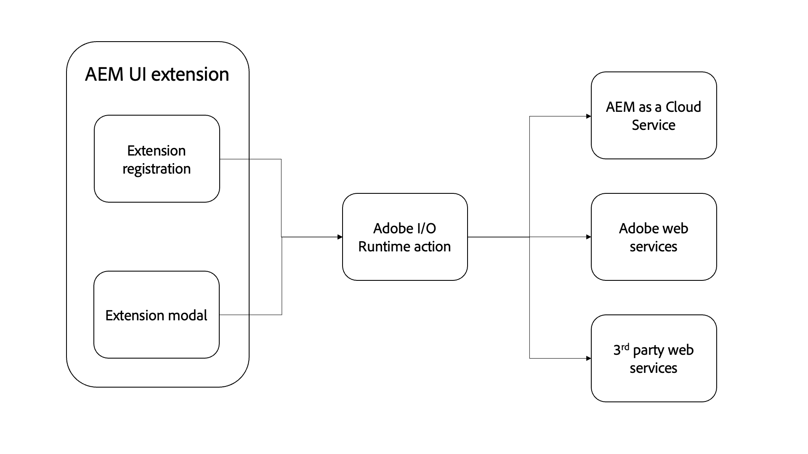

# Adobe I/O Runtime操作

{align="center"}

AEM UI扩展可以选择包含任意数量的 [Adobe I/O Runtime操作](https://developer.adobe.com/runtime/docs/).

Adobe I/O Runtime操作是可由扩展调用的无服务器函数。 操作对于执行需要与AEM或其他AdobeWeb服务交互的工作很有用。 通常，操作对执行长时间运行（超过几秒钟）的任务，或向AEM或其他Web服务发出HTTP请求最有用。

使用Adobe I/O Runtime操作执行工作的好处包括：

+ 操作是在浏览器上下文之外运行的无服务器函数，无需担心CORS
+ 用户无法中断操作（例如，刷新浏览器）
+ 操作是异步执行的，因此可以根据需要运行这些操作而不阻止用户

在AEM UI扩展的上下文中，操作通常用于直接与AEMas a Cloud Service通信：

+ 从AEM收集有关所选内容或当前内容的相关数据
+ 对内容执行自定义操作
+ 定制内容创建

虽然AEM UI扩展出现在特定AEM UI中，但扩展及其支持操作可以调用任何可用的AEM HTTP API，包括自定义AEM API端点。

## 调用操作

Adobe I/O Runtime操作主要从AEM UI扩展中的两个位置调用：

1. 此 [延期注册](./extension-registration.md) `onClick(..)` 处理程序
1. 在 [模态](./modal.md)

### 从扩展注册

可直接从扩展注册代码中调用Adobe I/O Runtime操作。 最常见的用例是将操作绑定到 [标题菜单](https://developer.adobe.com/uix/docs/services/aem-cf-console-admin/api/header-menu/)的未使用按钮 [模态](./modal.md).

+ `./src/aem-ui-extension/web-src/src/components/ExtensionRegistration.js`

```javascript
// allActions is an object containing all the actions defined in the extension's manifest
import allActions from '../config.json'

// actionWebInvoke is a helper that invokes an action
import actionWebInvoke from '../utils'
...
function ExtensionRegistration() {
  const init = async () => {
    const guestConnection = await register({
      id: extensionId, // A unique ID for the extension
      methods: {
        // Configure your header menu button here
        headerMenu: {
          getButton() {
            return {
              'id': 'example.my-header-menu-extension',  // Unique ID for the button
              'label': 'My header menu extension',       // Button label 
              'icon': 'Edit'                             // Button icon from https://spectrum.adobe.com/page/icons/
            }
          },

          // Click handler for the extension button
          onClick() {
            // Set the HTTP headers required to access the Adobe I/O runtime action
            const headers = {
              'Authorization': 'Bearer ' + guestConnection.sharedContext.get('auth').imsToken,
              'x-gw-ims-org-id': guestConnection.sharedContext.get('auth').imsOrg
            };

            // Set the parameters to pass to the Adobe I/O Runtime action
            const params = {
              aemHost: `https://${guestConnection.sharedContext.get('aemHost')}`, // Pass in the AEM host if the action interacts with AEM
              aemAccessToken: guestConnection.sharedContext.get('auth').imsToken
            };

            try {
              // Invoke Adobe I/O Runtime action named `generic`, with the configured headers and parameters.
              const actionResponse = await actionWebInvoke(allActions['generic'], headers, params);
            } catch (e) {
              // Log and store any errors
              console.error(e)
            }           
          }
        }
      }
    })
  }
  init().catch(console.error);
}
```

### 从模式

Adobe I/O Runtime操作可以直接从模式中调用，以执行更多涉及的工作，特别是依赖与AEMas a Cloud Service、AdobeWeb服务甚至第三方服务通信的工作。

Adobe I/O Runtime操作是在无服务器Adobe I/O Runtime环境中运行的基于Node.js的JavaScript应用程序。 这些操作可由扩展SPA通过HTTP寻址。

+ `./src/aem-ui-extension/web-src/src/components/MyModal.js`

```javascript
import React, { useState, useEffect } from 'react'
import { attach } from "@adobe/uix-guest"
import {
  Flex,
  Provider,
  Content,
  defaultTheme,
  Text,
  ButtonGroup,
  Button
} from '@adobe/react-spectrum'
import Spinner from "./Spinner"
import { useParams } from "react-router-dom"
import { extensionId } from "./Constants"

export default function MyModal() {
  // Initial modal views for Action Bar extensions typically pass in the list of selected Content Fragment Paths from ExtensionRegistration.js
  // Get the paths from useParams() and split on delimiter used
  let { selection } = useParams();
  let contentFragmentPaths = selection?.split('|') || [];

  const [actionInvokeInProgress, setActionInvokeInProgress] = useState(false);
  const [actionResponse, setActionResponse] = useState();

  // Asynchronously attach the extension to AEM. 
  // Wait or the guestConnection to be set before doing anything in the modal.
  const [guestConnection, setGuestConnection] = useState()
  useEffect(() => {
    (async () => {
      const guestConnection = await attach({ id: extensionId })
      setGuestConnection(guestConnection);
    })()
  }, [])

  if (!guestConnection) {
    // If the guestConnection is not initialized, display a loading spinner
    return <Spinner />
  } else if (!actionResponse) {
    // Else if the modal is ready to render and has not called the Adobe I/O Runtime action yet
    return (
        <Provider theme={defaultTheme} colorScheme='light'>
            <Content width="100%">
                <Flex width="100%">
                    <Text>
                        The selected Content Fragments are: { contentFragmentPaths.join(', ') }
                    </Text>                    

                     <ButtonGroup align="end">
                        <Button variant="cta" onPress={doWork}>Do work</Button>
                        <Button variant="primary" onPress={() => guestConnection.host.modal.close()}>Close</Button>
                    </ButtonGroup>
                </Flex>
            </Content>
        </Provider>
    )
  } else {
    // Else the modal has called the Adobe I/O Runtime action and is ready to render the response
    return (
        <Provider theme={defaultTheme} colorScheme='light'>
            <Content width="100%">
                <Flex width="100%">
                    <Text>
                        Done! The response from the action is: { actionResponse }
                    </Text>                    

                     <ButtonGroup align="end">
                        <Button variant="primary" onPress={() => guestConnection.host.modal.close()}>Close</Button>
                    </ButtonGroup>
                </Flex>
            </Content>
        </Provider>
    )
  }

  /**
   * Invoke the Adobe I/O Runtime action and store the response in the React component's state.
   */
  async function doWork() {
    // Mark the extension as invoking the action, so the loading spinner is displayed
    setActionInvokeInProgress(true);

    // Set the HTTP headers to access the Adobe I/O runtime action
    const headers = {
      'Authorization': 'Bearer ' + guestConnection.sharedContext.get('auth').imsToken,
      'x-gw-ims-org-id': guestConnection.sharedContext.get('auth').imsOrg
    };

    // Set the parameters to pass to the Adobe I/O Runtime action
    const params = {
      aemHost: `https://${guestConnection.sharedContext.get('aemHost')}`,
      contentFragmentPaths: contentFragmentPaths
    };

    try {
      // Invoke Adobe I/O Runtime action with the configured headers and parameters
      // Invoke the Adobe I/O Runtime action named `generic`.
      const actionResponse = await actionWebInvoke(allActions['generic'], headers, params);

      // Set the response from the Adobe I/O Runtime action
      setActionResponse(actionResponse);
    } catch (e) {
      // Log and store any errors
      console.error(e)
    }

    // Set the action as no longer being invoked, so the loading spinner is hidden
    setActionInvokeInProgress(false);
  }
}
```

## Adobe I/O Runtime操作

+ `src/aem-ui-extension/actions/generic/index.js`

```javascript
const fetch = require('node-fetch')
const { Core } = require('@adobe/aio-sdk')
const { errorResponse, getBearerToken, stringParameters, checkMissingRequestInputs } = require('../utils')

async function main (params) {
  const logger = Core.Logger('main', { level: params.LOG_LEVEL || 'info' })

  try {
    logger.debug(stringParameters(params))

    // Check for missing request input parameters and headers
    const requiredParams = [ 'aemHost', 'contentFragmentPaths' ]
    const requiredHeaders = ['Authorization']
    const errorMessage = checkMissingRequestInputs(params, requiredParams, requiredHeaders)
    if (errorMessage) {
      // return and log client errors
      return errorResponse(400, errorMessage, logger)
    }
      
    // Extract the user Bearer token from the Authorization header used to authenticate the request to AEM
    const accessToken = getBearerToken(params);

    // Example HTTP request to AEM payload; This updates all 'title' properties of the Content Fragments to 'Hello World'
    const body = {
      "properties": {
        "elements": {
          "title": {
            "value": "Hello World"
          }
        }
      }
    };

    let results = await Promise.all(params.contentFragmentPaths.map(async (contentFragmentPath) => {
      // Invoke the AEM HTTP Assets Content Fragment API to update each Content Fragment
      // The AEM host is passed in as a parameter to the Adobe I/O Runtime action
      const res = await fetch(`${params.aemHost}${contentFragmentPath.replace('/content/dam/', '/api/assets/')}.json`, { 
        method: 'put',
        body: JSON.stringify(body),
        headers: {
          // Pass in the accessToken as AEM Author service requires authentication/authorization
          'Authorization': `Bearer ${accessToken}`,
          'Content-Type': 'application/json'
        }
      });

      if (res.ok) {
        logger.info(`Successfully updated title of ${contentFragmentPath}`);
        return { contentFragmentPath, status: res.status, statusText: res.statusText, body: await res.json() };
      } else {
        logger.info(`Failed to update title of ${contentFragmentPath}`);
        return { contentFragmentPath, status: res.status, statusText: res.statusText, body: await res.text() };
      }
    }));

    // Return a response to the AEM Content Fragment extension React application
    const response = {
      statusCode: 200,
      body: results
    };
    return response;

  } catch (error) {
    logger.error(error)
    return errorResponse(500, 'server error', logger)
  }
}
```

## AEM HTTP API

以下AEM HTTP API通常用于通过扩展与AEM交互：

+ [AEM GRAPHQL API](https://experienceleague.adobe.com/landing/experience-manager/headless/developer.html?lang=zh-Hans)
+ [AEM ASSETS HTTP API](https://experienceleague.adobe.com/docs/experience-manager-cloud-service/content/assets/admin/mac-api-assets.html)
   + [AEM Assets HTTP API 中的内容片段支持](https://experienceleague.adobe.com/docs/experience-manager-cloud-service/content/assets/admin/assets-api-content-fragments.html)
+ [AEM QueryBuilder API](https://experienceleague.adobe.com/docs/experience-manager-cloud-service/content/implementing/developing/full-stack/search/query-builder-api.html)
+ [完成AEMas a Cloud ServiceAPI参考](https://experienceleague.adobe.com/docs/experience-manager-cloud-service/content/implementing/developing/reference-materials.html)


## Adobenpm模块

以下是用于开发Adobe I/O Runtime操作的有用npm模块：

+ [@adobe/aio-sdk](https://www.npmjs.com/package/@adobe/aio-sdk)
   + [核心SDK](https://github.com/adobe/aio-sdk-core)
   + [状态库](https://github.com/adobe/aio-lib-state)
   + [文件库](https://github.com/adobe/aio-lib-files)
   + [Adobe Target Library](https://github.com/adobe/aio-lib-target)
   + [Adobe Analytics Library](https://github.com/adobe/aio-lib-analytics)
   + [Adobe Campaign Standard Library](https://github.com/adobe/aio-lib-campaign-standard)
   + [Adobe客户配置文件库](https://github.com/adobe/aio-lib-customer-profile)
   + [Adobe Audience Manager Customer Data Library](https://github.com/adobe/aio-lib-audience-manager-cd)
   + [Adobe I/O事件](https://github.com/adobe/aio-lib-events)
+ [@adobe/aio-lib-core-networking](https://github.com/adobe/aio-lib-core-networking)
+ [@adobe/node-httptransfer](https://github.com/adobe/node-httptransfer)
