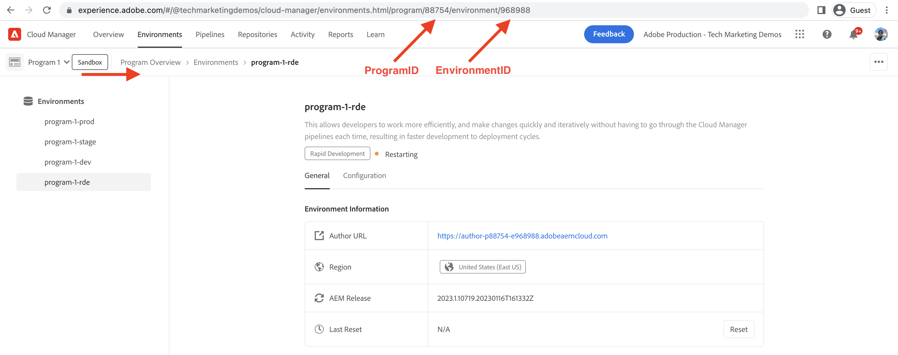

# 如何建立快速开发环境

学习 **如何设置** AEMas a Cloud Service中的快速开发环境(RDE)。

本视频说明：

- 使用Cloud Manager将RDE添加到程序
- 使用Adobe IMS的RDE登录流程，它如何与任何其他AEMas a Cloud Service环境相似
- 设置 [Adobe I/O Runtime可扩展CLI](https://developer.adobe.com/runtime/docs/guides/tools/cli_install/) 也称为 `aio CLI`
- AEM RDE和Cloud Manager的设置和配置 `aio CLI` 插件

>[!VIDEO](https://video.tv.adobe.com/v/3415490?quality=12&learn=on)

## 先决条件

下列内容应本地安装：

- [Node.js](https://nodejs.org/en/) （LTS — 长期支持）
- [npm 8+](https://docs.npmjs.com/)

## 本地设置

要部署 [WKND站点项目的](https://github.com/adobe/aem-guides-wknd#aem-wknd-sites-project) 代码和内容从本地计算机进入RDE，请完成以下步骤。

### Adobe I/O Runtime可扩展CLI

安装Adobe I/O Runtime可扩展CLI，也称为 `aio CLI` 从命令行运行以下命令。

```shell
$ npm install -g @adobe/aio-cli
```

### AEM插件

使用安装Cloud Manager和AEM RDE插件 `aio cli`的 `plugins:install` 命令。

```shell
$ aio plugins:install @adobe/aio-cli-plugin-cloudmanager

$ aio plugins:install @adobe/aio-cli-plugin-aem-rde
```

cloud Manager插件，允许开发人员从命令行与Cloud Manager交互。

AEM RDE插件允许开发人员从本地计算机部署代码和内容。

此外，要更新插件，请使用 `aio plugins:update` 命令。

## 配置AEM插件

必须配置AEM插件才能与RDE交互。 首先，使用Cloud Manager UI复制组织、项目和环境ID的值。

1. 组织ID：复制值 **配置文件图片>帐户信息（内部）>模式窗口>当前组织ID**

   

1. 项目ID：复制值 **项目概述>环境> {ProgramName}-rde >浏览器URI >之间的数字 `program/` 和`/environment`**

1. 环境ID：复制值 **项目概述>环境> {ProgramName}-rde >浏览器URI >之后的数字`environment/`**

   

1. 然后，通过使用 `aio cli`的 `config:set` 命令通过运行以下命令来设置这些值。

   ```shell
   $ aio config:set cloudmanager_orgid <org-id>
   
   $ aio config:set cloudmanager_programid <program-id>
   
   $ aio config:set cloudmanager_environmentid <env-id>
   ```

可以通过运行以下命令来验证当前配置值。

```shell
$ aio config:list
```

此外，要切换或知道您当前登录到哪个组织，您可以使用以下命令。

```shell
$ aio where
```

## 验证RDE访问权限

通过运行以下命令验证AEM RDE插件的安装和配置。

```shell
$ aio aem:rde:status
```

RDE状态信息的显示方式与以下内容类似： _您的AEM项目_ 创作和发布服务的包和配置。

## 后续步骤

学习 [使用方法](./how-to-use.md) 一个RDE，用于从您喜爱的集成开发环境(IDE)中部署代码和内容以加快开发周期。


## 其他资源

[在程序文档中启用RDE](https://experienceleague.adobe.com/docs/experience-manager-cloud-service/content/implementing/developing/rapid-development-environments.html#enabling-rde-in-a-program)

设置 [Adobe I/O Runtime可扩展CLI](https://developer.adobe.com/runtime/docs/guides/tools/cli_install/) 也称为 `aio CLI`

[AIO CLI用法和命令](https://github.com/adobe/aio-cli#usage)

[用于与AEM快速开发环境交互的Adobe I/O Runtime CLI插件](https://github.com/adobe/aio-cli-plugin-aem-rde#aio-cli-plugin-aem-rde)

[Cloud Manager AIO CLI插件](https://github.com/adobe/aio-cli-plugin-cloudmanager)
